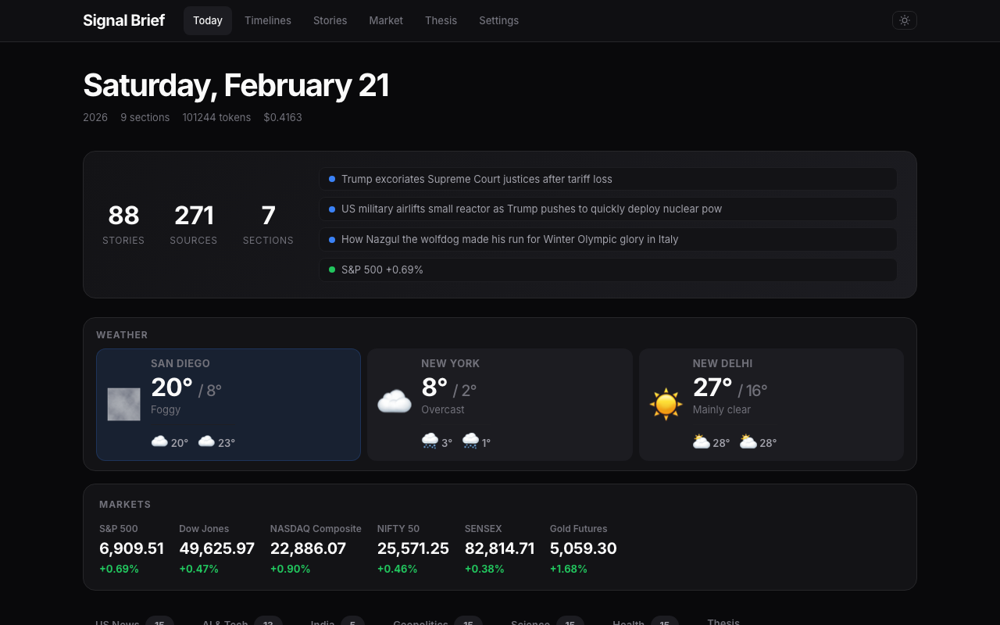
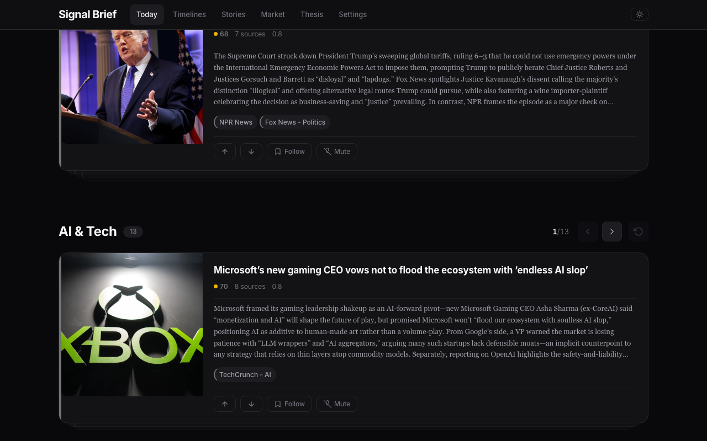
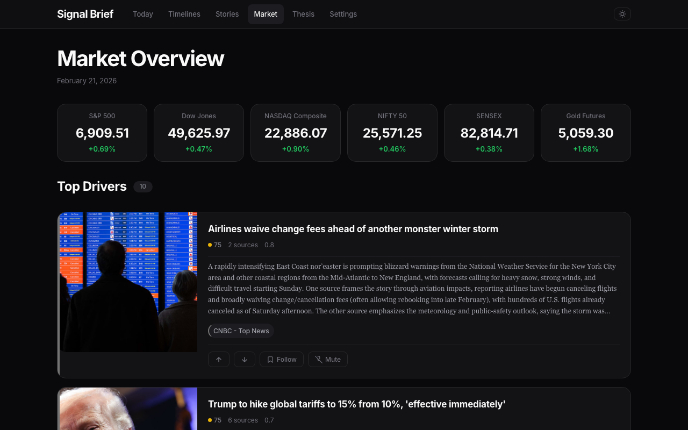
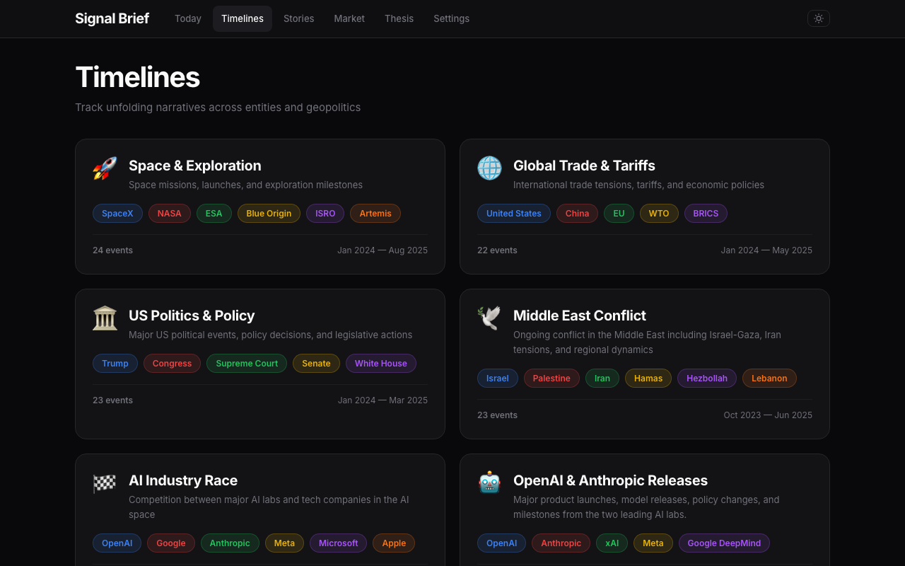
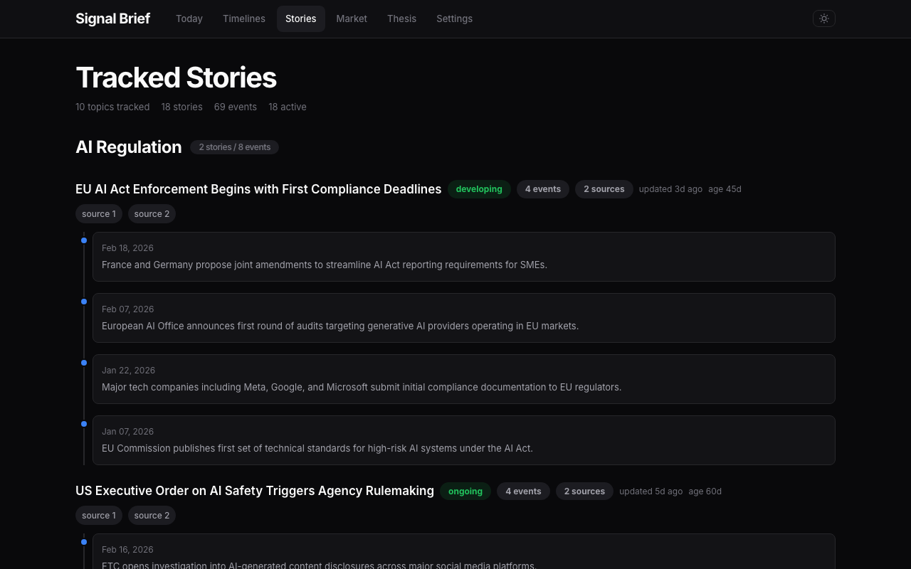
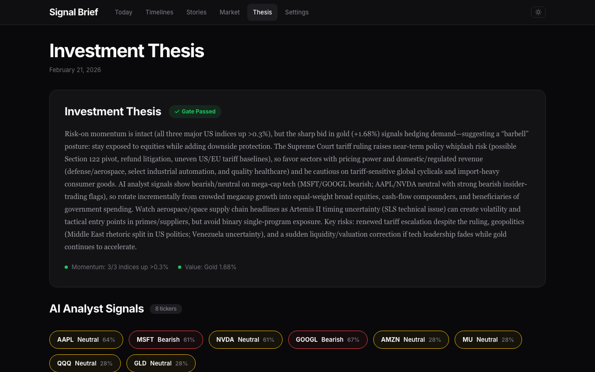
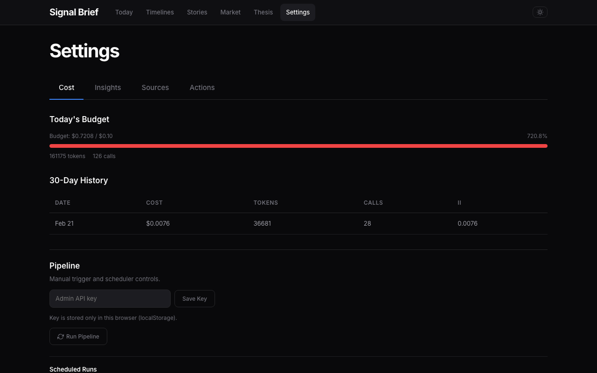
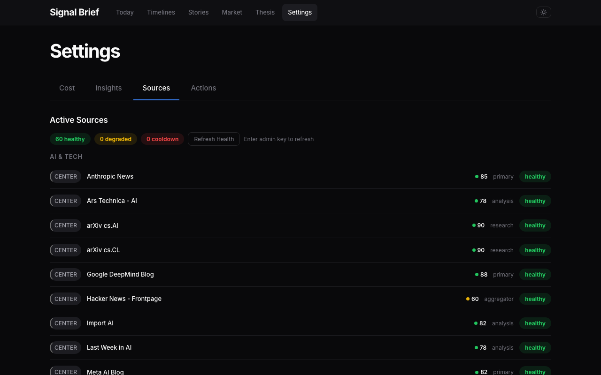

# Signal Brief

An AI-powered daily news intelligence engine that aggregates 60+ RSS sources, clusters related stories, ranks by relevance, and synthesizes a personalized daily briefing with market data, weather, investment signals, and tracked story timelines.



## Features

### Daily Briefing
Multi-section news brief generated through a 5-stage pipeline (Acquire → Normalize → Compress → Rank → Synthesize). Each section is budget-constrained and LLM-summarized from clustered source articles across US News, AI & Tech, India, Geopolitics, Science, and Health.

News cards stack into swipeable decks — navigate with arrow buttons or reset to the first card.



### Market Overview
Real-time market indices (S&P 500, Dow Jones, NASDAQ, Nifty 50, Sensex, Gold) with top market-moving story clusters ranked by impact score.



### Timelines
Curated chronological event timelines tracking unfolding narratives across entities. LLM-powered auto-discovery finds new timelines and auto-updates existing ones with fresh events each pipeline run.



### Tracked Stories
Long-running story threads grouped by topic (AI Regulation, Fed Interest Rates, Semiconductor Industry, etc.) with event timelines, source links, and activity tracking.



### Investment Thesis
Daily investment thesis with AI hedge fund analyst signals. Integrates multiple analyst personas (Warren Buffett, Technical, Valuation, Sentiment, Risk Management) across configurable tickers.



### Settings & Source Health
Cost dashboard with budget tracking, pipeline scheduler controls, and source health monitoring with auto-cooldown for failing feeds.




## Architecture

```
app/
├── integrations/       # RSS fetcher, LLM gateway, market data, weather APIs
├── pipeline/           # 5-stage pipeline: acquire → normalize → compress → rank → synthesize
├── models/             # SQLAlchemy models (Source, Article, Cluster, Brief, Timeline, etc.)
├── services/           # Business logic (clustering, ranking, embedding, cost, hedge fund)
├── routes/             # Flask blueprints (views, admin API, health, feedback)
├── jobs/               # APScheduler jobs (daily pipeline, source health)
├── templates/          # Jinja2 templates (pages, partials, macros)
└── static/             # CSS (design tokens + components), JS, images
vendor/
└── ai_hedge_fund/      # Vendored AI hedge fund multi-agent system
migrations/             # Alembic database migrations
tests/                  # pytest suite (106 tests)
```

### Pipeline

| Stage | Purpose |
|-------|---------|
| **Acquire** | Fetch RSS feeds with health tracking, retry logic, and auto-cooldown |
| **Normalize** | Extract article text, deduplicate, section-balanced selection |
| **Compress** | TF-IDF + cosine similarity clustering, representative article selection |
| **Rank** | LLM-scored relevance ranking with insight boosting |
| **Synthesize** | LLM summary generation per section, market + weather + thesis integration |

## Setup

### Prerequisites

- Python 3.12+
- PostgreSQL
- OpenAI API key

### Install

```bash
git clone https://github.com/mudit1729/daily-brief.git
cd daily-brief
python -m venv venv
source venv/bin/activate
pip install -r requirements.txt
```

### Configure

```bash
cp .env.example .env
# Edit .env with your credentials:
#   DATABASE_URL=postgresql://localhost/daily_brief
#   OPENAI_API_KEY=sk-...
#   ADMIN_API_KEY=your-admin-token
```

### Database

```bash
createdb daily_brief
flask db upgrade
```

### Seed Sources

```bash
flask shell
>>> from app.pipeline.acquire import seed_sources_from_file
>>> seed_sources_from_file('seed_sources.json')
```

## Source Catalog (From `seed_sources.json`)

The app currently seeds **44** curated sources across news, markets, science, health, AI, and feel-good coverage.

### Source Counts

| Section | Count |
|--------|------:|
| `general_news` | 14 |
| `market` | 8 |
| `ai_news` | 7 |
| `science` | 7 |
| `health` | 5 |
| `feel_good` | 3 |

### Configured Sources

#### `general_news`
- **Al Jazeera** (`global`, trust `72`) — https://www.aljazeera.com/xml/rss/all.xml
- **BBC News - World** (`global`, trust `85`) — https://feeds.bbci.co.uk/news/world/rss.xml
- **Foreign Policy** (`global`, trust `82`) — https://foreignpolicy.com/feed/
- **Reuters - World** (`global`, trust `90`) — https://feeds.reuters.com/Reuters/worldNews
- **The Diplomat** (`global`, trust `78`) — https://thediplomat.com/feed/
- **The Guardian - World** (`global`, trust `78`) — https://www.theguardian.com/world/rss
- **NDTV - India** (`india`, trust `72`) — https://feeds.feedburner.com/ndtvnews-india-news
- **The Hindu - National** (`india`, trust `78`) — https://www.thehindu.com/news/national/feeder/default.rss
- **Times of India - Top Stories** (`india`, trust `68`) — https://timesofindia.indiatimes.com/rssfeedstopstories.cms
- **AP News - Top Stories** (`us`, trust `92`) — https://rsshub.app/apnews/topics/apf-topnews
- **Defense One** (`us`, trust `76`) — https://www.defenseone.com/rss/
- **Fox News - Politics** (`us`, trust `55`) — https://moxie.foxnews.com/google-publisher/politics.xml
- **NPR News** (`us`, trust `82`) — https://feeds.npr.org/1001/rss.xml
- **Wall Street Journal** (`us`, trust `82`) — https://feeds.a.dj.com/rss/RSSWorldNews.xml

#### `market`
- **Bloomberg Markets** (`global`, trust `85`) — https://feeds.bloomberg.com/markets/news.rss
- **Financial Times - World** (`global`, trust `88`) — https://www.ft.com/rss/home
- **Reuters - Business** (`global`, trust `88`) — https://feeds.reuters.com/reuters/businessNews
- **Economic Times - Markets** (`india`, trust `72`) — https://economictimes.indiatimes.com/markets/rssfeeds/1977021501.cms
- **CNBC - Top News** (`us`, trust `75`) — https://search.cnbc.com/rs/search/combinedcms/view.xml?partnerId=wrss01&id=100003114
- **Investopedia - News** (`us`, trust `70`) — https://www.investopedia.com/feedbuilder/feed/getfeed?feedName=rss_headline
- **MarketWatch - Top Stories** (`us`, trust `75`) — https://feeds.marketwatch.com/marketwatch/topstories/
- **Yahoo Finance - Top Stories** (`us`, trust `72`) — https://finance.yahoo.com/news/rssindex

#### `ai_news`
- **Ars Technica - AI** (`global`, trust `78`) — https://feeds.arstechnica.com/arstechnica/features
- **MIT Technology Review - AI** (`global`, trust `85`) — https://www.technologyreview.com/feed/
- **Simon Willison's Weblog** (`global`, trust `80`) — https://simonwillison.net/atom/everything/
- **TechCrunch - AI** (`global`, trust `70`) — https://techcrunch.com/category/artificial-intelligence/feed/
- **The Verge - AI** (`global`, trust `72`) — https://www.theverge.com/rss/ai-artificial-intelligence/index.xml
- **VentureBeat - AI** (`global`, trust `70`) — https://venturebeat.com/category/ai/feed/
- **Wired - AI** (`global`, trust `74`) — https://www.wired.com/feed/tag/ai/latest/rss

#### `science`
- **Nature - Latest Research** (`global`, trust `95`) — https://www.nature.com/nature.rss
- **New Scientist** (`global`, trust `80`) — https://www.newscientist.com/feed/home/
- **Phys.org - Top News** (`global`, trust `75`) — https://phys.org/rss-feed/
- **Quanta Magazine** (`global`, trust `90`) — https://api.quantamagazine.org/feed/
- **Science Magazine** (`global`, trust `93`) — https://www.science.org/rss/news_current.xml
- **ScienceDaily** (`global`, trust `76`) — https://www.sciencedaily.com/rss/all.xml
- **Scientific American** (`global`, trust `85`) — https://rss.sciam.com/ScientificAmerican-Global

#### `health`
- **MedPage Today** (`global`, trust `80`) — https://www.medpagetoday.com/rss/headlines.xml
- **Medical News Today** (`global`, trust `72`) — https://rss.medicalnewstoday.com/featurednews.xml
- **STAT News** (`global`, trust `82`) — https://www.statnews.com/feed/
- **WHO News** (`global`, trust `88`) — https://www.who.int/rss-feeds/news-english.xml
- **NIH News** (`us`, trust `92`) — https://www.nih.gov/news-events/news-releases/feed

#### `feel_good`
- **Good News Network** (`global`, trust `65`) — https://www.goodnewsnetwork.org/feed/
- **Positive News** (`global`, trust `65`) — https://www.positive.news/feed/
- **Reasons to be Cheerful** (`global`, trust `65`) — https://reasonstobecheerful.world/feed/

### Run

```bash
flask run --port 5005
```

The scheduler runs the pipeline daily at the configured time. To trigger manually:

```bash
curl -X POST http://localhost:5005/admin/pipeline/trigger \
  -H "X-Admin-Key: your-admin-token"
```

### Tests

```bash
pytest tests/ -q
```

## Environment Variables

| Variable | Default | Description |
|----------|---------|-------------|
| `DATABASE_URL` | `postgresql://localhost/daily_brief` | PostgreSQL connection string |
| `OPENAI_API_KEY` | — | OpenAI API key for LLM calls |
| `ADMIN_API_KEY` | — | Token for admin API endpoints |
| `LLM_MODEL` | `gpt-5.2` | LLM model for synthesis |
| `LLM_DAILY_BUDGET_USD` | `1.00` | Daily LLM spend cap |
| `LLM_DAILY_TOKEN_BUDGET` | `100000` | Daily token limit |
| `HEDGE_FUND_TICKERS` | `AAPL,MSFT,NVDA,GOOGL,AMZN` | Tickers for hedge fund analysis |
| `SCHEDULER_ENABLED` | `true` | Enable/disable APScheduler |
| `SOURCE_FAILURE_THRESHOLD` | `3` | Consecutive failures before auto-cooldown |

## Tech Stack

- **Backend:** Flask, SQLAlchemy, Alembic, APScheduler
- **Database:** PostgreSQL
- **LLM:** OpenAI (configurable model)
- **NLP:** scikit-learn (TF-IDF clustering), numpy
- **Market Data:** yfinance
- **AI Analysts:** LangChain + LangGraph (vendored ai-hedge-fund)
- **Frontend:** Vanilla JS, CSS custom properties, Jinja2
- **Testing:** pytest (106 tests)
