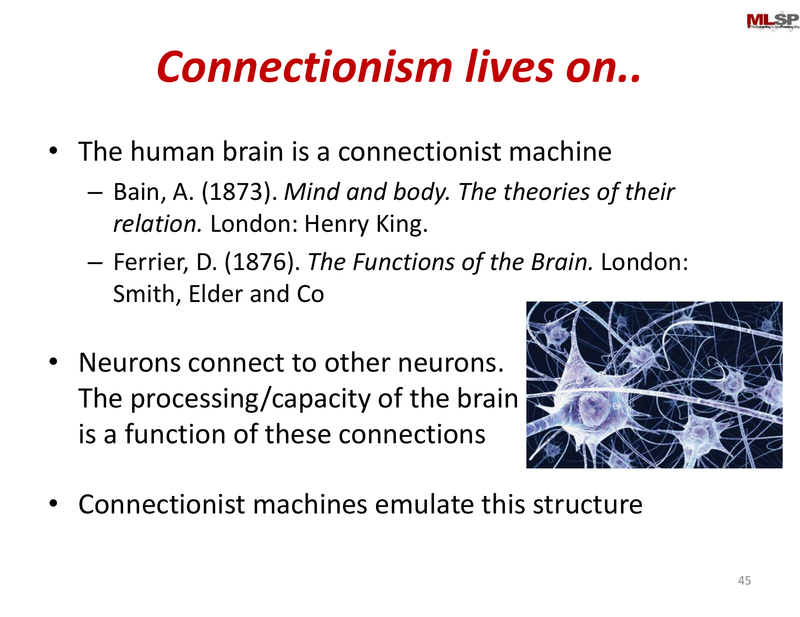
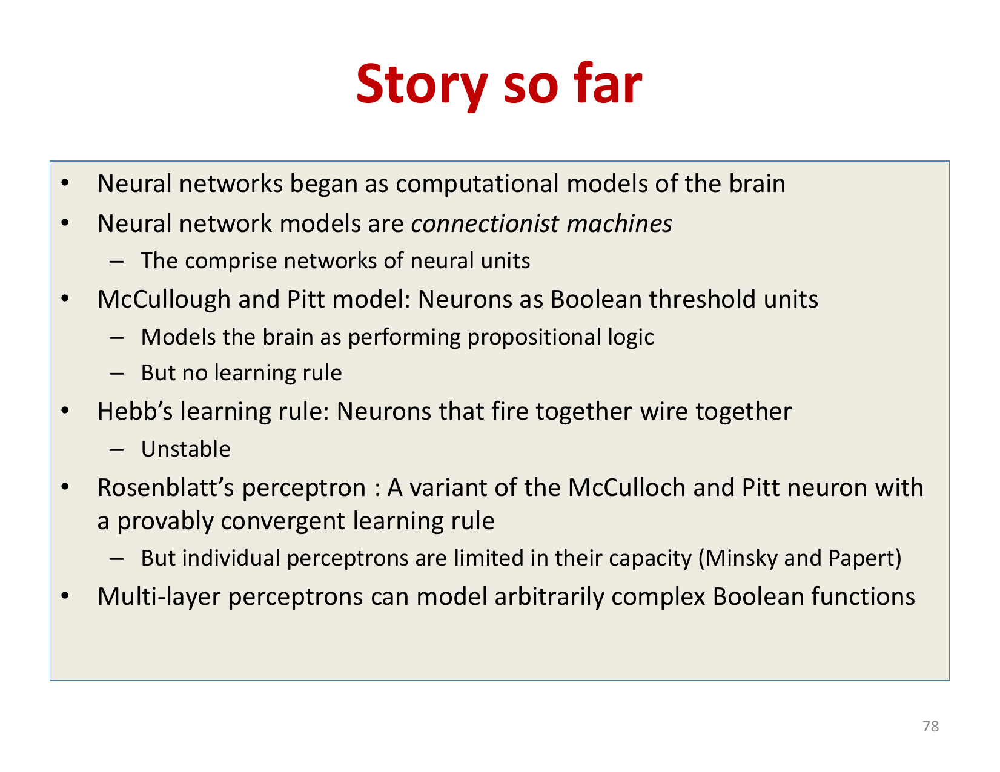
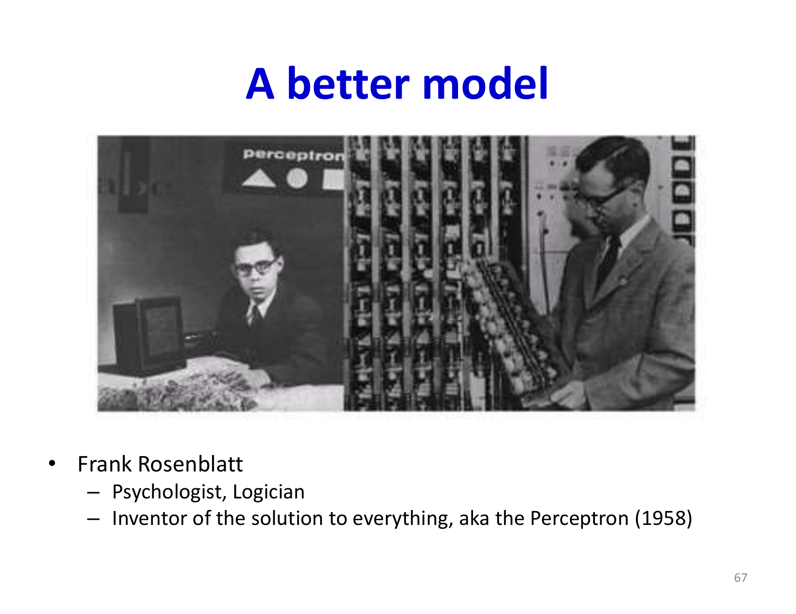
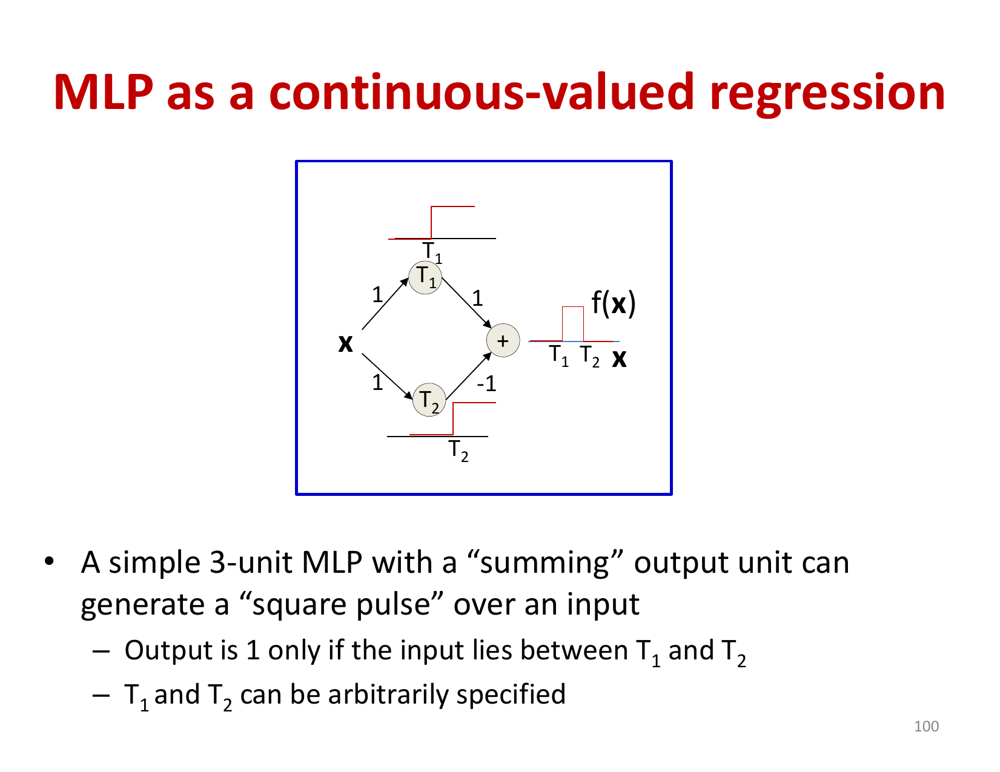

# Lecture 1: Introduction to Deep Learning

Neural networks have become one of the dominant approaches in artificial intelligence, successfully tackling pattern recognition, prediction, and analysis problems that previously seemed intractable. This lecture traces the intellectual history of neural networks from early associationist philosophy through modern connectionist machines, establishing both the theoretical foundations and practical capabilities of these systems.

## Visual Roadmap


## At a Glance

| Stage | Main idea | Why it matters | Limitation |
|---|---|---|---|
| Associationism | Learning through repeated associations | Earliest mental model of learning | No computational mechanism |
| Connectionism | Information is stored in connections | Sets up network-based intelligence | Still conceptual |
| McCulloch-Pitts | Threshold neuron as logic unit | First formal neuron model | No learning rule |
| Hebbian learning | Co-activation strengthens weights | First intuitive weight-update principle | Unstable without normalization |
| Perceptron | Trainable linear classifier | First practical neural learner | Cannot solve XOR with one layer |
| MLPs | Layered nonlinear composition | Enables rich function representation | Needs efficient gradient-based training |

## A Brief History of Neural Networks and Connectionism

The roots of neural network theory extend surprisingly far back in intellectual history. **Associationism** was a dominant philosophical theory from Aristotle (360 BC) through the 1800s, proposing that learning occurs through associations between temporally related phenomena. Aristotle formulated four foundational laws of association:

- The law of contiguity: Things occurring close together in space or time become linked
- The law of frequency: More frequent associations become stronger
- The law of similarity: Similar concepts trigger thoughts of one another
- The law of contrast: Concepts may trigger recall of opposites

In 1749, David Hartley proposed that the brain stores associations through interconnected "vibratiuncles" (small vibrations) in specific brain regions. This was prescient—though the actual mechanism would turn out to be neurons rather than vibrations. By the mid-1800s, scientists discovered that the brain consists of interconnected neurons, leading to the formalization of **connectionism** by Alexander Bain in 1873, who argued: "The information is in the connections."

The key insight was revolutionary: instead of thinking of the mind as a single processor following symbolic rules, connectionist systems view cognition as emerging from patterns of connections between simple processing elements. This paradigm shift distinguishes connectionist neural networks from traditional Von Neumann computers, where programs are separate from data and processed sequentially.



## McCulloch and Pitts: The First Formal Model

Warren McCulloch (neurophysiologist) and Walter Pitts (a young logician) developed the first mathematical model of a neuron in 1943. Their key contributions were:

1. **Synaptic Integration**: Excitatory synapses transmit weighted inputs; a single inhibitory signal could completely prevent neuron firing
2. **Boolean Computation**: Networks of these neurons could compute arbitrary Boolean functions
3. **Memory**: Recurrent networks (with loops) could implement memory mechanisms

The McCulloch-Pitts model showed that neurons were sophisticated computing elements—any Boolean function could be decomposed into combinations of threshold units. However, their model lacked a learning mechanism, and their claims about computational universality were somewhat dubious.

## Hebbian Learning and the Perceptron

Donald Hebb's 1949 contribution was perhaps the most influential: a simple learning rule that states "neurons that fire together wire together." Mathematically:

```text
Delta w_(ij) = eta * y_i * y_j
```

This rule elegantly captures the intuition that repeated co-activation strengthens connections. However, Hebbian learning is fundamentally unstable—stronger connections reinforce themselves without competition, leading to unbounded weight growth. Later modifications like Sanger's rule introduced normalization to address this.

Frank Rosenblatt's **perceptron** (1958) combined the McCulloch-Pitts neuron with a provably convergent learning rule. The perceptron updates weights when making errors:

```text
w_i^(new) = w_i^(old) + eta * (d - y) * x_i
```

where `d` is the desired output and `y` is the actual output. Rosenblatt proved convergence for linearly separable problems, and the perceptron generated enormous excitement—newspapers predicted machines that could "walk, talk, see, write, reproduce itself."

The limitation came quickly: Minsky and Papert (1969) demonstrated the **XOR problem**. A single perceptron cannot compute XOR because the function requires nonlinearly separable decision boundaries.



## Multi-Layer Perceptrons

The solution was elegant: networks with hidden layers could compute XOR and arbitrary Boolean functions. A multi-layer perceptron (MLP) composes perceptrons into layers:

```text
y = f_3(W_3 * f_2(W_2 * f_1(W_1 * x + b_1) + b_2) + b_3)
```

Individual layers act as feature detectors, with higher layers detecting combinations of lower-level features. An MLP with sufficient hidden units can represent any Boolean function over its inputs and any continuous-valued function to arbitrary precision.

## Real-Valued Perceptrons and Function Approximation

Moving beyond Boolean logic, real-valued perceptrons map real inputs to real outputs through continuous activation functions (typically sigmoid or ReLU). The key insight is that even with real inputs and outputs, networks can learn complex, nonlinear relationships through composition:

```text
y = f(z) = sigma(sum_i w_i x_i + b)
```

This enables:
- **Classification**: Networks identify decision boundaries in high-dimensional space (e.g., separating digit classes in MNIST's 784-dimensional input space)
- **Regression**: Networks approximate continuous functions like `f(x) = sin(x)`
- **Function Composition**: MLPs with multiple hidden layers can build hierarchical representations



## Neural Networks as Universal Approximators

Through appropriate composition of perceptron units, neural networks can:

1. **Model arbitrary Boolean functions**: Multiple layers create complex decision boundaries through logical combinations
2. **Approximate continuous functions**: "Square pulse" responses from pairs of threshold units can build up arbitrary functions
3. **Represent probability distributions**: Networks output normalized probability vectors
4. **Implement memory**: Recurrent architectures with feedback loops maintain state

## Why Neural Networks Replaced Earlier Pipelines

One recurring theme in the introductory slides is that neural networks did not become dominant just because they were loosely brain-inspired. They became dominant because they replaced brittle multi-stage pipelines with a single trainable system.

Older recognition systems often required:

- hand-designed features
- separate modules for detection and classification
- task-specific engineering for each new domain

Neural networks instead learn internal features directly from data. The same basic recipe, "compose linear maps with nonlinearities and train end to end," scales from speech to vision to language. That is the practical reason they displaced many earlier approaches.



## Modern Applications

Contemporary neural networks successfully perform complex AI tasks modeled as function approximation:

- **Speech Recognition**: Voice signal → Transcription (f: Audio → Text)
- **Image Understanding**: Image pixels → Captions (f: Image → Caption)
- **Game Playing**: Game state → Next optimal move (f: State → Action)
- **Image Generation**: Random noise → Realistic images (inverse function)

Each is fundamentally a learned function mapping inputs to outputs—precisely what neural networks excel at learning.

## Key Takeaways

- Neural networks emerged from philosophical traditions (associationism) grounded in how we believe the brain works
- Early models (McCulloch-Pitts, perceptron) established fundamental capabilities but revealed limitations
- Multi-layer architectures overcome single-neuron constraints, enabling universal function approximation
- Modern networks inherit the connectionist principle: knowledge is encoded in connection patterns
- The field matured by recognizing that learning (adjusting weights) was as important as network architecture
- Today's deep learning success represents the vindication of Bain's 1873 insight: complex behavior emerges from patterns of connections

The next lecture will explore the theoretical foundations of network depth and width—why some architectures are more efficient than others at approximating different function classes.

## Slide Coverage Checklist

These bullets mirror the source slide deck and make the summary concept coverage explicit.

- neural networks as a dominant AI paradigm
- contrast with earlier AI / ML approaches
- historical arc from associationism to connectionism
- Aristotle's laws of association
- Hartley / Bain / "information is in the connections"
- brain-inspired vs Von Neumann computation
- McCulloch-Pitts neuron as a threshold logic model
- excitatory vs inhibitory inputs and simple recurrence
- Hebbian learning intuition and instability
- perceptron learning and linearly separable problems
- XOR limitation and why hidden layers matter
- modern successes in speech, vision, segmentation, captioning, and games
