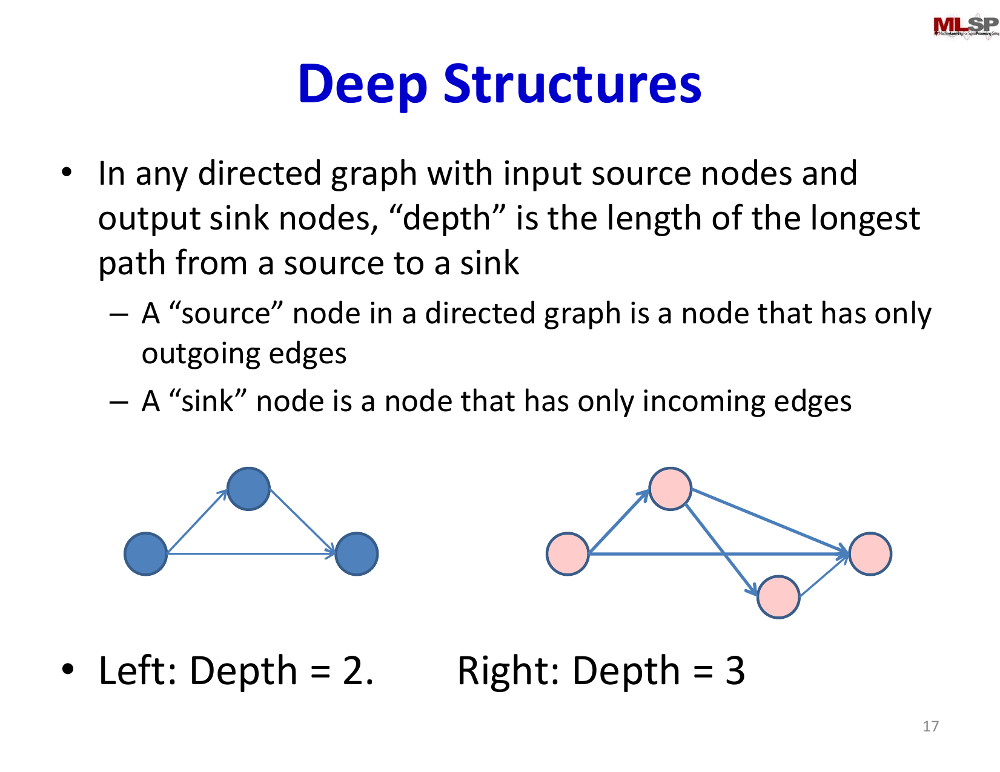

# Lecture 2: Universal Approximation and Network Representational Power

The theoretical power of neural networks lies in their capacity to represent complex functions. This lecture formalize what multi-layer perceptrons can represent, examining the roles of network depth, width, and activation functions in determining representational capacity.

## Visual Roadmap


## At a Glance

| Factor | What it controls | Main lesson |
|---|---|---|
| Width | Number of units per layer | Wider layers can approximate more patterns directly |
| Depth | Number of compositional steps | Depth can represent structure more efficiently |
| Activation | Form of the nonlinearity | Without it, stacked layers stay linear |
| Hidden layers | Intermediate feature construction | They build complex regions from simpler pieces |
| Universal approximation | Existence of a good network | Says representation is possible, not easy to train |
| Practical design | Parameter efficiency and trainability | Same function class can have very different implementations |

## What Neural Networks Can Represent

Neural networks are fundamentally function approximators. Given the widespread adoption of neural networks across domains, a fundamental question is: **what functions can these networks actually represent?** The answer requires careful analysis of three key architectural factors:

1. **Depth**: How many layers are needed?
2. **Width**: How many neurons per layer?
3. **Activation Functions**: What nonlinearities should we use?

Understanding these relationships helps us design networks appropriate for different problem types and avoid unnecessary complexity.

## Boolean Functions and Decision Boundaries

We begin by reconsidering the representational power from Lecture 1. A single threshold perceptron with real inputs implements a linear classifier—its output divides the input space into two half-spaces separated by a hyperplane.

For Boolean classification over two-dimensional input, single neurons compute:

```text
y = 1  if  w_1 x_1 + w_2 x_2 + b >= 0;  otherwise  y = 0
```

This is intrinsically a linear decision boundary. More complex classifications require composition:

- **Two neurons** can implement AND, OR, or NOT
- **Three neurons** can compose these into XOR
- **N neurons** in hidden layers can approximate arbitrary nonlinear boundaries

The key principle: each hidden layer adds a degree of compositional expressiveness. By decomposing complex regions into combinations of simpler half-spaces, multi-layer networks construct arbitrarily intricate decision boundaries.

## Layer Terminology and the "Square Pulse" Construction

The slide deck spends time on vocabulary because it matters when discussing representational power:

- **source nodes** are inputs
- **sink nodes** are outputs
- **depth** is the length of the longest path from a source to a sink
- a **layer** is a set of units at the same depth with respect to the input

This terminology also clarifies the classic approximation construction. With threshold-like units, one neuron can turn "on" at a left boundary and another can turn "off" at a right boundary. Combining them produces a localized interval response, often described as a **square pulse**. Summing many such localized responses lets a network tile a function with small bumps and approximate it arbitrarily well.

## Continuous Function Approximation

Beyond classification, neural networks approximate real-valued functions. Consider a single hidden layer with threshold activation:

```text
f(x) = sum_j w_j * sigma(v_j x + c_j) + b
```

where `sigma` is a threshold function. The response profile is a "square pulse"—the threshold units act as boundary detectors, and their weighted sum creates localized bumps in the output space.

**Key Insight**: Sufficiently many non-overlapping pulses can approximate any smooth function. To achieve precision, you reduce pulse width and increase quantity. This generalizes to functions of any dimensionality.



## The Depth vs. Width Trade-off

A fundamental question in network design: when is depth preferable to width?

**Width-based approximation**: A single hidden layer can approximate any continuous function, but may require exponentially many neurons to achieve precision. For instance:
- A single hidden layer might need `2^d` neurons to approximate a function in `d` dimensions to high precision
- This exponential scaling becomes impractical for high-dimensional problems

**Depth-based approximation**: Multiple layers can sometimes achieve the same representational power with dramatically fewer total neurons. For instance:
- A hierarchically-composed network can build complex functions from simpler building blocks
- Exponential reductions in neuron count compared to wide networks

The trade-off is subtle and problem-dependent. Some functions are inherently hierarchical and benefit from depth; others may not. Deep networks also introduce training challenges (we'll see this is related to the vanishing gradient problem).

## Restrictions on Network Capacity

Networks don't have unlimited representational power. Several factors constrain what can be represented:

1. **Insufficient Width**: A hidden layer narrower than input dimensionality may lose information
2. **Linear Activations**: Linear networks compute only linear functions—composition doesn't increase expressiveness
3. **Insufficient Depth**: Some functions may require depth for efficient representation
4. **Activation Function Choices**: Different activations (sigmoid, ReLU, tanh) have different approximation properties

The most important restriction: **you must have nonlinearity**. Without nonlinear activations, a deep network reduces to a single linear transformation, no matter how many layers.

## Universal Approximation Theorem

The mathematical result underlying all this intuition:

**Universal Approximation Theorem** (Cybenko, 1989; Hornik, 1991): A feedforward network with a single hidden layer containing a finite number of units with nonlinear activation function can approximate any continuous function on compact domains to arbitrary accuracy, provided the hidden layer is sufficiently wide.

This guarantees representational capacity but makes no claim about:
- How many neurons are needed (could be astronomical)
- Whether learning algorithms can find good parameter values
- Whether generalization is possible with finite training data

The theorem is existential—it says good networks exist, not that we can find them.

That distinction is central. A network class can be universal in principle and still be useless in practice if the approximation requires too many units, too much data, or parameters that gradient descent cannot reliably discover.

## Activation Functions and Their Role

Different activation functions enable different approximations:

**Sigmoid** (`sigma(z) = (1) / (1+e^(-z))`):
- Smooth, bounded output in (0,1)
- Good for probability interpretation
- Derivative: `sigma'(z) = sigma(z)(1-sigma(z))`

**Tanh** (`tanh(z) = (e^z - e^(-z)) / (e^z + e^(-z))`):
- Symmetric output in (-1,1)
- Steeper gradient than sigmoid
- Similar mathematical properties

**ReLU** (`ReLU(z) = max(0, z)`):
- Piecewise linear, simple computation
- Derivative: `ReLU'(z) = 1 for z > 0, 0 for z < 0`
- Modern networks prefer this due to training efficiency

The choice affects both expressiveness and optimization difficulty. ReLU networks train faster despite being less smooth, making them practically superior despite theoretical advantages of smooth activations.

## Implications for Network Design

Understanding representational power guides architectural decisions:

1. **For Complex, High-Dimensional Problems**: Prefer depth over width when possible. A deep network can represent hierarchical structure more efficiently than a wide network.

2. **For Simple, Low-Dimensional Problems**: A wide shallow network may suffice and trains faster.

3. **For Classification**: Need enough neurons to separate classes. A two-class problem requires at least 3 neurons (one per decision boundary side, plus composition).

4. **For Regression**: Need smooth hidden units. Sigmoid or ReLU work; pure threshold units create discontinuities.

5. **Activation Function Selection**: ReLU is typically preferred for hidden layers (computational efficiency); sigmoid/softmax for output (probability interpretation).

## Connection to Brain and Biology

The biological brain exhibits strong hierarchical structure: simple features are detected in early visual cortex (edges), composed into mid-level features (shapes), and finally into high-level concepts (objects). This hierarchical composition aligns with the theoretical preference for depth when possible.

However, biological neurons are dramatically more complex than our models—incorporating temporal dynamics, neuromodulatory effects, and other factors we omit. Our simplified model captures the essential computational principle (weighted summation + nonlinearity) while ignoring biological details.

## Key Takeaways

- **Universal Approximation**: Single hidden layer networks can represent any continuous function, but may be impractically wide
- **Depth Matters**: Multiple layers can represent the same functions with exponentially fewer parameters
- **Nonlinearity is Essential**: Without nonlinear activations, deep networks collapse to linear functions
- **Width-Depth Trade-off**: Problem-dependent; some functions are inherently hierarchical
- **Activation Functions**: Sigmoid, tanh, and ReLU offer different trade-offs between smoothness and computational efficiency
- **Architectural Constraints**: Network capacity depends on layer width, depth, and activation choices
- **The Gap Between Theory and Practice**: Universal approximation guarantees existence but not learnability

Having established that networks *can* represent any function, the next critical questions are: (1) How do we actually learn good parameters? (2) Can we do better than random search? This leads to the study of learning algorithms and gradient descent.

## Slide Coverage Checklist

These bullets mirror the source slide deck and make the summary concept coverage explicit.

- recap of connectionist intuition and perceptrons
- soft perceptron with sigmoid / tanh activation
- formal MLP structure: source nodes, sink nodes, depth, layers
- linear decision boundaries from a single perceptron
- Boolean composition using multiple threshold units
- XOR as a minimal non-linearly separable example
- square-pulse / interval construction with threshold units
- continuous function approximation in 1D
- extension of function approximation to higher dimensions
- role of width in direct approximation
- role of depth in parameter efficiency
- universal approximation as an existence theorem, not a training theorem
- necessity of nonlinearity for expressive depth
