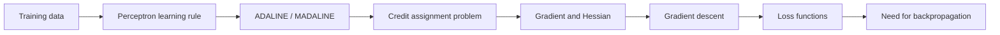
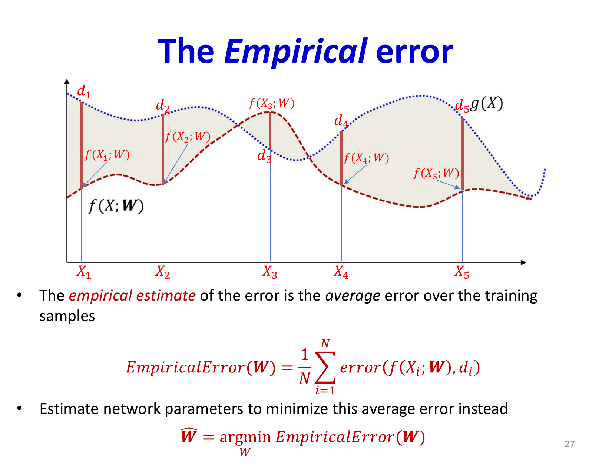
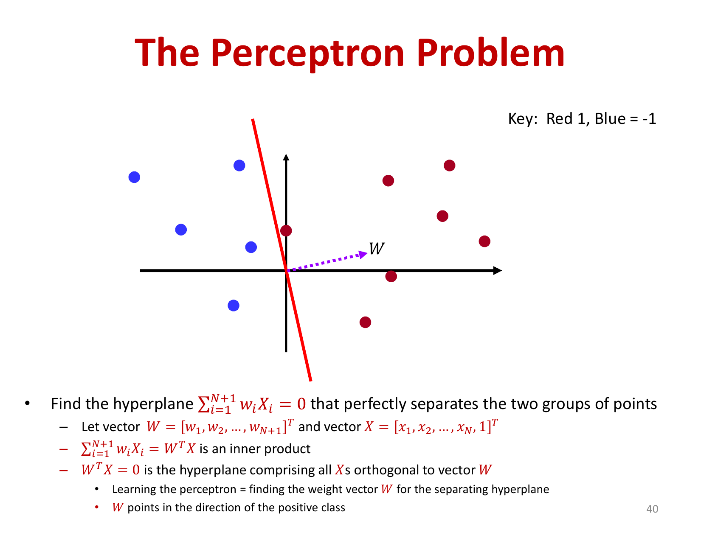

# Lecture 3: Learning the Network - Part 1 (Perceptron Learning and Optimization Basics)

While previous lectures established that neural networks can represent arbitrary functions, this lecture addresses the practical question: **how do we find good weights?** We move from representation theory to learning algorithms, introducing the perceptron learning rule, its limitations, and the foundations of optimization through gradient descent.

## Visual Roadmap



## At a Glance

| Concept | Role in the lecture | Key warning |
|---|---|---|
| Perceptron rule | First convergent rule for linear separators | Does not train hidden layers |
| ADALINE | Differentiable shallow learning | Still not enough for deep nets |
| Gradient | Direction of steepest increase | Must step opposite to minimize |
| Hessian | Local curvature information | Zero gradient alone is not enough |
| Gradient descent | General optimization procedure | Sensitive to step size |
| Loss function | Defines what training optimizes | Must match the output type |

## The Learning Problem

Given a training dataset of input-output pairs `{(x_1, d_1), (x_2, d_2), ..., (x_T, d_T)}`, we want to find network parameters (weights `W` and biases `b`) that minimize prediction error. This is formalized as **Empirical Risk Minimization**:

```text
L(W) = (1) / (T) sum_(t=1)^(T) Div(y_t, d_t)
```

where `Div(y, d)` measures divergence between predicted output `y` and desired output `d`. The goal: minimize `L(W)` with respect to all parameters.

Before addressing multi-layer networks, we begin with single perceptrons to understand learning principles.

## The Perceptron Learning Rule

For a single perceptron on the training set:

```text
w_i^(new) = w_i^(old) + eta * (d - y) * x_i
```

where:
- `eta` is the learning rate (step size)
- `d` is the desired output (0 or 1)
- `y` is the actual output
- The weight update is proportional to the input value and the prediction error

**Key Property**: For linearly separable data, this rule converges—it provably finds weights that correctly classify all training examples.

**Fundamental Limitation**: The perceptron learning rule **does not work for multi-layer networks**. For hidden layer neurons, we don't have desired outputs `d`—only error signals propagating backward from the output layer. This became the "credit assignment problem": how do we allocate blame for errors to hidden units that we never directly observe?

## Bias as an Always-On Input

One practical point emphasized in the slides is that the bias can be treated as just another weight by appending a constant input:

```text
x_0 = 1
```

and learning a weight attached to it. This simplifies both notation and implementation because affine maps can be handled with the same machinery as ordinary weighted sums.

## Greedy Solutions: ADALINE and MADALINE

**ADALINE** (Adaptive Linear Element, Widrow and Hoff, 1960s) adapted the perceptron rule by adjusting weights based on the pre-activation signal `z = sum w_i x_i + b` rather than the threshold output:

```text
Delta w_i = eta * (d - z) * x_i
```

This is equivalent to minimizing squared error: `L = (d - z)^2`. ADALINE works for single-layer networks but still cannot address the hidden layer problem.

**MADALINE** (Multiple ADALINES) stacked ADALINE units in layers but used greedy approximations for credit assignment—training layers independently rather than jointly. While practical, these approaches were suboptimal.

The fundamental breakthrough—**backpropagation**—would finally address multi-layer learning, but requires first understanding optimization through gradient descent.

## Function Optimization: Derivatives and Gradients

To minimize a function `f(x)` in one dimension, calculus tells us to find where `(df) / (dx) = 0`. The derivative gives the rate of change—positive where `f` increases, negative where it decreases.

For a scalar function of a vector input `f(x)`, we generalize to the **gradient**:

```text
grad f = [(partial f) / (partial x_1), (partial f) / (partial x_2), ..., (partial f) / (partial x_n)]^T
```

**Geometric Interpretation**: The gradient points in the direction of steepest increase. To minimize, we move opposite to the gradient.

```text
Maximum decrease proportional to -grad f
```

This is because the inner product of any unit vector `u` with the gradient is:

```text
u^T grad f = |grad f| cos(theta)
```

This is maximized when `u` aligns with `grad f` (minimize when opposite).



## The Hessian and Second Derivatives

For multivariate optimization, the **Hessian matrix** contains all second partial derivatives:

```text
H = [(partial^2 f) / (partial x_1^2) & (partial^2 f) / (partial x_1 partial x_2) & ...; (partial^2 f) / (partial x_2 partial x_1) & (partial^2 f) / (partial x_2^2) & ...; ... & ... & ...]
```

The Hessian's eigenvalues determine the nature of critical points:
- **All positive eigenvalues**: Local minimum
- **All negative eigenvalues**: Local maximum
- **Mixed signs**: Saddle point (neither minimum nor maximum)

At a minimum, the gradient is zero, but not all points with zero gradient are minima.

## Gradient Descent Algorithm

Since solving `grad f = 0` analytically is often intractable, we use **iterative gradient descent**:

1. **Initialize**: Start with random parameters `w_0`
2. **Iterate**:
   ```text
w_(k+1) = w_k - eta grad f(w_k)
```
   where `eta` is the step size (learning rate)
3. **Converge**: Stop when `grad f(w_k) ~ 0` or when `f(w_k)` stops improving

**Convergence Guarantee**: For convex functions (bowl-shaped), gradient descent with appropriate step size converges to the global minimum. For non-convex functions, it converges to some local minimum or inflection point.



The actual loss surface of neural networks is highly non-convex, yet gradient descent works well in practice. This is one of deep learning's great mysteries.

## Learning Rate and Step Size

The learning rate `eta` controls optimization behavior:

- **Too small**: Training progresses very slowly
- **Too large**: May oscillate or diverge, overshooting minima
- **Just right**: Smooth convergence

Adaptive learning rates (varying `eta` during training) often work better than fixed rates. Modern optimizers like Adam automatically adjust per-parameter learning rates.

## Why We Optimize a Smooth Divergence

The slides repeatedly contrast the quantity we care about, such as classification error, with the quantity we optimize during training. The reason is simple: classification error is discontinuous as a function of the weights, so its derivative is either undefined or uninformative almost everywhere.

That is why learning algorithms optimize a smooth surrogate divergence instead:

- `L2` for regression
- cross-entropy / KL-style losses for classification

The surrogate is not identical to the final metric, but it gives gradient-based methods a usable signal.

## Problem Setup for Network Training

To apply gradient descent to neural networks, we must define:

1. **Network Architecture**: Layer sizes, activation functions
2. **Input Representation**: How to convert raw data to numeric vectors
3. **Output Representation**:
   - Real-valued outputs for regression
   - Binary (0/1) for binary classification
   - One-hot vectors for multi-class (e.g., `[1,0,0,0,0]` for class 2 among 5 classes)
4. **Loss Function**: Divergence measure between predicted and desired outputs

## Loss Functions for Different Output Types

**For Regression** (real-valued outputs):
```text
L_2  divergence = (1) / (2)(y - d)^2
```

Simple, differentiable, standard choice.

**For Binary Classification**:
```text
KL divergence = -d log(y) - (1-d) log(1-y)
```

Encourages the network to output probabilities that match the binary target. Steeper gradients than squared error, aiding convergence.

**For Multi-class Classification**:
```text
Cross-Entropy = -sum_i d_i log(y_i)
```

When `d` is a one-hot vector, this simplifies to `-log(y_c)` where `c` is the correct class. Encourages high probability for the correct class.

## Connection to Maximum Likelihood

Loss functions relate to probabilistic interpretation. Cross-entropy loss corresponds to maximum likelihood estimation—minimizing cross-entropy is equivalent to finding parameters that maximize the probability of observed data under a probabilistic model.

## Key Takeaways

- **The Learning Problem**: Minimize empirical risk (average loss over training set)
- **Perceptron Rule**: Works for single layers on linearly separable data; fails for hidden layers
- **Gradient Descent**: Iteratively adjust parameters in the negative gradient direction
- **Convergence**: Guaranteed for convex problems; practical for non-convex networks despite lack of theoretical guarantees
- **Loss Function Design**: Must match the output type (regression: `L_2`; classification: cross-entropy)
- **Learning Rate**: Critical hyperparameter requiring careful tuning
- **Readiness for Backpropagation**: We've established optimization through gradient descent; next lecture shows how to efficiently compute gradients in deep networks

The critical missing piece is efficient computation of `(partial L) / (partial w)` for hidden layer weights. The next lecture introduces **backpropagation**, which uses the chain rule to compute gradients efficiently, enabling practical training of multi-layer networks.

## Slide Coverage Checklist

These bullets mirror the source slide deck and make the summary concept coverage explicit.

- learning problem setup from input-output training pairs
- perceptron parameters: weights and bias
- bias implemented as a constant input
- perceptron learning rule and correction on mistakes
- perceptron convergence under linear separability
- hidden-layer credit assignment problem
- ADALINE as differentiable linear learning
- MADALINE as greedy multilayer workaround
- empirical risk minimization viewpoint
- need for a smooth divergence instead of classification error
- scalar derivative intuition
- gradient as steepest-ascent direction
- Hessian and curvature / critical-point type
- gradient descent with learning-rate dependence
