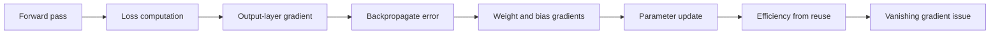
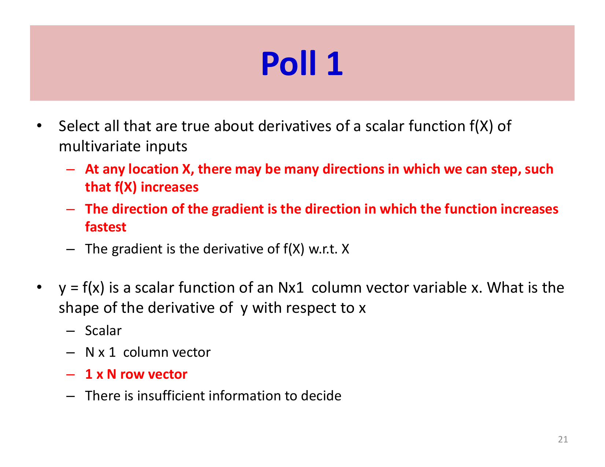
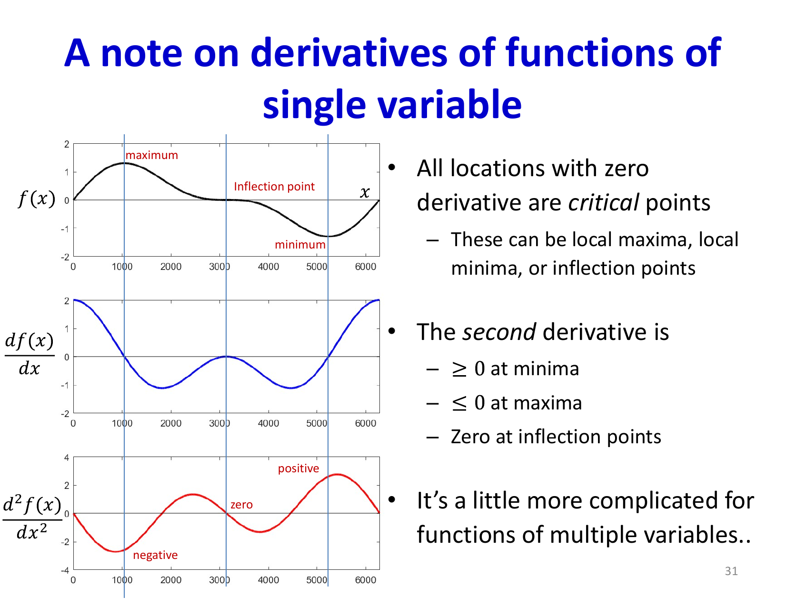

# Lecture 4: Learning Continued - Gradient Descent for Deep Networks

Building on the optimization foundations of Lecture 3, this lecture addresses the practical challenge of computing gradients for all parameters in deep networks. We must compute `(partial L) / (partial w)` for every weight in every layer. Backpropagation solves this by leveraging the chain rule to efficiently propagate errors backward through the network.

## Visual Roadmap



## At a Glance

| Quantity | Meaning | Why it matters |
|---|---|---|
| `z^(k)` | Pre-activation at layer `k` | Affine signal before nonlinearity |
| `y^(k)` | Activated output at layer `k` | Value passed to the next layer |
| `(partial L) / (partial y^(k))` | Gradient wrt layer outputs | Backward signal before activation derivative |
| `(partial L) / (partial z^(k))` | Error signal at layer `k` | Core reusable quantity for gradients |
| `(partial L) / (partial W^(k))` | Weight gradient | Used for learning updates |
| Chain rule | Composition of local derivatives | Makes deep networks trainable |

## The Fundamental Challenge

Given a network with T layers and thousands (or millions) of parameters, naive gradient computation would require evaluating the partial derivative with respect to each parameter independently. Computing `(partial L) / (partial w_(ij)^((k)))` for every weight `w_(ij)^((k))` in layer `k` separately would be prohibitively expensive.

The solution: **Use the chain rule to reuse intermediate computations**, computing all gradients in a single backward pass through the network. This is efficient because many parameters influence the loss through shared intermediate representations.

## Forward and Backward Passes

Neural network computation naturally decomposes into two phases:

**Forward Pass**: Compute the network's output for a given input
- Start with input `y^((0)) = x`
- For each layer `k = 1, ..., N`:
  - `z_j^((k)) = sum_i w_(ij)^((k)) y_i^((k-1)) + b_j^((k))` (affine combination)
  - `y_j^((k)) = f^((k))(z_j^((k)))` (activation function)
- Output: `y^((N)) = y_hat`
- Compute loss: `L = Div(y^((N)), d)`

Store all intermediate `z^((k))` and `y^((k))` values—these are needed for gradient computation.

**Backward Pass**: Propagate error signals backward to compute gradients for all weights
- Start with loss gradient: `(partial L) / (partial y^((N))) = (partial Div) / (partial y_hat)`
- For each layer `k = N, ..., 1` (backward):
  - Compute `(partial L) / (partial z^((k)))` using chain rule through activation
  - Compute `(partial L) / (partial w_(ij)^((k)))` using chain rule through weights
  - Propagate gradient backward: `(partial L) / (partial y^((k-1)))`



## The Chain Rule: Core Principle

For nested functions `y = g(f(x))`:

```text
(dy) / (dx) = (dy) / (df) * (df) / (dx)
```

For multivariate functions where `x` influences `y` through multiple paths:

```text
(partial y) / (partial x_i) = sum_j (partial y) / (partial z_j) * (partial z_j) / (partial x_i)
```

The total influence is the sum over all paths—this is key to understanding backpropagation. When a neuron's output influences multiple neurons in the next layer, the gradient through that neuron is the sum of influences from all downstream neurons.

## Gradient Geometry and Backprop as Dynamic Programming

The slides motivate backpropagation in two complementary ways.

First, gradient geometry: a derivative is a local linear map telling us how a tiny change in an input changes the output. Once a network is viewed as a composition of tiny local maps, the chain rule becomes unavoidable.

Second, dynamic programming: many parameters share the same downstream subcomputations. Instead of recomputing those dependencies separately for every weight, backprop stores the common error signals and reuses them layer by layer. That is why it is not merely correct, but computationally efficient.

## Computing Gradients at the Output Layer

For the final layer:

```text
(partial L) / (partial y_j^((N))) = (partial Div(y^((N)), d)) / (partial y_j^((N)))
```

This depends on the loss function:

**For `L_2` Loss** (`L = (1) / (2)(y-d)^2`):
```text
(partial L) / (partial y) = (y - d)
```

**For Cross-Entropy Loss** (multi-class):
```text
(partial L) / (partial y_i) = -(d_i) / (y_i)   =>   grad_y L  has  -(1) / (y_c)  at correct class  c
```

Then apply the chain rule through the activation function:

```text
(partial L) / (partial z_j^((N))) = (partial L) / (partial y_j^((N))) * f'^((N))(z_j^((N)))
```

where `f'^((N))` is the derivative of the activation function (sigmoid: `sigma'(z) = sigma(z)(1-sigma(z))`; ReLU: `ReLU'(z) = 1_(z>0)`).

For the common `softmax + cross-entropy` combination, this simplifies to:

```text
delta^((N)) = (partial L) / (partial z^((N))) = y^((N)) - d
```

That clean output-layer error is one reason this pairing is so common.

## Backpropagating Through Weights

The gradient with respect to weights connecting layer `k-1` to layer `k`:

```text
(partial L) / (partial w_(ij)^((k))) = (partial L) / (partial z_j^((k))) * y_i^((k-1))
```

Since the weight appears linearly in `z_j = sum_i w_(ij) y_i + b`, this is simply the error signal times the input value. All parameters at layer `k` can be computed using the same error signal `(partial L) / (partial z^((k)))` (shared computation).

For bias: `(partial L) / (partial b_j^((k))) = (partial L) / (partial z_j^((k)))`

## Propagating Back Through Layers

To compute gradients at layer `k-1`, we propagate the error signal backward:

```text
(partial L) / (partial y_i^((k-1))) = sum_j (partial L) / (partial z_j^((k))) * w_(ij)^((k))
```

Summing over all neurons in layer `k` that receive input from neuron `i` in layer `k-1`. In matrix form:

```text
(partial L) / (partial y^((k-1))) = W^((k)) (partial L) / (partial z^((k)))
```

Then compute the error signal for layer `k-1`:

```text
(partial L) / (partial z_i^((k-1))) = (partial L) / (partial y_i^((k-1))) * f'^((k-1))(z_i^((k-1)))
```

This pattern repeats backward through all layers.

## The Complete Backpropagation Algorithm

1. **Forward pass**: Compute all `z^((k)), y^((k))` for `k = 0, ..., N`
2. **Initialize**: Compute `delta^((N)) = (partial L) / (partial z^((N))) = (partial L) / (partial y^((N))) elementwise f'^((N))`
3. **Backward propagation**: For `k = N, ..., 1`:
   - Compute weight gradients: `(partial L) / (partial W^((k))) = y^((k-1)) (delta^((k)))^T`
   - Propagate error: `delta^((k-1)) = (W^((k)) delta^((k))) elementwise f'^((k-1))`
4. **Update weights**: `W^((k)) -> W^((k)) - eta (partial L) / (partial W^((k)))`

where `elementwise` denotes element-wise multiplication.

## Computational Efficiency

The beauty of backpropagation is its efficiency:

- **Forward pass**: `O(N * D_(max)^2)` where `D_(max)` is the maximum layer size
- **Backward pass**: `O(N * D_(max)^2)` (same complexity)
- **Total**: `O(N * D_(max)^2)` to compute gradients for all parameters

Without backpropagation, computing gradients independently would cost `O(P * N * D_(max)^2)` where `P` is the total number of parameters—potentially millions of times more expensive.



## Vanishing Gradients

A critical issue emerges when backpropagating through many layers. Each layer multiplies gradients by both weight matrices and activation derivatives. For sigmoid: `f'(z) <= 0.25` everywhere (since `sigma'(z) = sigma(z)(1-sigma(z)) <= (1) / (4)`).

Backpropagating through many sigmoid layers therefore repeatedly shrinks gradients:

```text
delta^((k-1)) = (W^((k)) delta^((k))) elementwise f'^((k-1))(z^((k-1)))
```

If the weight operators do not compensate for those contractions, the gradient becomes negligibly small. Early layers then receive almost no learning signal. This is the **vanishing gradient problem**, a major barrier to deep learning until solutions like ReLU activations, normalization, and skip connections became common.

ReLU partially alleviates this by having `f'(z) = 1` for `z > 0`, enabling gradient flow through many layers.

## Data Representations and Loss Functions

Before backpropagating, we must properly represent data:

**Binary Classification**: Output neuron with sigmoid activation, interpreted as probability
```text
P(y=1|x) = sigma(z) = (1) / (1+e^(-z))
```

**Multi-class Classification**: `K` output neurons with softmax activation
```text
y_i = (e^(z_i)) / (sum_j e^(z_j))
```

producing a probability distribution over classes.

**Regression**: Output neuron (or neurons) without activation, directly outputting predicted values.

The loss function choice (L2, cross-entropy) should match the output representation.

## Key Takeaways

- **Forward Pass**: Compute network output and store intermediate activations
- **Backward Pass**: Propagate error signals using the chain rule
- **Chain Rule**: Total gradient is product along computation paths
- **Shared Computation**: Error signals are reused across many parameter gradients
- **Computational Complexity**: Backpropagation achieves `O(N * D^2)` complexity, only 2x the forward pass
- **Vanishing Gradients**: Deep networks with sigmoid suffer gradient attenuation; ReLU helps
- **Data Representation**: Matching outputs to classification/regression is crucial
- **Practical Algorithm**: Forward-backward cycle is the foundation of all neural network training

With backpropagation in hand, we can train networks of any depth. However, practical issues like vanishing gradients, weight initialization, and optimization challenges require careful attention—topics for subsequent lectures.

## Slide Coverage Checklist

These bullets mirror the source slide deck and make the summary concept coverage explicit.

- empirical risk minimization recap
- divergence vs 0/1 classification error
- local linearization intuition for derivatives
- scalar derivative and vector derivative notation
- gradient as transpose / directional derivative geometry
- inner-product argument for steepest descent
- Hessian intuition and stationary points
- chain rule along multiple dependency paths
- forward pass through a layered network
- output-layer gradient from the divergence
- propagation from outputs to affine variables
- gradients for weights and biases
- recursive propagation to earlier layers
- why backprop is efficient dynamic programming
- vanishing-gradient intuition from repeated multiplication
