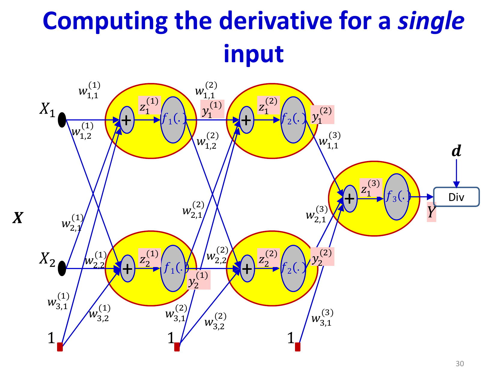

# Lecture 5: Multi-Layer Perceptrons and Complete Backpropagation

With the conceptual foundations of backpropagation established, this lecture provides rigorous mathematical treatment of gradient computation in multi-layer networks and unifies everything into a complete learning framework. We formalize the notation, present detailed derivations, and implement the complete forward-backward algorithm.

## Visual Roadmap

```mermaid
flowchart LR
    A["Problem formulation"] --> B["Layer notation"]
    B --> C["Forward pass"]
    C --> D["Chain rule"]
    D --> E["Output-layer gradients"]
    E --> F["Backprop through weights"]
    F --> G["Backprop to earlier layers"]
    G --> H["Activation derivatives"]
    H --> I["Implementation details"]
```



## At a Glance

| Symbol / object | Meaning | Use |
|---|---|---|
| `W^(k)` | Weight matrix for layer `k` | Maps layer `k-1` activations into layer `k` |
| `b^(k)` | Bias vector for layer `k` | Adds affine offset |
| `z^(k)` | Pre-activation vector | Input to the nonlinearity |
| `y^(k)` | Post-activation vector | Output of the layer |
| `delta^(k)` | Layer error signal | Efficient handle for all gradients in layer `k` |
| `f'(z)` | Activation derivative | Gates gradient flow |

## Complete Problem Formulation

**Given**: Training set `{(x^((n)), d^((n)))}_(n=1)^T` of input-output pairs

**Find**: Network parameters `W = {W^((1)), b^((1)), ..., W^((N)), b^((N))}` that minimize

```text
L(W) = (1) / (T) sum_(n=1)^(T) Div(y_n^((N)), d^((n)))
```

**Method**: Gradient descent with learning rate `eta`

```text
W -> W - eta grad_W L(W)
```

## From Per-Example Loss to Full Training Loss

The slides are explicit that training loss is built in layers:

1. compute a divergence for one example
2. sum or average divergences over the dataset or current minibatch
3. differentiate that total with respect to every parameter

This matters because the total derivative is just the sum of the per-example derivatives. Backpropagation therefore does not change conceptually when moving from one example to many; we simply aggregate the same local gradients across examples.

## Formal Network Notation

For a layered network with `N` layers:

**Layer `k` computations**:
- Input from previous layer: `y^((k-1)) = [y_1^((k-1)), ..., y_(D_(k-1))^((k-1))]^T`
- Weight matrix: `W^((k)) in R^{D_(k-1) x D_k}` (rows = inputs, columns = neurons)
- Bias vector: `b^((k)) in R^(D_k)`
- Affine combination: `z^((k)) = W^((k)T) y^((k-1)) + b^((k))`
- Activation: `y^((k)) = f^((k))(z^((k)))` where `f^((k))` applies element-wise

**Network composition**:
```text
y^((0)) = x   =>   y^((1)) = f^((1))(W^((1)T) x + b^((1)))   =>   ...   =>   y^((N)) = y_hat
```

## Computing the Forward Pass

**Algorithm**:
```
Input: x (D₀-dimensional vector)
Output: y^(N) (predictions), and all intermediate z^(k), y^(k)

y^(0) ← x
For k = 1 to N:
  z^(k) ← W^(k)T y^(k-1) + b^(k)
  y^(k) ← f^(k)(z^(k))
return y^(N), {z^(k), y^(k)}
```

The intermediate values must be retained—they are essential for computing gradients in the backward pass.

**Notation Extension**: To handle biases uniformly, extend outputs: `y^((k)) -> [y^((k)), 1]` and weights: `W^((k)) -> [W^((k)), b^((k))]`. Then `z^((k)) = W^((k)T) y^((k-1))` without explicit bias terms. (This is notational convenience; implementations handle biases separately.)

## Calculus Refresher: The Chain Rule

For nested functions `y = f(g(u))`:

```text
(dy) / (du) = (dy) / (dg) * (dg) / (du)
```

For multiple paths where `u` influences `y` through multiple intermediates `g_1, ..., g_m`:

```text
(partial y) / (partial u) = sum_(j=1)^(m) (partial y) / (partial g_j) * (partial g_j) / (partial u)
```

**Influence Diagram**: Visualize the computation graph showing how variables propagate forward, and how gradients propagate backward. Each edge carries partial derivatives as multiplicative factors.

For the network:
- Forward: `x -> z^((1)) -> y^((1)) -> z^((2)) -> ... -> y^((N)) -> L`
- Backward: `(partial L) / (partial y^((N))) -> (partial L) / (partial z^((N))) -> (partial L) / (partial y^((N-1))) -> ... -> (partial L) / (partial x)`



## Computing Gradients: Output Layer

Starting point—the loss function gradient at the output:

```text
(partial L) / (partial y^((N))) = grad_(y^((N))) Div(y^((N)), d)
```

**Examples**:

**L2 Regression Loss**: `L = (1) / (2)(y - d)^2`
```text
(partial L) / (partial y_j) = (y_j - d_j)
```

**Cross-Entropy for Multi-class**: `L = -sum_i d_i log(y_i)` where `d` is one-hot
```text
(partial L) / (partial y_j) = -(1) / (y_j)  for the correct class;  0 otherwise
```

Then propagate through the final activation:

```text
(partial L) / (partial z_j^((N))) = (partial L) / (partial y_j^((N))) * f_j'^((N))(z_j^((N)))
```

where `f'^((N))` is the derivative of the activation function, applied element-wise.

## Backpropagating Through Weights

For weights at layer `k` connecting layer `k-1` to `k`:

```text
(partial L) / (partial W^((k))) = y^((k-1)) (partial L / partial z^((k)))^T
```

In component form:

```text
(partial L) / (partial W_(ij)^((k))) = (partial L) / (partial z_j^((k))) * y_i^((k-1))
```

The weight gradient is the product of the error signal and the input to that weight. Importantly, all weights in a layer share the same error signal—we compute `(partial L) / (partial z^((k)))` once, then use it for all weights in that layer.

For biases:
```text
(partial L) / (partial b^((k))) = (partial L) / (partial z^((k)))
```

## Matrix-Shape Sanity Check

The slide deck spends time on notation because matrix orientation mistakes are one of the easiest ways to get backprop wrong.

- `y^((k-1))` is a column vector of incoming activations
- `delta^((k))` is a column vector of error signals for the next layer
- their outer product gives a matrix with one row per incoming unit and one column per destination unit

That is exactly the shape of `W^((k))`. When the algebra is correct, the dimensions line up naturally.

## Backpropagating to Previous Layers

To compute gradients at layer `k-1`, we must propagate the error signal backward:

```text
(partial L) / (partial y_i^((k-1))) = sum_j (partial L) / (partial z_j^((k))) * W_(ij)^((k))
```

In matrix form:
```text
grad_(y^((k-1))) L = W^((k)) * grad_(z^((k))) L
```

Then activate:
```text
(partial L) / (partial z_i^((k-1))) = (partial L) / (partial y_i^((k-1))) * f_i'^((k-1))(z_i^((k-1)))
```

This error signal `delta^((k-1)) = (partial L) / (partial z^((k-1)))` propagates backward through all layers following the same pattern.

## Complete Backpropagation Algorithm

**Input**: Training example `(x, d)`, current parameters `W, b`

**Forward Pass**:
```
y^(0) ← x
For k = 1 to N:
  z^(k) ← W^(k)T y^(k-1) + b^(k)
  y^(k) ← f^(k)(z^(k))
L ← Div(y^(N), d)
```

**Backward Pass**:
```
δ^(N) ← ∇_(y^(N)) Div(y^(N), d) ⊙ f'^(N)(z^(N))
For k = N down to 1:
  ∇_W L = y^(k-1) (δ^(k))^T
  ∇_b L = δ^(k)
  Update: W^(k) ← W^(k) - η ∇_W L
         b^(k) ← b^(k) - η ∇_b L
  If k > 1:
    δ^(k-1) ← (W^(k) δ^(k)) ⊙ f'^(k-1)(z^(k-1))
```

where `elementwise` is element-wise multiplication and `f'^((k))` is the derivative of layer `k`'s activation.

## Activation Functions and Their Derivatives

**Sigmoid**: `sigma(z) = (1) / (1+e^(-z))`
- Derivative: `sigma'(z) = sigma(z)(1 - sigma(z)) in [0, 0.25]`
- Output range: `(0, 1)` suitable for probabilities
- Problem: Gradient saturation outside `[-2, 2]`

**Tanh**: `tanh(z) = (e^z - e^(-z)) / (e^z + e^(-z))`
- Derivative: `tanh'(z) = 1 - tanh^2(z)`
- Output range: `(-1, 1)` centered around zero
- Similar issues to sigmoid

**ReLU**: `ReLU(z) = max(0, z)`
- Derivative: `ReLU'(z) = 1 for z > 0, 0 for z < 0`
- Output range: `[0, infinity)`
- Advantage: No saturation for positive inputs; efficient computation
- Disadvantage: Dead neurons (zero gradient when `z < 0`)

ReLU's unit gradient for positive inputs enables gradient flow through deep networks.

## Multi-class Classification Example

**Setup**: 3 classes, `K = 3` output neurons with softmax

```text
y_i = (e^(z_i)) / (sum_(j=1)^3 e^(z_j))
```

**Loss**: Cross-entropy
```text
L = -d_c log(y_c) = -log(y_c)
```
where `c` is the correct class (since `d` is one-hot).

**Output Gradient**:
```text
(partial L) / (partial y_i) = -(1) / (y_c)  for the correct class;  0 otherwise
```

**Through Softmax**:
```text
(partial L) / (partial z_i) = y_i - d_i
```

Remarkably simple! The softmax + cross-entropy combination produces a particularly clean gradient.

## Practical Considerations

**Batch Processing**: Computing gradients on single examples is noisy. In practice:

```text
grad_W L = (1) / (|B|) sum_(n in B) grad_W L_n
```

where `B` is a minibatch. Averaging stabilizes gradient estimates.

**Gradient Checking**: Numerically verify backpropagation:

```text
Numerical gradient: g_i^(num) = (L(w + epsilon e_i) - L(w - epsilon e_i)) / (2epsilon)
```

Compare with analytical `grad_W L` from backpropagation. Small differences (typically `< 10^(-5)`) indicate correct implementation.

**Initialization**: Random initialization of `W^((k))`, typically from `N(0, sigma^2)` where `sigma` depends on layer size. Poor initialization leads to training failure.

## Computational Complexity

- **Forward pass**: `O(sum_k D_k D_(k-1))` (matrix-vector products)
- **Backward pass**: Same complexity as forward pass
- **Total per example**: `O(sum_k D_k D_(k-1))`
- **Per-example efficient**: Only `~ 2`x the cost of forward pass

## Key Insights

**Information Flow**: The network transforms inputs through successive nonlinear transformations. Each layer detects patterns in its inputs. Deeper layers see higher-level features.

**Gradient Flow**: Backpropagation efficiently computes how loss depends on every parameter by reusing partial derivatives through the computation chain.

**Scale**: Modern networks have millions of parameters optimized through backpropagation—an algorithm that would be infeasible to compute naively but is elegant and efficient through the chain rule.

## Key Takeaways

- **Complete Forward Pass**: Compute all `z^((k))` and `y^((k))` for all layers, storing them for backward pass
- **Error Signal Propagation**: Work backward from output, computing `delta^((k)) = (partial L) / (partial z^((k)))`
- **Gradient Computation**: Each weight's gradient is error signal times input value
- **Layer Propagation**: Error signals propagate through weight matrices and activation derivatives
- **Computational Efficiency**: Backprop achieves linear scaling in network size through dynamic programming
- **Softmax + Cross-Entropy**: Produces particularly clean gradients for multi-class classification
- **Implementation Verified**: Numerical gradient checking validates analytical backpropagation

Having established the complete training algorithm, the remaining frontier is practical optimization—how to set learning rates, handle non-convex optimization landscapes, and enable successful training of very deep networks. These are topics for subsequent lectures on optimizers and regularization.

## Slide Coverage Checklist

These bullets mirror the source slide deck and make the summary concept coverage explicit.

- full notation for multilayer networks
- total training loss as sum / average over examples
- total derivative as sum of per-example derivatives
- calculus refresher: differential approximation
- multivariate chain rule in matrix form
- forward equations for affine values and activations
- output-layer derivative for regression
- output-layer derivative for classification
- recursive delta equations for hidden layers
- weight-gradient matrix shapes and orientation
- bias-gradient computation
- activation derivatives for sigmoid / tanh / ReLU
- softmax plus cross-entropy simplification
- complete forward-backward algorithm
- minibatch averaging, gradient checking, and complexity
