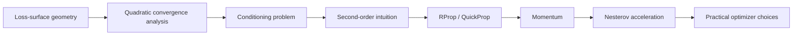
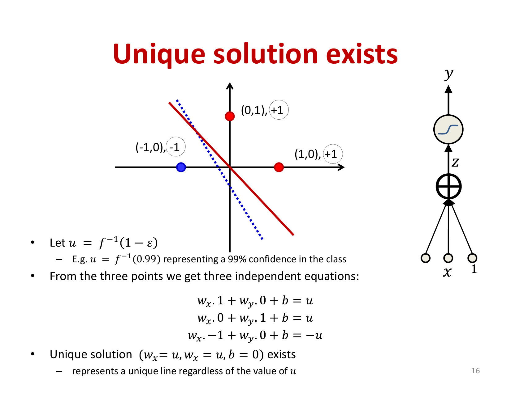
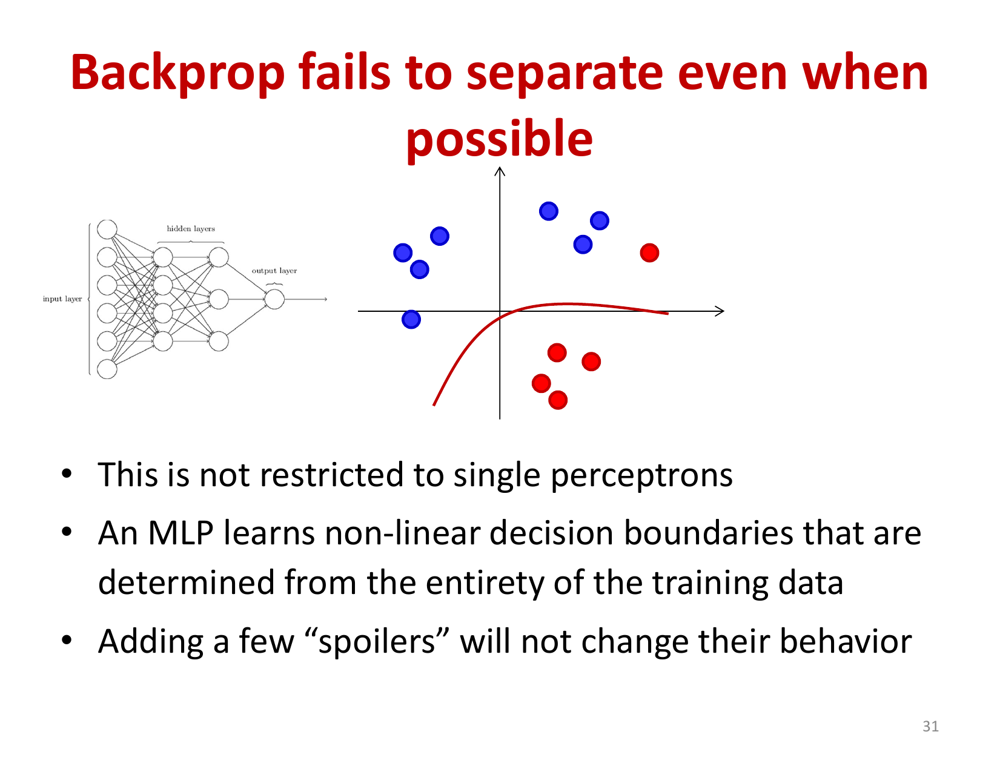
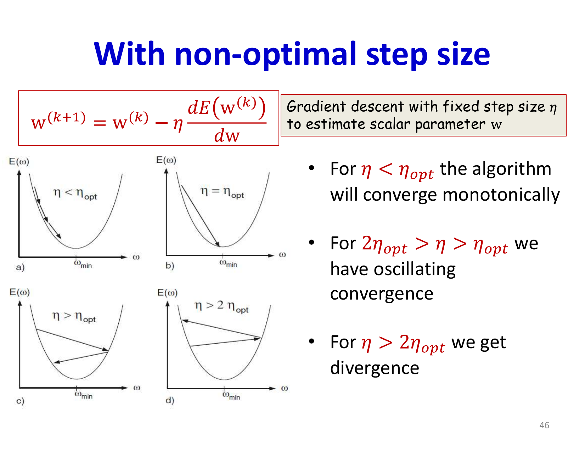
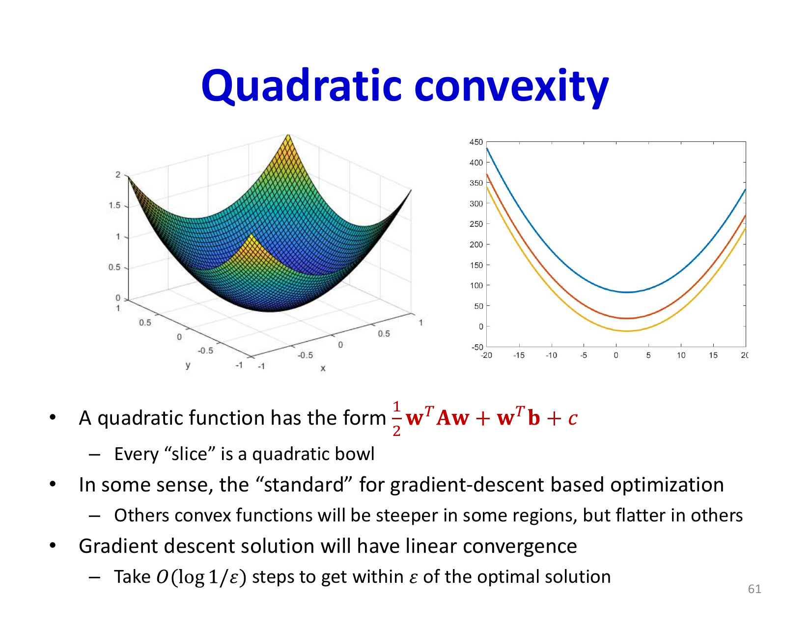
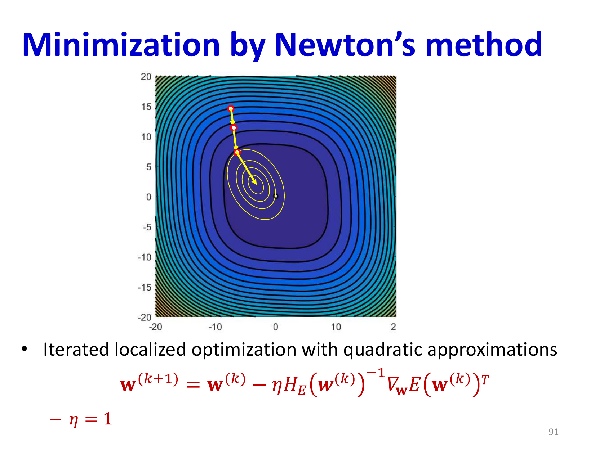

# Lecture 6: Optimization Basics

This lecture provides the foundational understanding of optimization algorithms for training neural networks. We move beyond basic gradient descent to understand convergence properties, explore second-order methods, and introduce advanced techniques like momentum and adaptive learning rates. The core challenge is that neural network loss surfaces are non-convex with multiple local minima and saddle points, requiring careful algorithm design to achieve efficient training.

## Visual Roadmap



## At a Glance

| Method / idea | Main benefit | Main tradeoff |
|---|---|---|
| Vanilla gradient descent | Simple baseline | Slow on ill-conditioned surfaces |
| Hessian view | Explains curvature and step size | Usually too expensive directly |
| RProp | Uses gradient sign, not magnitude | Heuristic rather than principled full optimization |
| QuickProp | Per-parameter curvature approximation | Can be brittle |
| Momentum | Speeds motion through valleys | Needs tuning |
| Nesterov momentum | Better lookahead correction | Slightly more complex but often more stable |

## Historical Context: Backpropagation and Its Limitations

Before diving into optimization, it's important to understand what makes backpropagation effective and where it falls short. While backpropagation successfully computes gradients of the loss function with respect to network parameters, it does not guarantee that the network learns the true decision boundary even when one exists.

A classical counterexample from Brady, Raghavan, and Slawny (1989) illustrates this limitation. Consider a simple linearly separable dataset with a few additional "spoiler" points. A perceptron using the perceptron rule finds the linear separator trivially. However, backpropagation with logistic activation and cross-entropy loss can fail to separate the points. This occurs because backpropagation minimizes a differentiable loss function (divergence), which serves as a proxy for classification error but is not identical to it.

## What the Counterexample Is Really Showing

The lecture is not claiming that backpropagation is "wrong." It is making a narrower point: minimizing a differentiable loss and minimizing classification mistakes are not the same optimization problem.

That distinction explains why:

- the perceptron rule can succeed on a separable classification task
- a smooth logistic or cross-entropy objective can still choose a different solution
- lower proxy loss does not always mean zero training error

This is one of the first places in the course where optimization objectives and evaluation objectives are clearly separated.

The key insight is that backpropagation achieves low variance in its learned decision boundaries at the potential cost of bias. By not fitting every training point perfectly, the algorithm learns more generalizable solutions. This trade-off between minimizing the proxy loss and achieving perfect training accuracy is actually a feature, not a bug.



## The Loss Surface and Convergence Challenges

The neural network loss surface is highly complex and non-convex. Understanding its geometry is crucial for optimization.

### Local Minima and Saddle Points

A critical question for deep learning practitioners is: does gradient descent reliably find good solutions? The answer depends on the topology of the loss surface. Recent research has revealed that:

- **Saddle points dominate large networks**: In high-dimensional spaces, saddle points (where the gradient is zero but the surface increases in some directions and decreases in others) far outnumber local minima. As network size increases exponentially, so does the frequency of saddle points.

- **Most local minima are equivalent**: The loss surface of large networks appears to have a band of local minima that are all reasonably close to the global minimum in terms of loss value. This is a more optimistic view than earlier pessimistic results about "bad" local minima.

- **Small networks behave differently**: For networks of finite size trained on finite data, truly problematic local minima can exist. This is a reminder that the pleasant properties of large networks may not always hold.

Vanilla gradient descent frequently gets stuck at saddle points because the gradient is zero in all directions, providing no directional information to escape. This is one of the central problems driving the development of more sophisticated optimization algorithms.

## Convergence Analysis for Quadratic Functions

To understand optimization better, we examine the simplest non-trivial case: quadratic loss functions. Although neural network losses are not quadratic, this analysis provides intuition and a benchmark for convergence rates.

### Single Variable Case

For a scalar quadratic function `E(w) = (1) / (2)(w-w^*)^2` where `w^*` is the optimum, gradient descent with step size `eta` has the update rule:

```text
w^((k+1)) = w^((k)) - eta (dE) / (dw) evaluated_at _(w^((k)))
```

Using Taylor expansion around the optimum:

```text
E(w^((k))) = E(w^*) + (1) / (2)(w^((k)) - w^*)^2 H
```

where `H` is the Hessian (second derivative). The convergence behavior depends critically on the step size:

- If `0 < eta < (1) / (H)`: monotonic convergence to the optimum
- If `(1) / (H) < eta < (2) / (H)`: oscillating but convergent updates
- If `eta >= (2) / (H)`: divergence

The optimal step size that minimizes convergence time is `eta_(opt) = (1) / (H)`.

The slide deck uses this 1D quadratic case as a calibration tool. Real deep networks are much messier, but the same qualitative lesson survives: oversize steps create oscillation or divergence, while tiny steps waste computation.



### Multivariate Case and the Conditioning Problem

For multivariate functions, the situation becomes more complex. With a diagonal Hessian, the loss function decouples into independent quadratics along each coordinate:

```text
E(w) = sum_i (1) / (2)H_(ii)(w_i - w_i^*)^2
```

Each dimension has its own optimal learning rate: `eta_(i,opt) = (1) / (H_(ii))`. However, in practice, we must use a single learning rate for all dimensions. This creates a fundamental problem: the learning rate must be small enough to avoid divergence in the direction with the highest Hessian eigenvalue, but this makes learning very slow in directions with smaller eigenvalues.

The ratio of the largest to smallest eigenvalue is called the **condition number** `kappa = (lambda_(max)) / (lambda_(min))`. Large condition numbers lead to slow convergence because the learning rate must accommodate the largest eigenvalue, leaving other directions to converge slowly.



## Second-Order Methods: Newton's Method

Newton's method directly addresses the conditioning problem by normalizing the loss surface. The Newton update rule is:

```text
w^((k+1)) = w^((k)) - H^(-1) grad E(w^((k)))
```

This is equivalent to using adaptive learning rates for each dimension proportional to `(1) / (H_(ii))`. In principle, Newton's method can reach the optimum in a single step for quadratic functions.

### Challenges for Neural Networks

Despite its theoretical appeal, Newton's method has several critical limitations for deep learning:

1. **Computational cost**: For a network with 100,000 parameters, the Hessian matrix has `10^(10)` elements. Computing and storing this matrix is infeasible.

2. **Inversion cost**: Even if computed, inverting a `10^5 x 10^5` matrix is computationally prohibitive.

3. **Non-convexity**: For non-convex loss surfaces, the Hessian may not be positive semi-definite. Taking steps in directions with negative eigenvalues moves away from rather than toward minima.

4. **Empirical instability**: Hessian-based methods are prone to instability in non-convex regions.

Several quasi-Newton methods attempt to approximate or estimate the Hessian more efficiently (BFGS, L-BFGS, Levenberg-Marquardt), but these remain challenging for very large neural networks and have largely fallen out of favor.

## Adaptive Learning Rate Schedules

Since optimal learning rates vary across dimensions and optimal second-order methods are infeasible, a practical compromise is to decay the learning rate during training. The intuition is:

- Start with a large learning rate to escape poor local minima and explore the loss surface
- Gradually decrease the learning rate to stabilize convergence near a solution

Common decay schedules include:

- **Linear decay**: `eta^((k)) = eta_0 - alpha k`
- **Quadratic decay**: `eta^((k)) = eta_0 - alpha k^2`
- **Exponential decay**: `eta^((k)) = eta_0 e^(-alpha k)`

A practical approach is step decay: train with a fixed learning rate until performance plateaus, then multiply the learning rate by a decay factor (e.g., 0.1), and resume training. This can be repeated multiple times.

## Decoupling Dimensions: RProp and QuickProp

Instead of modifying the loss function landscape (like Newton's method attempts), alternative algorithms decouple the learning of different dimensions entirely.

### Resilient Propagation (RProp)

RProp is a remarkably simple algorithm that treats each parameter independently:

1. Maintain a step size `Delta w_i` for each parameter
2. At each step, compute the current gradient `(dE) / (dw_i)`
3. If the gradient sign hasn't changed from the previous step: **increase** the step size (`Delta w_i -> alpha Delta w_i` where `alpha > 1`, e.g., 1.2)
4. If the gradient sign has changed (overshoot): **decrease** the step size (`Delta w_i -> beta Delta w_i` where `beta < 1`, e.g., 0.5)
5. Update the parameter: `w_i -> w_i - sign((dE) / (dw_i)) Delta w_i`

The elegance of RProp is that it automatically grows step sizes in well-behaved directions and shrinks them in oscillatory directions. It makes only minimal assumptions about the loss function and requires no convexity assumptions.



### QuickProp

QuickProp applies Newton-style updates but with two key modifications:

1. **Dimensional decoupling**: For each parameter independently, approximate the second derivative
2. **Finite difference approximation**: Estimate the second derivative using differences between the current and previous gradients

For each parameter, the update is:

```text
w_i^((k+1)) = w_i^((k)) - ((dE) / (dw_i) evaluated_at ^((k))) / ((dE) / (dw_i) evaluated_at ^((k)) - (dE) / (dw_i) evaluated_at ^((k-1))) (w_i^((k)) - w_i^((k-1)))
```

This is a first-order approximation to Newton's method that avoids computing actual second derivatives. QuickProp is often one of the fastest training algorithms for many problems, though it can be prone to instability in highly non-convex regions.

## Momentum Methods

A different approach recognizes that the main problem with vanilla gradient descent is not the direction of steps, but oscillations in certain dimensions. The solution: maintain a running average of past steps.

### Basic Momentum

The momentum method maintains an exponentially weighted moving average of all past gradients:

```text
v^((k)) = mu v^((k-1)) + (1-mu) grad E(w^((k)))
```

```text
w^((k+1)) = w^((k)) - eta v^((k))
```

The momentum parameter `mu` (typically 0.9) determines how much of the previous velocity to retain. In directions where the gradient consistently points the same way, the moving average grows large, accelerating progress. In directions where gradients oscillate, the positive and negative contributions cancel out, dampening the steps.

The algorithm elegantly balances two competing needs:
- **Smooth convergence**: Steps grow larger in consistent directions
- **Damped oscillations**: Steps become smaller in oscillatory directions

### Nesterov Accelerated Gradient

Nesterov's modification changes the order of operations for better convergence:

1. First, take a tentative step using the momentum velocity: `w_tilde = w^((k)) + mu v^((k-1))`
2. Compute the gradient at this lookahead position: `g = grad E(w_tilde)`
3. Update the velocity and position:

```text
v^((k)) = mu v^((k-1)) - eta g
```
```text
w^((k+1)) = w^((k)) + v^((k))
```

The key difference is evaluating the gradient at the anticipated future position rather than the current position. This lookahead property allows Nesterov's method to correct course before committing to large steps, resulting in faster convergence than standard momentum. The improvement is particularly noticeable when convergence rate matters, as demonstrated in comparative studies.



## Summary and Key Takeaways

- **Backpropagation minimizes a proxy loss**: Perfect training accuracy is not always desirable due to variance-bias tradeoffs
- **Loss surfaces are complex**: Local minima, saddle points, and high condition numbers all pose challenges
- **Single learning rates are limiting**: Different parameters benefit from different step sizes
- **Second-order methods are impractical**: Computing and inverting Hessians is infeasible for large networks
- **Adaptive methods work well**: Momentum, RProp, QuickProp, and learning rate decay all address different aspects of the optimization problem
- **Momentum methods show promise**: Both standard momentum and Nesterov acceleration consistently outperform vanilla gradient descent

The next lecture will continue exploring optimization, diving deeper into stochastic gradient descent, batch sizes, and further algorithmic innovations like adaptive learning rate methods (RMSprop, Adam) that will become standard in modern deep learning.

## Slide Coverage Checklist

These bullets mirror the source slide deck and make the summary concept coverage explicit.

- training recap and backprop-derived gradients
- backprop does not directly optimize classification error
- perceptron vs backprop counterexample / failure to separate
- quadratic convergence analysis in 1D
- monotone vs oscillatory vs divergent updates
- optimal learning rate for a quadratic
- multivariate quadratic and diagonal Hessian intuition
- condition number as the source of slow convergence
- Newton method and Hessian inversion idea
- why second-order methods are expensive for deep nets
- non-convexity and negative curvature issues
- learning-rate decay schedules
- RProp sign-based step adaptation
- QuickProp as per-parameter curvature approximation
- momentum and Nesterov acceleration
