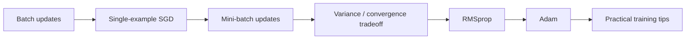
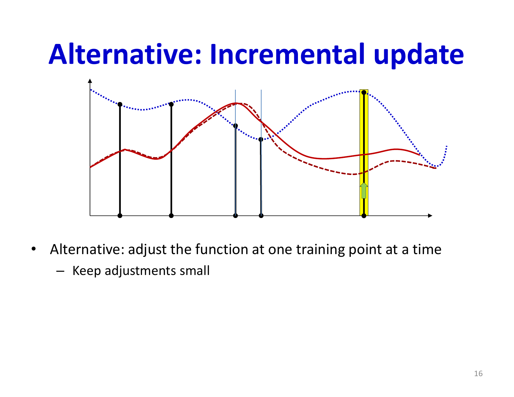
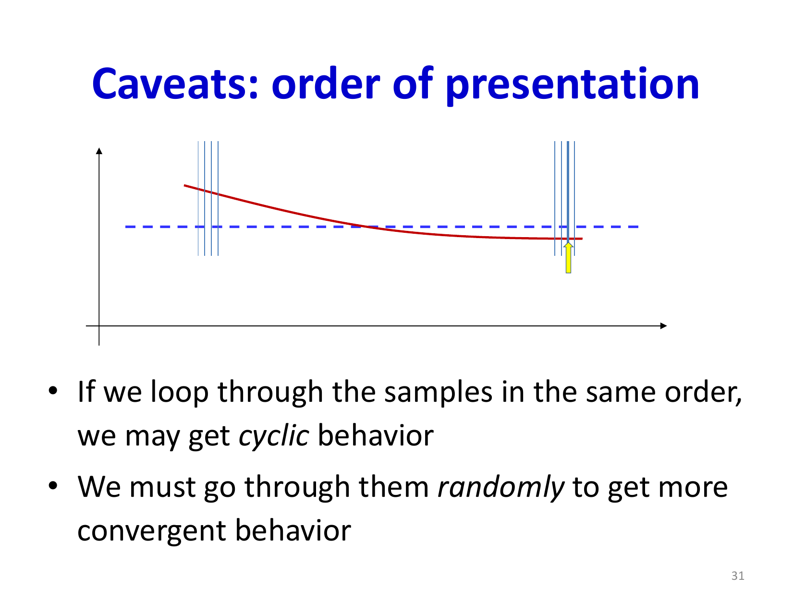
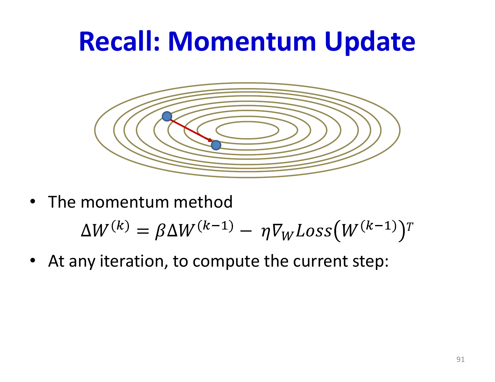

# Lecture 7: Stochastic Gradient Descent

Stochastic Gradient Descent (SGD) represents one of the most important algorithmic innovations in deep learning. Rather than computing gradients over the entire training dataset before updating parameters (batch gradient descent), SGD updates parameters after each example or small batch. This simple change fundamentally transforms the convergence properties and computational efficiency of neural network training, enabling practical learning on massive datasets.

## Visual Roadmap



## At a Glance

| Update style | Cost per update | Variance | Typical use |
|---|---|---|---|
| Batch GD | High | Low | Analysis and small datasets |
| SGD | Very low | High | Highly noisy or online settings |
| Mini-batch SGD | Moderate | Moderate | Standard deep learning default |
| RMSprop | Adaptive scaling per parameter | Moderate | Useful for noisy non-stationary gradients |
| Adam | Momentum plus adaptive scaling | Moderate | Strong general-purpose baseline |

## From Batch to Incremental Updates

The standard formulation of neural network training uses batch updates: compute the gradient with respect to all training data, take a single step, then repeat. This approach is theoretically sound but computationally wasteful and, surprisingly, not always the best in practice.

### The Case for Incremental Updates

The key insight is that for many training datasets, individual examples are not independent samples from some infinite distribution—they are correlated. Consider the extreme case where all training examples are identical:

```text
grad E(w) = (1) / (N)sum_(i=1)^(N) grad E_i(w) = grad E_1(w)
```

In this degenerate case, processing one example gives you the exact same gradient direction as processing all N examples. More generally, if examples are tightly clustered in input space, computing the gradient from a small subset provides a reasonable approximation to the full batch gradient.

Incremental update algorithms process training examples one at a time (or in small batches):

1. Initialize weights
2. Randomly shuffle training data
3. For each training example:
   - Compute loss and gradient
   - Update parameters
4. Repeat until convergence

The advantage is profound: for N training examples, you get N parameter updates per epoch rather than just 1. This provides much faster convergence when data is not uniformly distributed.

## Why Incremental Updates Can Actually Help

The slide argument is more subtle than "SGD is cheaper." If nearby training examples induce similar gradients, then waiting to average all of them before taking a step is often unnecessary. Earlier updates already move the model in roughly the right direction.

So incremental methods buy two things at once:

- cheaper updates
- earlier corrective motion

That is why they often improve wall-clock convergence even though each individual gradient is noisier.

## Stochastic Gradient Descent (SGD)

Pure SGD updates parameters after processing each individual example. The update rule is:

```text
w^((k+1)) = w^((k)) - eta grad E_i(w^((k)))
```

where `i` is a randomly selected training example. The critical requirement is randomization: if you always process examples in the same order, cyclic patterns in the data can trap the algorithm. Shuffling examples before each epoch is essential.

### Convergence of SGD

Unlike batch gradient descent, SGD has noisier updates because individual example gradients are poor estimates of the true batch gradient. However, provided the learning rate decays appropriately, SGD does converge:

```text
eta^((k)) = (eta_0) / (sqrt(k))
```

or similarly

```text
eta^((k)) = (eta_0) / (k^alpha)  where  0.5 < alpha < 1
```

The learning rate must decrease sufficiently fast that the algorithm eventually focuses on a single solution, but not so fast that it gets stuck prematurely.

### Why SGD Works Better in Practice

Despite the noise, SGD often converges faster than batch gradient descent:

- **Noise as exploration**: The stochastic updates provide implicit exploration of the loss surface, helping escape poor local minima
- **Reduced memory**: Only one example in memory at a time
- **Computational efficiency**: Updates before seeing all data
- **Implicit regularization**: The noise from stochasticity acts as a form of regularization, improving generalization

The high variance of SGD updates is actually beneficial—it keeps the algorithm from getting stuck and can help find better solutions than low-variance batch methods.



## Mini-batch Gradient Descent

In practice, using batch size of 1 is often too noisy and inefficient. Mini-batch gradient descent computes gradients over small batches (e.g., 32, 64, 128 examples) before updating:

```text
grad E_(batch) = (1) / (b) sum_(i in batch) grad E_i(w)
```

```text
w^((k+1)) = w^((k)) - eta grad E_(batch)(w^((k)))
```

### Variance Properties of Mini-batches

The mini-batch loss is an unbiased estimate of the full batch loss:

```text
E[batch loss] = E[full loss]
```

The variance decreases with batch size:

```text
Var(batch loss of size  b) = (1) / (b) Var(single example loss)
```

This provides a variance-efficiency tradeoff:

- **Batch size = 1**: High variance, potentially fast convergence, poor hardware utilization
- **Batch size = N**: Zero variance, slow convergence, but exploits vector processing
- **Batch size = b**: Middle ground—reduced variance compared to SGD, but allows many updates per epoch



### Convergence Rate Analysis

For convex functions:
- Batch gradient descent convergence rate: `O(1/k)`
- SGD convergence rate: `O(1/sqrt(k))`
- Mini-batch (size b) convergence rate: `O(1/sqrt(k/b))`

This appears to show mini-batches are inferior to SGD! However, this analysis is misleading because:

1. We must account for computational cost: mini-batch size `b` uses `b` times more computation per update
2. Accounting for this, the effective convergence rate is `O(1/sqrt(k))` whether using SGD or larger mini-batches
3. In practice, mini-batches enable vectorization on GPUs/CPUs, dramatically improving wall-clock time despite equivalent theoretical convergence rates

The practical benefit of mini-batches is leveraging parallel processing power of modern hardware. Practitioners typically set the batch size to the largest that fits in memory without slowing down compute.

## Batch Size as a Variance-Compute Tradeoff

The slides emphasize a useful mental model:

- small batches: noisy but frequent updates
- large batches: stable but infrequent updates
- mini-batches: compromise between estimator variance and efficient hardware use

That is the real reason mini-batches dominate practical deep learning. They are not just a mathematical compromise; they are the point where optimization statistics and hardware throughput line up.

## Practical Training with Mini-batches

In modern deep learning, mini-batch training is universal. The typical training loop:

1. Randomly shuffle data
2. Process data in mini-batches of size b
3. For each batch:
   - Compute forward pass
   - Compute loss and gradients via backpropagation
   - Update all parameters
4. One complete pass through all data = one epoch
5. Continue training for multiple epochs

Learning rate scheduling is crucial:
- Train with a fixed learning rate until validation performance plateaus
- Decay learning rate by a fixed factor (e.g., divide by 10)
- Resume training from where you left off
- Repeat multiple times as needed

This simple schedule works remarkably well in practice and remains standard in many modern deep learning frameworks.

## Advanced Optimizer Methods: Beyond Vanilla SGD

While SGD with momentum and appropriate learning rate decay works well, several advanced methods address specific weaknesses by tracking gradient statistics.

### RMSprop

RMSprop (Root Mean Square Propagation) addresses a key problem: different parameters benefit from different learning rates. Instead of using a fixed learning rate for all parameters, RMSprop maintains a per-parameter learning rate that adapts based on the historical magnitude of gradients.

For each parameter `w`, maintain an exponentially weighted moving average of squared gradients:

```text
RMS^((k))_w = gamma RMS^((k-1))_w + (1-gamma) ((partial E) / (partial w))^2
```

The parameter update uses the inverse of this RMS:

```text
w^((k+1)) = w^((k)) - (eta / sqrt(RMS^((k))_w + epsilon)) * (partial E / partial w)
```

The `epsilon` term (typically `10^(-8)`) prevents division by zero. The intuition:

- Parameters with consistently large gradients get smaller effective learning rates
- Parameters with consistently small gradients get larger effective learning rates
- This automatically normalizes the learning rates across dimensions

RMSprop is closely related to the RProp algorithm from Lecture 6, but works with squared gradients rather than just gradient signs.

### ADAM: Adaptive Moments

ADAM (Adaptive Moment Estimation) combines the benefits of momentum methods and RMSprop. It maintains two running averages for each parameter:

1. **First moment** (exponential moving average of gradients—momentum):
```text
m^((k))_w = beta_1 m^((k-1))_w + (1-beta_1) (partial E) / (partial w)
```

2. **Second moment** (exponential moving average of squared gradients—RMSprop):
```text
v^((k))_w = beta_2 v^((k-1))_w + (1-beta_2) ((partial E) / (partial w))^2
```

Before using these moments, ADAM applies bias correction to account for initialization at zero:

```text
m_hat^((k))_w = (m^((k))_w) / (1 - beta_1^k),   v_hat^((k))_w = (v^((k))_w) / (1 - beta_2^k)
```

The parameter update combines both moments:

```text
w^((k+1)) = w^((k)) - eta * m_hat^((k))_w / (sqrt(v_hat^((k))_w) + epsilon)
```

Typical default values are `beta_1 = 0.9`, `beta_2 = 0.999`, and `epsilon = 10^(-8)`. ADAM is remarkably robust across different problems and has become the default choice in many applications.



### Related Methods

Several other adaptive methods exist:

- **Adagrad**: Accumulates squared gradients (monotonically increasing denominator), causing learning rate to decay over time
- **AdaDelta**: RMSprop variant that also accumulates updates, eliminating the need to set a learning rate
- **AdaMax**: Extension of ADAM using infinity norm instead of L2 norm

These methods are broadly equivalent in performance, with ADAM being the most popular and well-studied.

## Why Trend-Based Optimizers Matter

All these methods—momentum, RMSprop, ADAM—address the same core problem: vanilla gradient-based updates have unequal efficiency across dimensions. Some directions converge smoothly while others oscillate wildly.

Consider a parameter that oscillates: its gradient alternates between positive and negative. With vanilla SGD and a fixed learning rate:

- Large steps in one direction
- Large steps in opposite direction
- Net progress is small; it's like taking 3 steps forward and 2 steps backward

With momentum or RMSprop:

- Steps in positive direction accumulate in the velocity/momentum
- Steps in negative direction partially cancel previous momentum
- Net progress is much larger

This smoothing of the trajectory is particularly important for SGD and mini-batch training because their stochastic gradients introduce significant noise. The variance in gradient estimates manifests as oscillations in certain directions, and trend-based optimizers automatically dampen these.

## Training Tips

Based on practical experience with SGD-based training:

1. **Batch size**: Use the largest batch size your hardware supports for efficient vector processing
2. **Learning rate**: Start with a reasonable value (e.g., 0.001 or 0.01 for ADAM) and adjust if needed
3. **Decay schedule**: For ADAM, simple step decay often works (multiply by 0.1 when plateauing), though some methods don't require explicit decay
4. **Momentum coefficient**: If using momentum-based methods, 0.9 is a good default for batch/mini-batch training; use higher values (0.99) only if batch sizes are very large
5. **Optimizer choice**: Start with ADAM for new problems; use vanilla SGD with momentum if ADAM causes issues

## Summary and Key Takeaways

- **SGD enables efficient training**: Processing one example at a time (or in small batches) is often faster than processing the full batch before updating
- **Random order is critical**: Without shuffling, cyclic patterns in data cause convergence failure
- **Mini-batches balance efficiency**: Small batches reduce variance, enable vectorization, and provide fast convergence in practice
- **Learning rates must decay**: For convergence, the learning rate cannot remain constant; it must decrease over time
- **Adaptive methods address dimension-specific issues**: RMSprop, ADAM, and related methods automatically scale learning rates based on gradient history
- **ADAM is practical and robust**: It combines momentum and second-moment normalization, works well across different problems, and is now standard in modern deep learning

The next lecture will continue exploring optimization techniques, with focus on regularization methods that improve generalization and prevent overfitting of trained neural networks.

## Slide Coverage Checklist

These bullets mirror the source slide deck and make the summary concept coverage explicit.

- batch updates as an expensive baseline
- effect of number of samples on update quality
- incremental update intuition
- stochastic gradient descent definition
- need for random shuffling of examples
- noisy gradients as exploration and regularization
- decaying step-size schedules for SGD
- minibatch gradients as unbiased estimators
- variance scaling with batch size
- convergence-vs-compute tradeoff
- hardware vectorization benefit of minibatches
- trend-based optimizers to smooth oscillations
- RMSprop intuition from squared-gradient tracking
- Adam as first-moment plus second-moment adaptation
- practical batch-size and learning-rate defaults
