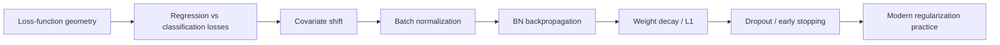
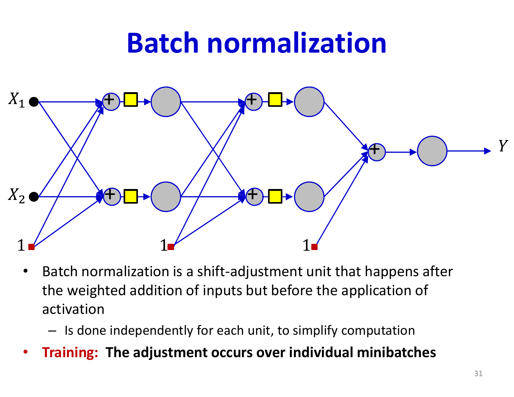
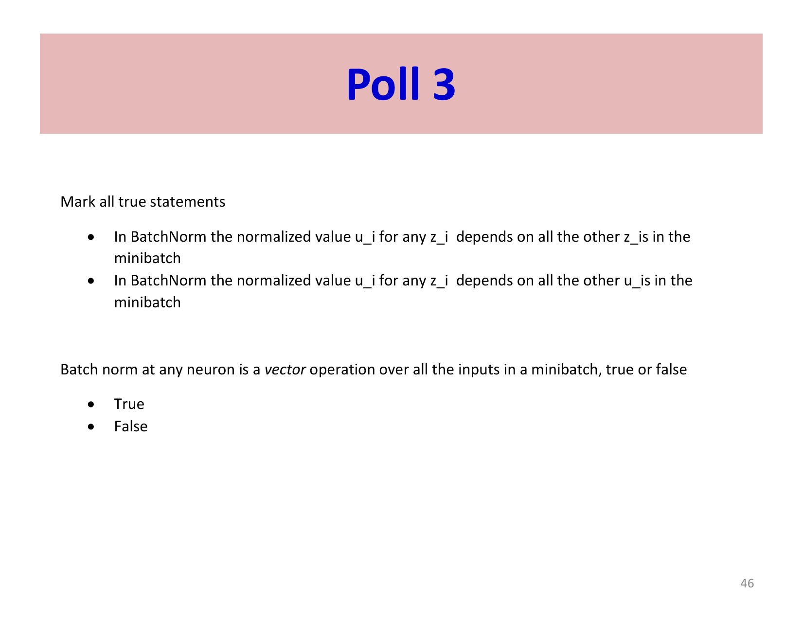

# Lecture 8: Optimizers and Regularizers

This lecture shifts focus from basic optimization algorithms to practical considerations that make neural network training robust and effective. We address two critical challenges: ensuring smooth training dynamics through proper choice of loss functions and data normalization, and preventing overfitting through regularization techniques. Batch normalization emerges as a transformative technique that simultaneously accelerates training and improves generalization.

## Visual Roadmap



## At a Glance

| Technique | Main purpose | Typical effect |
|---|---|---|
| L2 loss | Regression objective | Smooth gradients for continuous targets |
| Cross-entropy / KL | Classification objective | Strong gradient signal on wrong predictions |
| Batch normalization | Stabilize internal activations | Faster training and often better generalization |
| Weight decay | Penalize large weights | Simpler, smoother models |
| L1 regularization | Promote sparsity | Sparse feature usage |
| Dropout | Stochastic regularization | Reduces co-adaptation |
| Early stopping | Stop before overfitting | Cheap and practical regularizer |

## Loss Functions and Their Role in Optimization

The divergence (loss function) chosen for training has profound effects on both convergence speed and solution quality. Neural networks optimize a surrogate loss, not directly the metric we ultimately care about.

### Properties of Good Loss Functions

An ideal loss function should have specific geometric properties:

- **Smooth topology**: Few poor local optima to get trapped in
- **High gradients far from optimum**: Strong guidance initially, preventing slow convergence in flat regions
- **Low gradients near optimum**: Stable convergence without oscillation
- **Quadratic curvature near optimum**: Balanced convergence properties

In practice, we want functions that are **steep far from the optimum but shallow near the optimum** so they provide strong guidance early and stable convergence late.

### L2 Loss for Regression

For regression problems with continuous outputs, the L2 loss (Euclidean distance) is standard:

```text
L = sum_i (y_i - d_i)^2
```

where `y_i` is the network output and `d_i` is the target. The L2 loss is popular because:

- It is continuously differentiable
- It provides natural gradient flow proportional to prediction error
- For fixed linear features, it reduces to a well-behaved least-squares problem; for deep non-linear networks the overall objective is still non-convex

However, L2 is not convex with respect to the weights of a deep non-linear network.

### KL Divergence for Classification

For classification, the KL divergence (cross-entropy) is theoretically preferred:

```text
L = -sum_i d_i log(y_i)
```

where `y_i` are softmax outputs and `d_i` are target probabilities. The KL divergence:

- **Is convex** with respect to the logits or final linear layer when the feature representation is fixed
- Directly minimizes the distributional distance between predicted and true class probabilities
- Provides stronger gradients than L2 when predictions are far from targets

**Key insight**: For the standard combinations of loss and output layer:
- **Linear output + L2 loss**: Gradient w.r.t. pre-activation is simply the error `y - d`
- **Softmax output + cross-entropy**: Gradient w.r.t. pre-activation is also the error `y - d`

This is why the algorithm is called "error backpropagation"—the loss gradient becomes the error signal propagated backward.

## When the Output Gradient Collapses to `y - d`

This simplification is important enough that the slides revisit it repeatedly. It does **not** happen for arbitrary choices of output layer and loss. It happens for the common matched pairs:

- linear output with `L2` loss
- softmax output with cross-entropy

These pairings are popular partly because the gradient signal at the output layer is especially clean.



## Covariate Shift and Batch Normalization

### The Covariate Shift Problem

The original batch-normalization motivation is often described as **internal covariate shift**: the distribution of hidden activations drifts as earlier layers change during training. Whether BN literally solves that phenomenon is debated, but the practical issue is clear: unstable activation scales make optimization harder.

1. **Between minibatches**: Each minibatch may have a different statistical distribution of features
2. **Within epochs**: As network parameters evolve, the distribution at each layer's input drifts
3. **Across layers**: Each layer experiences different distributions of inputs

This drift forces later layers to repeatedly readapt to changing activation statistics, slowing convergence and reducing the effectiveness of learned transformations.

### Batch Normalization Solution

Batch normalization (BN) is a normalization layer inserted after the affine transformation but before the activation function. For each unit independently, BN normalizes inputs across the minibatch to have zero mean and unit variance, then learns to scale and shift back to an optimal location.

For a unit receiving input `z_j` across a minibatch of size `N`:

**Normalization step**:
```text
mu_j = (1) / (N)sum_(i=1)^(N) z_(i,j)
```

```text
sigma_j^2 = (1) / (N)sum_(i=1)^(N) (z_(i,j) - mu_j)^2
```

```text
z_hat_(i,j) = (z_(i,j) - mu_j) / (sqrt(sigma_j^2 + epsilon))
```

**Scaling and shifting**:
```text
z_tilde_(i,j) = gamma_j z_hat_(i,j) + beta_j
```

The parameters `gamma_j` and `beta_j` are learned during training, allowing the network to undo normalization if beneficial. The small constant `epsilon` prevents division by zero.

### Benefits of Batch Normalization

Batch normalization provides multiple benefits:

1. **Stabilizes activation scales**: Later layers see less dramatic variation in magnitude across updates
2. **Accelerates training**: Smoother optimization often allows faster convergence and larger learning rates
3. **Reduces sensitivity to initialization**: Network behavior depends less on carefully tuned initial scales
4. **Acts as regularization**: Mini-batch statistics introduce noise that can mildly regularize training
5. **Improves gradient flow**: Better-scaled activations and derivatives often make optimization easier

### Training vs. Testing with Batch Normalization

**Training time**: BN uses statistics from the current minibatch

**Testing time**: BN must use fixed statistics computed during training. Two approaches:

1. **Running average**: Maintain an exponential moving average of minibatch statistics during training
2. **Full dataset statistics**: Recompute statistics over the entire training set before deployment

The moving average approach is more practical and is the standard in modern frameworks. BN is most reliable when batches are reasonably large; with tiny batches, the estimated statistics can become noisy.



### Backpropagation Through Batch Normalization

A subtle but important point: batch normalization is a **vector operation across the minibatch**. Each normalized value `z_hat_i` depends on all inputs `z_1, ..., z_N` in the batch (through the mean and variance).

For backpropagation:

1. Compute `(partial L) / (partial gamma_j)` and `(partial L) / (partial beta_j)` directly (learned parameters)
2. Compute `(partial L) / (partial z_hat_(i,j))` for each normalized value
3. **Propagate through the vector operation**: Compute `(partial L) / (partial z_(i,j))` accounting for the fact that each `z_(i,j)` affects all normalized values through `mu_j` and `sigma_j^2`

The backpropagation is more complex than standard layer-wise operations because of these dependencies, but modern frameworks handle this automatically.

## Practical Batch-Norm Caveat

The slide motivation is framed in terms of covariate shift, but the engineering takeaway is broader: batch norm is useful because it keeps activations and gradients in a numerically friendlier range. It is therefore best understood as an optimization stabilizer with side benefits for regularization.

That is also why BN interacts strongly with batch size:

- large enough batches produce stable mean / variance estimates
- tiny batches can make those estimates noisy
- in very small-batch regimes, alternatives like layer norm or group norm may be preferable

## Regularization: Preventing Overfitting

Training error naturally decreases as model capacity increases, but test error may increase due to overfitting. Regularization techniques penalize model complexity to improve generalization.

### Why Regularization Matters

Deep neural networks have enormous capacity. Without regularization, they readily memorize training data, learning spurious patterns that don't generalize. Regularization techniques constrain this flexibility to prefer simpler, more generalizable solutions.

### Weight Decay (L2 Regularization)

The most common regularization approach adds a penalty on weight magnitude:

```text
L_(total) = L_(data) + lambda sum_w w^2
```

where `lambda` controls regularization strength. This encourages the network to use smaller weights, which:

- Limits the sensitivity of outputs to inputs (flatter functions generalize better)
- Reduces network complexity in a principled way
- Provides implicit noise robustness

The gradient update becomes:

```text
w -> w - eta (partial L_(data)) / (partial w) - eta lambda w
```

The `-eta lambda w` term causes weights to shrink toward zero, hence the name "weight decay."

### L1 Regularization (Lasso)

An alternative to L2 penalizes absolute values:

```text
L_(total) = L_(data) + lambda sum_w |w|
```

L1 regularization tends to produce **sparse** networks where many weights become exactly zero, effectively removing connections. This is useful for:

- Interpretability (learned sparse structure shows important features)
- Computational efficiency (sparse networks require fewer operations)
- Feature selection (connections to unimportant features are pruned)

### Dropout: Stochastic Regularization

Dropout is a probabilistic regularization technique that randomly sets activations to zero during training with probability `p` (typically 0.5):

During training:
```text
a_i -> a_i * Bernoulli(1-p)
```

Scaling is typically applied to maintain expected magnitude:
```text
a_i -> (a_i * Bernoulli(1-p)) / (1-p)
```

**Benefits of dropout**:

1. **Ensemble effect**: Training with dropout is equivalent to training many different network architectures (those with different units dropped out). At test time, you use the full network, approximately averaging over this ensemble.

2. **Co-adaptation prevention**: Dropout prevents neurons from becoming too specialized or co-dependent on specific other neurons, forcing the network to learn robust features.

3. **Data augmentation**: The stochasticity provides an implicit form of data augmentation.

4. **Simplicity**: Dropout is trivial to implement and has few hyperparameters.

Dropout is typically applied before major layers but not to the input layer. During testing, dropout is disabled.

### Early Stopping

Early stopping is a simple but effective technique: monitor performance on a validation set, and stop training when validation error begins to increase. This prevents overfitting without explicitly penalizing complexity.

**Advantages**:

- No hyperparameter to tune beyond the patience parameter
- Elegant and easy to implement
- Effective in practice across many applications

**Disadvantages**:

- Requires holding out a validation set, reducing available training data
- Computationally wasteful if stopped too early

## Advanced Regularization Techniques

### Data Augmentation

Artificially expanding the training set through transformations (rotations, crops, color jitter for images; back-translation, paraphrasing for text) increases effective dataset size and robustness.

### Gradient Clipping

During training, gradient magnitudes can explode (especially in recurrent networks), causing instability. Gradient clipping rescales gradients if their norm exceeds a threshold:

```text
g -> g * min(1, theta / norm(g))
```

This prevents parameter updates from becoming too large while preserving update direction.

### Layer-wise Learning Rate Adjustment

Different layers may benefit from different learning rates. Recent layers often learn faster than early layers, suggesting higher learning rates for recent layers and lower rates for early layers. This can be implemented by multiplying the global learning rate by layer-specific factors.

## Modern Training Practices

Based on accumulated experience, here are practical guidelines for training neural networks:

1. **Use batch normalization**: It consistently improves convergence and often eliminates the need for careful weight initialization
2. **Combine multiple regularization techniques**: BN + dropout + weight decay + early stopping provides good coverage against overfitting
3. **Use ADAM or SGD with momentum**: Both are reliable optimizers for most problems
4. **Decay learning rates**: Step decay (divide by 10 when plateauing) works reliably
5. **Monitor validation performance**: Early stopping prevents overfitting and can save computational resources
6. **Data augmentation is powerful**: For vision and NLP, appropriate data augmentation dramatically improves generalization

## Summary and Key Takeaways

- **Loss function choice matters**: KL divergence for classification, L2 for regression; both yield natural error gradients for standard architectures
- **Covariate shift is problematic**: Batch normalization eliminates this problem and accelerates training
- **Batch norm is transformative**: Simultaneously improves convergence, generalization, and training stability
- **Regularization prevents overfitting**: Weight decay, L1 sparsity, dropout, and early stopping all address the same fundamental problem
- **Dropout as ensemble training**: Provides implicit regularization through stochastic component elimination
- **Multiple techniques synergize**: Combining batch normalization, appropriate optimizers, and multiple regularization methods produces robust training

The combination of these techniques—proper loss functions, batch normalization, appropriate optimizers, and regularization—forms the foundation of modern deep learning practice. These tools transform the art of training neural networks from a precarious balancing act to a more reliable engineering process.

## Slide Coverage Checklist

These bullets mirror the source slide deck and make the summary concept coverage explicit.

- recap of incremental methods and trend-based updates
- desiderata for a good divergence
- L2 loss for regression
- KL / cross-entropy for classification
- convexity claims and where they hold
- standard output-layer pairings that yield `y - d`
- internal activation drift / batch-normalization motivation
- batch normalization forward equations
- train-time vs test-time statistics
- backpropagation through batch normalization
- L2 regularization / weight decay
- L1 regularization and sparsity
- dropout as stochastic co-adaptation control
- early stopping as implicit regularizer
- data augmentation and gradient clipping
