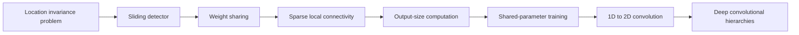
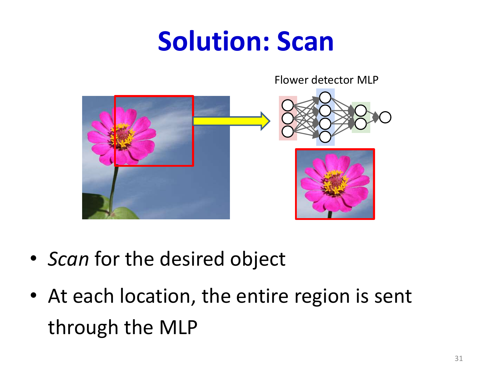

# Lecture 9: Convolutional Neural Networks - Part 1

Convolutional Neural Networks (CNNs) represent a fundamental architectural innovation that leverages spatial structure and translational invariance in data. Rather than treating inputs as unordered vectors as MLPs do, CNNs explicitly exploit the insight that many signals—images, audio, video—have local structure and patterns that recur across spatial locations. This lecture introduces the conceptual foundation of convolution: scanning for patterns.

## Visual Roadmap



## At a Glance

| Architecture | Parameter use | Position handling | Practical consequence |
|---|---|---|---|
| MLP | Dense everywhere | Position-specific | Large parameter count and weak translation invariance |
| Sliding detector | One small model reused across positions | Detects same pattern anywhere | Better data efficiency |
| CNN | Weight sharing plus local receptive fields | Naturally shift-aware | Scales well to images, audio, and video |

## The Problem: Location Invariance

Traditional MLPs treat input data as flat vectors, with each input dimension having fixed semantic meaning. This works poorly for data where local structure matters but position does not.

### Motivating Example: Finding a Word in Audio

Consider detecting whether a recording contains the word "welcome." A naive approach using an MLP would require:

1. Training a single large network on the entire recording
2. Assuming all recordings are the same length

This approach has fundamental problems:

- **Data inefficiency**: A network trained to detect "welcome" at time position 0.5-0.7 seconds won't recognize "welcome" at 1.2-1.4 seconds—they're entirely different input patterns to the MLP
- **Scalability**: Different recording lengths require different network architectures
- **Parameter explosion**: You need enormous networks with massive amounts of training data to cover every possible position

The core issue is that MLPs are fundamentally position-specific. A detector trained on one location does not automatically generalize to another.

### Image Example: Finding Flowers

The same problem exists for images. A network trained to recognize a flower at the top-left of an image won't recognize the same flower in the center or bottom-right. Yet semantically, the flower is the same pattern regardless of location.

## Solution: Scanning / Convolution

The elegant solution is to scan the input with a small detector network, evaluating it at every position. For 1D audio with a recording of length `T` and a detector window of width `K`:

```
For t = 1 : T-K+1
  window = x(t : t+K-1)
  output(t) = detector_network(window)
End
```

The detector network sees each sliding window and produces a local classification. Multiple detector outputs across positions can be combined (via max-pooling or softmax) to produce a final decision.

**Key insight**: This is equivalent to a single giant network where:

- Many identical subnets scan across the input
- All subnets share the **same parameters** (weights and biases)
- The detector becomes **translation equivariant**: moving the pattern moves the detector response to a different location in the output map

Pooling or later aggregation layers then convert that equivariant response into a more location-tolerant decision.

Visualized as one large network, this is just weight sharing across translation—the same weights are applied to every window.



## The Structure of Convolutional Networks

### Weight Sharing and Sparsity

In a standard MLP connecting a layer with `N` input units to a layer with `M` output units, the weight matrix is dense: `N x M` unique parameters, one for each input-output pair.

In a scanning (convolutional) network:

- Each output neuron connects only to a local window of inputs (typically 3×3 to 7×7)
- The weight matrix is **sparse**: far fewer connections than a full matrix
- The weight matrix is **block structured** with **identical blocks**: the same set of weights repeats for each scanning position
- This is called **weight sharing** or **parameter sharing**

For example, with a `K x K` kernel applied to an image, you have only `K^2 x M` unique parameters for an output layer with `M` channels, regardless of image size.

### Terminology: Filters and Kernels

The detector network is called a **filter** or **kernel**. In convolutional networks, we typically use multiple filters simultaneously, each learning to detect different patterns:

- **Filter size**: Spatial extent (e.g., 3×3, 5×5)
- **Stride**: Distance between scanning positions (stride 1 = every position, stride 2 = every other position)
- **Padding**: How to handle edges (zero-padding is common)
- **Number of filters**: Each filter learns to detect different patterns; output has one channel per filter

### Output Dimensions

For an input of height `H` and width `W`, with kernel size `K`, stride `s`, and padding `p`:

```text
H_(out) = floor( (H + 2p - K) / (s) ) + 1
```

```text
W_(out) = floor( (W + 2p - K) / (s) ) + 1
```

A stride of 1 with no padding produces output dimensions of `(H - K + 1) x (W - K + 1)`, which is smaller than the input due to boundary effects.

## Learning Convolutional Networks

### Shared Parameter Training

Training convolutional networks with backpropagation requires a modification to handle shared parameters. When a weight `w` is shared across multiple connections (as it is in convolution), updating it requires accumulating gradients from all positions where it appears.

For a shared weight `w` that appears in a set `S` of connections:

```text
(partial L) / (partial w) = sum_((i,j) in S) (partial L) / (partial w_(ij))
```

Each term can be computed via standard backpropagation; they're simply summed together because the same parameter affects the loss through multiple paths.

**Algorithm for training with shared parameters**:

1. Initialize all weights
2. For each training example:
   - Compute forward pass through all positions (or equivalently, the giant network)
   - Backpropagate to compute `(partial L) / (partial w_(ij))` for each connection
   - For each shared parameter, sum gradients from all connections: `(partial L) / (partial w_s) = sum_((i,j) in S) (partial L) / (partial w_(ij))`
   - Update: `w_s -> w_s - eta (partial L) / (partial w_s)`
3. Repeat until convergence

### Practical Implementation

Modern implementations don't explicitly construct the "giant network" with repeated subnets. Instead, they implement the scanning operation (called the **convolution operation**) efficiently using optimized linear algebra routines. But conceptually, it's equivalent to applying the same small network across all spatial locations.

## Advantages of Convolutional Architectures

### Parameter Reduction

Consider a CNN vs. MLP for a 32×32 RGB image classification task:

- **MLP**: Input layer has `32 x 32 x 3 = 3,072` units. A hidden layer with 128 units requires `3,072 x 128 = 393,216` parameters just for this layer.

- **CNN**: With 32 filters of size 5×5, the first layer has `5 x 5 x 3 x 32 = 2,400` parameters regardless of image size (within reason).

This dramatic reduction comes from two sources:
1. **Local connectivity**: Each neuron only connects to a small window
2. **Weight sharing**: The same weights are reused across the entire image

### Computational Efficiency

Fewer parameters mean:
- Faster training
- Faster inference
- Better generalization (less overfitting due to fewer degrees of freedom)
- Ability to handle larger inputs

### Translation Equivariance and Invariance

By design, convolution applies the same detector regardless of spatial location. The raw convolution output is therefore **equivariant** to translation, not fully invariant: if the input shifts, the feature map shifts as well. Later pooling, subsampling, or global aggregation steps are what make the final decision more invariant to location.

## 2D Convolution: Images

For images, scanning is 2D: a kernel of size `K_h x K_w` slides across height and width.

```python
For i = 1 : H - K_h + 1
  For j = 1 : W - K_w + 1
    patch = Image(i:i+K_h-1, j:j+K_w-1)
    output(i,j) = kernel(patch)
  End
End
```

Each output position `(i,j)` contains the result of applying the kernel to the patch at that location. With multiple filters, the output has depth (number of filters).

## Higher Dimensions

The same principle extends to any dimensionality:

- **1D**: Audio spectrograms, time series (scanning along time axis)
- **2D**: Images (scanning height and width)
- **3D**: Videos (scanning height, width, and time), 3D medical imaging
- **Higher dimensions**: Scientific simulations, etc.

The mathematical operation is identical; only the dimensionality changes.

## Deep Convolutional Networks

A single convolutional layer detects simple local patterns (edges, colors, small shapes). Stacking multiple convolutional layers creates a hierarchy:

- **Layer 1**: Detects low-level patterns (edges, colors)
- **Layer 2**: Combines layer 1 features to detect textures and simple shapes
- **Layer 3**: Combines layer 2 features to detect larger structures
- **Later layers**: Detect objects and high-level concepts

This hierarchical composition is one of the great strengths of deep convolutional networks.

## Summary and Key Takeaways

- **Shift invariance is essential**: Many real-world signals (images, audio) have patterns that shouldn't depend on position
- **Scanning is the solution**: Apply the same detector network at every position—this is convolution with weight sharing
- **Dramatic parameter reduction**: Local connectivity + weight sharing reduces parameters by orders of magnitude
- **Shared detectors across space**: By applying the same weights everywhere, CNNs learn reusable local pattern detectors and support location-tolerant decisions after pooling or aggregation
- **Backpropagation with sharing**: Standard backprop works, but gradient updates must accumulate from all shared uses of each parameter
- **Foundation for deep learning on structured data**: Convolution is the building block for state-of-the-art vision, audio, and sequence models

The next lecture will expand on these concepts, introducing pooling operations, activation functions, and how to stack convolutional layers into powerful deep networks.

## Slide Coverage Checklist

These bullets mirror the source slide deck and make the summary concept coverage explicit.

- scanning for patterns in speech / time signals
- why flat MLPs are poor shift-tolerant detectors
- need for shift / translation invariance
- scanning-window detector as repeated subnet
- giant-network interpretation of scanning
- parameter sharing across positions
- sparse local connectivity
- 2D analogue for images
- filters / kernels / feature maps terminology
- output-size computation with kernel, stride, padding
- training shared parameters by summing gradient contributions
- convolution as the generalization of scanning
- higher-dimensional extension to video / volumetric data

