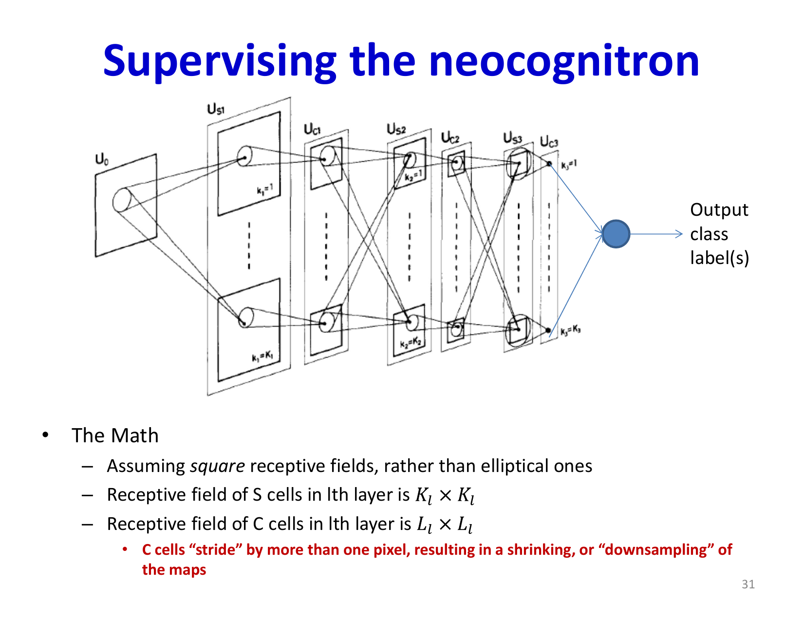
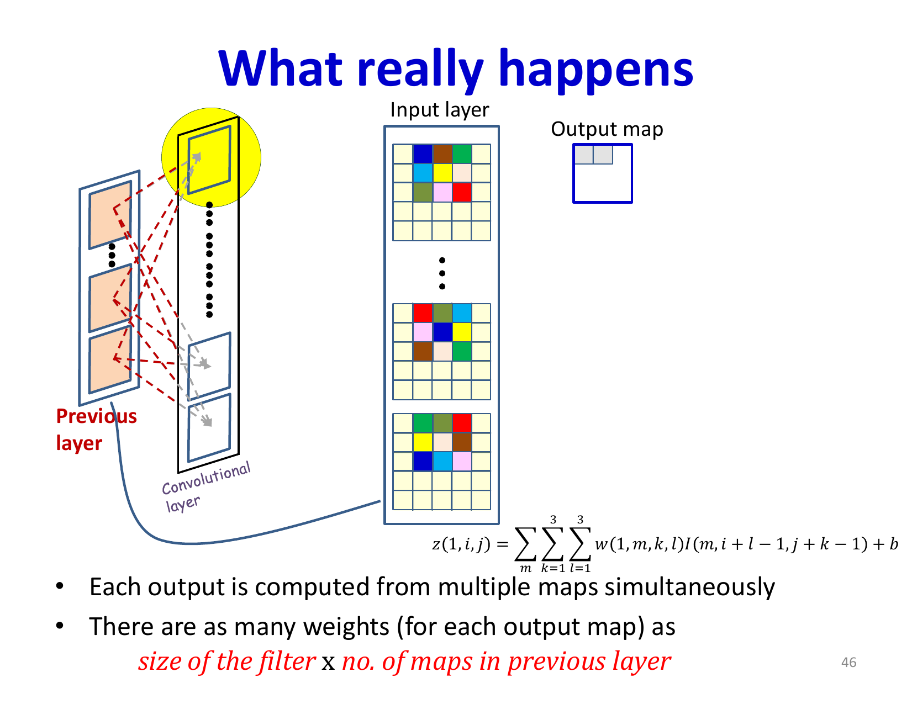

# Lecture 10: Convolutional Neural Networks - Part 2

Building on the foundational concepts of scanning and weight sharing, this lecture deepens the practical understanding of CNNs. We examine biological inspiration from neuroscience, trace the historical development of convolutional architectures, and introduce critical components like pooling layers, multi-channel convolutions, and architectural design principles that make CNNs work in practice.

## Visual Roadmap


## At a Glance

| Idea / model | Core contribution | Modern echo |
|---|---|---|
| Simple / complex cells | Local edge detection plus robustness | Convolution plus pooling |
| NeoCognitron | Alternating feature extraction and invariance | Early CNN stack template |
| LeNet-style CNNs | Supervised end-to-end training | Foundation of modern vision models |
| Multi-map convolution | Many learned filters per layer | Standard channel hierarchy |
| Pooling | Downsampling with robustness | Translation tolerance and efficiency |

## Biological Inspiration: Visual Cortex Organization

Modern convolutional neural networks have deep roots in neuroscience. Understanding how brains process visual information provides both inspiration and intuition for CNN design.

### Hubel and Wiesel: Receptive Fields and Orientation Selectivity

In 1959, David Hubel and Torsten Wiesel conducted landmark experiments studying the cat visual cortex (V1—the primary visual processing area). They discovered:

- **Receptive fields**: Each neuron responds only to stimuli in a localized region of the visual field, not the entire image
- **Orientation selectivity**: Many neurons respond preferentially to edges of particular orientations (vertical, horizontal, oblique)
- **Hierarchical structure**: Two classes of cells with complementary roles:
  - **S-cells (Simple cells)**: Respond to oriented edges in their receptive fields
  - **C-cells (Complex cells)**: Respond to similar patterns as S-cells but are more robust to slight positional shifts and noise

Crucially, complex cells appear to combine responses from multiple simple cells. Simple cells are sensitive to precise edge location, while complex cells "clean up" these responses, creating robustness to small distortions.

### The Hubel-Wiesel Hierarchy

The visual cortex implements a hierarchical processing pipeline:

1. **Layer 1 (Retina)**: Circular receptive fields, responds to light
2. **Layer 2 (V1 Simple cells)**: Elongated receptive fields, responds to oriented edges
3. **Layer 3 (V1 Complex cells)**: Larger receptive fields, responds to oriented patterns robustly
4. **Higher layers**: Progressively larger receptive fields, more complex features (textures, object parts, objects)

Each layer combines outputs from the previous layer, building increasingly abstract representations. This hierarchy was revolutionary—it showed that brains solve perception through hierarchical feature composition.



## The NeoCognitron: Fukushima's Model

In 1980, Kunihiko Fukushima recognized that the Hubel-Wiesel model needed modification to achieve **position invariance**. His "NeoCognitron" addressed this problem by organizing neurons into planes of identical response.

### Architecture Principles

The NeoCognitron uses alternating S-planes and C-planes:

- **S-planes (Simple planes)**: Contain many neurons organized in a rectangular grid. All neurons within a plane have identical learned weights; each responds to the same pattern at different spatial locations
- **C-planes (Complex planes)**: One C-plane per S-plane. C-cells perform a "majority vote" (max operation) over groups of S-cells, providing robustness to positional jitter

Key architectural principles:

1. **Identical weights within planes**: All S-cells in a plane share the same filter weights, enabling shift invariance
2. **Increasing receptive fields**: Deeper layers have larger receptive fields (important for detecting large patterns)
3. **Decreasing spatial resolution**: Planes shrink in size as you go deeper, trading spatial detail for larger context
4. **Increasing pattern specificity**: More planes in deeper layers detect more specific patterns

### Learning in the NeoCognitron

NeoCognitron used unsupervised Hebbian learning:

- Initialize S-cells randomly
- For each training example, apply a Hebbian rule: `Delta w_(ij) = x_i y_j` (weight change proportional to input-output correlation)
- Use a "winner-take-all" strategy within each layer to ensure different planes learn different features
- Across multiple examples of a character (e.g., "A"), different S-planes learn different strokes and features

This unsupervised learning automatically discovered useful visual patterns without explicit labels.

### Advantages and Limitations

The NeoCognitron successfully demonstrated:

- Unsupervised learning of visual patterns
- Robustness to noise and distortion
- Hierarchical feature composition

Limitations:

- Complex, ad-hoc learning rules
- Unsupervised (doesn't use class labels)
- Fixed C-cell response (not learned)

## From NeoCognitron to Modern CNNs

### Adding Supervision: LeCun's LeNet

Yann LeCun recognized that Fukushima's architecture could be simplified and improved by:

1. **Adding a supervised output layer** on top of the feature hierarchy to predict class labels
2. **Using backpropagation** to train the entire network end-to-end
3. **Treating S-planes mathematically as scanning/convolution** with single neurons rather than many identical copies
4. **Replacing hand-crafted robustness mechanisms** with simpler subsampling and pooling-style operations that could be integrated into an end-to-end system

This created the first practical "Convolutional Neural Network"—the LeNet, successfully applied to handwritten digit recognition.

### Key Simplifications in Modern CNNs

Modern CNNs improved on NeoCognitron and LeNet:

1. **Mathematical formulation**: Treat convolution as a mathematical operation on input maps using filters
2. **Simple subsampling / pooling**: Fixed or simple pooling operators replaced complex C-cell heuristics
3. **End-to-end training**: Single backpropagation pass trains all parameters
4. **Standardization**: Uniform architecture templates (Conv → Pool → Conv → Pool → Dense layers)

## Modern CNN Architecture

### Convolutional Layers

A convolutional layer contains multiple **feature maps** (called "channels" in modern terminology), each computed by a different filter applied to all input maps.

For input with `D_(l-1)` maps and output with `D_l` maps, with square kernels of size `K_l x K_l`:

**Output computation at position `(i,j)`:**

```text
z^((l))_(n,i,j) = sum_(m=1)^{D_(l-1)} sum_(k=1)^(K_l) sum_(l=1)^(K_l) w^((l))_(n,m,k,l) * I^((l-1))_(m,i+l-1,j+k-1) + b_n
```

where:
- `w^((l))_(n,m,k,l)` is the weight connecting input map `m` to output map `n`, at position `(k,l)` in the kernel
- `I^((l-1))_(m,i,j)` is the value at position `(i,j)` in input map `m`
- The kernel size and input dimensions define the output spatial dimensions

Each output map is then passed through an activation function (ReLU being standard in modern networks).

In deep-learning libraries this operation is usually implemented as **cross-correlation** rather than strict mathematical convolution, since the filter is not flipped in the forward pass. The term "convolution" is retained historically.

### Multi-Map Convolution

Unlike single-filter scanning from Lecture 9, practical CNNs apply multiple filters simultaneously:

- Each filter has shape `D_(l-1) x K_l x K_l` (connects to all input maps)
- Multiple filters → multiple output maps
- The complete weight tensor is shape `D_l x D_(l-1) x K_l x K_l`

This allows the network to detect different patterns in parallel.

### Padding and Output Size

Without padding, a `K x K` filter reduces spatial dimensions:

```text
Output size = Input size - K + 1
```

A 5×5 input with 3×3 filter produces 3×3 output—a significant reduction.

**Solution**: Zero-padding preserves spatial dimensions. For a filter of width `K`:

- **Odd** `K` (e.g., 3, 5, 7): Pad with `floor( K/2 )` zeros on each side
- **Even** `K` (e.g., 4, 6): Pad asymmetrically to preserve dimensions

With appropriate padding, output size equals input size, allowing deeper stacks without progressive shrinkage.

### Pooling Layers

Pooling layers perform a fixed operation (typically max pooling) over spatial regions, not learned:

**Max pooling with 2×2 windows:**
```text
y_(i,j) = max(x_(i,j), x_(i+1,j), x_(i,j+1), x_(i+1,j+1))
```

Benefits of pooling:

1. **Robustness to small positional shifts**: Max pooling the s-cell responses (conceptually similar to C-cells) makes the network robust to small translations
2. **Computational efficiency**: Reducing spatial dimensions reduces computation in later layers
3. **Larger effective receptive fields**: Pooling allows neurons in deeper layers to consider larger input regions
4. **Invariance**: The network becomes more invariant to small spatial distortions

A 2×2 max pool with stride 2 halves spatial dimensions.



## Architectural Design Principles

### Progression of Dimensions

Modern CNNs follow a consistent pattern:

- **Early layers**: Small kernels (3×3, 5×5), high spatial resolution, few maps
- **Middle layers**: Same kernel size, moderate spatial resolution, many maps (64→128→256)
- **Later layers**: Same kernel size, low spatial resolution, many maps (256→512)
- **Final layers**: Fully connected layers operating on flattened features

This design principle:
- Learns simple patterns early (edges, colors)
- Combines simple patterns into complex patterns
- Progressively increases pattern complexity while reducing spatial resolution

### Common Architectures

**AlexNet (2012)**:
- Large early convolutions followed by deeper convolution and pooling stages, then dense classification layers
- Showed CNNs could dramatically outperform hand-crafted features for image classification

**VGG (2014)**:
- Stacks of two Conv(3×3) layers → MaxPool
- Showed that multiple small convolutions are better than single large ones
- Deeper networks improved accuracy

**ResNet (2015)**:
- Added skip connections for training very deep networks
- Demonstrated that 100+ layer networks could be trained effectively

## Forward and Backward Pass

### Forward Pass

The forward pass through a CNN:

1. **Input**: Image (H × W × 3 for RGB)
2. **Conv layer 1**: Apply filters → (H × W × D₁)
3. **Pool layer 1**: Max pool → (H/2 × W/2 × D₁)
4. **Conv layer 2**: Apply filters → (H/2 × W/2 × D₂)
5. **Pool layer 2**: Max pool → (H/4 × W/4 × D₂)
6. **Repeat conv/pool blocks as needed**
7. **Dense layers**: Flatten and pass through MLP
8. **Output**: Class probabilities (softmax)

### Backward Pass

Backpropagation through CNNs requires:

1. **Pooling backprop**: Route gradients back to the position that had the maximum value
2. **Convolution backprop**: Accumulate gradients across all spatial positions where each filter weight appears (similar to shared parameter training)
3. **Multi-map gradients**: Sum gradients from all input maps that contributed to each output

Modern frameworks handle these automatically, but understanding the mechanism helps with debugging and architectural design.

## Advantages of CNNs

1. **Dramatically fewer parameters**: Compared to fully connected networks, CNNs have millions fewer parameters
2. **Translation invariance**: Same features detected regardless of position
3. **Hierarchical representations**: Learn multi-level abstractions naturally
4. **Empirical success**: State-of-the-art on vision tasks for decades
5. **Interpretability**: Learned filters often correspond to interpretable visual features

## Summary and Key Takeaways

- **Biological inspiration matters**: Hubel and Wiesel's discoveries of visual hierarchy directly inspired CNN design
- **Historical progression**: NeoCognitron → LeNet → Modern CNNs, each refining previous ideas
- **Convolution is scanning**: Multiple filters applied at every spatial location, learning different features
- **Pooling provides robustness**: Max pooling over spatial regions provides robustness to translations
- **Hierarchical feature learning**: Stacking convolution and pooling layers creates a hierarchy from simple (edges) to complex (objects) patterns
- **Practical design principles**: Progressive increase in feature complexity with decreasing spatial resolution works well in practice
- **End-to-end training**: Backpropagation through the entire CNN pipeline enables efficient, practical learning

The combination of convolution (local, weight-shared patterns), pooling (robustness and efficiency), and deep architectures (hierarchy) creates a remarkably effective architecture for visual perception. These principles have proven so successful that they're now applied not just to images, but to audio (time-delay neural networks), text (1D convolutions), and many other domains where local structure matters.

## Slide Coverage Checklist

These bullets mirror the source slide deck and make the summary concept coverage explicit.

- visual-cortex inspiration from Hubel and Wiesel
- receptive fields and orientation selectivity
- simple cells vs complex cells
- hierarchical composition of responses
- NeoCognitron S planes and C planes
- weight sharing within planes
- increasing receptive field with depth
- decreasing spatial resolution with depth
- Hebbian / unsupervised feature learning in the NeoCognitron
- shift tolerance from complex / pooling-like responses
- LeNet as supervised end-to-end CNN
- multi-map convolution over all input maps
- padding to preserve spatial size
- pooling / subsampling rationale
- classical architecture patterns: AlexNet, VGG, ResNet

