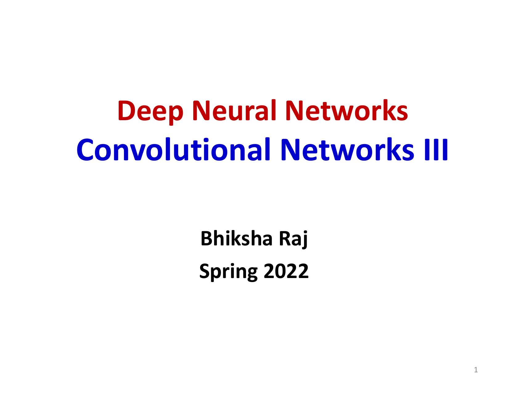
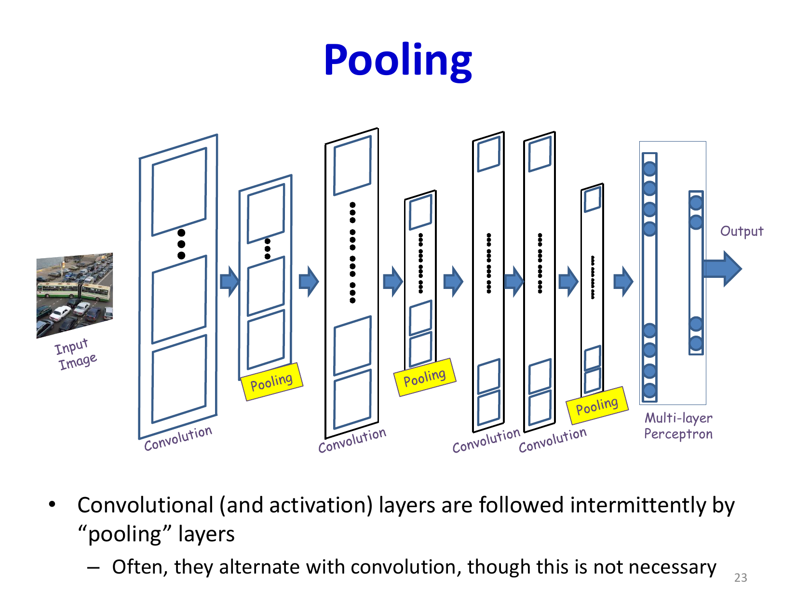
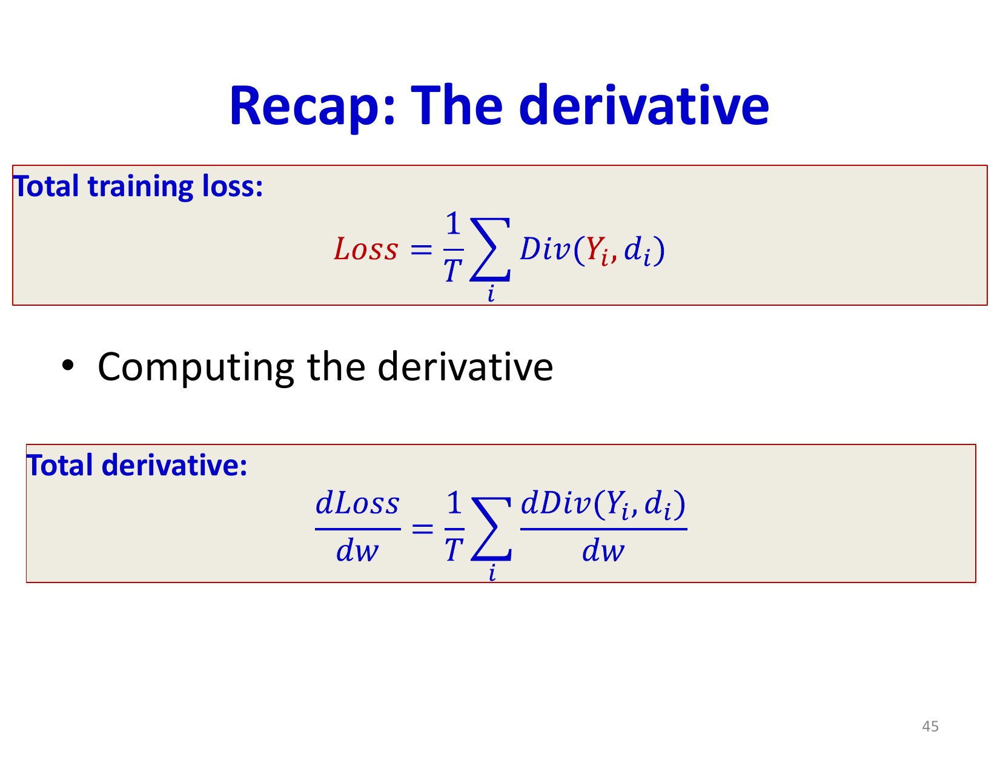
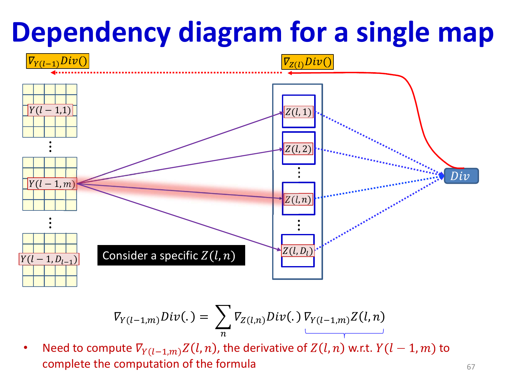

# Lecture 11: Convolutional Networks Part 3

This lecture deepens the understanding of CNNs by examining convolutional mechanics, pooling, striding, and backpropagation through shared filters. The focus is on how CNN computations are structured and how their gradients are accumulated correctly during training.

## Visual Roadmap


## At a Glance

| Component | Main idea | Why it helps |
|---|---|---|
| Convolution | Shared local filters | Efficient hierarchical feature extraction |
| Pooling | Reduce spatial size | More translation tolerance and lower compute |
| Stride | Downsample during convolution | Efficient resampling |
| Convolution backprop | Accumulate shared gradients over space | Makes CNN training end-to-end feasible |
| Deeper stacks | Compose many local operations | Larger receptive fields and richer features |

## CNN Fundamentals Review

Convolutional Neural Networks are built on a hierarchical scanning principle. Rather than processing images as flat vectors, CNNs scan input data with learnable filters at multiple levels of hierarchy. The first layer of neurons scans the raw input, while higher-level neurons scan the "feature maps" (outputs) from lower layers. This hierarchical organization is what enables CNNs to learn increasingly abstract features.

The general CNN architecture consists of three main components:

- **Convolutional layers**: Extract features through learned filters
- **Pooling layers**: Downsample feature maps while retaining important information
- **Fully connected layers**: Perform final classification or regression



## Convolutional Layer Mechanics

A convolutional layer computes output feature maps through two stages. First, an affine transformation is computed via convolution:

```text
z^((l))_(n,x,y) = sum_m sum_(i=0)^(K_l-1) sum_(j=0)^(K_l-1) w^((l))_(m,n,i,j) y^((l-1))_(m,x+i,y+j) + b^((l))_n
```

where `w^((l))_(m,n,i,j)` represents the weights in the filter for output map `n` computed from input map `m`, at filter position `(i,j)`.

Second, a point-wise activation function is applied:

```text
y^((l))_(n,x,y) = f(z^((l))_(n,x,y))
```

The key insight is that each output filter has as many weight parameters as (filter size × number of input maps). This weight sharing across spatial positions dramatically reduces the parameter count compared to fully connected layers, making CNNs efficient for image processing.

## Weight Tensor Dimensions and Parameter Count

The slide deck is very explicit about tensor shapes. If a layer has:

- `M` input maps
- `N` output maps
- kernel size `K_h x K_w`

then the weight tensor has shape:

```text
W has shape [N, M, K_h, K_w]
```

That means:

```text
parameters for one output map = M * K_h * K_w + 1 bias
parameters for full layer = N * (M * K_h * K_w + 1)
```

The important consequence is that the spatial size of the input image does **not** appear in the parameter count. Larger images create larger activation maps, but not more filter parameters.

## Pooling Operations

Pooling layers reduce spatial dimensions while preserving important information. The two most common pooling operations are:

**Max pooling** selects the maximum value in a pooling window:
```text
y^((l))_(j,x,y) = max(Y^((l-1))_(j,x:x+K_l-1, y:y+K_l-1))
```

**Mean pooling** computes the average value:
```text
y^((l))_(j,x,y) = mean(Y^((l-1))_(j,x:x+K_l-1, y:y+K_l-1))
```

Both operations are performed independently on each feature map. Pooling provides local translation tolerance by making nearby responses collapse to the same pooled value.



## Strided Convolution and Resampling

In practice, downsampling is often integrated into convolutional layers by using a stride `S > 1`:

```text
z^((l))_(n,x,y) = sum_m sum_(i=0)^(K_l-1) sum_(j=0)^(K_l-1) w^((l))_(m,n,i,j) y^((l-1))_(m,S * x + i,S * y + j) + b^((l))_n
```

The stride parameter allows the convolution to skip positions, directly reducing output size. Similarly, upsampling can be performed through transposed convolutions (also called fractional stride convolutions), which increase spatial dimensions by a factor determined by the upsampling rate.

The clean intuition is:

- ordinary strided convolution keeps only every `S`-th response location
- transposed convolution spreads each input activation back over a larger output grid using the same shared-weight pattern

So a transposed convolution is best viewed as a **learned upsampling operator**, not as a magical exact inverse of convolution.

## Backpropagation Through Convolutional Layers

Training CNNs requires computing gradients with respect to all learnable parameters. The backpropagation process through convolutional layers involves several considerations:

**Backpropagation through activation**: Given the derivative of the loss with respect to an output activation map `y^((l))`, we compute the derivative with respect to the pre-activation:

```text
(partial L) / (partial z^((l))_(n,x,y)) = f'(z^((l))_(n,x,y)) * (partial L) / (partial y^((l))_(n,x,y))
```

**Computing weight gradients**: Each filter weight affects multiple output locations because convolution shares weights across space. The contribution of a single weight `w_(i,j)` appears in multiple output positions `(x,y)`:

```text
(partial L) / (partial w^((l))_(m,n,i,j)) = sum_x sum_y (partial L) / (partial z^((l))_(n,x,y)) * y^((l-1))_(m,x+i,y+j)
```

**Propagating to previous layer**: Gradients flow back through the convolution by applying filters in a special way (with flipped kernels):

```text
(partial L) / (partial y^((l-1))_(m,x,y)) = sum_n sum_(i=0)^(K_l-1) sum_(j=0)^(K_l-1) W_(flip)^((l))_(m,n,i,j) * (partial L) / (partial z^((l))_(n,x+i,y+j))
```





**Backpropagation through pooling**: For max pooling, gradients flow only to the position that produced the maximum value. For mean pooling, the gradient is distributed equally to all positions in the pooling window.

## Receptive Field Growth and Deeper CNNs

The lecture's main architectural point is that deeper stacks of local operators create much larger effective receptive fields. Even if each convolution is only `3 x 3`, stacking several layers lets later units depend on a broad region of the input while still using relatively few parameters.

Practical consequences:

- More layers mean more abstract features
- Stacked small kernels can replace one very large kernel more efficiently
- Increasing the number of feature maps in deeper layers increases representational capacity
- Pooling or stride trades spatial resolution for larger context and lower compute

## Training CNNs in Practice

The training procedure for CNNs follows the standard supervised learning framework:

1. **Forward pass**: Compute network output for a training example
2. **Loss computation**: Evaluate divergence between predicted and ground truth
3. **Backward pass**: Compute gradients for all parameters using backpropagation
4. **Parameter update**: Adjust all weights using gradient descent

The aggregate loss over the training set is:

```text
L = (1) / (N) sum_(i=1)^(N) D(y(x_i), d_i)
```

where `D` is the divergence function (typically cross-entropy for classification). Parameters are updated via:

```text
theta -> theta - eta grad_theta L
```

## Key Takeaways

- **Convolutions are efficient**: Weight sharing dramatically reduces parameters while maintaining expressiveness through hierarchical feature learning
- **Backpropagation requires special handling**: The shared weights in convolutional layers mean that gradient contributions must be accumulated across all spatial positions where a weight is used
- **Pooling provides local translation tolerance**: pooling operations reduce sensitivity to small shifts and reduce spatial dimensions
- **Deeper stacks enlarge receptive fields**: higher layers summarize larger portions of the input without huge kernels
- **Modern architectures still build on these mechanics**: even later CNN variants rely on the same convolution, pooling, and shared-gradient principles

These training mechanics and geometric intuitions remain foundational to modern vision models, even when later architectures add normalization, skip connections, or attention on top of the same core operations.

## Slide Coverage Checklist

These bullets mirror the source slide deck and make the summary concept coverage explicit.

- recap of the generic CNN architecture
- exact convolution equation with map and spatial indices
- interpretation of weight tensor dimensions
- parameter count as kernel size times number of input maps
- max pooling definition
- mean pooling definition
- stride as integrated downsampling
- transposed / fractional-stride intuition
- backpropagation through activation functions
- weight-gradient accumulation over all output positions
- backpropagation to previous maps with flipped filters
- dependence graph for a single map / local receptive field
- receptive-field growth through deeper stacks
