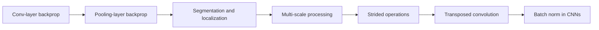
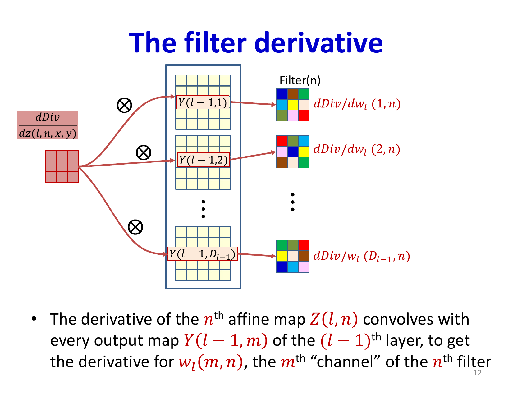
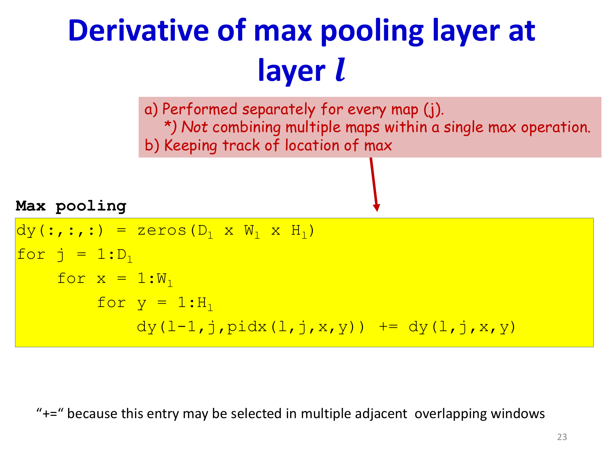
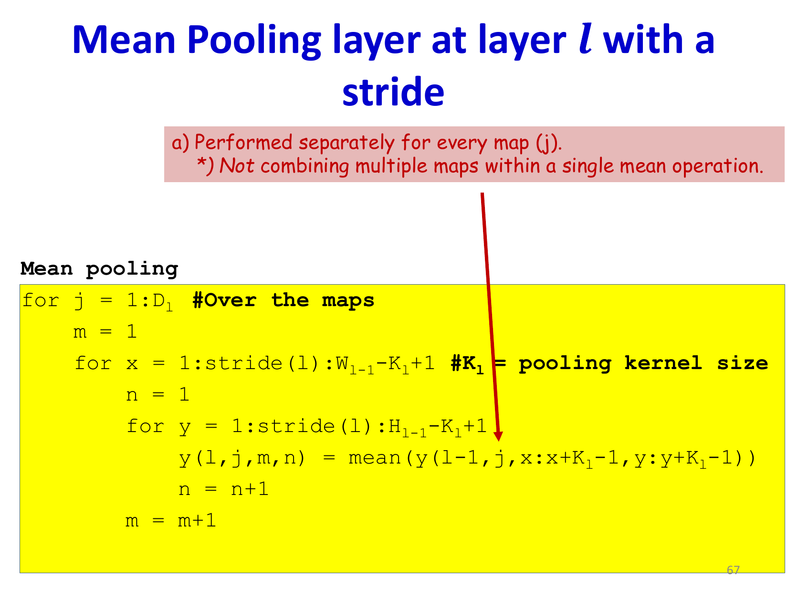

# Lecture 12: Convolutional Networks Part 4

This lecture continues the deep dive into CNNs, focusing on practical training mechanics and modern architectural variants. Building on the backpropagation fundamentals, we explore segmentation, localization, and the architectural innovations that have made CNNs the standard for computer vision tasks.

## Visual Roadmap



## At a Glance

| Operation | Forward role | Backward intuition |
|---|---|---|
| Convolution | Shared local feature extraction | Sum gradient contributions over all positions |
| Max pooling | Select strongest local response | Route gradient only through max location |
| Mean pooling | Average local region | Distribute gradient uniformly |
| Strided conv | Extract features while downsampling | Same shared-gradient logic with fewer outputs |
| Transposed conv | Learnable upsampling | Reverse spatial expansion pattern |

## Backpropagation Through Convolutional Layers

Training CNNs requires carefully handling gradients through both convolutional and pooling layers. The backpropagation process must account for weight sharing and spatial structure in ways that differ from fully connected networks.

### Gradient Flow Through Activation Functions

For any layer, the derivative with respect to pre-activation values follows the chain rule:

```text
(partial Loss) / (partial z^((l))_(m,x,y)) = f'(z^((l))_(m,x,y)) * (partial Loss) / (partial y^((l))_(m,x,y))
```

This is a simple element-wise operation applied to every position in every feature map. The activation function derivative `f'(·)` (such as ReLU's derivative) gates the gradient flow.

### Weight Gradient Computation

Computing gradients for filter weights is more complex due to weight sharing. A single weight at position `(i,j)` in a filter contributes to multiple output locations:

```text
(partial Loss) / (partial w^((l))_(m,n,i,j)) = sum_(x,y) (partial Loss) / (partial z^((l))_(n,x,y)) * y^((l-1))_(m,x+i,y+j)
```

This is mathematically equivalent to convolving the gradient map with the input feature map. The accumulated gradient represents the contribution of this weight to the loss across all spatial positions where it is used.



### Gradient Propagation to Previous Layer

To propagate gradients backward to the previous layer, we use a transposed convolution operation. Given gradients with respect to the output affine maps, we compute:

```text
(partial Loss) / (partial y^((l-1))_(m,x,y)) = sum_n sum_(i,j) W_(flip)^((l))_(m,n,i,j) * (partial Loss) / (partial z^((l))_(n,x+i,y+j))
```

where `W_(flip)` denotes the horizontally and vertically flipped version of the filter weights. This operation effectively "inverts" the forward convolution operation with respect to spatial dimensions.

## Pooling Layer Backpropagation

Different pooling operations require different gradient handling:

### Max Pooling Gradients

Max pooling is selective—it passes through only the maximum value from each pooling window. During backpropagation, the gradient flows only to the position that produced the maximum:

```text
(partial Loss) / (partial y^((l-1))_(j,k,n)) = incoming pooled gradient
only at the argmax location in the pooling window; 0 elsewhere
```

In practice, we track the index of the maximum during the forward pass and route gradients back to that position only. A single input element may be selected as the max in multiple overlapping windows, so gradients from all windows where it is the max must be accumulated.



### Mean Pooling Gradients

Mean pooling distributes the gradient equally to all elements in the pooling window:

```text
(partial Loss) / (partial y^((l-1))_(j,x+i,y+j)) = (1) / (K_(pool)^2) * (partial Loss) / (partial y^((l))_(j,x,y))
```

This can be viewed as a convolution with a uniform filter where all weights equal `(1) / (K_(pool)^2)`, applied after zero-padding the gradient map.



## Jitter Sensitivity and Why Pooling Helps

Pure convolutional detectors are often sensitive to tiny input shifts. A pattern that moves by one or two pixels can produce noticeably different activations if the detector or later classifier expects it at a precise location. Pooling and stride reduce this sensitivity by summarizing local neighborhoods instead of preserving every exact coordinate.

That is why CNNs typically alternate:

- convolution for precise local pattern detection
- pooling or stride for robustness and resolution reduction
- deeper layers for larger-context pattern composition

## Strided and Transposed Operations

Building on the foundational elements of convolution, pooling, and backpropagation, modern architectures combine these with strategic design choices:

### Strided Operations for Efficiency

Striding in convolution and pooling directly reduces spatial dimensions:

```text
y^((l))_(n,x,y) = sum_(i,j) w^((l))_(n,i,j) * y^((l-1))_((S * x) + i, (S * y) + j)
```

where `S` is the stride. This is more efficient than separate downsampling operations and provides tighter integration of dimension reduction with feature extraction.

### Transposed Convolution for Upsampling

Transposed convolutions (also called deconvolutions) increase spatial resolution while learning to reconstruct or expand features. Unlike simple upsampling, transposed convolutions are learnable operations that can adaptively expand feature maps:

```text
y^((l))_(x,y) = sum_(n,i,j) w^((l))_(n,i,j) * y^((l-1))_((x-i)/S, (y-j)/S)
```

These are essential whenever the output must recover spatial detail, such as dense prediction or generation.

### Batch Normalization Integration

Modern CNNs typically include batch normalization layers that normalize feature maps before nonlinearities:

```text
y_(norm) = gamma * (y - mu_B) / (sqrt(sigma_B^2 + epsilon)) + beta
```

where `mu_B` and `sigma_B^2` are the mean and variance computed over a mini-batch, and `gamma, beta` are learnable scale and shift parameters. This stabilizes training, allows higher learning rates, and provides regularization.

## The Mechanics of Modern CNN Training

The complete training cycle for contemporary CNNs includes:

1. **Forward pass with explicit dimension tracking**:
   - Input images (with padding, stride, dilation parameters specified)
   - Convolution with learned filters
   - Batch normalization
   - Activation functions
   - Pooling or strided downsampling
   - Repeat for each layer

2. **Loss computation** at the final layer based on task (classification, regression, dense prediction)

3. **Backward pass** computing gradients for:
   - Filter weights in convolutional layers
   - Bias terms
   - Batch norm parameters (scale and shift)
   - All previous layer activations

4. **Parameter updates** using optimized gradient descent variants (Adam, SGD with momentum, etc.)

The key advantage of this carefully structured pipeline is that gradient computation exploits the spatial structure and weight sharing of convolutions, making training efficient even for networks with millions of parameters.

## Building Blocks for Task-Specific Networks

Different vision tasks use specialized arrangements of these fundamental operations:

- **Object detection**: Anchor-based predictions at multiple scales, often using ResNet backbone with FPN (Feature Pyramid Network)
- **Instance segmentation**: Detection combined with per-instance pixel-level masks
- **Keypoint detection**: Per-location regression for joint coordinates
- **Depth estimation**: Pixel-wise regression outputs using encoder-decoder architectures
- **3D tasks**: Extending 2D convolutions to 3D, or using other architectural patterns

All of these build on the core concepts of strided convolution, upsampling, gradient computation, and spatial feature hierarchies covered in these lectures.

## Key Takeaways

- **Pooling creates routing decisions**: Max pooling creates a selective routing mechanism where gradients flow only through the selected maximum, while mean pooling distributes gradients uniformly
- **Weight sharing requires careful gradient accumulation**: The shared weights mean gradients from all spatial positions must be accumulated, turning gradient computation into a convolution operation
- **Transposed convolutions are learnable upsampling**: Unlike fixed upsampling, transposed convolutions learn how to expand feature representations
- **Spatial structure is paramount**: Maintaining and carefully managing spatial dimensions through stride, padding, and upsampling is crucial for all vision tasks
- **Batch normalization improves stability**: Normalizing between layers enables faster training and better generalization
- **Modern architectures layer these primitives**: State-of-the-art networks combine convolution, pooling, batch norm, skip connections, and attention in task-specific arrangements

## Slide Coverage Checklist

These bullets mirror the source slide deck and make the summary concept coverage explicit.

- detailed backpropagation through convolutional layers
- backpropagation through pooling layers
- derivative with respect to affine maps
- derivative with respect to filter weights
- derivative with respect to previous-layer maps
- flipped-filter view of backward convolution
- max-pooling gradient routing to argmax locations
- mean-pooling gradient distribution
- stride inside pooling and convolution
- transposed convolution as learned upsampling
- deformation / jitter sensitivity
- how pooling and stride reduce sensitivity to tiny shifts

