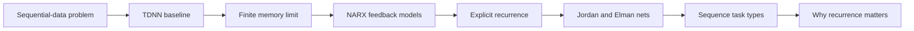
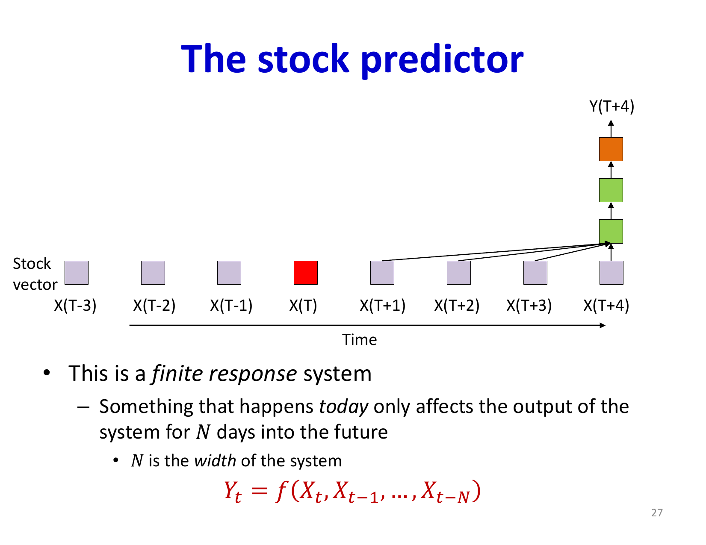
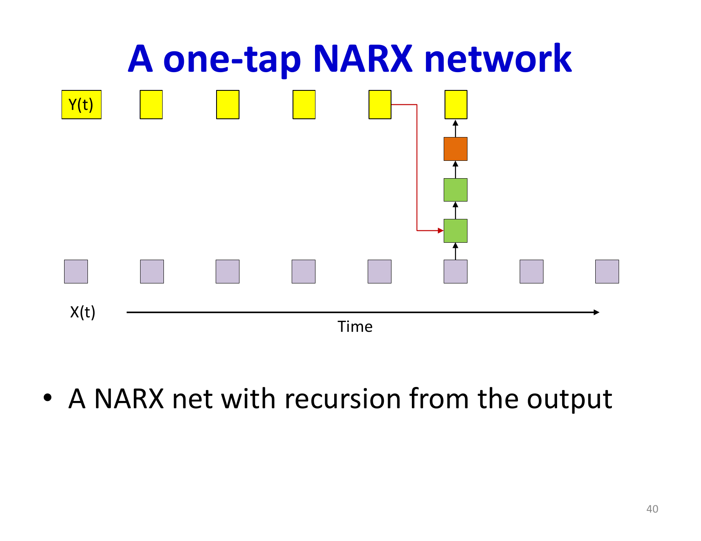

# Lecture 13: Recurrent Networks Part 1

Recurrent Neural Networks (RNNs) represent a fundamental shift from feedforward architectures to networks with internal state. This lecture introduces the core concepts of RNNs by examining how temporal sequences are processed and how networks can maintain memories of past inputs to inform current and future predictions.

## Visual Roadmap



## At a Glance

| Model | Memory mechanism | Strength | Limitation |
|---|---|---|---|
| MLP | None | Simple baseline | No temporal state |
| TDNN | Fixed input window | Handles short local context | Finite memory horizon |
| NARX | Feedback from past outputs | Extends temporal dependence | Hand-designed delay structure |
| Vanilla RNN | Recurrent hidden state | Flexible sequence modeling | Hard to train over long horizons |
| Jordan / Elman nets | Specific recurrent feedback choices | Early recurrent templates | Less expressive than gated RNNs |

## The Problem with Feedforward Networks for Sequential Data

Many real-world tasks involve sequential or temporal data where predictions depend on previous inputs and outputs. Consider these applications:

- **Speech recognition**: Process a sequence of acoustic feature vectors to determine what was spoken
- **Text analysis**: Analyze a document word-by-word to classify its topic or translate it to another language
- **Time series prediction**: Use stock prices from previous days to predict tomorrow's value
- **Language modeling**: Generate natural language text character by character or word by word

All these tasks share a common structure: the output depends on information distributed across time, not just the current input.

## Language Generation and Sequence Boundaries

The opening slides use text generation to make recurrence intuitive. A recurrent language model does not output a full sentence in one shot. It repeatedly predicts the **next** symbol given everything seen so far:

```text
P(w_(t+1) | w_1, ..., w_t)
```

That setup immediately requires two bookkeeping symbols:

- a start token telling the model when generation begins
- an end token telling it when to stop

Those boundary markers later become essential in encoder-decoder models and attention-based generation too.

### Time-Delay Neural Networks

A natural first approach is the Time-Delay Neural Network (TDNN), which is essentially a CNN applied to temporal sequences. A TDNN processes a fixed window of past inputs:

```text
y(t) = f(W * [x(t-N), x(t-N+1), ..., x(t-1), x(t)])
```

This is a **finite response system**—a single input at time `t` only affects outputs up to time `t + M` where `M` is the "future window" size.

The limitation of TDNNs becomes clear when considering longer-term dependencies. To capture trends spanning weeks or months in financial data, or long-range dependencies in language, the input window must become impractically large. Each additional day of history requires expanding the network architecture and increasing the number of parameters.



## Infinite Response Systems and Recurrence

To handle dependencies of arbitrary length, we need **infinite response systems** where a single input can influence outputs indefinitely into the future, though typically with diminishing influence.

### NARX Networks (Nonlinear Autoregressive Networks with Exogenous Input)

A NARX network generates outputs through feedback:

```text
y(t) = f(W_(in) * x(t) + W_(out) * [y(t-1), y(t-2), ..., y(t-D)])
```

The key insight is that the output at time `t` depends on past outputs, which in turn contain information about all previous inputs. This creates an infinite response: a single input at time 0 influences `y(1)`, which influences `y(2)`, and so on indefinitely.

The memory is implicit in the output signal itself. However, this approach has limitations—the network must learn to encode all necessary history into a single output variable, which may not be efficient.

### Explicit Memory with Recurrent Connections

Rather than relying on output feedback, we can introduce explicit **hidden state** or **memory variables**:

```text
h(t) = tanh(W_(hx) * x(t) + W_(hh) * h(t-1) + b_h)
```
```text
y(t) = W_(yh) * h(t) + b_y
```

Here, `h(t)` is a vector of hidden state variables that serves as the network's memory. The hidden state at time `t` depends on the current input and the previous hidden state, creating a recurrent flow of information through time.

This architecture has several advantages:

1. **Explicit memory structure**: The hidden state has a dedicated capacity for remembering past information
2. **Shared computation**: The same weights `W_(hh)` are applied at every timestep, reusing parameters
3. **Gradient flow**: Backpropagation can propagate errors through the hidden state across timesteps
4. **Flexibility**: The hidden state size can be tuned independently of input/output dimensions



## Jordan and Elman Networks

Early recurrent architectures formalized these ideas:

### Jordan Networks

In a Jordan network, the hidden state (called "context") is a copy of the output from the previous timestep, passed back through fixed-weight connections:

```text
h(t) = y(t-1)
```
```text
y(t) = f(W_(in) * x(t) + W_(fixed) * h(t) + W_(out) * internal_state)
```

The memory structure is fixed—it simply maintains the output history. While simple, this limits the network's ability to learn what to remember. The context capacity is constrained by the output size, which is determined by the task rather than memory requirements.

### Elman Networks

Elman networks decouple the hidden state from the output, giving the network complete freedom to learn what to store:

```text
h(t) = tanh(W_(hx) * x(t) + W_(hh) * h(t-1) + b_h)
```
```text
y(t) = softmax(W_(yh) * h(t) + b_y)
```

The hidden state `h(t)` is not constrained by output requirements and can develop its own learned representation of the past. This is substantially more powerful than Jordan networks and serves as the foundation for modern RNNs.

## Sequential Processing in RNNs

The RNN processes sequences one timestep at a time:

**Forward pass**:
```
h(0) = 0  # initial hidden state
for t = 1 to T:
    h(t) = activation(W_hx @ x(t) + W_hh @ h(t-1) + b_h)
    y(t) = output_function(W_yh @ h(t) + b_y)
```

At each timestep, the network receives an input, updates its hidden state using both the new input and the previous hidden state, and produces an output. The hidden state accumulates information from all previous inputs.

## Types of Sequence Modeling Tasks

RNNs address different sequence problem structures:

1. **Sequence classification**: Single output from a sequence of inputs (e.g., sentiment analysis of a document)
2. **Sequence-to-sequence**: Each input produces an output (e.g., part-of-speech tagging)
3. **Many-to-one**: Process a sequence and produce one output at the end (e.g., stock price prediction from historical data)
4. **One-to-many**: Single input produces a sequence of outputs (e.g., image captioning)
5. **Many-to-many**: Sequence-in, sequence-out, often with alignment (e.g., machine translation)

Different RNN architectures and training procedures are optimized for each problem type.

## The Power of Recurrent Architectures

The advantage of RNNs over fixed time-window approaches becomes clear in problems requiring unbounded memory:

- **Addition problem**: An RNN trained to add two binary numbers of length N can generalize to adding numbers of any length, while MLPs trained on N-bit addition fail on inputs longer than their training set
- **Parity problem**: RNNs require minimal training data and generalize to input sequences of any length, while MLPs require complex architectures and large amounts of data
- **Language modeling**: RNNs can learn to capture long-range linguistic dependencies that would require prohibitively large time-windows in feedforward networks

These capabilities emerge from the network's ability to maintain and update hidden state over time, creating an implicit memory that scales with sequence length rather than being fixed at architecture design time.

Another way to say this is that recurrence can discover **algorithms**, not just finite templates. Fixed-window models memorize local correlations; recurrent models can in principle learn update rules that apply for arbitrarily long sequences.

## Key Takeaways

- **Temporal dependencies require special architecture**: Standard feedforward networks cannot efficiently capture long-range temporal dependencies
- **Finite response systems are limited**: Time-delay neural networks cannot capture effects that persist for unbounded time
- **Recurrence enables infinite response**: Feeding hidden state back to itself allows a single input to influence outputs indefinitely
- **Hidden state is the key innovation**: Explicit memory variables give networks the capacity to learn what to remember
- **Shared parameters across time**: The same weight matrices are applied at every timestep, making RNNs parameter-efficient for long sequences
- **Elman networks are foundational**: The architecture of separate hidden state and output, with recurrent hidden-to-hidden connections, underlies most modern RNN variants
- **Generalization to variable sequence length**: RNNs can be trained on sequences of one length and applied to sequences of different lengths

## Slide Coverage Checklist

These bullets mirror the source slide deck and make the summary concept coverage explicit.

- sequence modeling examples from text, sports, and stocks
- language generation as next-symbol prediction
- beginnings and ends of generated sequences
- time-delay neural network as finite-context baseline
- finite response vs infinite response systems
- NARX / output-feedback viewpoint
- explicit recurrent hidden state
- Jordan network
- Elman network
- representational shortcut of unrolling recurrence
- one-input / one-output and sequence classification task types
- why recurrence beats fixed windows on long dependencies
