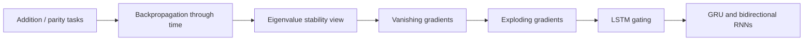
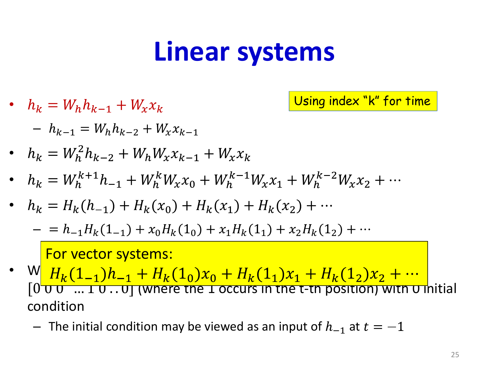
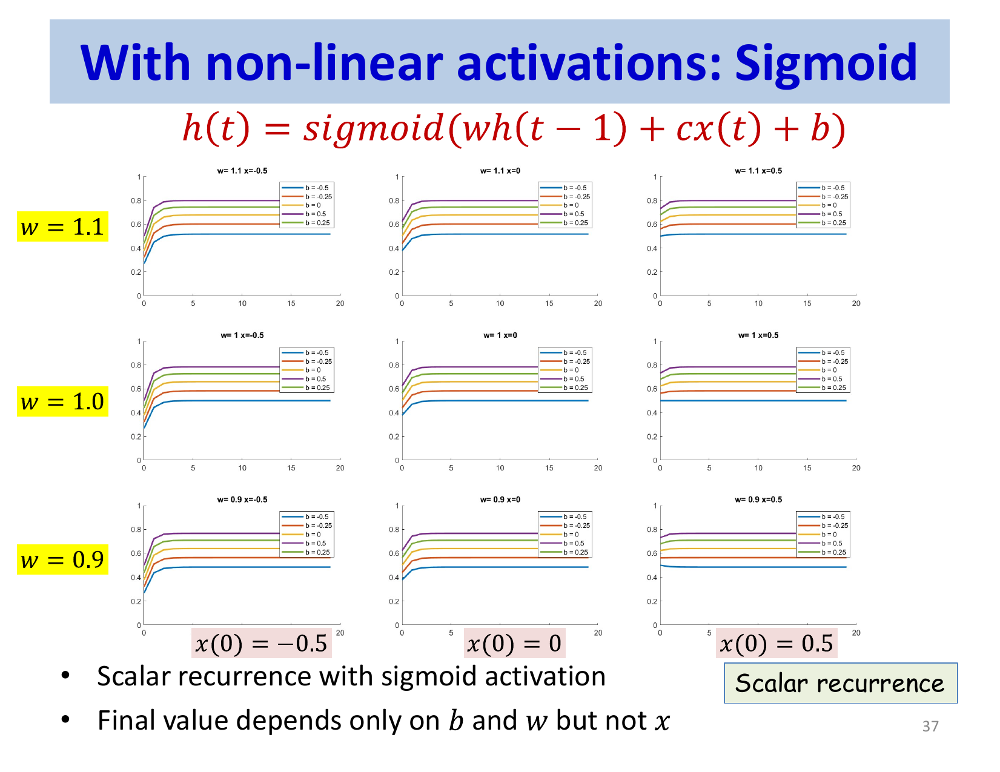
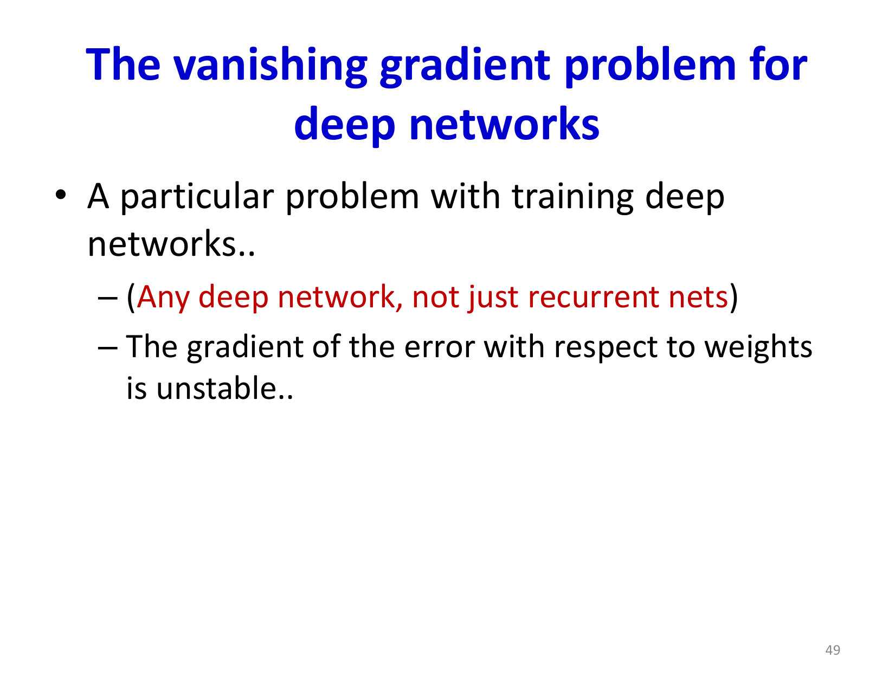

# Lecture 14: Recurrent Networks Part 2

This lecture explores the stability properties of RNNs and introduces Long Short-Term Memory (LSTM) networks, which solve critical training challenges in vanilla RNNs. Understanding how gradients behave in recurrent architectures is essential for building networks that can learn long-term dependencies.

## Visual Roadmap



## At a Glance

| Architecture | Memory behavior | Main advantage | Main weakness |
|---|---|---|---|
| Vanilla RNN | Hidden state reused every step | Simple recurrent baseline | Vanishing / exploding gradients |
| LSTM | Separate memory cell with gates | Strong long-range memory handling | More parameters and complexity |
| GRU | Gated hidden-state update | Simpler than LSTM | Less explicit memory structure |
| Bidirectional RNN | Reads past and future context | Better contextual features | Not causal for online inference |

## RNNs for Varied Sequence Tasks

Recurrent architectures excel at problems with variable-length sequences where MLPs and CNNs struggle. Consider two canonical problems that illustrate RNN superiority:

### The Addition Problem

An MLP trained to add N-bit binary numbers requires a completely different network to add (N+1)-bit numbers. The network lacks generalization because it must learn all possible input-output mappings, and the network structure is fixed to the training input size.

An RNN learns a simple carry mechanism that works for numbers of any length:

```
For each bit position:
    sum = bit1 + bit2 + carry_from_previous
    output_bit = sum mod 2
    carry_to_next = sum // 2
```

This solution requires minimal training data and generalizes perfectly to longer sequences.

### The Parity Problem

A parity detector determines whether a sequence contains an even or odd number of 1s. An MLP requires an exponentially complex architecture to capture all possible patterns, while an RNN trivially solves this by maintaining a running count:

```
parity = 0
for each bit:
    parity = parity XOR bit
output parity
```

These examples demonstrate that RNNs can solve problems with unbounded input size and discover generalizable patterns that feedforward networks cannot.



## Training RNNs: Backpropagation Through Time

RNNs are trained by minimizing a loss function defined over sequences:

```text
L = sum_(t=1)^(T) D(y(t), d(t))
```

where `D` is the divergence measure and `d(t)` is the desired output at time `t`. Backpropagation is performed by unrolling the network through time:

1. **Forward pass**: Compute `h(t)` and `y(t)` for all timesteps
2. **Backward pass**: Compute gradients for all timesteps starting from the end
3. **Accumulate gradients**: Sum weight gradients across all timesteps

The gradient with respect to hidden-to-hidden weights involves:

```text
(partial L) / (partial W_(hh)) = sum_t (partial L) / (partial h(t)) (partial h(t)) / (partial W_(hh))
```

where the derivative `(partial h(t)) / (partial W_(hh))` involves gradients flowing through multiple timesteps.

## Stability Analysis: The Vanishing and Exploding Gradient Problem

The recurrent nature of RNNs creates special challenges for gradient flow. To understand these, we analyze linear RNN dynamics:

```text
h(t) = W_(hh) * h(t-1) + W_(hx) * x(t)
```

For a single input at time 0 with zero initial condition:

```text
h(t) = W_(hh)^t * W_(hx) * x(0)
```

The hidden state grows or shrinks according to powers of the recurrent weight matrix. Through eigenvalue decomposition:

```text
W_(hh) = V Lambda V^(-1)
```

where `Lambda` contains eigenvalues `lambda_1, lambda_2, ..., lambda_n`:

```text
h(t) = V Lambda^t V^(-1) * W_(hx) * x(0)
```

The behavior at large `t` is dominated by the largest eigenvalue `lambda_(max)`:

```text
h(t) proportional to lambda_(max)^t
```

### Vanishing Gradients

If `|lambda_(max)| < 1`, then `lambda_(max)^t -> 0` as `t -> infinity`. The hidden state and its gradient decay exponentially:

- Early inputs have negligible effect on late timesteps
- Gradients flowing backward from late timesteps vanish before reaching early parameters
- The network effectively "forgets" information from distant past

This creates a very short effective memory horizon, limiting the network's ability to learn long-term dependencies.

### Exploding Gradients

If `|lambda_(max)| > 1`, then `lambda_(max)^t -> infinity` as `t -> infinity`. The hidden state explodes:

- Activations become extremely large and often saturate
- Numerical overflow occurs
- Gradients explode, causing unstable training with diverging loss



### The BIBO Stability Condition

A system is **Bounded Input Bounded Output (BIBO) stable** if bounded inputs always produce bounded outputs. For a linear recurrent system, the safe condition is that the spectral radius is strictly below 1, i.e. `|lambda_(max)| < 1`. Values at or above 1 can create marginally stable or unstable behavior depending on the full matrix structure. For nonlinear RNNs with bounded activations like tanh, hidden activations may remain numerically bounded, but useful input-specific memory can still disappear because the dynamics saturate.

## Memory Failure vs Learning Failure

The slides distinguish two different problems that are easy to mix up:

- **memory failure**: in the forward dynamics, old information disappears because repeated application of `W_(hh)` shrinks it or because the hidden state saturates toward a fixed point
- **learning failure**: in the backward dynamics, gradients vanish or explode before they can properly update early timesteps and shared recurrent weights

Those are related, but not identical. A network can have bounded activations and still fail to remember anything useful. Likewise, a network can in principle store information for a while but still be hard to train because the backward Jacobian chain is poorly conditioned.

For saturating nonlinear recurrence, the long-run hidden state tends toward a fixed point of:

```text
h_star = f(W_(hh) * h_star + b)
```

When that happens, the network is no longer preserving detailed information about the original input. It is just settling into dynamics mainly determined by `W_(hh)` and `b`. That is exactly why the lecture motivates gating as a remedy.

## Gating Mechanisms and Memory Control

The fundamental insight addressing both vanishing and exploding gradients is **gating**: allow the network to learn what information to keep and what to discard.

### The LSTM Architecture

Long Short-Term Memory (LSTM) networks introduce a separate **memory cell** `c(t)` alongside the hidden state `h(t)`. The memory cell is updated through additive gates rather than multiplicative recurrence:

```text
c(t) = f(t) elementwise c(t-1) + i(t) elementwise c_tilde(t)
```

where:
- `f(t) = sigma(W_f * [h(t-1), x(t)] + b_f)` is the **forget gate** (0 to 1)
- `i(t) = sigma(W_i * [h(t-1), x(t)] + b_i)` is the **input gate** (0 to 1)
- `c_tilde(t) = tanh(W_c * [h(t-1), x(t)] + b_c)` is the **candidate memory** (-1 to 1)
- `elementwise` denotes element-wise multiplication

The hidden state is computed from the memory cell:

```text
h(t) = o(t) elementwise tanh(c(t))
```

where `o(t) = sigma(W_o * [h(t-1), x(t)] + b_o)` is the **output gate**.

### Why LSTMs Work

The additive memory update creates an "information highway" with gradient flow properties:

```text
(partial c(t)) / (partial c(t-1)) = f(t)
```

When the forget gate learns to output values near 1, gradients can flow backward through time with multiplicative factors near 1 rather than `lambda_(max)^t`. This constant gradient flow enables learning of very long-term dependencies.

The three gates provide learnable mechanisms:
- **Forget gate**: Decide what past information to discard
- **Input gate**: Control how much new information enters memory
- **Output gate**: Select which aspects of memory to expose to downstream layers



## Variants and Extensions

### Gated Recurrent Unit (GRU)

The GRU simplifies LSTM with only two gates (reset and update):

```text
r(t) = sigma(W_r * [h(t-1), x(t)])
```
```text
z(t) = sigma(W_z * [h(t-1), x(t)])
```
```text
h_tilde(t) = tanh(W_h * [r(t) elementwise h(t-1), x(t)])
```
```text
h(t) = (1 - z(t)) elementwise h(t-1) + z(t) elementwise h_tilde(t)
```

GRUs have fewer parameters than LSTMs while often achieving comparable performance.

### Bidirectional RNNs

Many sequence labeling tasks (like part-of-speech tagging or named entity recognition) benefit from context from both future and past. Bidirectional RNNs run two RNNs in parallel:
- Forward RNN: processes sequence left to right
- Backward RNN: processes sequence right to left

The outputs are concatenated: `h(t) = [h_(forward)(t); h_(backward)(t)]`

This is only applicable to tasks where the entire sequence is available upfront, not for real-time applications.

## Deep Recurrent Networks

RNNs can be stacked vertically to create deep networks:

```text
h^((l))(t) = f(W^((l))_(hh) h^((l))(t-1) + W^((l))_(hx) h^((l-1))(t) + b^((l)))
```

where `h^((0))(t) = x(t)` is the input. Each layer maintains its own hidden state and recurrent connections. Deep RNNs can capture hierarchical temporal patterns, though training becomes more difficult and requires careful initialization.

## Key Takeaways

- **Vanilla RNNs suffer from vanishing/exploding gradients**: The largest eigenvalue of the recurrent weight matrix determines whether gradients decay or explode exponentially with sequence length
- **Gate mechanisms enable stable gradient flow**: By using additive updates with learned gates, LSTMs achieve nearly constant gradient flow through time
- **LSTM memory cells are crucial**: Separate memory cells decouple the information storage function from the hidden representation function
- **Three gates serve different purposes**: Forget, input, and output gates provide learnable controls over what information enters, persists, and exits the memory cell
- **Sequence modeling is fundamentally different from spatial processing**: The temporal structure of RNNs is optimized for problems where dependencies vary across sequence length
- **Bidirectional processing doubles capacity**: When future context is available, bidirectional RNNs capture much richer representations

## Slide Coverage Checklist

These bullets mirror the source slide deck and make the summary concept coverage explicit.

- short-term vs long-term temporal dependence
- parity and addition as canonical recurrence examples
- recurrence can solve variable-size problems with small models
- sequence divergence over outputs
- unrolling the recurrent computation through time
- analyzing recursion in linear systems
- eigenvalue view of memory persistence
- bounded-input bounded-output stability intuition
- saturation in nonlinear recurrence
- vanishing gradients and exploding gradients
- distinction between memory failure and learning failure
- gating as the remedy
- introduction to LSTM cell state and gates
