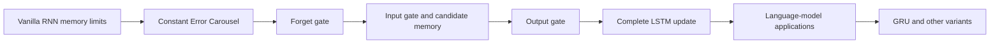
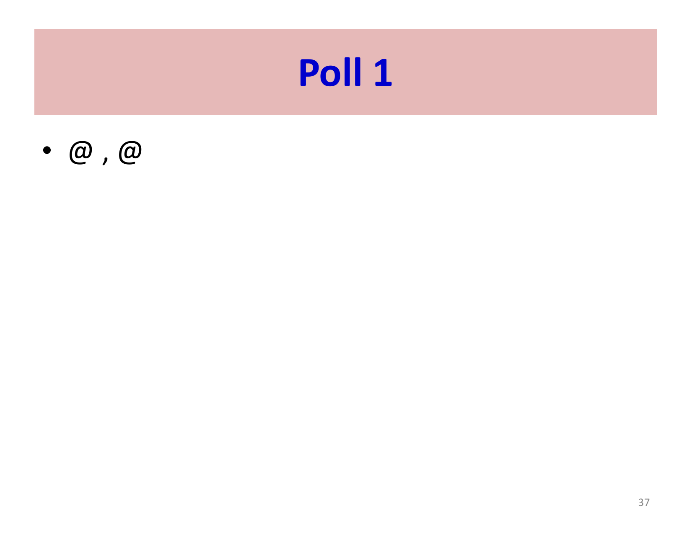
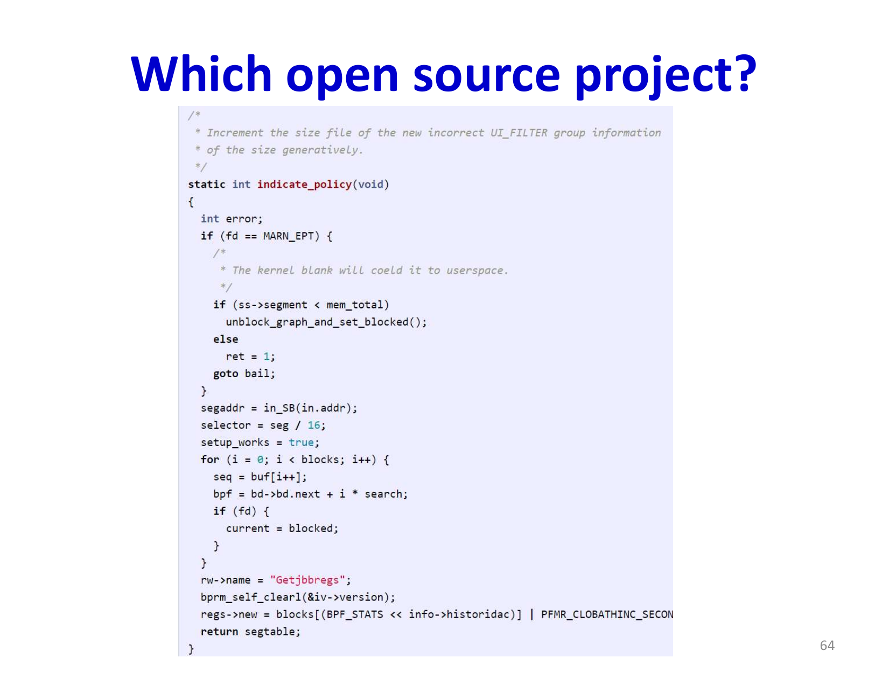

# Lecture 15: Recurrent Networks Part 3

This lecture examines LSTM networks in depth, providing both intuitive and mathematical understanding of how they overcome vanishing gradients. The focus is on language modeling and how recurrent architectures handle temporal sequence structure in complex linguistic tasks.

## Visual Roadmap



## At a Glance

| LSTM component | What it controls | Why it matters |
|---|---|---|
| Memory cell `c(t)` | Long-term stored state | Core path for stable gradient flow |
| Forget gate | What old information to erase | Prevents stale memory buildup |
| Input gate | What new information to write | Controls updates to the cell |
| Candidate memory | New content proposal | Supplies fresh information |
| Output gate | What to expose as hidden state | Separates memory from visible output |

## The Fundamental Problems with Vanilla RNNs

Vanilla RNNs face two critical challenges that limit their ability to learn from long sequences:

### The Vanishing Memory Problem

With a linear activation and recurrent weight matrix `W_(hh)`, the long-term memory depends primarily on the largest eigenvalue `lambda_(max)`. If `|lambda_(max)| < 1`, the hidden state decays exponentially:

```text
h(t) proportional to lambda_(max)^t
```

As `t` increases, the influence of past inputs vanishes. More problematically, even when `|lambda_(max)| = 1`, the "remembered" information is not what the network originally learned to encode—it becomes a function of `W_(hh)` and `b` rather than reflecting the actual input that needs to be remembered.

With nonlinear activations like tanh, the problem worsens. The network can saturate toward a fixed point determined by `f(W_(hh) h + b) = h`, which is largely independent of the initial input. This **saturation effect** means the network loses input-specific information over time.

### The Vanishing Gradient Problem During Learning

When training RNNs via backpropagation through time, gradients flow backward through many layers. The gradient is repeatedly multiplied by Jacobian matrices of activation functions and the singular values of weight matrices:

```text
grad_(W_(hh)) L = sum_t (partial L) / (partial h(T)) (partial h(T)) / (partial h(t)) (partial h(t)) / (partial W_(hh))
```

The chain of products `(partial h(t+k)) / (partial h(t))` typically contains many factors less than 1 (activation function derivatives, weight matrices with singular values less than 1). Over long sequences, this product becomes exponentially small.

This means:
- Gradients for early parameters become vanishingly small
- Weight updates for early layers become negligible
- The network cannot learn long-range dependencies
- Early parameters remain essentially untrained

## Why Recurrent Weights Dominate Vanilla Memory

The lecture makes a sharper point than "memory decays." In a vanilla recurrent net with no further inputs, the hidden state evolution is governed mainly by the recurrent weights and the hidden activation function.

That creates two problems:

- if the dominant singular values or eigenvalues are too small, information disappears
- if they are too large, the state can blow up or saturate

Even in the borderline case where the recurrence does not immediately collapse, what survives is often determined more by the preferred directions of `W_(hh)` than by the actual input pattern we wanted to remember. So the issue is not just duration of memory. It is also **what kind of information is preserved**.

## The Constant Error Carousel: LSTM Core Insight

The key innovation of LSTMs is the **constant error carousel** (CEC)—a pathway through the network where information flows with minimal transformation. Instead of the hidden state being the sole information carrier, a separate **memory cell** `c(t)` stores information and updates additively:

```text
c(t) = f(t) elementwise c(t-1) + i(t) elementwise c_tilde(t)
```

The crucial aspect is the additive update: gradients can flow backward through the cell state with nearly constant magnitude because:

```text
(partial c(t)) / (partial c(t-1)) = f(t) elementwise 1
```

When the forget gate `f(t)` is near 1, this gradient remains near 1 rather than shrinking exponentially. This provides a "shortcut" for gradient flow, enabling credit assignment across long time horizons.



## The LSTM Architecture

An LSTM unit consists of four main components:

### 1. The Forget Gate

```text
f(t) = sigma(W_f * [h(t-1), x(t)] + b_f)
```

The forget gate outputs values between 0 and 1, controlling how much of the previous cell state to retain. When `f(t) ~ 1`, the network "remembers"; when `f(t) ~ 0`, it "forgets". This is learned—the network determines when to discard information based on the current context.

### 2. The Input Gate and Candidate Memory

```text
i(t) = sigma(W_i * [h(t-1), x(t)] + b_i)
```
```text
c_tilde(t) = tanh(W_c * [h(t-1), x(t)] + b_c)
```

The input gate decides which new information to add to the memory, while the candidate memory computes what information should potentially be stored. These work together to update the cell:

```text
c(t) = f(t) elementwise c(t-1) + i(t) elementwise c_tilde(t)
```

The additive operation is critical—it allows information to flow directly through without multiplicative gating.

### 3. The Hidden State (Output of the Cell)

The cell state `c(t)` is not directly exposed. Instead, a transformed version becomes the hidden state:

```text
h(t) = o(t) elementwise tanh(c(t))
```

where the output gate controls what aspects of the cell state are revealed:

```text
o(t) = sigma(W_o * [h(t-1), x(t)] + b_o)
```

This separation of concerns is important: the cell `c(t)` maintains uncompressed memory, while `h(t)` provides a transformed representation suitable for downstream layers.

### 4. Complete LSTM Update

```text
f_t = sigma(W_f * [h_(t-1), x_t] + b_f)
i_t = sigma(W_i * [h_(t-1), x_t] + b_i)
c_tilde_t = tanh(W_c * [h_(t-1), x_t] + b_c)
c_t = f_t elementwise c_(t-1) + i_t elementwise c_tilde_t
o_t = sigma(W_o * [h_(t-1), x_t] + b_o)
h_t = o_t elementwise tanh(c_t)
```



## Why Input-Dependent Memory Control Matters

This is the conceptual jump from vanilla RNNs to LSTMs. In a vanilla RNN, the memory behavior is mostly dictated by fixed recurrent weights. In an LSTM, the amount of remembering and forgetting depends on the **current input and current context** through the gates.

That means the network can learn behavior like:

- keep a subject identity active until the matching verb appears
- forget a temporary modifier once it is no longer useful
- expose only the memory contents that matter for the current prediction

The gates do not just slow down forgetting. They make memory control conditional on the sequence itself.

## Why LSTMs Work

### 1. Gradient Flow Through the Carousel

The cell state update creates a direct path for gradients:

```text
(partial L) / (partial c(t-1)) = (partial L) / (partial c(t)) * f(t)
```

When the network learns forget gates near 1, this gradient factor is near 1, preventing exponential decay. Over hundreds of timesteps, a product of factors close to 1 remains reasonable, enabling effective credit assignment.

### 2. Learnable Memory Control

Rather than having memory determined by weight eigenvalues (unlearned), the gates provide learnable mechanisms:
- **When to forget**: Input and previous state determine if information is stale
- **What to remember**: The network decides what aspects of new input matter
- **When to output**: The network controls which memory contents are currently relevant

This input-dependent control is fundamentally more flexible than fixed weight dynamics.

### 3. Separation of Concerns

By separating the internal cell state from the exposed hidden state:
- The cell can maintain precise, uncompressed information
- The hidden state can be compressed for downstream use
- Gates control the flow between them without destroying stored information

## LSTM Applications in Language Modeling

Language modeling—predicting the next word given previous words—is a natural application where long-term dependencies are crucial. Examples include:

- Tracking subject-verb agreement across many intervening words
- Maintaining context about locations, characters, or topics
- Understanding nested structures and long-range linguistic constraints

An LSTM language model processes sequences word-by-word:
1. At each time step, receive a word embedding
2. Update the forget gate based on whether current context is still relevant
3. Add new information relevant to the new word
4. Output a distribution over next-word predictions

The model can learn to:
- Forget irrelevant discourse context
- Remember important entities and their properties
- Track long-range dependencies like open quotes or parentheses

This demonstrates how LSTMs provide not just technical solutions to vanishing gradients, but conceptually meaningful memory control mechanisms.

## Variants and Extensions

### Gated Recurrent Unit (GRU)

A simpler alternative combining some LSTM components:

```text
z(t) = sigma(W_z * [h(t-1), x(t)])
r(t) = sigma(W_r * [h(t-1), x(t)])
h_tilde(t) = tanh(W_h * [r(t) elementwise h(t-1), x(t)])
h(t) = (1 - z(t)) elementwise h(t-1) + z(t) elementwise h_tilde(t)
```

Here `z(t)` is the update gate and `r(t)` is the reset gate.

GRUs have fewer parameters and gates but maintain similar gradient flow properties.

### Bidirectional LSTMs

Process sequences in both directions and concatenate outputs:

```text
h(t) = [h_(forward)(t); h_(backward)(t)]
```

This provides context from both past and future, valuable for tasks like sequence labeling.

### Multi-layer LSTMs

Stack LSTM layers vertically where the output of one layer becomes input to the next. Deep recurrent networks can capture hierarchical temporal patterns at different timescales.

### Attention Mechanisms with RNNs

Rather than relying solely on the hidden state, attention mechanisms allow the network to focus on specific previous timesteps. These work with LSTMs to handle even longer dependencies and provide interpretability about what the model attends to.

## Training Considerations

### Gradient Clipping

Even with LSTMs, exploding gradients can occur (from large weight matrices). Gradient clipping—normalizing gradient norms that exceed a threshold—prevents divergence during training.

### Initialization

Proper weight initialization is crucial. Biases for forget gates are often initialized to positive values (e.g., 1.0) to encourage the network to initially remember history, changing only as learning proceeds.

### Sequence Length

While LSTMs handle much longer sequences than vanilla RNNs, very long sequences (thousands of timesteps) still create challenges. Techniques like hierarchical RNNs or attention mechanisms can help.

## Key Takeaways

- **Vanilla RNNs suffer from saturation and vanishing gradients**: The lack of explicit memory control and exponential gradient decay severely limit learning of long-term dependencies
- **The constant error carousel is revolutionary**: An additive pathway with gating allows information to flow through time with near-constant gradients
- **LSTMs are learnable memory modules**: The forget, input, and output gates provide input-dependent control over memory, not determined by fixed weight parameters
- **Separation of cell state and hidden state is crucial**: The uncompressed cell state carries precise information; the hidden state provides a transformed interface
- **Gates solve three problems simultaneously**: Vanishing/exploding gradients (through additive updates), saturation (through gating), and memory control (through learned gates)
- **LSTMs enable practical sequence modeling**: Language models, machine translation, speech recognition, and many other tasks became feasible at scale due to LSTM innovations
- **Architecture variations maintain core principles**: GRUs, attention mechanisms, and other variants preserve the essential insight of gated memory while optimizing for specific use cases

The LSTM represents one of the most important architectural innovations in deep learning, enabling neural networks to effectively learn from sequences with dependencies spanning hundreds of timesteps or more.

## Slide Coverage Checklist

These bullets mirror the source slide deck and make the summary concept coverage explicit.

- vanishing memory from repeated recurrent multiplication
- linear-activation memory decay with small eigenvalues
- non-linear-activation fixed-point saturation
- gradient dependence on activation Jacobians and singular values
- why hidden-state behavior is dominated by recurrent weights
- need for input-dependent memory control
- constant error carousel
- forget gate
- input gate and candidate content
- output gate
- full LSTM update equations
- language modeling as a running application
- GRU as a simplified gated alternative
- gradient clipping and forget-gate initialization
