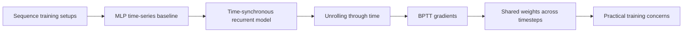
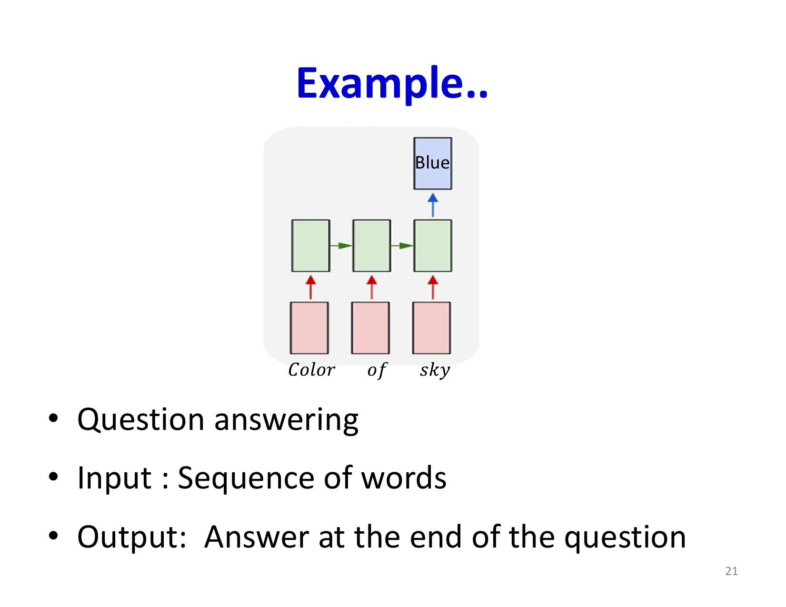
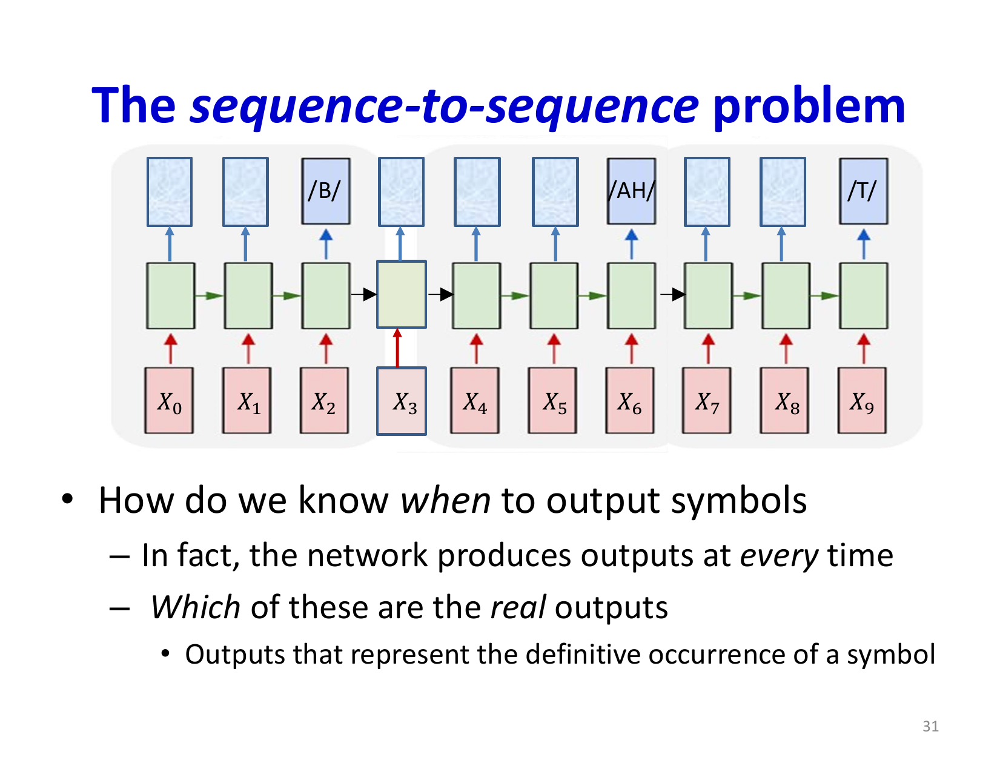
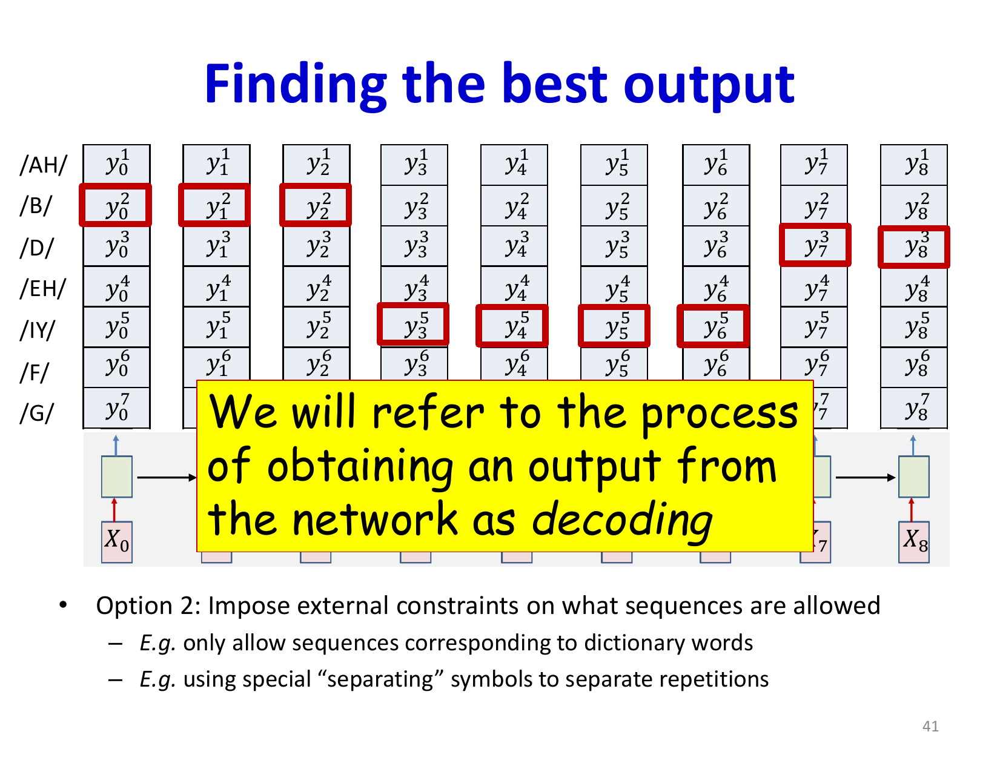
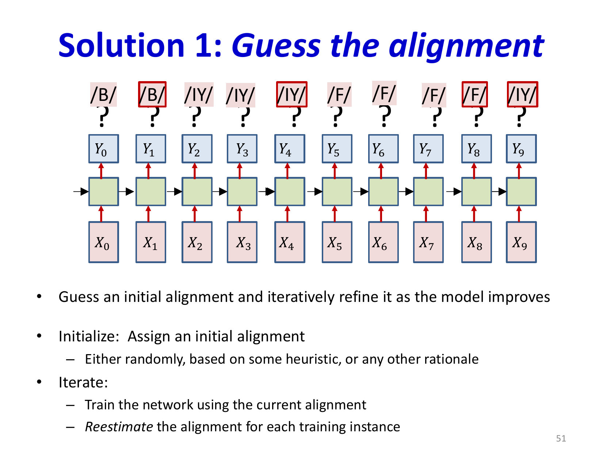

# Lecture 16: Recurrent Networks - Part 4

This lecture explores the fundamental framework for training recurrent neural networks on time-series data. We examine different architectural variants for handling sequential data with various input-output correspondences, and develop the critical backpropagation through time (BPTT) algorithm for computing gradients in recurrent systems.

## Visual Roadmap



## At a Glance

| Task form | Input / output relation | Example |
|---|---|---|
| Time-synchronous | One output per input timestep | Tagging each word in a sentence |
| Sequence classification | Whole sequence to one label | Isolated-word recognition |
| Order-synchronous | Same order, no exact time alignment | Speech recognition |
| Full seq2seq | Entire input then output sequence | Machine translation |
| Single-input generation | One input to long output sequence | Image captioning |

## Overview of RNN Training Frameworks

Recurrent structures can be trained by minimizing the divergence between sequences of network outputs and desired outputs through gradient descent and backpropagation. The key challenge lies in properly defining this divergence when inputs and outputs may not be time-aligned or synchronous.

The framework depends critically on the relationship between input and output sequences:

1. **Time-synchronous outputs**: One output per input (e.g., part-of-speech tagging)
2. **Sequence classification**: Full input sequence produces single class label (e.g., isolated word recognition)
3. **Order-synchronous, time-asynchronous**: Output sequence follows input order but lacks time alignment (e.g., speech recognition)
4. **A posteriori sequence-to-sequence**: Complete input processing before generating output (e.g., machine translation)
5. **Single-input sequence generation**: Single input generates entire output sequence (e.g., image captioning)



## Why the MLP Baseline Is Still Worth Studying

The slides spend time on sequence MLPs because they provide a useful baseline. If you let an MLP emit one output per time step and define the loss over the whole output sequence, then the **task** is sequential even though the **model** is not recurrent.

That comparison isolates what recurrence actually adds:

- dependence of current hidden state on previous hidden state
- parameter sharing through time
- the ability for current decisions to depend on arbitrarily long history

## MLPs for Time Series: The Baseline

Before examining recurrent networks, we establish how conventional MLPs can process sequences. A time-series MLP maintains exactly as many outputs as inputs with one-to-one correspondence, but crucially, each output is computed independently—the output at time `t` is unrelated to the output at time `t-1`.

The learning problem for such networks assumes the total sequence divergence decomposes as a sum of local divergences:

```text
D_(total) = sum_t D(Y(t), Y^(target)(t))
```

For classification tasks, typical divergence uses cross-entropy:

```text
D(Y(t), Y^(target)(t)) = -sum_c Y^(target)_c(t) log Y_c(t)
```

This assumption vastly simplifies both the model and the mathematics, allowing straightforward application of backpropagation where gradients at each time step are computed independently.

## Time-Synchronous Recurrent Networks

In time-synchronous architectures, the network produces one output for each input with exact one-to-one correspondence. Examples include part-of-speech tagging, where each word in a sentence receives a grammatical label.

The recurrent connections allow the hidden state to accumulate information across the sequence:

```text
h(t) = f(X(t), h(t-1))
```
```text
Y(t) = g(h(t))
```

Such networks may operate unidirectionally (processing left to right) or bidirectionally (considering both past and future context). Bidirectional networks are particularly valuable for tasks like POS tagging where the grammatical role of a word depends on surrounding context.



## Sequence Classification and Other Task Variants

The lecture also contrasts time-synchronous prediction with **sequence classification**, where the entire input sequence maps to one label. In that case, the divergence no longer decomposes into one local target per timestep. Instead, the network often uses the final hidden state, a pooled summary, or a dedicated classifier head:

```text
Y = g(h(T))
```

and the training objective becomes:

```text
D_total = D(Y, Y_target)
```

This distinction matters because it changes both the architecture and where the supervision enters. The same recurrent machinery can support:

- one label per timestep
- one label for the whole sequence
- one output sequence with unknown alignment
- one output sequence generated after consuming the full input

## Backpropagation Through Time (BPTT)

BPTT extends backpropagation to handle sequences by unfolding the recurrent structure through time. The first critical step computes the gradient of the total divergence with respect to outputs at each time step:

```text
(partial D_(total)) / (partial Y(t)) = (partial D(Y(t), Y^(target)(t))) / (partial Y(t))
```

This gradient combines information from two sources:
1. Direct contribution from the local divergence at time `t`
2. Indirect contribution through the recurrent connections from future time steps

For time-synchronous networks with additive divergence, we have:

```text
(partial D_(total)) / (partial Y(t)) = (partial D(Y(t), Y^(target)(t))) / (partial Y(t))
```

The challenge intensifies when propagating gradients through the hidden state, since the hidden state at time `t` influences both the current output and the hidden state at time `t+1`.

## Gradient Flow Through Hidden States

The gradient must flow back through both the output computation and the recurrent connections. Let's denote `delta(t) = (partial D_(total)) / (partial h(t))`. This gradient decomposes into:

1. **Immediate gradient**: From the current output at time `t`
2. **Recurrent gradient**: From the hidden state at time `t+1` flowing backward

```text
delta(t) = (partial Y(t)) / (partial h(t)) (partial D) / (partial Y(t)) + (partial h(t+1)) / (partial h(t)) delta(t+1)
```

This recurrent relationship means computing the gradient at time `t` requires the gradient from time `t+1`, creating a dependency chain that extends backward through the entire sequence. The gradients must be computed in reverse chronological order, from the end of the sequence back to the beginning.

This is the exact reason the method is called **backpropagation through time** rather than ordinary backpropagation: unrolling converts one recurrent module into a very deep computation graph whose depth equals the sequence length.



## Weight Updates and Training Dynamics

All instances of a weight parameter appear at every time step, so its total gradient aggregates contributions across the entire sequence:

```text
(partial D_(total)) / (partial W) = sum_t (partial D_(total)) / (partial W(t))
```

This means training recurrent networks requires processing entire sequences, and the gradient information comes from all positions simultaneously. The weight update at each training iteration reflects the cumulative effect of the model's performance across the entire sequence.

The learning rate and optimization scheme become crucial, as large gradients early in the sequence can dominate the weight updates. This phenomenon relates to the vanishing and exploding gradient problems that plague deep recurrent architectures.

## Practical Considerations

When implementing BPTT:
- Sequences are typically unfolded explicitly into computational graphs
- Memory requirements scale with sequence length
- Truncated BPTT limits backpropagation depth to reduce computation
- Gradient clipping prevents instability from exploding gradients
- Careful initialization (orthogonal matrices) helps maintain gradient flow

### Truncated BPTT as a Practical Approximation

Truncated BPTT is not a different model. It is a computational compromise:

- run the recurrent net forward over a long stream
- backpropagate only through the most recent `K` timesteps
- carry the hidden state forward, but stop the backward graph at the truncation boundary

This reduces memory and compute cost substantially, but it also means parameter updates only get direct credit-assignment information from a limited temporal window.



## Key Takeaways

- Recurrent networks extend standard backpropagation through time using the BPTT algorithm
- Different task formulations (time-synchronous, sequence classification, sequence-to-sequence) require distinct architectural choices
- The key challenge in BPTT is properly computing gradients through recurrent connections and aggregating them across time steps
- Gradient flow through long sequences can be problematic, leading to vanishing or exploding gradients
- Weight parameters are shared across time, causing their gradients to accumulate information from the entire sequence

## Slide Coverage Checklist

These bullets mirror the source slide deck and make the summary concept coverage explicit.

- variants of recurrent nets for different sequence problems
- MLP baseline for sequence-to-sequence divergence
- time-synchronous recurrence
- one output per input timestep
- sequence classification setup
- divergence over sequences rather than single examples
- unrolled computation graph
- backpropagation through time first step
- recursive gradient flow through hidden states
- shared-weight accumulation across timesteps
- truncated BPTT and memory/computation tradeoffs
- gradient clipping / practical training issues
