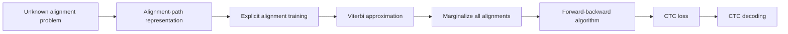
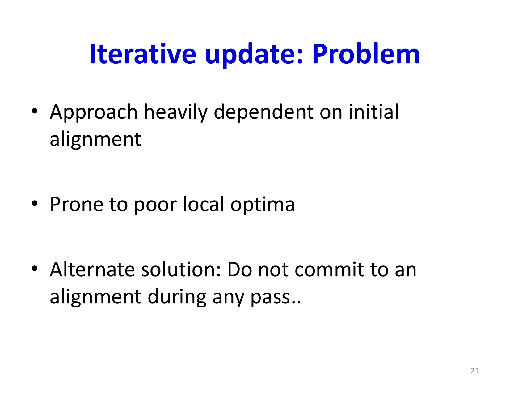
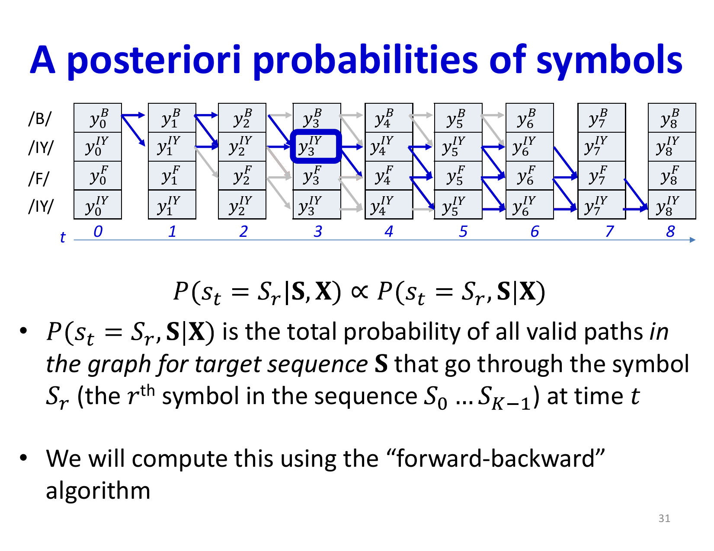
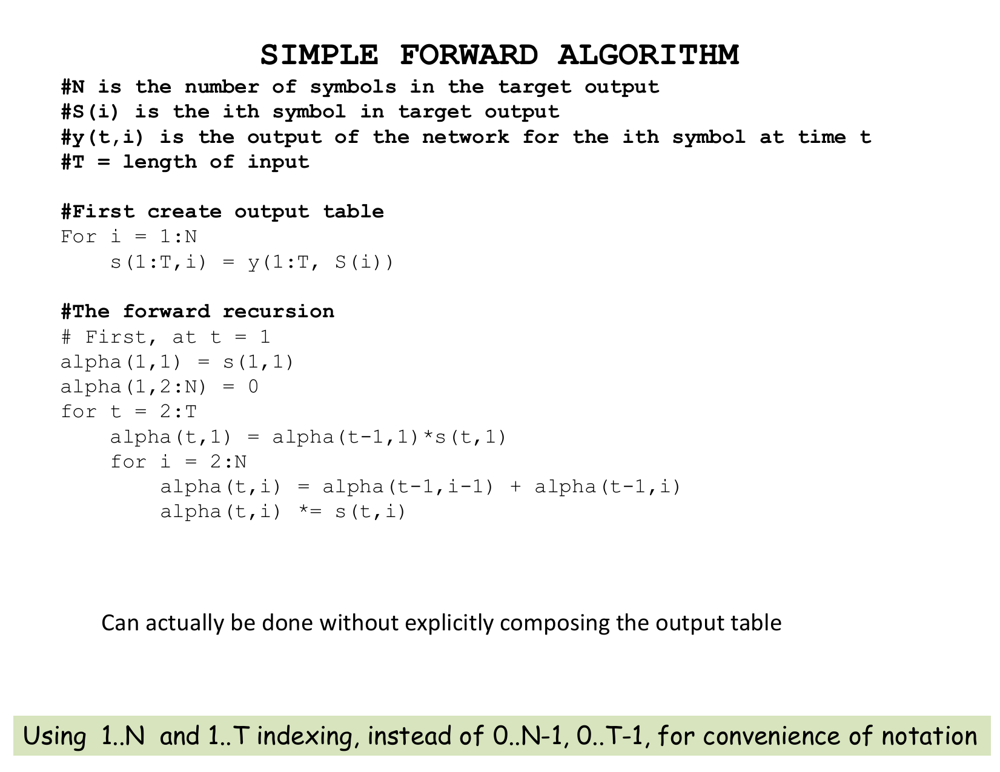
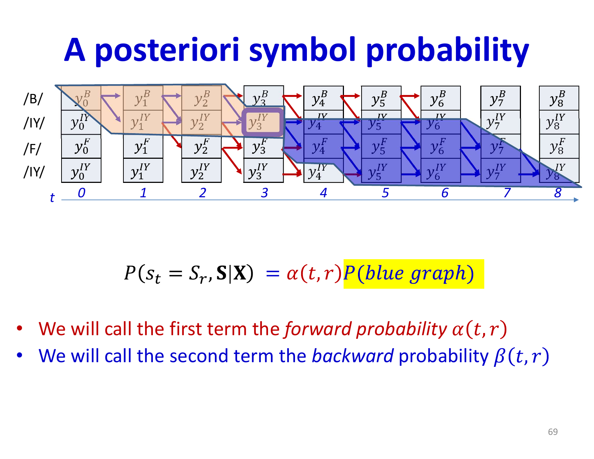
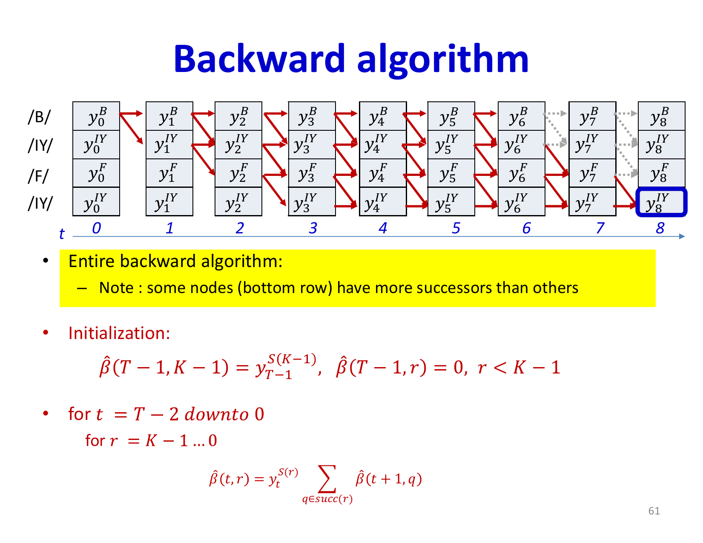

# Lecture 17: Connectionist Temporal Classification (CTC)

This lecture addresses the critical problem of training sequence-to-sequence models when the alignment between input and output sequences is unknown. We explore order-aligned but time-asynchronous scenarios (like speech recognition) and develop the Connectionist Temporal Classification algorithm as a principled solution that marginalizes over all possible alignments.

## Visual Roadmap



## At a Glance

| Approach | What it assumes | Tradeoff |
|---|---|---|
| Explicit alignment | True timing labels are known | Easy training, unrealistic labeling burden |
| Viterbi-style alignment | Pick one best alignment | Faster but approximate |
| CTC | Sum over all valid monotonic alignments with blanks | Principled and label-efficient, but more complex |
| CTC decoding | Collapse repeated labels and blanks | Inference depends on search strategy |

## The Sequence-to-Sequence Problem

In many real-world tasks, a sequence goes in and a different sequence comes out, with no notion of time synchrony between them:

- **Speech recognition**: Acoustic frames as input, phoneme or character sequence as output
- **Machine translation**: Word sequence in source language, word sequence in target language
- **Dialog systems**: User statement becomes system response
- **Question answering**: Question becomes answer

The core challenge: outputs may not maintain the same order as inputs, may have different lengths, or may not even seem related to inputs.

CTC only addresses the **monotonic** case. It is appropriate when output order follows input order, as in speech or handwriting recognition, but not for arbitrary reordering tasks like general machine translation.



## Order-Aligned But Time-Asynchronous Sequences

A special case that bridges time-synchronous and fully asynchronous sequences occurs when input and output sequences follow the same order but lack time synchrony. Speech recognition exemplifies this: the phoneme sequence emerges in the same order as the acoustic frames, but a single phoneme may span multiple frames.

The key challenge is that while we know the correct output sequence, we don't know where each output symbol aligns in time. For example, given "bat" as the target output for a 10-frame acoustic sequence, we don't know which frames correspond to /B/, /AH/, or /T/.

```text
Input frames:  X_0, X_1, ..., X_9
```
```text
Target symbols:  S_0=/B/, S_1=/AH/, S_2=/T/
```

The question becomes: how do we train a network when the temporal alignment is unknown?

## Alignment Representation

CTC augments the output alphabet with a special **blank** symbol. The network outputs a distribution over `labels + blank` at every frame.

An alignment between a target sequence and an input sequence of length N is represented as a frame-level path over this augmented alphabet. For the /B/ /AH/ /T/ example, a valid CTC path could be:

```text
Path:  blank, /B/, /B/, blank, /AH/, /AH/, blank, /T/, /T/, blank
```

To recover the label sequence, CTC applies two operations:

```text
1. Merge repeated consecutive labels
2. Remove blanks
```

After collapsing, the path above becomes `/B/ /AH/ /T/`. Any path that collapses this way is a valid alignment.

The blank symbol is essential for repeated neighboring labels. Without blanks, a word like `hello` could not distinguish the double `l` cleanly from a single long `l`.



## Training With Explicit Alignment

If alignments were provided during training, the problem becomes straightforward: treat it as a time-synchronous task over the augmented alphabet. The gradient at frame `t` would target the aligned label or blank directly.

For classification:
```text
D(t) = -log P(s_t | X_(0:t), theta)
```

The total divergence is the sum of local divergences at each aligned position, and backpropagation through time applies directly.

## The Alignment Problem

In practice, alignments are not provided—we only have the target sequence without timing information. This creates two obstacles:

1. **Inference problem**: Given inputs, how do we output a time-asynchronous sequence?
2. **Training problem**: How do we compute gradients without knowing the alignment?

## Solution 1: Viterbi Training

One approach is to estimate the most likely alignment at each iteration (Viterbi decoding), then train as if that alignment were correct. However, this has serious drawbacks:

- **Sensitivity to initialization**: Poor initial alignments can lead to suboptimal local minima
- **Commitment problem**: We deterministically select a single alignment, losing information from alternative good alignments
- **Early training instability**: In early iterations, when the model is poorly trained, the estimated alignment is often wrong

## Solution 2: Marginalize Over All Alignments

Rather than committing to a single alignment, CTC marginalizes over all possible valid alignments. By linearity of expectation, the expected divergence decomposes into expected divergence at each input position:

```text
E[DIV] = E[sum_t DIV(t)] = sum_t E[DIV(t)]
```

This requires computing the probability that a specific symbol appears at a specific time, averaging over all valid alignments:

```text
P(s_k  at  t | S, X) = (Total prob. of all valid paths through  s_k  at  t) / (Total prob. of all valid paths)
```



## The Forward-Backward Algorithm

To efficiently compute these probabilities, we decompose them as:

```text
P(s_k  at  t) proportional to alpha(k, t) * beta(k, t)
```

where:

- **Forward probability** `alpha(k, t)`: Total probability of all paths from the start to symbol `s_k` at time `t`
- **Backward probability** `beta(k, t)`: Total probability of all paths from symbol `s_k` at time `t` to the end

The forward pass initializes at the first symbol and iteratively computes:
```text
alpha(k, t) = P(X_t | s_k) * sum_(k') alpha(k', t-1) * P(transition from  k'  to  k)
```

The backward pass works similarly in reverse chronological order.



## Conditional Independence Structure

The algorithm leverages conditional independence properties:

- Input sequence `X_(0:N)` governs hidden variables
- Hidden variables govern output predictions
- Output predictions at different times are conditionally independent given the input

This structure allows efficient computation: once the input and hidden state are fixed, the output probabilities factorize.

## CTC Loss Function

The CTC loss for a sequence is:

```text
CTC Loss = -log P(target sequence | X)
```

During training, we can efficiently compute this and its gradients using the forward-backward algorithm. At each position, we accumulate gradients weighted by the posterior probability of each symbol appearing at that position.

For a softmax output over the augmented alphabet, the gradient has the same overall shape as other probabilistic models: predicted posterior minus target posterior. Here the "target posterior" is not a single one-hot label, but the summed posterior mass over all valid alignments that place each symbol at that frame.

The expected gradient with respect to the network output at time `t` is:

```text
(partial CTC Loss) / (partial Y(t)) = sum_k P(s_k  at  t) * (partial local loss) / (partial Y_k(t))
```

## Advantages of CTC

- **No alignment required**: Training data only needs target sequences, not alignments
- **Principled marginalization**: Averages over all valid alignments rather than committing to one
- **Robustness**: Early in training, when the model is poor, it considers many alignments
- **Gradient flow**: Information from multiple potential alignments helps stabilize learning



## Practical Considerations

During inference, CTC can use:
- **Greedy decoding**: Select the most likely symbol at each time, then remove repetitions
- **Beam search**: Maintain multiple hypothesis paths, collapse blanks/repeats carefully, and optionally score them with a language model
- **Full sequence search**: Use dynamic programming to find the most likely alignment (Viterbi decoding)

## Key Takeaways

- Order-aligned sequences require solving the alignment problem without explicit timing information
- CTC assumes monotonic order and introduces a blank symbol to express "no label here yet"
- Viterbi training (selecting best alignment) is prone to local optima and early-training instability
- CTC marginalizes over all valid alignments using forward-backward computation
- Forward probabilities accumulate information from the sequence start
- Backward probabilities accumulate information from the sequence end
- The product of forward and backward probabilities gives the posterior probability of a symbol at each position
- CTC loss is differentiable and enables end-to-end training without alignment annotations

## Slide Coverage Checklist

These bullets mirror the source slide deck and make the summary concept coverage explicit.

- sequence-to-sequence task families
- order-aligned but time-asynchronous case
- recap of training with explicit alignments
- characterization of an alignment path
- timing information as the missing supervision
- problem statement when alignment is absent
- Viterbi / best-alignment approximation
- need to marginalize over all valid alignments
- blank symbol in CTC
- collapse rule: merge repeats then remove blanks
- forward probability recursion
- backward probability recursion
- posterior probability of a symbol at a frame
- CTC loss and gradient intuition
- greedy decoding vs beam search

