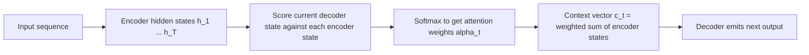
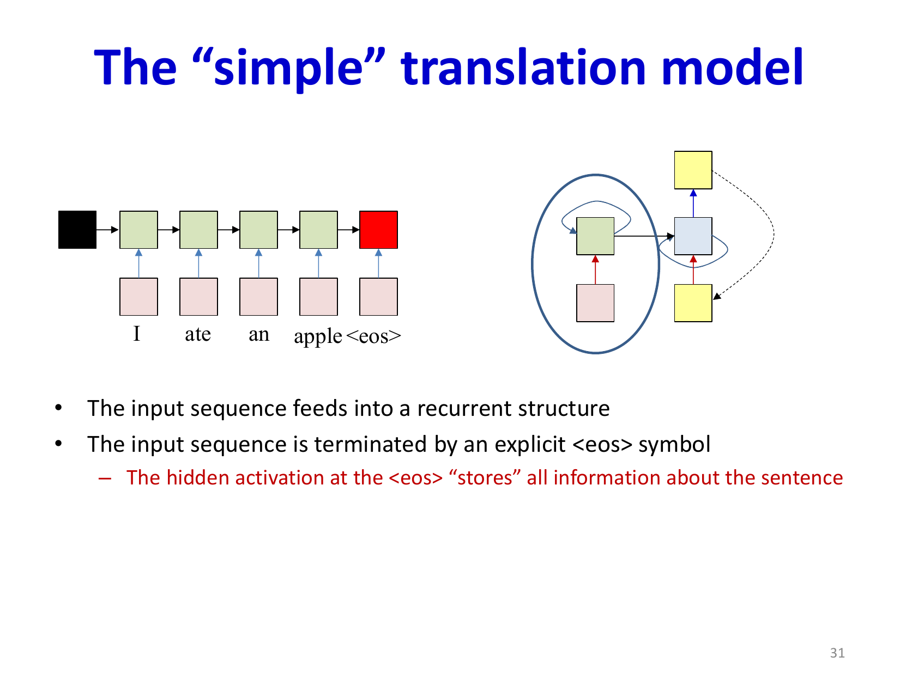
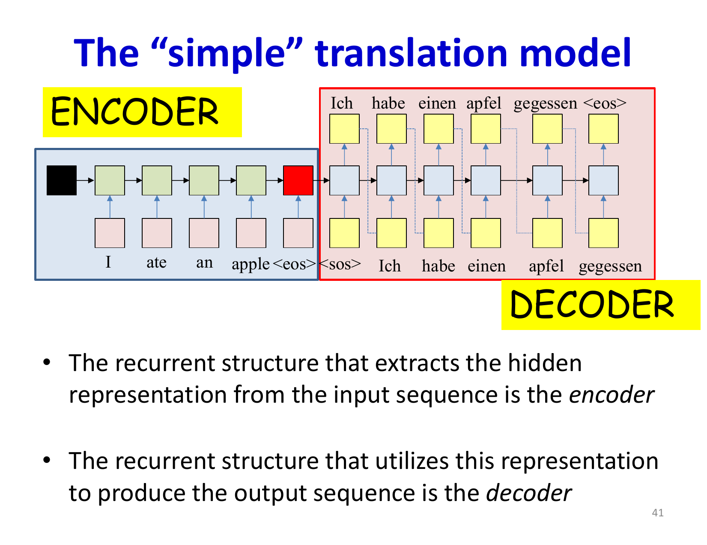
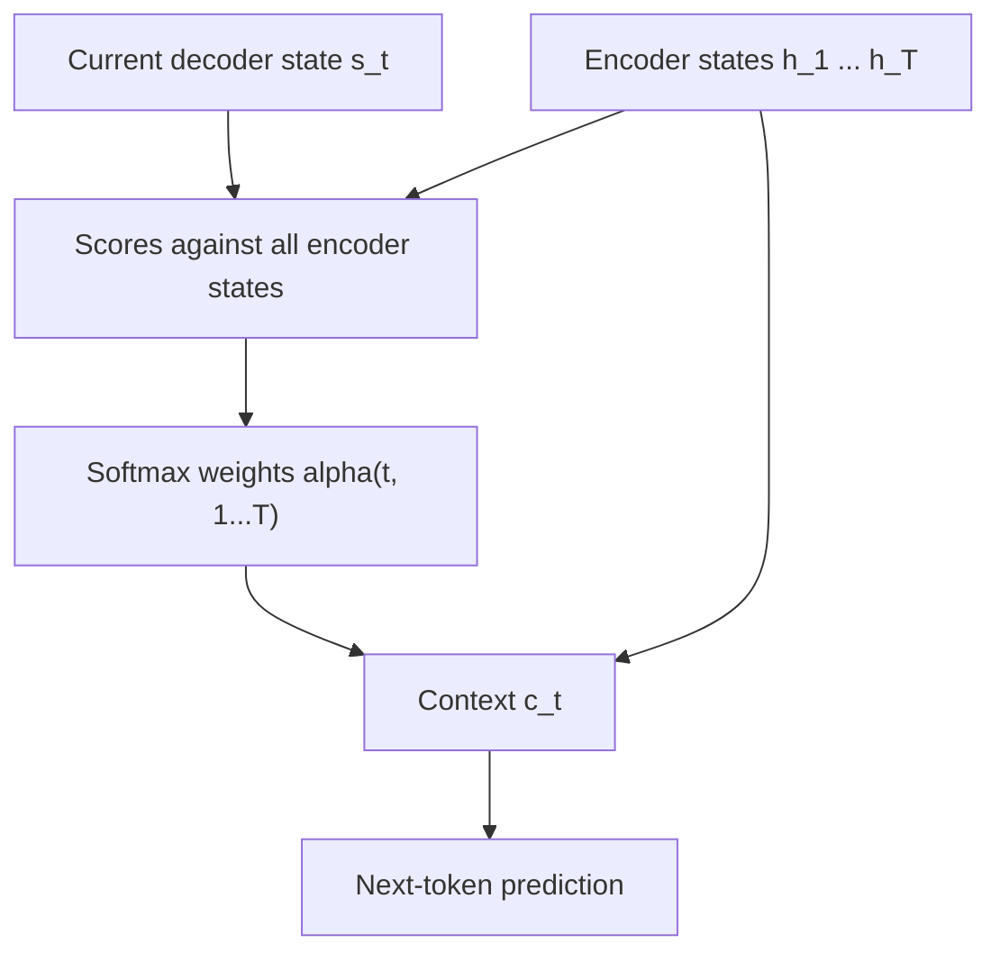
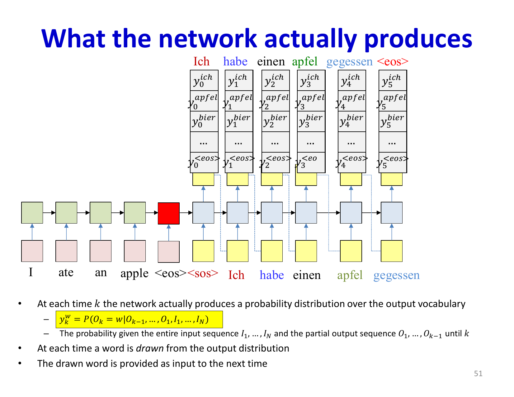

# Lecture 18: Attention Mechanisms

Attention fixes the core weakness of the basic encoder-decoder sequence-to-sequence model: forcing the entire input sequence through one fixed-size context vector. Instead of asking the decoder to remember everything in one hidden state, attention lets it look back at all encoder states and choose what matters at each output step.

## Visual Roadmap



## At a Glance

| Object | Meaning | Formula / role |
|---|---|---|
| Encoder states `h_tau` | Represent each input position | Memory bank for the decoder |
| Attention score `e(t, tau)` | Compatibility of output step `t` with input position `tau` | Often query-key style or bilinear score |
| Attention weight `alpha(t, tau)` | Normalized importance of input position `tau` at output step `t` | Softmax over scores |
| Context vector `c(t)` | Input-specific summary for output step `t` | Weighted sum of encoder states |

## Why Plain Seq2Seq Breaks

In a basic seq2seq model:

1. the encoder reads the full input
2. the final encoder state initializes the decoder
3. the decoder produces the whole output from that compressed representation

This causes a bottleneck:

- long inputs are hard to compress into one vector
- different output words need different parts of the input
- non-monotonic mappings, such as translation, are awkward because word order can change

## Plain Seq2Seq vs Attention

| Model | What the decoder gets | Weakness |
|---|---|---|
| Plain seq2seq | One fixed context vector | Information bottleneck |
| Attention seq2seq | A new context vector at every step | More compute, but much better alignment and memory access |

## Language Modeling Background

For a sequence of words `w_1, ..., w_t`, a recurrent language model predicts:

```text
P(w_(t+1) | w_1, ..., w_t)
```

The output is a probability distribution over the vocabulary, trained with cross-entropy. Seq2seq builds on this idea, but now the decoder conditions on an **input sequence** as well as previously generated outputs.

### Sequence Boundaries Matter

The slides explicitly call out beginning and ending symbols. They matter because generation is not just about choosing the next word; it is also about knowing when a sequence has started and when it is complete.

- `<sos>` tells the decoder how to begin
- `<eos>` lets the model terminate generation

Without those symbols, autoregressive decoding has no clean notion of "first step" or "done."

## Encoder-Decoder Setup

The basic encoder-decoder model works like this:

```text
Encode:
for t = 1 ... T:
    h_t = EncoderRNN(x_t, h_(t-1))

Decode:
s_0 = h_T
for t = 1 ... M:
    y_t = DecoderRNN(y_(t-1), s_(t-1))
```

The problem is that `h_T` has to carry everything.



## Attention Computation

At output step `t`, attention computes:

```text
c(t) = sum over tau=1..T of alpha(t, tau) * h_tau
```

where

```text
alpha(t, tau) = exp(e(t, tau)) / sum over tau' of exp(e(t, tau'))
```

and `e(t, tau)` is a raw compatibility score between:

- the current decoder state
- the encoder state at position `tau`

Common forms include bilinear, additive, or query-key scoring.

## The Decoder Step with Attention

At each output time step:

1. use the decoder's current state to score all encoder states
2. softmax those scores into attention weights
3. compute the weighted context vector
4. combine the context vector with the decoder state to predict the next output

That means the model chooses a **different input summary for each output token**.



## Attention as Alignment

The matrix of weights `alpha(t, tau)` is an alignment matrix:

- each row corresponds to one output step
- each column corresponds to one input position
- high weights indicate which source positions influence the current output

Important correction:

- The context vector is **not** just the single encoder state with the largest weight.
- It is a **weighted sum** of all encoder states.

## Attention Step as a Visual Pattern



## Why Attention Helps

- **Less bottleneck**: the decoder can access all encoder states, not just the final one.
- **Better long-range learning**: gradients can connect decoder outputs directly to earlier input positions.
- **Interpretability**: attention weights expose alignment.
- **Handles reordering**: critical for translation and other seq2seq tasks with non-local alignment.

## Training vs Inference

| Stage | Previous token fed into decoder | Why |
|---|---|---|
| Training | Ground-truth previous token (teacher forcing) | Stabilizes optimization |
| Inference | Model's own previous prediction | Reflects real deployment behavior |

Teacher forcing is useful, but it creates **exposure bias**: at test time the decoder must live with its own mistakes.

## Inference Loop

```text
Encode input to get h_1 ... h_T
Initialize decoder state
Start with <sos>
Repeat:
    compute attention weights over encoder states
    form context vector
    decode next output token
    feed predicted token back in
until <eos>
```

Beam search is often used instead of greedy decoding because locally best choices do not always form the globally best sentence.

The important conceptual shift is that the decoder is no longer forced to trust a single frozen summary from the encoder. At every step, it can re-read the input memory with a different focus.



## Extensions Mentioned in the Lecture

- bidirectional encoders
- local vs global attention
- query-key-value formulation
- multi-head attention
- image attention for captioning

These extensions turn attention from a seq2seq fix into a general neural computation pattern.

## Attention as the Bridge to Transformers

This lecture is the conceptual bridge to Transformers:

- here, attention augments recurrence
- next lecture, attention largely replaces recurrence

That shift only makes sense once you see that the important operation is not the recurrence itself, but the learned routing of information between positions.

## Key Takeaways

- Plain seq2seq bottlenecks the entire input into one vector.
- Attention gives the decoder a fresh, input-dependent context vector at every output step.
- Attention weights are obtained by softmax-normalizing compatibility scores.
- The context vector is a weighted sum of encoder states, not a hard selection of one state.
- Attention improves alignment, long-sequence handling, and interpretability.
- Teacher forcing helps training, but inference still requires autoregressive decoding.
- Attention sets up the next conceptual step: Transformers.

## Slide Coverage Checklist

These bullets mirror the source slide deck and make the summary concept coverage explicit.

- seq2seq recap and fixed-context bottleneck
- language modeling recap with recurrent generation
- next-symbol prediction setup
- start token and end token handling
- encoder-decoder architecture without attention
- why fixed-length context vectors fail on long inputs
- attention scores over encoder states
- normalized attention weights as soft alignment
- context vector as weighted sum of values / states
- decoder update with previous output plus context
- alignment heatmap interpretation
- training vs autoregressive inference
- attention as the bridge to transformers
