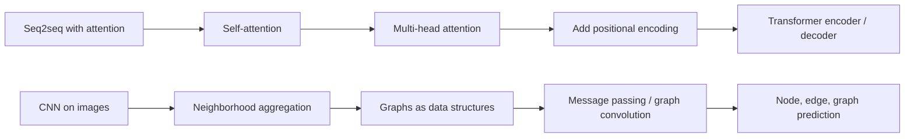
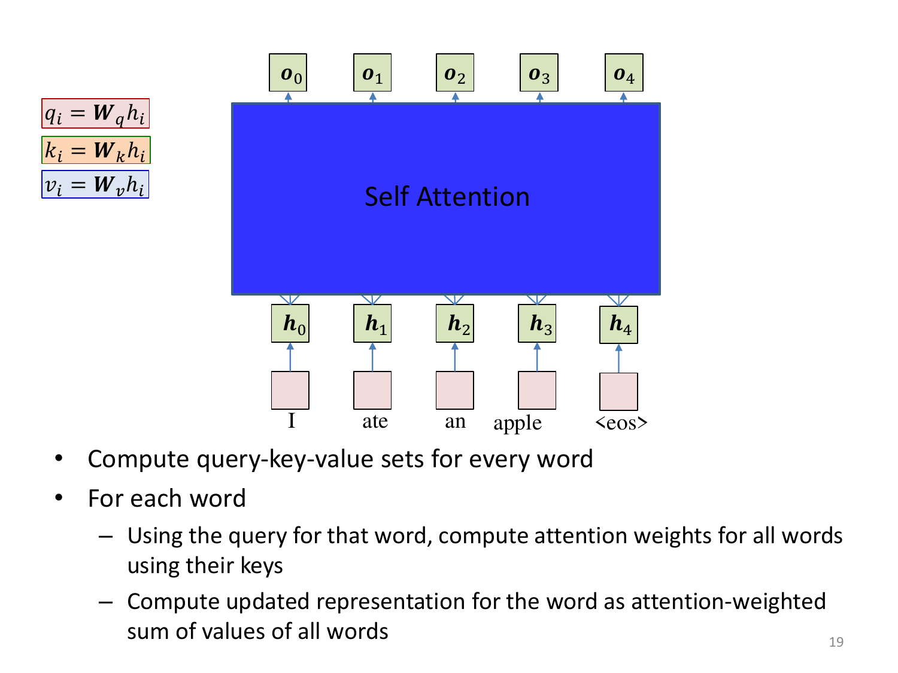
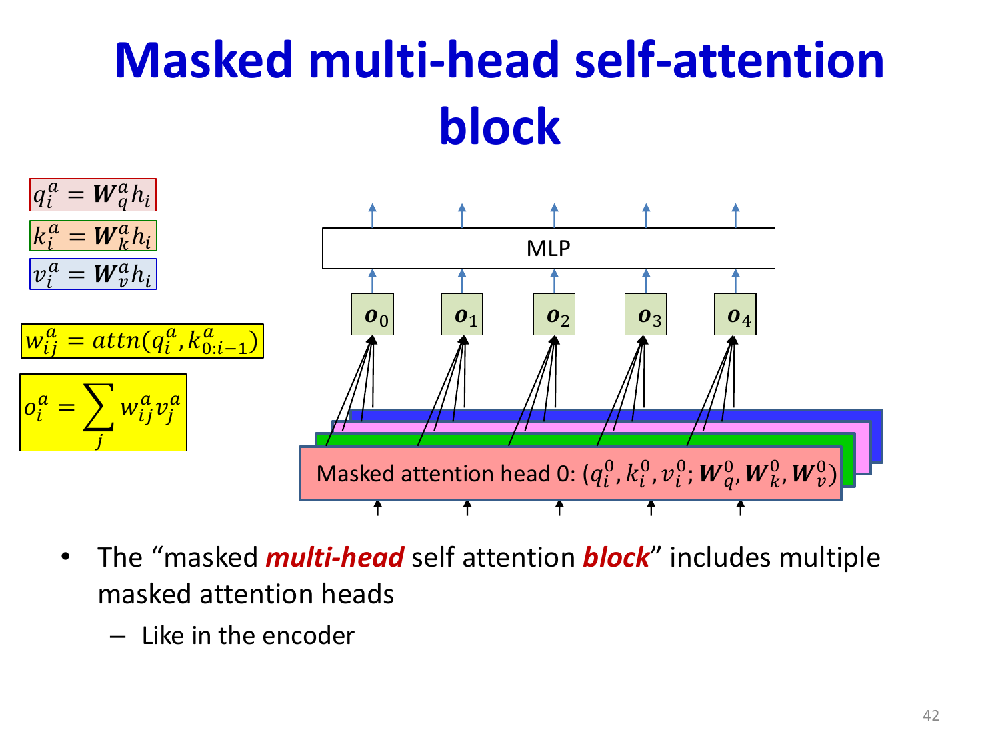
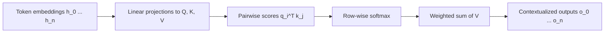
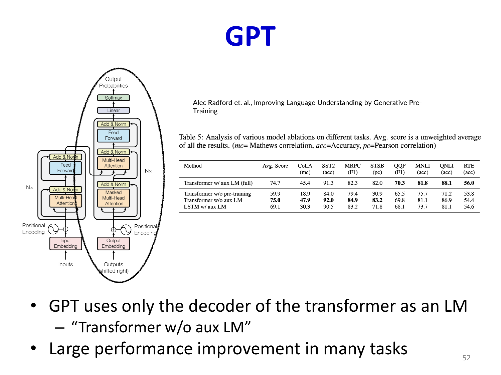
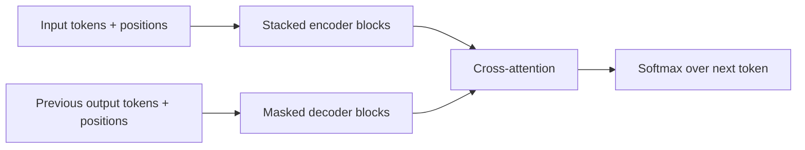
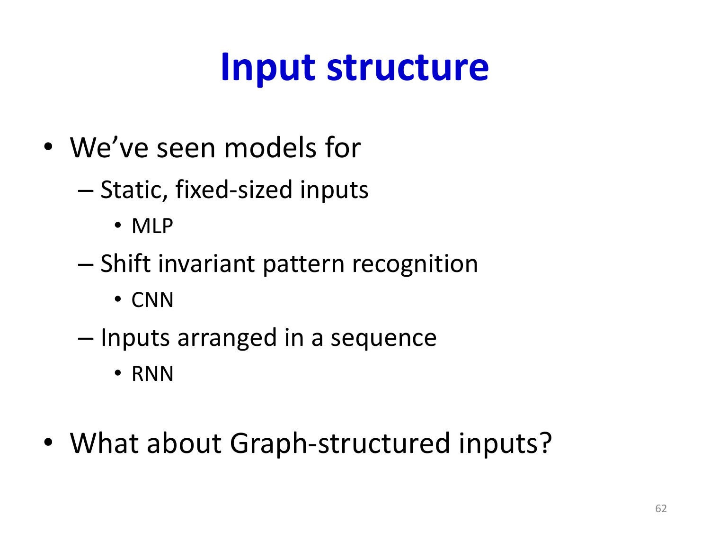
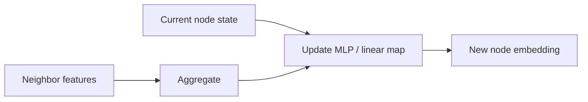

# Lecture 19: Transformers and Graph Neural Networks

This lecture covers two generalizations of earlier ideas. Transformers generalize attention into a fully non-recurrent sequence model, while Graph Neural Networks (GNNs) generalize convolution from grids to arbitrary relational structures.

## Visual Roadmap



## At a Glance

| Model | Basic unit of computation | How context is gathered | Strength | Main cost / limitation |
|---|---|---|---|---|
| RNN | Hidden state over time | Sequential recurrence | Natural for ordered streams | Hard to parallelize; long paths for long-range dependence |
| Attention model | Decoder attends to encoder states | Learned weighted average over input positions | Explicit alignment | Still depends on recurrent encoder/decoder |
| Transformer | Self-attention block | Every token attends to every other token | Full parallelism in encoder; strong long-range modeling | Attention cost grows as `O(n^2)` with sequence length |
| GNN | Message-passing layer | Each node aggregates from neighbors | Works on arbitrary graphs | Deep stacks can over-smooth or become expensive on dense graphs |

## Bridge from Attention to Transformers

In the attention model from the previous lecture, the decoder already learns which encoder states matter for each output. That raises the key question from the slides:

> If attention is already deciding what information matters, do we still need recurrence in the encoder?

The Transformer answers: not necessarily. Replace recurrence with repeated self-attention plus feedforward processing.

## Why a Non-Recurrent Encoder Still Works

The slide deck's key observation is that context-specific embeddings do not require recurrence if the attention mechanism itself supplies the context. Once every token can interact with every other token through self-attention, the representation of the word at position `i` is no longer just a static embedding. It becomes:

```text
contextual representation of token i = weighted sum of value vectors from the whole sequence
```

So the encoder can stay non-recurrent while still producing word representations that depend on surrounding words.



## Self-Attention: Context-Specific Token Representations

For each input token embedding `h_i`, compute three projected vectors:

- Query: `q_i = W_q h_i`
- Key: `k_i = W_k h_i`
- Value: `v_i = W_v h_i`

The attention score from token `i` to token `j` is:

```text
e_ij = q_i^T k_j
```

These scores are normalized into attention weights:

```text
w_ij = softmax over j of (e_ij / sqrt(d_k))
```

Then token `i` gets a context-aware update:

```text
o_i = sum over j of w_ij * v_j
```

Interpretation:

- Query asks: what information does token `i` want?
- Key asks: what kind of information does token `j` offer?
- Value is the content passed forward if token `j` is attended to.



## One Pass of Self-Attention



## Why Self-Attention Helps

- **Parallel computation**: all token-token interactions are computed at once.
- **Short dependency paths**: any token can influence any other in one layer.
- **Interpretability**: attention weights reveal which tokens interact.
- **Flexible specialization**: different heads can focus on syntax, local context, or long-range semantics.

## Multi-Head Attention

Instead of one attention operation, use multiple attention heads in parallel:

```text
o_i^(a) = sum over j of w_ij^(a) * v_j^(a), for head a = 1..H
```

Then concatenate the head outputs:

```text
o_i = concat(o_i^(1), o_i^(2), ..., o_i^(H))
```

Multi-head attention matters because one head usually cannot capture every useful relation at once. Different heads can learn different views of the sequence.



## Positional Encoding: What Self-Attention Is Missing

Pure self-attention ignores order. Without extra information, the set of embeddings for:

- `I ate an apple`
- `apple ate I an`

would look like the same bag of vectors.

That is why Transformers add a positional encoding `p_i` to each token embedding:

```text
x_i = h_i + p_i
```

The slides emphasize the reason clearly: attention knows *which* tokens matter, but not *how far away* they are or *in what order* they appear. Positional encoding restores sequence structure.

## The Transformer Block

A standard Transformer block has two sublayers:

1. Multi-head self-attention
2. Position-wise feedforward network

With residual connections and normalization:

```text
u_i^(l) = LayerNorm(h_i^(l-1) + MHA(h_i^(l-1)))
```

```text
h_i^(l) = LayerNorm(u_i^(l) + MLP(u_i^(l)))
```

The MLP is usually:

```text
MLP(x) = W_2 * sigma(W_1 * x + b_1) + b_2
```

## Encoder vs Decoder Transformer Blocks

| Block | Attention type | Can it see future tokens? | Purpose |
|---|---|---|---|
| Encoder block | Self-attention | Yes | Build contextual representations of the full input |
| Decoder block | Masked self-attention | No | Generate outputs autoregressively |
| Decoder cross-attention | Decoder attends to encoder outputs | Yes, over encoder states only | Connect generated output to the input sequence |

The decoder must be masked so position `t` cannot peek at positions `t+1, t+2, ...` during training or inference.

## Masking and Cross-Attention in the Decoder

Masked self-attention modifies the score matrix before softmax:

```text
masked_score_ij = q_i^T k_j + mask_ij
```

where:

- `mask_ij = 0` if output position `j` is allowed to influence `i`
- `mask_ij = -infinity` if `j` is a future position that must be hidden

After masking, the decoder can only attend to outputs generated so far. Cross-attention is the second decoder attention step:

- decoder states provide the queries
- encoder outputs provide the keys and values

This is what reconnects autoregressive generation to the source sentence.

## Full Sequence-to-Sequence Transformer



This is the lecture's main conceptual jump: both encoder and decoder are now built from attention blocks rather than recurrent cells.

## Graphs: Moving Beyond Sequences and Grids

CNNs assume regular neighborhoods on a grid. But many datasets are not grids:

- social networks
- citation networks
- molecules
- webpages with links
- even images, if we reinterpret pixels as nodes connected to adjacent pixels

Graphs provide a general way to describe entities plus relations.

The slides also emphasize that many familiar structures are special cases of graphs:

- sequences are chain graphs
- images are grid graphs
- social and citation data are irregular graphs

That is why GNNs are best read as a generalization of CNN-style local aggregation rather than as a completely separate idea.

## Message Passing / Graph Convolution

For each node `i`, a GNN updates its representation using the features of neighboring nodes:

```text
m_i^(l) = AGGREGATE({ h_j^(l-1) : j in N(i) })
```

```text
h_i^(l) = UPDATE(h_i^(l-1), m_i^(l))
```

Typical aggregations:

- sum
- mean
- max
- attention-weighted combinations

A common template is:

```text
h_i^(l) = sigma( W * concat(h_i^(l-1), m_i^(l)) )
```

This is the graph analogue of a convolutional layer: use local neighborhoods, share parameters, stack layers to expand receptive field.



## GNN Update as a Visual Pattern



## What Depth Means in a GNN

- After 1 layer, node `i` has seen its 1-hop neighbors.
- After 2 layers, it has seen 2-hop neighbors.
- After `L` layers, it has seen an `L`-hop neighborhood.

This is exactly analogous to receptive-field growth in CNNs.

## Graph Tasks

| Task type | Output object | Example |
|---|---|---|
| Node classification | Label for each node | Predict paper topic in a citation graph |
| Edge / link prediction | Score for pair of nodes | Predict missing social connections |
| Graph classification | One label per graph | Predict molecular property |

For graph-level tasks, use a readout:

```text
h_G = READOUT({ h_i^(L) for i in V })
```

where READOUT might be sum, mean, max, or attention pooling.

Some formulations also maintain explicit edge features or edge activations in addition to node features. That is useful when the relation itself carries information, such as bond types in molecules or relation labels in knowledge graphs.

## Unifying View Across Architectures

| Architecture | Underlying structure | Local interaction pattern |
|---|---|---|
| CNN | Grid | Fixed spatial neighborhood |
| RNN | Chain graph over time | Previous hidden state only |
| Transformer | Fully connected sequence graph | Learned attention to all positions |
| GNN | Arbitrary graph | Learned or fixed neighborhood aggregation |

This table is the big picture of the lecture: many neural architectures differ mainly in the structure over which they pass information.

## Key Takeaways

- Transformers remove recurrence and use repeated self-attention plus feedforward layers.
- Query, key, and value projections let each token gather context from all other tokens.
- Multi-head attention lets the model capture several relation types at once.
- Positional encoding is essential because attention alone does not encode order.
- Decoder self-attention must be masked for autoregressive generation.
- GNNs extend the convolution/message-passing idea to arbitrary graphs.
- A GNN layer aggregates neighbor information and updates node states.
- CNNs, RNNs, Transformers, and GNNs can all be viewed as parameter-shared local interaction systems defined on different structures.

## Slide Coverage Checklist

These bullets mirror the source slide deck and make the summary concept coverage explicit.

- non-recurrent encoder motivation
- context-specific token embeddings without recurrence
- query / key / value construction
- self-attention score computation
- attention-weighted sum of values
- multi-head attention and diversity of relations
- need for positional encoding
- transformer encoder block components
- transformer decoder block, masking, and cross-attention
- full seq2seq transformer data flow
- moving from sequences and grids to graphs
- graph message passing / graph convolution
- neighborhood aggregation and update rule
- depth as k-hop neighborhood growth
- node-level, edge-level, and graph-level tasks
