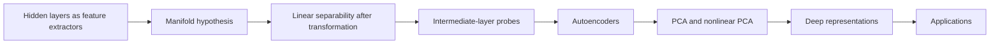
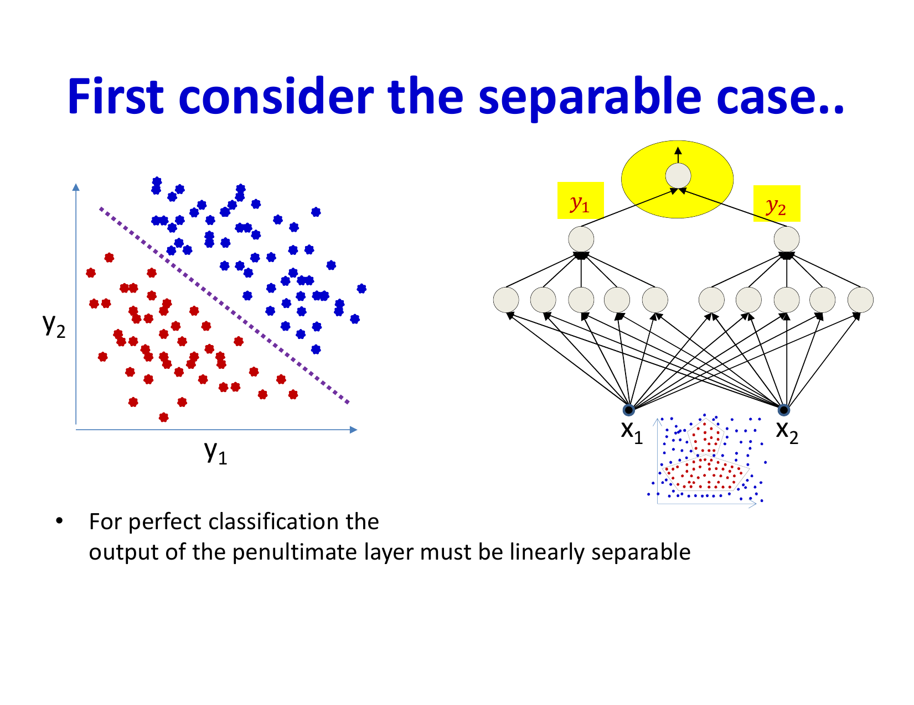
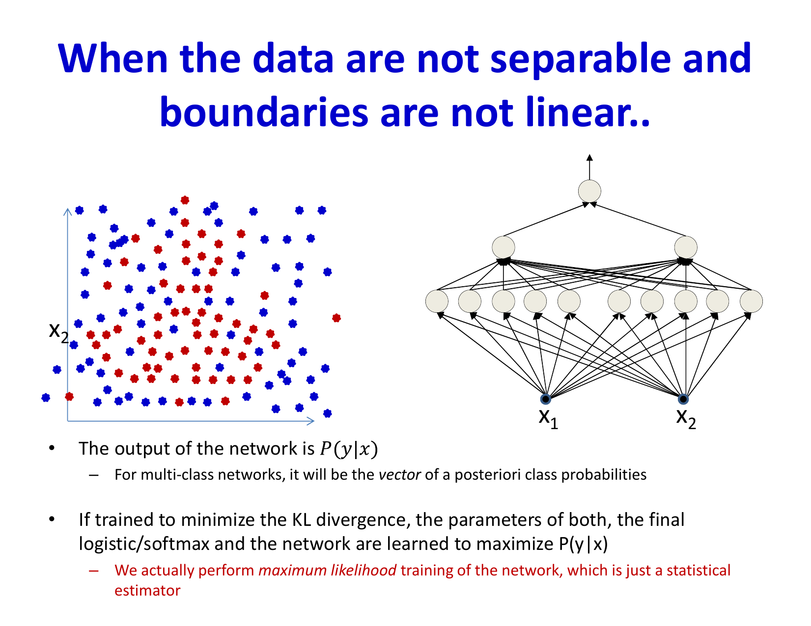
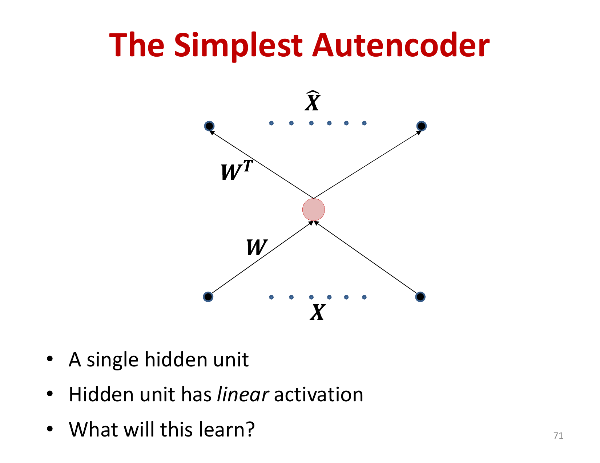
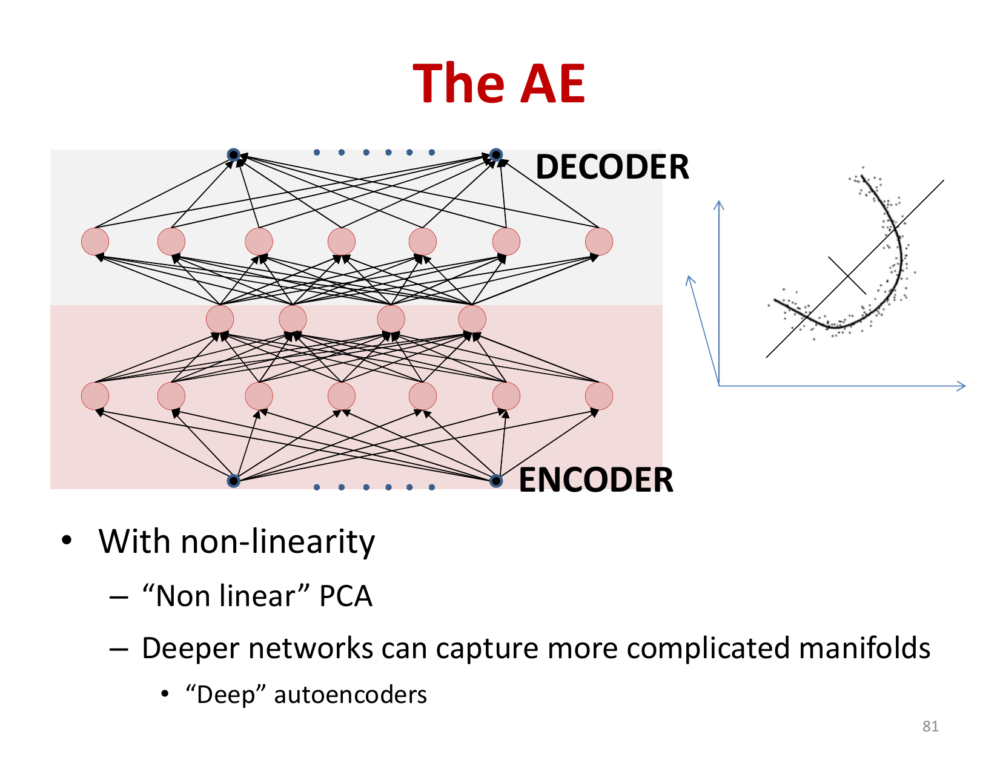
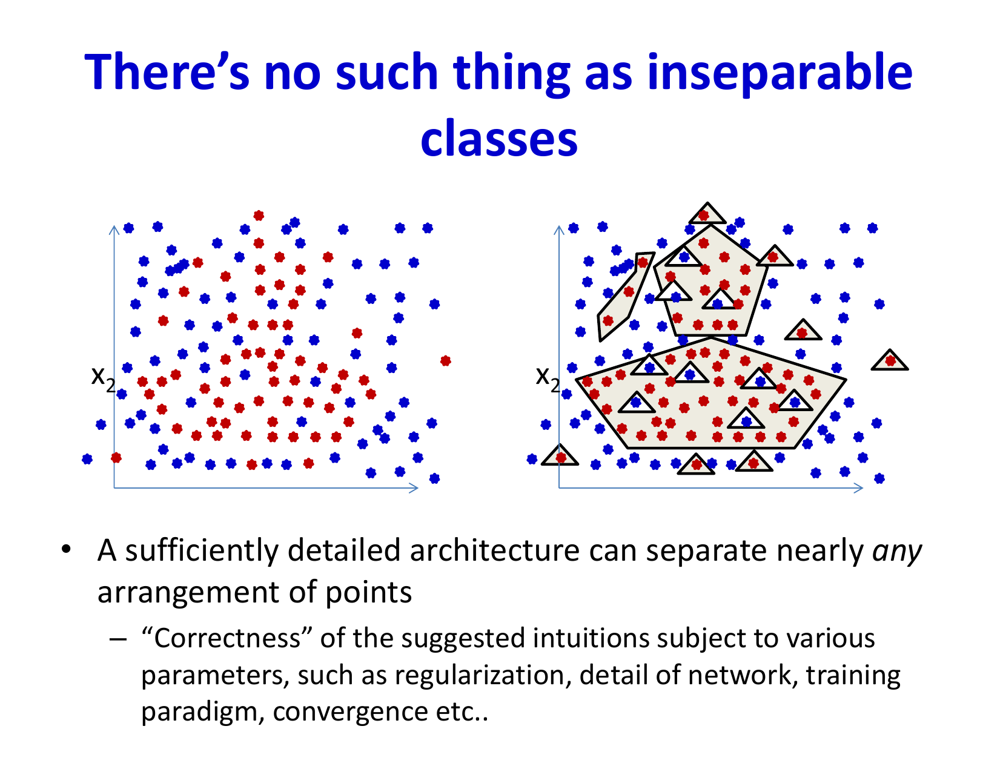

# Lecture 20: Representation Learning

This lecture explores what neural networks actually learn internally. We examine how networks learn to transform data into linearly separable features, understand the role of intermediate layers as feature extractors, and introduce autoencoders as a framework for unsupervised representation learning.

## Visual Roadmap



## At a Glance

| Representation idea | Core view | Why it matters |
|---|---|---|
| Hidden layers | Learned feature transforms | They make hard problems more linearly separable |
| Manifold hypothesis | Data lives on lower-dimensional structure | Explains why deep transforms can simplify geometry |
| Linear probe view | Test each layer with a simple classifier | Makes internal representations measurable |
| Autoencoder | Learn to reconstruct via a bottleneck | Unsupervised feature learning |
| PCA vs nonlinear AE | Linear vs nonlinear compression | Shows how depth expands representation power |

## The Role of Hidden Layers: Feature Extraction

A fundamental insight about classification neural networks is that they perform two distinct tasks:

1. **Feature Extraction** (all layers except the last): Transform the input space so that classes become (nearly) linearly separable
2. **Linear Classification** (final layer): Apply a linear classifier on the extracted features

When data are not linearly separable in input space, the network cannot learn a linear decision boundary. However, a sufficiently complex network can transform the input into a new space where the classes become linearly separable.

```text
Transformed features = f_(feature)(x)
```
```text
Output probabilities = sigma(W^T f_(feature)(x) + b)
```



## The Manifold Hypothesis

The manifold hypothesis suggests that high-dimensional data typically lies on a low-dimensional manifold. For separable classes, the manifold hypothesis implies that classes are linearly separable on a non-linear manifold embedded in the input space.

Each layer of the network progressively "straightens" this manifold:
- **Early layers**: Detect low-level features and begin manifold straightening
- **Middle layers**: Combine features to build more abstract representations
- **Late layers**: Nearly linearize the data
- **Final layer**: Applies linear classification to the linearized features

This suggests that networks learn a hierarchy of increasingly abstract representations.

## Locality, Smooth Interpolation, and Why Features Help

The beginning of the slide deck motivates representation learning with a very practical inductive bias: small changes in the input should usually cause small changes in the output. If tiny perturbations forced the learned function to change wildly everywhere, we would need impossible amounts of data to train reliable models.

That is why "local" reasoning matters:

- nearby examples should often share labels or similar outputs
- interpolation between similar examples should usually be smooth
- useful hidden layers should turn hard global structure into simpler local structure

In the trivial linear case, smooth interpolation is easy. The interesting case is when the data are not linearly separable in input space. Then hidden layers act as learned coordinate changes that make local neighborhoods more class-consistent.

## Understanding Hidden Layer Outputs

A key way to understand what intermediate layers learn is to attach linear classifiers at various depths and evaluate their accuracy. Empirical observations show:

- Early layers alone achieve moderate classification accuracy
- Each subsequent layer increases accuracy significantly
- By the penultimate layer, accuracy approaches the final network's performance

This demonstrates that increasingly discriminative information is extracted as data flows through the network.

## Logistic Regression as a Model

The final layer of a classification network with sigmoid/softmax activation computes posterior class probabilities:

```text
P(y = 1 | x) = sigma(w^T x + b) = (1) / (1 + e^(-(w^T x + b)))
```

When training with cross-entropy loss, the network performs maximum likelihood estimation:

```text
MLE = argmin_(theta) -sum_i log P(y_i | x_i; theta)
```

This is equivalent to minimizing KL divergence between the empirical and predicted label distributions. So classification networks are probabilistic models for the conditional distribution `P(y | x)`, not for the class-conditional density `P(x | y)`.

## Intermediate Layers as Feature Detectors

Each neuron in intermediate layers acts as a feature detector. A single neuron computes:

```text
h = sigma(w^T x + b)
```

The weights form a "template" that fires when the input matches its pattern. This is fundamentally a correlation filter: the neuron fires strongly when the input is highly correlated with the weight vector.

In early layers:
- Individual filters detect low-level patterns (edges, corners, textures in images)
- These patterns can be directly visualized and understood

In deeper layers:
- Filters detect increasingly complex, semantic features
- Direct visualization becomes less intuitive
- The features are more abstract and task-specific

Another way to say this is that neurons behave like learned correlation detectors. They fire not because a single raw pixel or scalar matters in isolation, but because the input aligns with a pattern that the network has discovered is predictive.

## Autoencoders: Unsupervised Feature Learning

An autoencoder is a neural network trained to predict its own input. The architecture consists of:

**Encoder**: Transforms input to a lower-dimensional latent representation
```text
z = f_(encoder)(x)
```

**Decoder**: Reconstructs the input from the latent representation
```text
x_hat = f_(decoder)(z)
```

**Training objective**: Minimize reconstruction error
```text
L = ||x - x_hat||_2^2 = ||x - f_(decoder)(f_(encoder)(x))||_2^2
```



## The Simplest Autoencoder: Linear PCA

The simplest autoencoder has:
- Linear activation functions throughout
- Single hidden layer with dimensionality `d` smaller than the input dimensionality

With mean-squared reconstruction loss, a linear undercomplete autoencoder learns the same **principal subspace** as PCA. If weights are tied or an orthonormal basis is chosen, the encoder/decoder can be written in the familiar PCA form. More generally, the exact weight matrices need not be identical to the canonical PCA projection matrix even though the recovered subspace is the same.

Any input gets mapped to a low-dimensional code, and the reconstruction lies in the learned principal subspace.

```text
Encoder output lies in R^d
```
```text
Decoder output lies in the principal subspace of the input space
```



## Non-linear Autoencoders: Non-linear PCA

When hidden layers have non-linear activations (ReLU, tanh, sigmoid), the autoencoder can perform a **non-linear** dimensionality reduction:

- The decoder learns a non-linear manifold that best fits the training data
- Varying the latent representation moves along this learned manifold
- Deeper networks can capture increasingly complex, twisted manifolds

The decoder maps latent codes onto a learned reconstruction manifold, but unlike a VAE it does **not** enforce that arbitrary latent points are sampled from a well-behaved prior. So an ordinary autoencoder is useful for representation learning, yet it is not automatically a reliable generative model.



## The Decoder as a Generative Dictionary

The decoder can be viewed as a source-specific dictionary:

```text
x_hat = D * z
```

where `D` is the learned decoder and `z` is the latent code.

Given a latent vector `z` that lies in a region learned during training, the decoder reconstructs data consistent with that region. This makes the decoder useful for:

- **Controlled synthesis**: Generate reconstructions or interpolations near training-supported codes
- **Completion**: Fill in missing data
- **Signal separation**: Learn separate dictionaries for different sources



## Deep Autoencoders

Deeper autoencoders with bottleneck architectures can learn increasingly sophisticated representations:

```
Input → Large → Medium → Small (bottleneck) → Medium → Large → Output
```

Each layer progressively compresses information toward the bottleneck, then reconstructs. The bottleneck layer learns a compact representation that captures the essential structure of the data.

Training a very deep autoencoder can be challenging due to vanishing gradients and requires careful initialization and regularization.

## Applications: Audio Source Separation

A practical application demonstrates the power of dictionary-based autoencoders. To separate mixed audio (e.g., guitar + drums):

1. **Train autoencoders** on spectrograms of each source separately
2. **Learn source-specific dictionaries** (decoders specialized for each source)
3. **Model mixed signal** as a sum of transformed latent codes:
   ```text
X(f,t) = D_1(z_1(f,t)) + D_2(z_2(f,t))
```
4. **Optimize latent codes** `z_1, z_2` to minimize reconstruction error:
   ```text
min_(z_1, z_2) ||X - D_1(z_1) - D_2(z_2)||_2^2
```
5. **Extract sources** by evaluating `D_1(z_1)` and `D_2(z_2)`

This approach works because each dictionary has learned to efficiently represent only its source type, and the optimization naturally discovers which dictionary should explain which parts of the mixture.

## Reconstruction vs. Generative Properties

A critical distinction:

- **Reconstruction**: An autoencoder trained to minimize reconstruction loss will reconstruct inputs to lie on the learned manifold, but may not generalize well beyond training data configurations
- **Generation**: The decoder can generate novel points on the learned manifold, but these may not correspond to any actual data

For true generative modeling with explicit sampling semantics, more sophisticated approaches like VAEs and GANs are needed. Plain autoencoders provide the geometric intuition, but not a complete probabilistic story.

## Key Takeaways

- Classification networks learn to transform inputs into linearly separable features
- The final layer applies a linear classifier to these features
- Training with cross-entropy loss is equivalent to maximum likelihood estimation
- Intermediate layers serve as feature detectors, with neurons acting as correlation filters
- Linear autoencoders perform PCA, extracting the principal subspace
- Non-linear autoencoders perform non-linear PCA, learning low-dimensional manifolds
- The decoder acts as a generative dictionary that can compose data similar to the training distribution
- Deep autoencoders can learn increasingly sophisticated hierarchical representations
- Autoencoders have practical applications in unsupervised learning, source separation, and data compression

## Slide Coverage Checklist

These bullets mirror the source slide deck and make the summary concept coverage explicit.

- function learning from finite samples and locality assumptions
- trivial linear case and smooth interpolation intuition
- non-linearly separable 1D example
- why tiny data perturbations should not rewrite the whole function
- local windows and neighborhood-based reasoning
- hidden layers as learned feature transforms
- manifold hypothesis
- layerwise probing of learned representations
- logistic regression / probabilistic interpretation of final layer
- neurons as correlation-based feature detectors
- autoencoder objective and bottleneck
- linear autoencoder and PCA subspace
- non-linear autoencoder as manifold learner
- decoder as dictionary / source model
- source separation example
- reconstruction vs generative use
