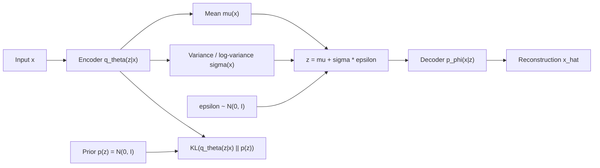
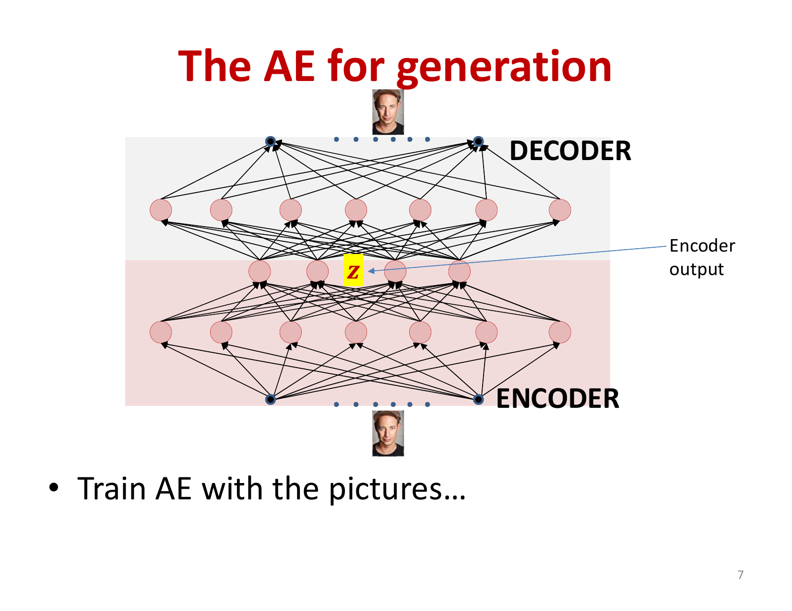
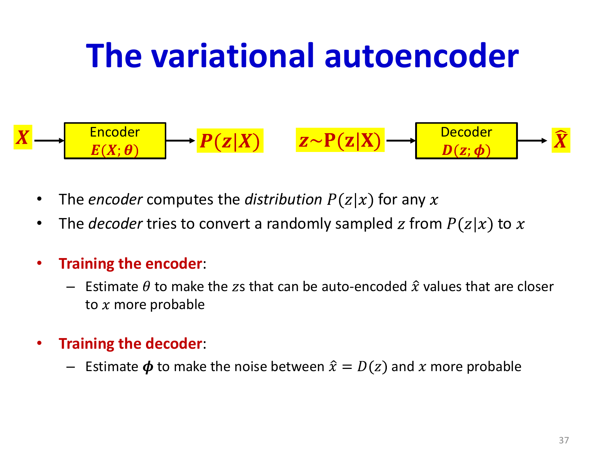
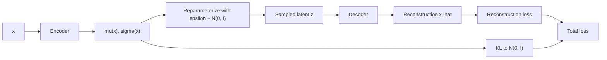
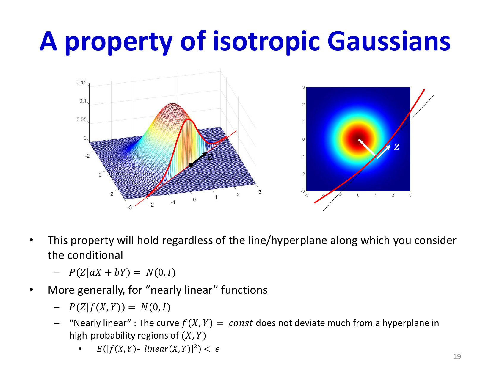

# Lecture 21: Variational Autoencoders

Variational Autoencoders (VAEs) turn the autoencoder into a probabilistic generative model. The central idea is simple: instead of learning an arbitrary latent code that only works for reconstruction, force the latent space to follow a known distribution so we can sample from it and generate new data.

## Visual Roadmap



## At a Glance

| Component | Meaning | Why it is there |
|---|---|---|
| Prior `p(z)` | Usually `N(0, I)` | Gives a known latent distribution for generation |
| Encoder `q_theta(z | x)` | Approximate posterior over latent codes | Tells us which latent codes could have produced an input |
| Decoder `p_phi(x | z)` | Generative model | Turns latent samples into data |
| Reconstruction term | Make decoded samples look like the input | Keeps the model faithful to data |
| KL term | Push `q_theta(z | x)` toward the prior | Makes latent space smooth and sampleable |

## Why a Plain Autoencoder Is Not Enough for Generation

An ordinary autoencoder can learn a useful low-dimensional manifold, but it does not tell us which latent codes are valid. If we pick a random point in latent space and feed it to the decoder, the output may be meaningless because the decoder was only trained on the latent codes the encoder happened to produce.

The lecture's motivating question is:

> How do we choose decoder inputs that are typical of the class we want to generate?

VAEs answer this by imposing a distribution on the latent representation.



## The Data-Manifold View

The slides motivate VAEs geometrically. The working hypothesis is that natural data such as faces do not fill the full pixel space. They lie near a curved, lower-dimensional manifold embedded in that high-dimensional space.

That creates two separate problems for generation:

- characterize where the manifold is
- choose latent points that land on meaningful parts of it

A plain autoencoder addresses the first problem reasonably well, but not the second. It learns how to decode latent codes it has seen during training, yet it gives no clean rule for which unseen codes should be considered valid samples.

## Generative Story

The VAE assumes data are generated as follows:

1. Sample a latent code from a simple prior:
   ```text
   z ~ p(z) = N(0, I)
   ```
2. Decode that code into a data point:
   ```text
   x ~ p_phi(x | z)
   ```

For intuition, think of the decoder as a learned generative dictionary. A sampled latent vector chooses where on the data manifold to generate from.

## Encoder and Decoder Roles

| Network | Input | Output | Role during training | Role after training |
|---|---|---|---|---|
| Encoder | `x` | Parameters of `q_theta(z | x)` | Approximates the latent distribution that could explain `x` | Optional; useful for inference / representation |
| Decoder | `z` | Parameters of `p_phi(x | z)` or reconstruction | Learns how latent states generate data | This is the actual generative model |

The slides make this distinction explicit: the decoder is the real generative model, while the encoder is primarily needed to train it.


## Approximate Posterior, Not a Single Code

For a given input `x`, there may be many plausible latent values `z` that could explain it. So the encoder does not output a single vector. It outputs a distribution:

```text
q_theta(z | x) = N(z; mu_theta(x), Sigma_theta(x))
```

Usually, implementations predict:

- `mu_theta(x)`
- diagonal variance terms, often via `log sigma_theta^2(x)`

This is the "variational" part: instead of solving the exact posterior, we learn an approximation.

## Training Objective

The VAE loss has two coupled goals:

### 1. Reconstruction

Sample `z` from the encoder distribution and make the decoder reconstruct the input well.

For a Gaussian decoder, this corresponds to a squared-error-like term:

```text
L_recon proportional to || x - D(z; phi) ||^2
```

### 2. Latent Regularization

Keep the encoder distribution close to the prior:

```text
D_KL(q_theta(z | x) || N(0, I))
```

For a Gaussian posterior, the KL has closed form:

```text
D_KL = 0.5 * [tr(Sigma_theta(x))
             + mu_theta(x)^T mu_theta(x)
             - d
             - log |Sigma_theta(x)|]
```

So the total loss is:

```text
L(x) = L_recon(x) + D_KL(q_theta(z | x) || p(z))
```

Equivalent view: maximizing the ELBO. Even if the slides present the loss directly, this is the standard interpretation of the same tradeoff.

## Loss Intuition

| If this term dominates | What happens |
|---|---|
| Reconstruction term too strong | Behaves more like a regular autoencoder; latent space may become irregular |
| KL term too strong | Latents collapse toward the prior and the decoder may ignore `z` |
| Balanced objective | Smooth latent space plus useful reconstructions and valid sampling |

Important correction: the KL term does **not** automatically prevent posterior collapse. It creates useful regularization, but if over-weighted it can contribute to collapse by making all posterior distributions too similar to the prior.



## The Reparameterization Trick

Sampling is not directly differentiable, so we rewrite the random variable as:

```text
z = mu_theta(x) + Sigma_theta(x)^(1/2) * epsilon,
epsilon ~ N(0, I)
```

This separates:

- deterministic dependence on model parameters
- randomness from a parameter-free noise source

That makes backpropagation possible.

## Training Pipeline



## Why the Prior Is Usually Gaussian

The course uses an isotropic Gaussian prior because it gives:

- easy sampling
- analytic KL divergence
- a smooth, symmetric latent space

The goal is not that every individual datapoint maps to exactly the same Gaussian, but that the collection of posterior distributions stays close enough to the prior that random sampling remains meaningful.

## Why Isotropic Gaussians Are So Convenient

The lecture spends extra time on a Gaussian geometry fact that is worth keeping. If `z ~ N(0, I)`, then affine projections and affine slices behave cleanly: the resulting distributions remain Gaussian, and the unconstrained directions stay spherically symmetric inside the relevant subspace.

That matters because a decoder often maps latent variables through locally linear transformations. Using an isotropic Gaussian prior means those transformations stay mathematically manageable and the latent geometry is easy to reason about.

In less formal terms:

- linear projections of an isotropic Gaussian are still Gaussian
- conditioning on an approximately affine constraint still yields a well-behaved Gaussian distribution on the remaining degrees of freedom

This is one of the reasons the standard normal prior is so attractive in VAEs.



## What the Latent Space Buys You

A good VAE latent space is:

- **sampleable**: draw `z ~ N(0, I)` and decode
- **smooth**: nearby latent codes decode to similar outputs
- **structured**: interpolation between codes often yields plausible intermediate examples

This is why VAEs are useful for:

- generation
- interpolation
- conditional generation
- representation learning

## AE vs VAE

| Aspect | Autoencoder | Variational Autoencoder |
|---|---|---|
| Latent representation | Arbitrary deterministic code | Distribution `q_theta(z | x)` |
| Can sample from prior? | Not reliably | Yes |
| Objective | Reconstruction only | Reconstruction + KL regularization |
| Decoder role | Reconstruction map | Probabilistic generative model |
| Typical outputs | Sharp reconstructions on seen-like inputs | Smoother latent space, better generation |

## Practical Reading Shortcut

When you read any VAE derivation, keep this mapping in mind:

- `encoder` means inference network
- `decoder` means generative network
- `reconstruction term` teaches fidelity
- `KL term` teaches latent-space geometry
- `reparameterization trick` makes the sampling path differentiable

## Key Takeaways

- A VAE is an autoencoder with a probabilistic latent space.
- The decoder is the actual generative model; the encoder mainly supports inference and training.
- The encoder predicts a distribution `q_theta(z | x)` rather than a single code.
- Training balances reconstruction quality against closeness to the prior.
- The KL term makes latent sampling meaningful, but too much KL pressure can collapse the latent variables.
- The reparameterization trick is what makes VAE training practical with backpropagation.
- Once trained, generation is simple: sample `z ~ N(0, I)` and run the decoder.

## Slide Coverage Checklist

These bullets mirror the source slide deck and make the summary concept coverage explicit.

- data manifold picture for generation
- why ordinary autoencoders do not guarantee sampleable latent codes
- hidden representation as a distribution, not a single point
- encoder outputting posterior parameters
- decoder mapping latent samples back to data
- prior constraint on latent variables
- Gaussian prior and isotropic-Gaussian properties
- affine projection property of isotropic Gaussians
- KL divergence to the prior
- reconstruction term vs latent regularization term
- reparameterization trick
- training with statistical constraints
- latent interpolation and sampling use cases
