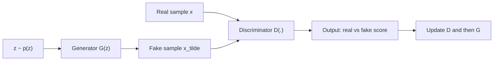
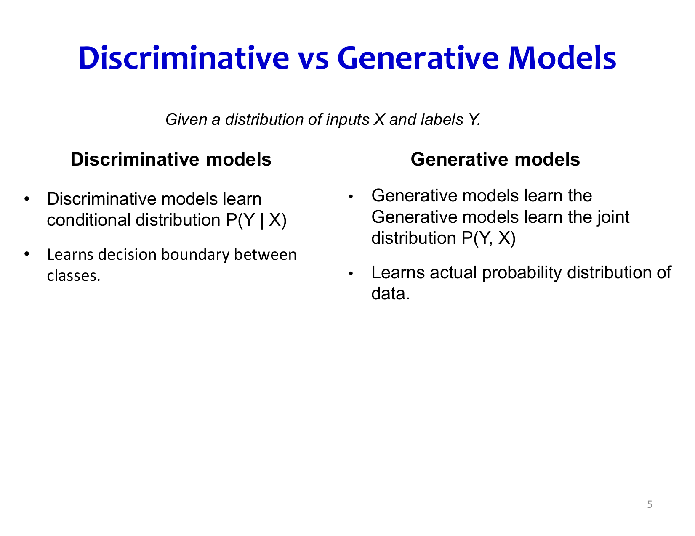
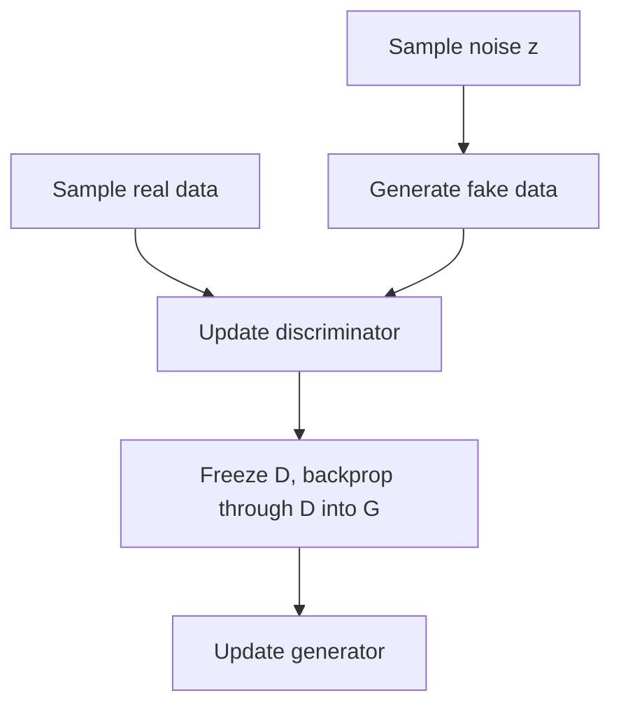
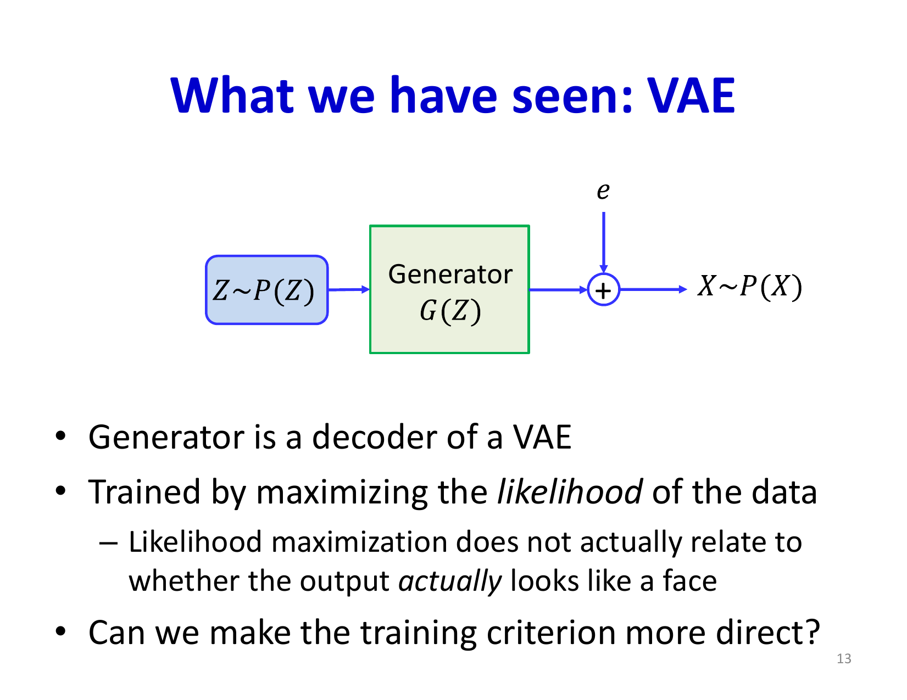
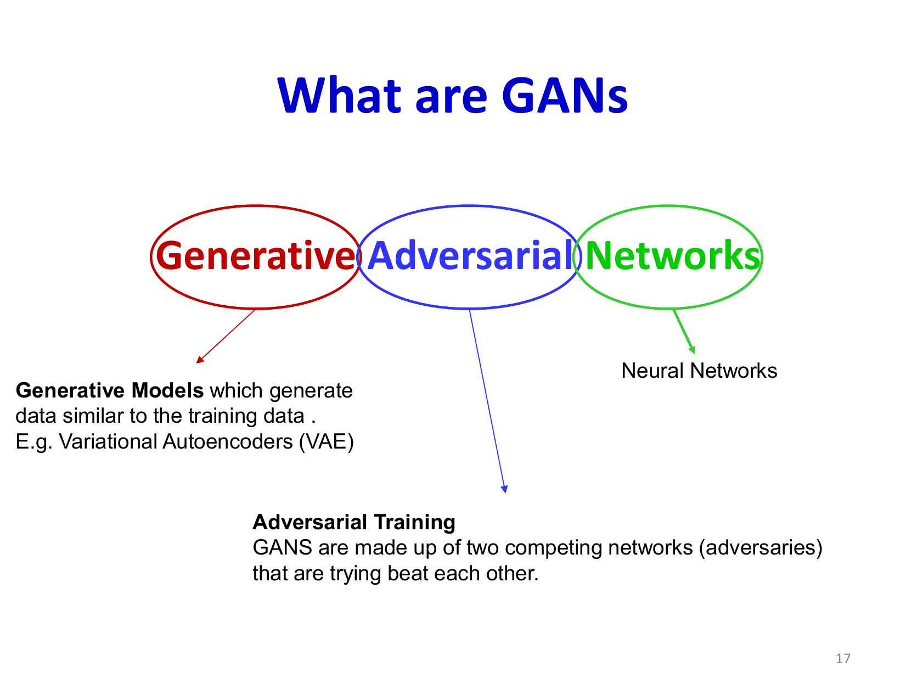

# Lecture 22: Generative Adversarial Networks Part 1

Generative Adversarial Networks (GANs) replace explicit likelihood modeling with a game between two networks. A generator tries to produce realistic samples; a discriminator tries to tell real and generated samples apart. The generator improves only through the discriminator's feedback.

## Visual Roadmap



## At a Glance

| Concept | Meaning | Why it matters |
|---|---|---|
| Discriminative model | Learns `P(Y | X)` | Good for classification, not generation |
| Generative model | Learns data distribution structure | Can generate or model data itself |
| Explicit model | Gives a tractable density or likelihood | Easier to score samples probabilistically |
| Implicit model | Only needs to generate samples | Fits the GAN setting |
| Generator | Maps latent noise to synthetic data | Produces candidate samples |
| Discriminator | Distinguishes real from fake | Supplies the training signal |

## From Discriminative to Generative Modeling

The slides begin by contrasting two questions:

- **Discriminative**: given `X`, what is the label `Y`?
- **Generative**: what distribution produced the data in the first place?

That is why GANs are a major conceptual shift. They do not just separate classes; they try to learn the data distribution itself.

## Conditional vs Joint / Marginal Modeling

The slides also place GANs in the broader probabilistic landscape:

- a classifier usually models `P(y | x)`
- a generative model may try to model `P(x)` directly
- or it may model a joint distribution such as `P(x, y)` and derive conditionals from it

Basic GANs are aimed at sampling from `P(x)`. Conditional GANs extend this idea to `P(x | c)`, where `c` may be a class label, text prompt, or some other conditioning signal.

## Explicit vs Implicit Generative Models

GANs are **implicit** generative models:

- They can generate `x ~ P_model`
- They do **not** usually provide an exact tractable likelihood `P_model(x)`

This contrasts with models like VAEs, which are built around explicit probabilistic structure and likelihood-style objectives.

## Why VAEs Often Look Blurrier Than GANs

The comparison to VAEs in the slides is not just historical. With common decoder choices, a VAE is often rewarded for matching average reconstruction statistics. If several outputs are plausible, that can encourage a smoother, averaged sample.

GANs optimize realism differently. The discriminator rewards outputs that look like valid samples from the data distribution, so the generator is pushed toward sharper, more realistic-looking images. The tradeoff is that this adversarial signal is harder to optimize and less stable.

## The GAN Setup

### Generator

The generator transforms latent noise into a sample:

```text
x_tilde = G(z; theta_g),    z ~ p(z)
```

### Discriminator

The discriminator outputs the probability that a sample is real:

```text
D(x; theta_d) = P(real | x)
```

The discriminator is just a binary classifier, but it is trained on a moving target because the generator keeps changing.



## The Minimax Objective

The original GAN objective is:

```text
min over G, max over D:
V(D, G) = E_(x ~ P_data)[log D(x)] + E_(z ~ p(z))[log(1 - D(G(z)))]
```

Interpretation:

- The discriminator wants high scores on real samples and low scores on generated ones.
- The generator wants generated samples to be scored as real.

In practice, one often trains the generator with a non-saturating variant, maximizing `log D(G(z))`, because it gives stronger gradients early in training.

## Training Loop



## The Optimal Discriminator

For a fixed generator, the optimal discriminator is the Bayesian classifier:

```text
D*(x) = P_data(x) / (P_data(x) + P_G(x))
```

This formula is worth memorizing because it explains the whole game:

- if a point is much more likely under real data, classify it as real
- if it is much more likely under generated data, classify it as fake
- if the two distributions match, output `0.5`

## What the Generator Is Really Minimizing

Under the idealized analysis with an optimal discriminator, the generator minimizes the Jensen-Shannon divergence between real and generated distributions:

```text
JS(P_data || P_G)
```

This is the theoretical justification for GANs.



## Important Practical Correction

The theoretical JS-divergence story is elegant, but it does **not** mean GANs always get useful gradients in practice. In fact, when the real and generated distributions have little or no overlap, the discriminator can become too confident and the generator can receive almost no local guidance.

That is why the next lecture introduces mode collapse, vanishing gradients, and Wasserstein GANs.

## Nash Equilibrium Intuition

The ideal stationary point is:

- `P_G = P_data`
- the discriminator cannot tell them apart
- `D(x) = 0.5` everywhere

At that point, generated and real samples are indistinguishable under the discriminator.

The difficulty is not defining this equilibrium. The difficulty is reaching it with alternating gradient updates.

## Core Failure Modes Preview

Even before the stabilization lecture, you should already expect three problems:

| Failure mode | What it looks like | Why it happens |
|---|---|---|
| Mode collapse | Generator outputs very limited variety | Generator exploits the current discriminator instead of covering the full distribution |
| Vanishing gradients | Generator stops improving | Discriminator becomes too confident |
| Oscillation | Training never settles | Each player's update changes the other player's objective |

## GANs vs VAEs

| Aspect | VAE | GAN |
|---|---|---|
| Training signal | Reconstruction + KL | Adversarial feedback |
| Density modeling | More explicit probabilistic structure | Implicit model |
| Sample sharpness | Often blurrier | Often sharper |
| Coverage of modes | Usually better | Can collapse onto few modes |
| Inference network | Encoder available | Not in the basic GAN |



## Why GANs Were Exciting

The generator is not trained to maximize per-pixel likelihood or squared-error reconstruction. Instead, it is trained to produce samples that look realistic to a learned critic. That makes the learning objective much closer to perceptual realism, especially for images.

## Common Variants Mentioned as Follow-Ons

- **DCGAN**: convolutional architectures and normalization for more stable image generation
- **Conditional GAN**: generation conditioned on labels, text, or other side information
- **WGAN**: replaces JS-based adversarial objective with Wasserstein distance
- **CycleGAN**: learns domain translation without paired examples

These do not change the basic game structure; they change how the game is parameterized or stabilized.

## Key Takeaways

- GANs are implicit generative models trained through an adversarial game.
- The generator maps latent noise to data; the discriminator distinguishes real from fake.
- The optimal discriminator has a closed-form Bayesian solution.
- In the idealized analysis, GAN training minimizes Jensen-Shannon divergence.
- In practice, that divergence view does not guarantee good gradients during optimization.
- GANs often generate sharper samples than VAEs, but they are much harder to train reliably.

## Slide Coverage Checklist

These bullets mirror the source slide deck and make the summary concept coverage explicit.

- discriminative vs generative modeling
- conditional vs joint / marginal modeling
- explicit-density vs implicit-sample models
- VAE recap and why sample quality can be blurry
- GAN setup: generator and discriminator
- adversarial min-max objective
- alternating training loop
- optimal discriminator form
- JS-divergence interpretation under ideal assumptions
- non-saturating generator objective
- Nash equilibrium intuition
- GANs vs VAEs as complementary generative families
