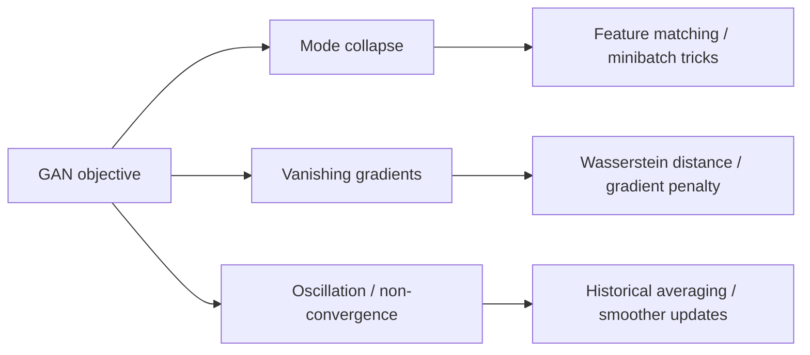
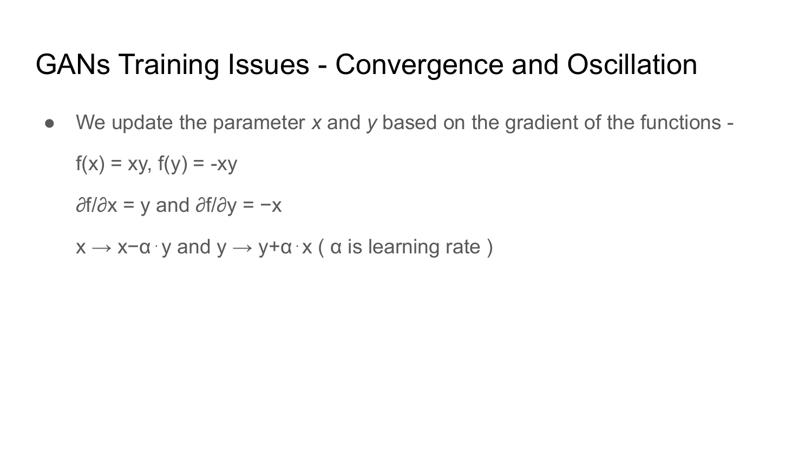
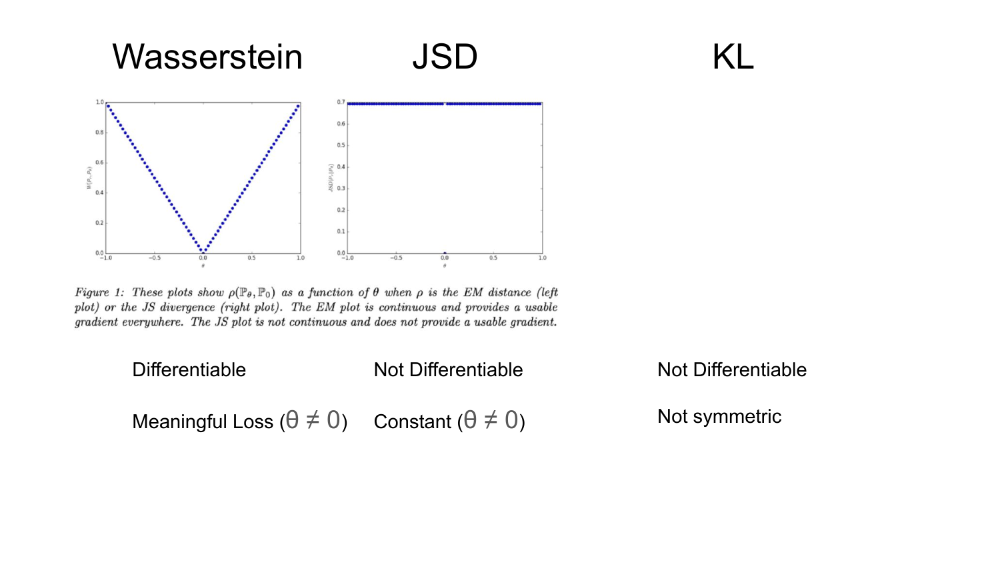

# Lecture 23: Generative Adversarial Networks Part 2

This lecture is about why GANs are hard to train and what people do about it. The important shift is from clean minimax theory to messy optimization reality: gradients vanish, generators collapse onto a few modes, and alternating updates can cycle rather than converge.

## Visual Roadmap



## Failure Modes at a Glance

| Problem | What you observe | Root cause | Typical remedies |
|---|---|---|---|
| Mode collapse | Many samples look nearly the same | Generator exploits a narrow region that fools current discriminator | Feature matching, minibatch discrimination, conditional structure |
| Vanishing gradients | Generator stops learning | Discriminator becomes too confident, especially with non-overlapping supports | Non-saturating loss, WGAN, gradient penalty |
| Oscillation | Training metrics cycle without settling | Two-player game dynamics | Update balancing, regularization, smoother objectives |

## 1. Mode Collapse

The generator can learn to produce only a small subset of the data distribution.

Typical symptom:

- you ask for many samples
- they all look like slight variations of the same prototype

Why it happens:

- the generator only needs to fool the **current** discriminator
- if one narrow family of samples works, the generator has no incentive to cover the full data distribution

This is the central "quality vs diversity" failure mode in GANs.

## 2. Vanishing Gradients

If the discriminator becomes too good, generated samples get scores very close to zero. Then the generator receives weak or uninformative gradients.

This is especially bad when real and generated distributions occupy nearly disjoint regions of space. In that regime:

- KL divergence can be pathological
- JS divergence can flatten
- the generator may know it is wrong without knowing *how to move closer*

## 3. Oscillation and Game Dynamics

GAN training is not ordinary minimization. It is a two-player minimax game:

```text
min over G, max over D of L(G, D)
```

So the update that helps one player changes the objective surface of the other. That is why trajectories can rotate or cycle around equilibria rather than settle into them.

## Stabilization Techniques

These methods try to improve the signal the generator receives, reduce collapse, or smooth the adversarial game.

### Feature Matching

Instead of training the generator only to fool the discriminator's final scalar output, use intermediate discriminator features:

- compute an internal feature representation for real samples
- compute the same for generated samples
- train the generator to match those feature statistics

Benefit:

- richer training signal
- encourages matching broader structure, not just boundary exploits

### Minibatch Discrimination

Make the discriminator examine relationships between samples in a batch, not just each sample independently.

Why it helps:

- a batch of nearly identical samples becomes easy to flag as fake
- discourages collapse to one prototype

### Historical Averaging

Add a penalty that keeps parameters near a moving average of previous values.

Purpose:

- reduce oscillation
- discourage abrupt adversarial swings

### Label Smoothing

Replace hard targets like `1` for real with `1 - epsilon`.

Why it helps:

- prevents the discriminator from becoming overconfident too quickly
- keeps gradients from saturating as aggressively

One-sided label smoothing is common: smooth the real labels but leave fake labels alone.

### Virtual Batch Normalization

Normalize examples using statistics from a fixed reference batch rather than the current adversarial batch alone.

Benefit:

- more stable normalization
- fewer moving-target effects during adversarial training

## Divergences: Why the Choice Matters

| Divergence / distance | Key property | Problem in GAN training |
|---|---|---|
| KL divergence | Strongly penalizes missing support | Can blow up or give poor geometry when supports differ |
| JS divergence | Symmetric and bounded | Can become locally flat when supports do not overlap |
| Wasserstein distance | Measures transport cost between distributions | Still usable when supports are disjoint; provides more informative gradients |

## Wasserstein Distance

Wasserstein distance can be interpreted as the minimum "work" needed to move probability mass from one distribution to another:

```text
W(P, Q) = inf over gamma of E_((x, y) ~ gamma)[||x - y||]
```

Its big practical advantage is geometric:

- even if distributions are far apart, it still changes smoothly with their separation
- that gives the generator a directional signal

## WGAN: From Discriminator to Critic

In Wasserstein GANs, the discriminator becomes a **critic**:

- it does not output a probability
- it outputs a score
- the score difference between real and fake estimates Wasserstein distance

But this only works if the critic is **1-Lipschitz**.

## Enforcing the Lipschitz Constraint

| Method | Idea | Drawback / advantage |
|---|---|---|
| Weight clipping | Force critic weights into `[-c, c]` | Simple but crude; can reduce capacity or destabilize training |
| Gradient penalty | Penalize `|| grad_x D(x) ||_2` deviating from 1 | More stable and usually preferred |

Gradient penalty adds:

```text
L_GP = lambda * E_(x_hat)[( || grad_(x_hat) D(x_hat) ||_2 - 1 )^2]
```

typically on points interpolated between real and generated samples.



## Architectural Variants

These variants adapt the adversarial training idea to different data settings and control requirements.

### Conditional GANs

Condition both generator and discriminator on side information such as class labels.

Use when:

- you want control over which kind of sample gets generated
- you need class-conditional or text-conditional synthesis

### CycleGAN

Learns mappings between two domains without paired training examples.

Key idea:

- generator `G: X -> Y`
- generator `F: Y -> X`
- cycle consistency forces `F(G(x)) ~= x`

This lets the model learn domain transfer from unpaired data.



### Laplacian Pyramid GAN

Generate images coarse-to-fine across multiple resolutions.

Why this helps:

- easier optimization at low resolution
- detail added progressively

### BiGAN

Adds an encoder to the adversarial framework.

This partly closes the gap between VAEs and GANs:

- GAN-like sample quality
- encoder-like latent inference

## Comparing Two Common Style-Transfer Ideas

| Method | Data requirement | Strength | Limitation |
|---|---|---|---|
| Neural style transfer | One content image + one style image | Fine-grained artistic control | Optimization-heavy; per-example process |
| CycleGAN | Two unpaired domains | Learns a reusable feedforward translator | Less direct control over one specific content-style pair |

## Practical Reading Shortcut

When studying GAN stabilization papers, sort methods into three buckets:

1. **better generator signal**: feature matching, Wasserstein objectives
2. **stronger diversity pressure**: minibatch discrimination, conditioning
3. **smoother game dynamics**: label smoothing, averaging, regularization

That framing makes the literature much easier to organize.

## Key Takeaways

- The biggest GAN problems are mode collapse, vanishing gradients, and oscillation.
- These problems come from adversarial game dynamics, not from lack of model capacity alone.
- Feature-level objectives and minibatch-aware discriminators help fight collapse.
- Wasserstein distance gives a more useful learning signal than JS divergence when supports are far apart.
- WGAN requires a Lipschitz critic; gradient penalty is the standard practical fix.
- Conditional, cycle-consistent, and multi-scale GANs adapt the adversarial idea to different tasks.

## Slide Coverage Checklist

These bullets mirror the source slide deck and make the summary concept coverage explicit.

- GAN framework recap
- training dynamics in the adversarial game
- qualitative effects of JS divergence
- mode collapse
- vanishing gradients with an over-strong discriminator
- oscillation / non-convergence in min-max games
- feature matching
- minibatch discrimination
- historical averaging
- one-sided label smoothing
- virtual batch normalization
- KL vs JS vs Wasserstein comparison
- WGAN critic and 1-Lipschitz constraint
- weight clipping vs gradient penalty

