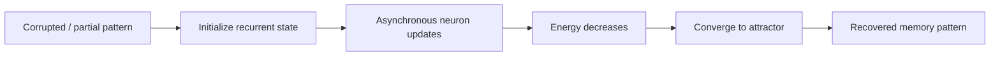
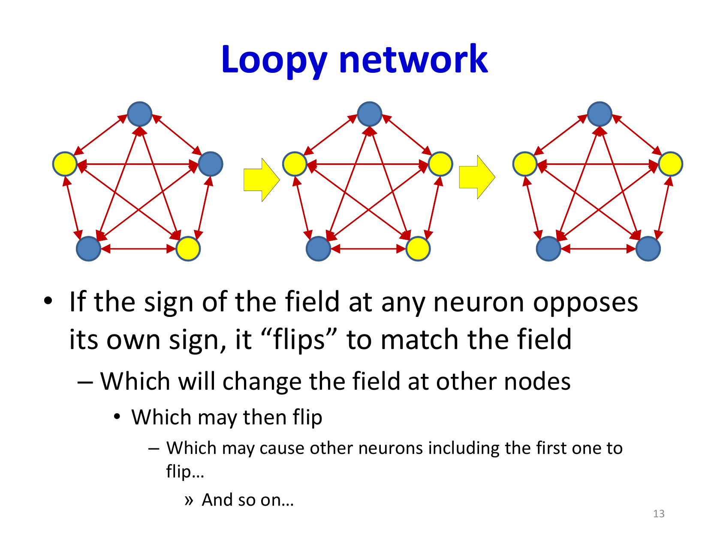
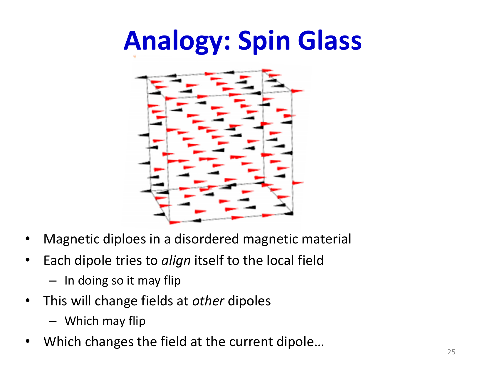
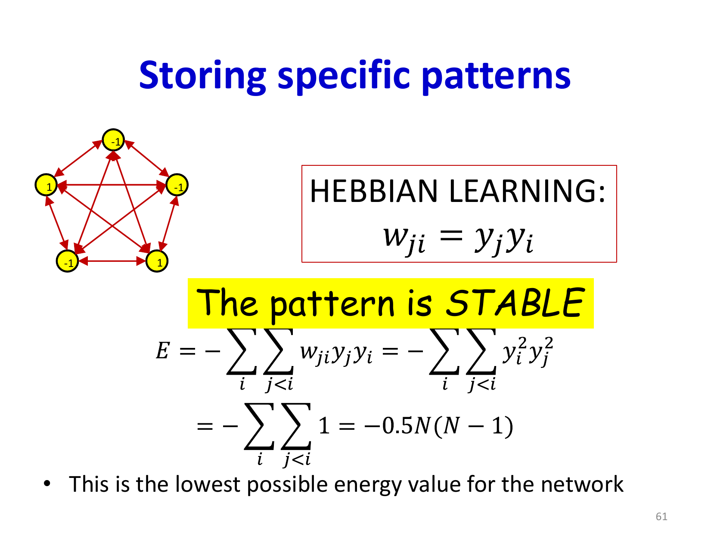
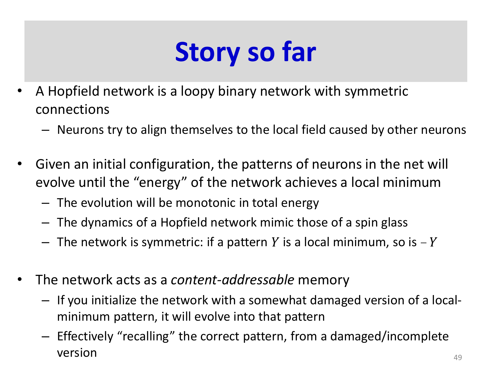
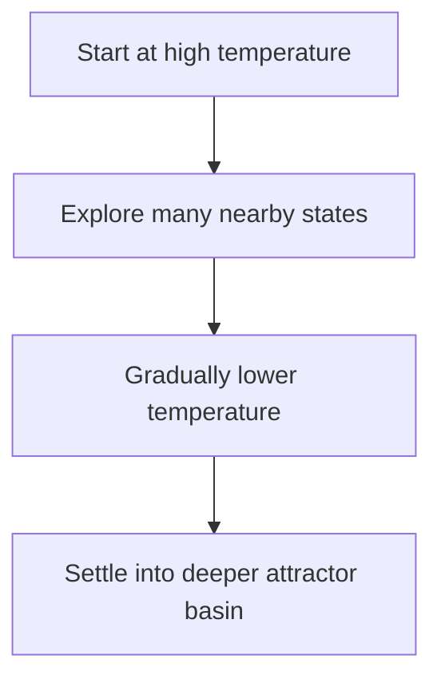

# Lecture 24: Hopfield Networks

Hopfield networks are recurrent networks with symmetric weights that act as associative memories. Instead of computing an output in one forward pass, they evolve toward low-energy stable states. If the energy landscape is designed well, those stable states correspond to stored patterns.

## Visual Roadmap



## At a Glance

| Concept | Meaning | Why it matters |
|---|---|---|
| Symmetric recurrent network | `w_ij = w_ji` | Enables energy-based analysis |
| Energy function | Scalar objective over network state | Guarantees monotonic descent under asynchronous updates |
| Attractor | Stable fixed point / basin | Encodes a memory |
| Hebbian rule | Correlation-based storage rule | Makes target patterns stationary |
| Spurious memory | Unintended stable state | Main practical limitation |

## Architecture and Update Rule

Each neuron has binary state `y_i in {-1, +1}` and receives local field:

```text
z_i = sum over j != i of w_ij * y_j + theta_i
```

The deterministic update is:

```text
y_i^(tau+1) =
    +1  if z_i > 0
    -1  if z_i < 0
    y_i^(tau)  if z_i = 0
```

The most important implementation detail is **asynchronous** updating: update one neuron at a time. That is the setting in which the classic energy descent guarantee holds.

## Why One Flip Can Trigger Others

The "loopy network" slides emphasize a simple but important point: when neuron `i` flips, every other neuron's local field changes because:

```text
z_j = sum over k != j of w_jk * y_k + theta_j
```

and `y_i` is one of the terms inside that sum. So a single correction can destabilize or stabilize several other units. This chain reaction is exactly why Hopfield inference is a dynamical process rather than one independent decision per neuron.



## Energy Function

The Hopfield energy is:

```text
E(y) = -0.5 * sum over i,j of w_ij * y_i * y_j
       - sum over i of theta_i * y_i
```

If a neuron flips in a way that agrees better with its local field, the total energy decreases.

That gives the network a clean interpretation:

- the state moves downhill in energy
- minima correspond to stable configurations
- recall becomes optimization over an energy landscape



## Why It Is a Memory Model

Hopfield networks are **content-addressable memories**:

- you do not retrieve by index
- you retrieve by starting near a stored pattern

If a noisy input lies inside the basin of attraction of a stored memory, the dynamics pull it toward the clean stored pattern.

## Noisy and Partial Pattern Completion

The associative-memory interpretation covers two closely related cases:

- **noisy completion**: many bits are wrong, but the pattern is still closer to one stored memory than to its competitors
- **partial completion**: some bits are missing or unspecified, so the network must fill them in consistently with the basin it falls into

As long as the starting state lies in the attraction basin of a stored pattern, asynchronous updates can clean up corruption and fill in missing entries. If the starting point lies near the boundary between basins, the network may converge to the wrong memory or to a spurious state instead.



## Hebbian Storage Rule

To store patterns `y^(1), ..., y^(K)`, use:

```text
w_ij = (1 / N) * sum over mu=1..K of y_i^(mu) * y_j^(mu)
```

Interpretation:

- neurons that are often active together get positive coupling
- neurons that disagree across stored patterns get negative coupling

This makes the training patterns stationary under the network dynamics, at least when interference is not too large.



## Capacity: What the Famous 0.14N Number Means

The classical result is:

- with Hebbian learning
- for random patterns
- with low probability of instability

a Hopfield net with `N` neurons can store about:

```text
0.14N to 0.15N
```

patterns reliably.

Important nuance from the slides:

- this is a **guarantee for random patterns under Hebbian learning**
- it is **not** a universal hard ceiling on every notion of storage
- some non-orthogonal pattern sets can behave better empirically
- other learning constructions can make more patterns stationary, often at the cost of many parasitic minima

## Orthogonal vs Non-Orthogonal Patterns

The lecture spends time on a subtle point: patterns that are farther apart are not always easier to recall in practice.

The reason is not that closeness is universally better, but that the detailed energy landscape matters:

- orthogonal random patterns support the classical theory
- non-orthogonal patterns can sometimes form stronger basins
- but they may also produce asymmetric recall quality and more complex interference

So the safe takeaway is:

> "0.14N random patterns" is the classical Hebbian benchmark, not the whole story of practical recall behavior.

## Spurious Memories

A major limitation is the existence of unintended stable states:

- mixtures of stored patterns
- "ghost" states
- random local minima created by interference

These are sometimes called parasitic or fake memories.

They are why merely making target patterns stationary is not enough. You also care about:

- basin size
- number of spurious minima
- robustness of recall from perturbed inputs

## Hidden or Extra Units

The lecture also points out that more elaborate constructions can increase the number of intentionally stable patterns, potentially beyond the basic Hebbian benchmark.

The tradeoff is usually:

- more storage flexibility
- but also more parasitic memories or a more delicate construction

So when reading claims about increased capacity, always ask:

- stable in what sense?
- recalled from how much corruption?
- with how many spurious attractors?

## Stochastic Updates and Temperature

A stochastic variant updates neurons with:

```text
P(y_i = 1) = 1 / (1 + exp(-z_i / T))
```

where `T` is temperature.

Interpretation:

- low `T`: close to deterministic Hopfield updates
- high `T`: more random exploration

This is useful because noise can help the network escape shallow local minima.

## Simulated Annealing View



This creates the bridge to the next lecture: once updates become stochastic and equilibrium probabilities matter, the network starts looking like a Boltzmann machine rather than a purely deterministic attractor system.

## Hopfield vs Feedforward Memory

| Property | Feedforward classifier | Hopfield network |
|---|---|---|
| Computation | One forward pass | Iterative state evolution |
| Memory style | Parametric mapping | Attractor-based associative memory |
| Robust completion | Not inherent | Core feature |
| Objective view | Usually loss minimization during training only | Energy decreases during inference dynamics |

## Key Takeaways

- Hopfield networks are symmetric recurrent systems that store memories as attractors.
- Asynchronous updates monotonically decrease an energy function.
- Hebbian learning stores patterns by correlation, making them stationary when interference is manageable.
- The classical capacity result is about `0.14N` random patterns under Hebbian learning, not an absolute universal ceiling.
- Spurious minima are the main practical failure mode.
- Adding stochasticity and temperature leads naturally toward Boltzmann-style probabilistic models.

## Slide Coverage Checklist

These bullets mirror the source slide deck and make the summary concept coverage explicit.

- loopy binary recurrent network
- local field and sign-matching flip rule
- asynchronous single-unit updates
- why one flip can change the field of others
- energy of a Hopfield net
- monotonic energy decrease under asynchronous updates
- local minima as attractors
- content-addressable memory
- noisy pattern completion
- partial observation completion
- Hebbian storage rule
- spurious minima / parasitic memories
- storage capacity intuition and the `0.14N` result
- stochastic updates, temperature, and annealing intuition
