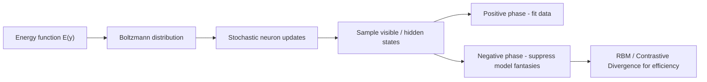
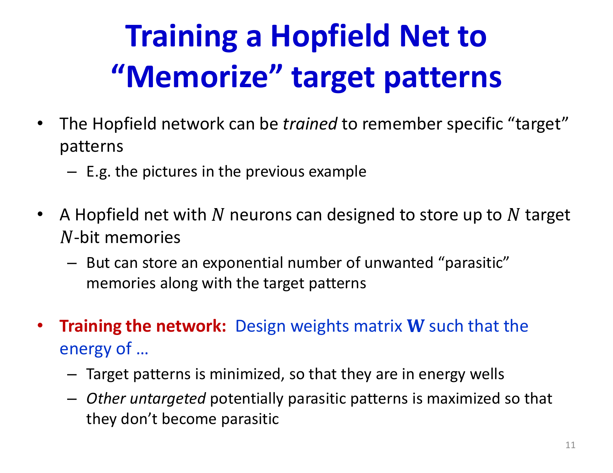
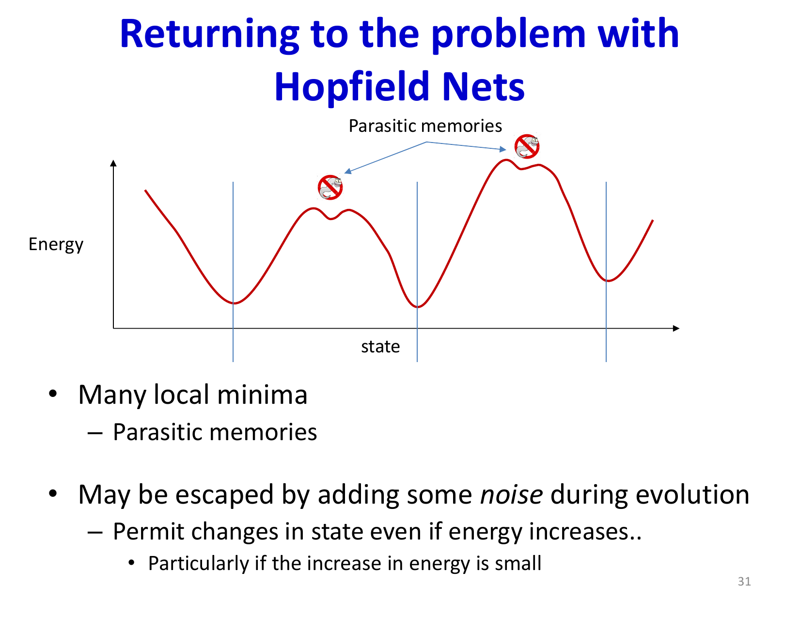
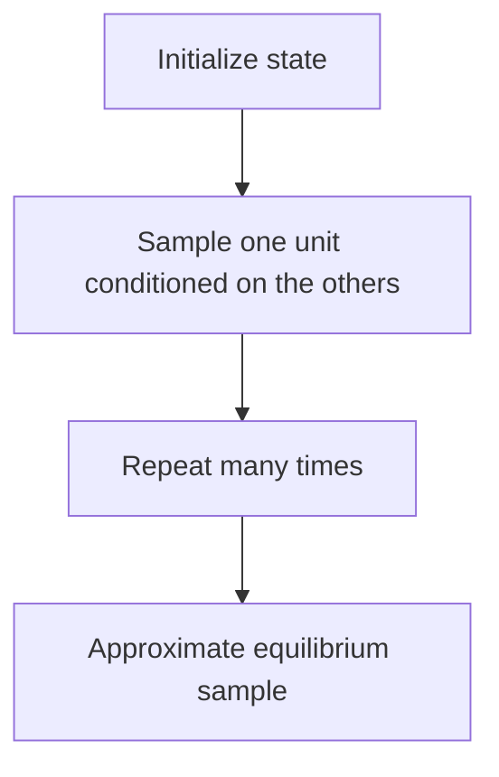
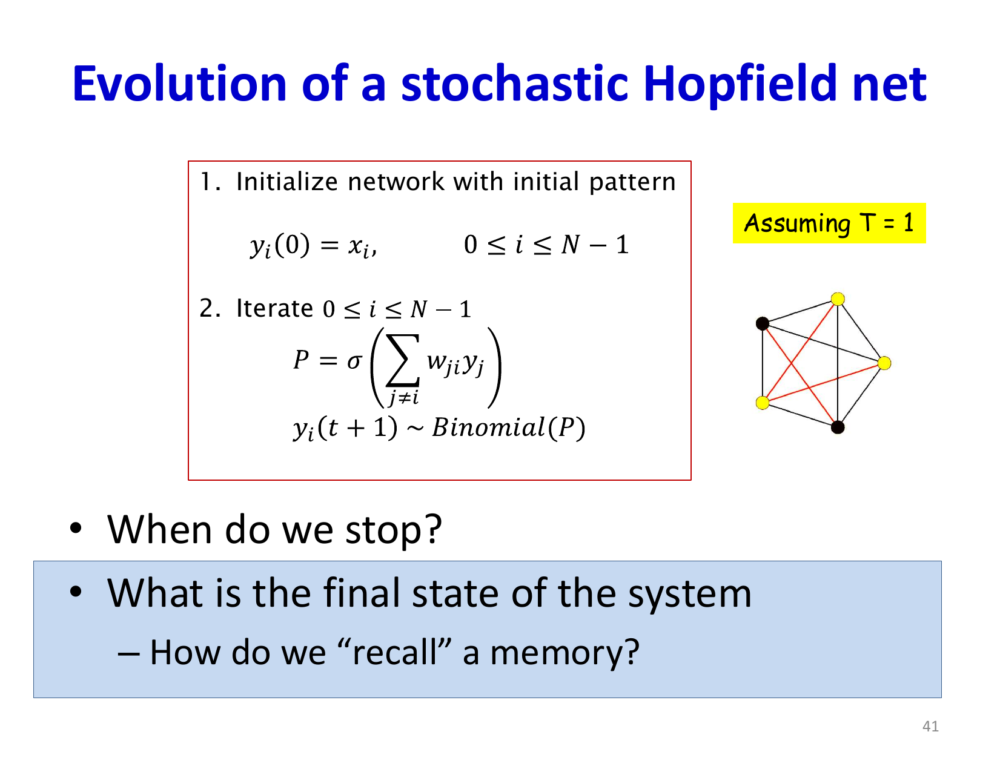
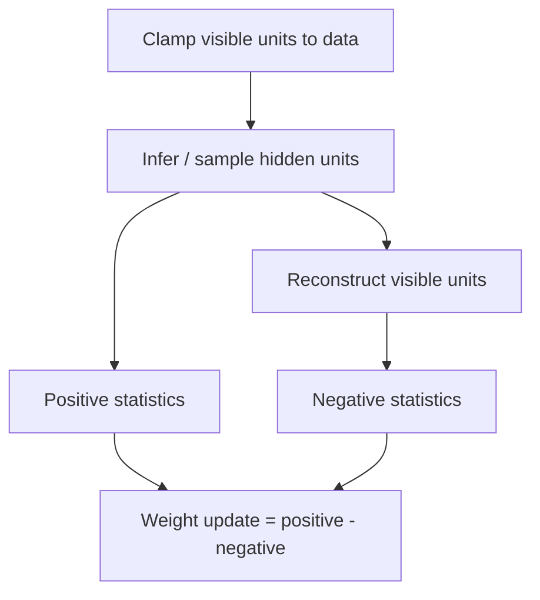

# Lecture 25: Boltzmann Machines

Boltzmann Machines turn the deterministic attractor picture of Hopfield networks into a probabilistic generative model. Instead of asking only which state minimizes energy, we ask how probability mass is distributed over all states at thermal equilibrium.

## Visual Roadmap



## At a Glance

| Concept | Meaning | Why it matters |
|---|---|---|
| Energy-based model | Probability tied to energy | Lower-energy states become more likely |
| Temperature `T` | Controls randomness | Connects deterministic and stochastic behavior |
| Partition function `Z` | Normalizes probabilities | Makes exact likelihood expensive |
| Positive phase | Raise probability of training data | Data-driven term in the gradient |
| Negative phase | Lower probability of model-generated states | Prevents trivial memorization |
| RBM | Restricted bipartite Boltzmann Machine | Makes inference and learning much cheaper |

## Training Hopfield Memories Before Going Probabilistic

The slide deck begins by revisiting a practical issue with Hopfield networks: it is not enough to say that memories are attractors. We also want to **shape the energy landscape** so target memories become deep, wide valleys while confusing "parasitic" states are pushed upward.

Concretely, the training goal is:

- lower the energy of desired memories
- raise the energy of nearby confusing states that could trap recall
- make important memories broader basins of attraction, not just isolated minima

This can be expressed as an energy-shaping problem over the weight matrix `W`. In the simplest picture, you initialize the network at target patterns, let it settle, inspect which valley it reached, and then update weights so the target valley deepens while the wrong valley is lifted.



The slides also describe an SGD-style viewpoint:

1. sample a target memory according to its importance
2. initialize the network there and let it evolve a few steps
3. compare the reached valley with the intended target
4. update weights so the target region gets lower energy and the confusing region gets higher energy

That "do this until convergence, satisfaction, or death from boredom" loop is a memorable way of stating a real idea: **training is local energy-landscape surgery**.



This also motivates the move to Boltzmann machines. If deterministic evolution gets trapped in many local minima, adding stochasticity can sometimes help the network escape shallow parasitic wells and explore the state space more intelligently.

## From Hopfield to Boltzmann

Hopfield nets choose low-energy stable states deterministically. Boltzmann machines instead define:

```text
P(y) = exp(-E(y) / T) / Z(T)
```

where:

- `E(y)` is the energy of state `y`
- `T` is temperature
- `Z(T)` is the partition function

This means:

- low-energy states are more probable
- higher temperature makes the system more random
- the model is generative because it defines a distribution over states

## Stochastic Update Rule

Each neuron updates according to a logistic probability:

```text
P(y_i = 1 | y_not_i) = sigma(z_i / T)
```

where:

```text
z_i = sum over j != i of w_ij * y_j + theta_i
```

Interpretation:

- if the local field strongly favors `1`, the neuron is likely to be `1`
- if the local field is weak, the neuron becomes uncertain
- increasing temperature moves probabilities toward `0.5`

This stochasticity is what turns the network into a sampler rather than a deterministic settle-down system.

## Equilibrium Distribution

The key theorem is that if all neurons update according to those logistic conditionals, the joint equilibrium distribution over states is exactly the Boltzmann distribution:

```text
P(y) proportional to exp(-E(y) / T)
```

That gives Boltzmann machines a clean statistical-physics interpretation.

## Why Learning Is Hard

To train the model, maximize likelihood of observed data:

```text
L = sum over mu of log P(y^(mu))
```

Differentiating with respect to a weight gives:

```text
dL / dw_ij = < y_i y_j >_data - < y_i y_j >_model
```

This is the famous:

- **positive phase**
- **negative phase**

decomposition.

## Positive vs Negative Phase

| Phase | What is held or sampled | Intuition |
|---|---|---|
| Positive phase | Clamp to training data (or visible data, with hidden states conditioned on it) | Increase probability of observed patterns |
| Negative phase | Let the model run freely and sample from itself | Decrease probability of states the model invents but should not favor |

This is one of the most important conceptual takeaways in the lecture.

## Why the Partition Function Causes Trouble

The partition function is:

```text
Z = sum over all states y of exp(-E(y) / T)
```

For `N` binary units, that sum spans `2^N` states. Exact likelihood and exact gradients are therefore intractable for anything but tiny systems.

That is why training relies on sampling.

## Sampling View



This is Gibbs sampling: repeatedly resample one variable from its conditional distribution.

## Visible and Hidden Units

A practical Boltzmann machine separates units into:

- **visible units**: observed data
- **hidden units**: latent explanatory variables

The model defines a joint distribution over both, but for data modeling we care about:

```text
P(v) = sum over h of P(v, h)
```

Hidden units increase representational power because many hidden configurations can support the same visible pattern.



## Learning with Hidden Units

With hidden units, both phases involve latent uncertainty:

- in the positive phase, visible units are fixed to data but hidden units must still be inferred or sampled
- in the negative phase, both visible and hidden units are sampled from the free-running model

That makes full Boltzmann machine training expensive.

## Restricted Boltzmann Machines (RBMs)

RBMs simplify the architecture:

- visible units connect only to hidden units
- hidden units connect only to visible units
- no visible-visible or hidden-hidden connections

This bipartite structure gives conditional independence:

```text
P(h_j = 1 | v) = sigma(sum over i of w_ij * v_i + theta_j)
```

```text
P(v_i = 1 | h) = sigma(sum over j of w_ij * h_j + theta_i)
```

Now all hidden units can be sampled in parallel given visible units, and vice versa.

## Full BM vs RBM

| Property | Full Boltzmann Machine | RBM |
|---|---|---|
| Connectivity | Arbitrary symmetric graph | Bipartite visible-hidden only |
| Inference cost | High | Much cheaper |
| Gibbs updates | Correlated within layers | Parallel within each layer |
| Practicality | Mostly small / theoretical | Historically much more usable |

## Contrastive Divergence

Even RBMs are expensive if you run chains to equilibrium. Contrastive Divergence (CD) approximates the gradient with a short chain:

1. clamp visible units to a data point `v^(0)`
2. sample hidden units `h^(0) ~ P(h | v^(0))`
3. reconstruct visible units `v^(1) ~ P(v | h^(0))`
4. update using:

```text
Delta w_ij proportional to
    < v_i h_j >_(v^(0))
  - < v_i h_j >_(v^(1))
```

With CD-1, that chain is only one step long, yet it often works surprisingly well in practice.

## Training Loop Intuition



## What These Models Were Good For

- pattern completion
- denoising
- modeling joint feature-label distributions
- unsupervised feature learning
- historical pretraining for deep networks

RBMs were especially important before end-to-end deep learning training became reliable.

## Limitations

- exact likelihood is intractable because of the partition function
- full BM sampling is slow
- learning quality depends heavily on sampling quality
- modern generative modeling has largely moved to other frameworks for large-scale applications

Still, the conceptual legacy is large: energy-based modeling, stochastic latent variables, sampling-based learning, and positive/negative phase reasoning all remain important.

## Hopfield vs Boltzmann

| Aspect | Hopfield network | Boltzmann machine |
|---|---|---|
| Dynamics | Deterministic or nearly deterministic | Stochastic |
| Output view | Settles into one attractor | Defines a distribution over states |
| Main use | Associative memory | Probabilistic generative modeling |
| Physics link | Energy descent | Thermal equilibrium / Boltzmann distribution |

## Key Takeaways

- Boltzmann machines reinterpret energy-based recurrent networks probabilistically.
- Temperature controls how random neuron updates are.
- Learning is maximum likelihood, but the gradient splits into positive and negative phases.
- The partition function makes exact training hard.
- RBMs make learning much cheaper by removing within-layer connections.
- Contrastive Divergence is the practical approximation that made RBMs trainable.
- Even though these models are less common today, they are foundational for energy-based and probabilistic deep learning.

## Slide Coverage Checklist

These bullets mirror the source slide deck and make the summary concept coverage explicit.

- Hopfield recap: energy and deterministic evolution
- content-addressable examples and noisy completion
- training the Hopfield energy landscape
- target patterns vs parasitic / confusing patterns
- SGD-style shaping of valleys and attraction basins
- boredom / broad-valley intuition in energy shaping
- shift from deterministic attractors to stochastic updates
- Boltzmann update probabilities
- equilibrium distribution over states
- partition function and why learning is hard
- visible vs hidden units
- positive phase vs negative phase
- restricted Boltzmann machines
- contrastive divergence
- Hopfield vs Boltzmann interpretation
