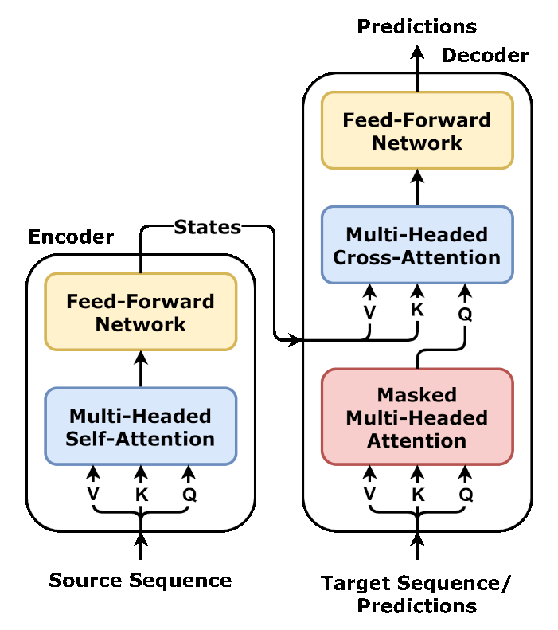
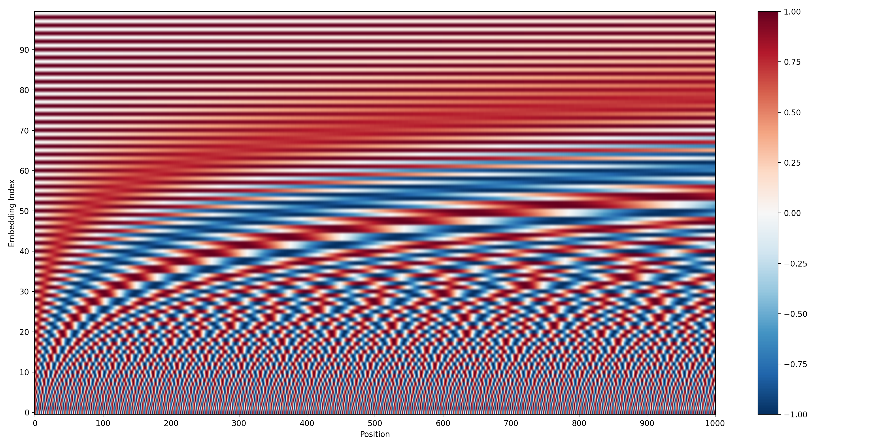
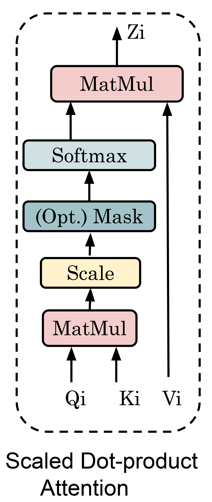
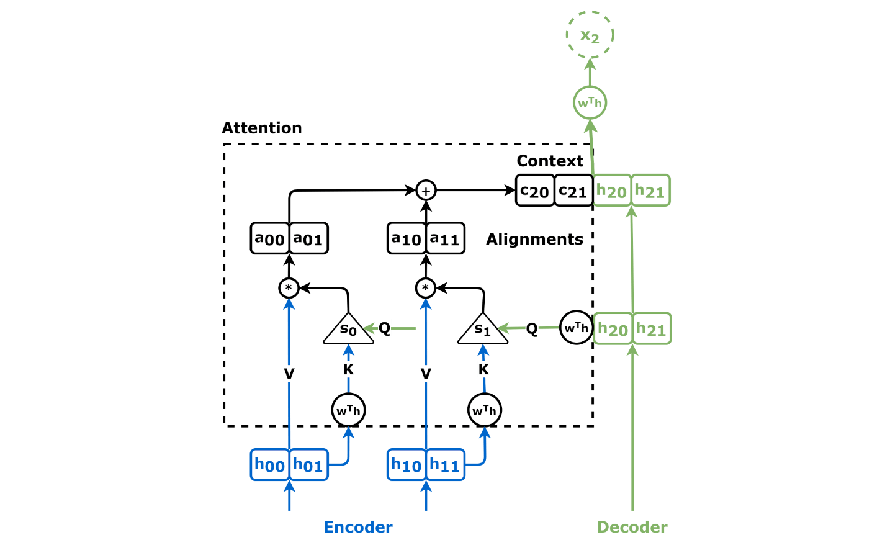
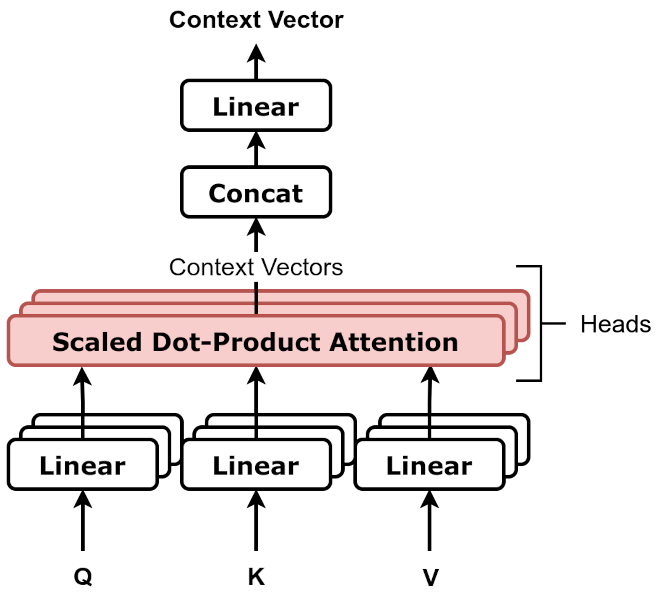
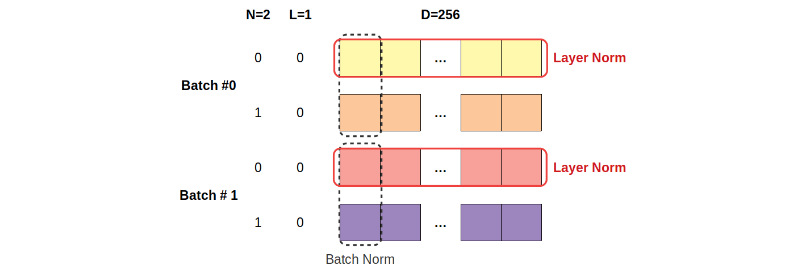

# Attention Is All You Need - Complete Solutions

**Paper**: Attention Is All You Need
**Authors**: Vaswani et al., 2017
**DOI**: 10.48550/arXiv.1706.03762
**URL**: https://arxiv.org/abs/1706.03762

This document contains comprehensive solutions for 6 fundamental tasks implementing the core components of the Transformer architecture from the seminal "Attention Is All You Need" paper.



*Figure: The complete Transformer architecture showing the encoder-decoder structure with multi-head attention, feed-forward networks, and residual connections*

Image credit: ["Transformer, one encoder-decoder block"](https://commons.wikimedia.org/wiki/File:Transformer,_one_encoder-decoder_block.png) by dvgodoy, licensed under [CC BY 4.0](https://creativecommons.org/licenses/by/4.0/).

---

## Table of Contents

1. [Task 01: Positional Encoding](#task-01-positional-encoding)
2. [Task 02: Scaled Dot-Product Attention](#task-02-scaled-dot-product-attention)
3. [Task 03: Single Attention Head](#task-03-single-attention-head)
4. [Task 04: Multi-Head Attention](#task-04-multi-head-attention)
5. [Task 05: Layer Normalization](#task-05-layer-normalization)
6. [Task 06: Tiny Transformer Forward Pass](#task-06-tiny-transformer-forward-pass)

---

## Task 01: Positional Encoding

**Difficulty**: Easy (Micro)
**Time Limit**: 2s



*Figure: Sinusoidal positional encodings showing how position information is encoded using sine and cosine functions across different dimensions*

Image credit: ["Absolute positional encoding"](https://commons.wikimedia.org/wiki/File:Absolute_positional_encoding.png) by Nils Blumer, licensed under [CC BY 4.0](https://creativecommons.org/licenses/by/4.0/).

### Problem Description

Implement sinusoidal positional encodings as used in the Transformer architecture. Unlike RNNs, Transformers process sequences in parallel without positional information. Positional encodings provide information about the position of tokens in the sequence while maintaining the ability to attend to relative positions.

### Mathematical Formulation

The positional encoding is computed using sine and cosine functions at different frequencies:

```
PE(pos, 2i)   = sin(pos / 10000^(2i/d_model))
PE(pos, 2i+1) = cos(pos / 10000^(2i/d_model))
```

Where:
- `pos` is the position in the sequence (0, 1, 2, ...)
- `i` is the dimension index (0, 1, 2, ..., d_model/2)
- `d_model` is the dimensionality of the model

### Function Signature

```python
def positional_encoding(seq_len: int, d_model: int) -> torch.Tensor:
    """
    Generate sinusoidal positional encodings.

    Args:
        seq_len: Length of the sequence
        d_model: Dimensionality of the model (must be even)

    Returns:
        torch.Tensor: Positional encodings of shape (seq_len, d_model) with dtype float32
    """
```

### Constraints

- `d_model` is guaranteed to be even
- PyTorch implementation (no loops preferred)
- Output dtype must be `float32`

### Example

```python
pe = positional_encoding(4, 4)
# Shape: (4, 4)
# pe[0] = [0., 1., 0., 1.]  # pos=0: sin(0)=0, cos(0)=1, sin(0)=0, cos(0)=1
# pe[1] = [sin(1/100), cos(1/100), sin(1/10000), cos(1/10000)]
```

### Complete Solution

```python
import torch
import math

def positional_encoding(seq_len: int, d_model: int) -> torch.Tensor:
    """
    Generate sinusoidal positional encodings.

    Args:
        seq_len: Length of the sequence
        d_model: Dimensionality of the model (must be even)

    Returns:
        torch.Tensor: Positional encodings of shape (seq_len, d_model) with dtype float32
    """
    # Create position indices: shape (seq_len, 1)
    positions = torch.arange(seq_len, dtype=torch.float32).reshape(-1, 1)

    # Create dimension indices: shape (1, d_model)
    # For even indices: 0, 2, 4, ...
    # For odd indices: 0, 2, 4, ... (same as even, will be used with cos)
    dim_indices = torch.arange(d_model, dtype=torch.float32).reshape(1, -1)

    # Compute the angle rates
    # 10000^(2i/d_model) for each dimension
    angle_rates = 1 / (10000 ** (2 * (dim_indices // 2) / d_model))

    # Compute the angles: pos / 10000^(2i/d_model)
    angles = positions * angle_rates

    # Apply sin to even indices, cos to odd indices
    pe = torch.zeros((seq_len, d_model), dtype=torch.float32)
    pe[:, 0::2] = torch.sin(angles[:, 0::2])  # Even indices: sin
    pe[:, 1::2] = torch.cos(angles[:, 1::2])  # Odd indices: cos

    return pe
```

### Explanation

1. **Position Vector**: Create a column vector of positions from 0 to seq_len-1
2. **Dimension Indices**: Create a row vector of dimension indices
3. **Angle Rates**: Compute the base angle rate `1 / 10000^(2i/d_model)` for each dimension pair
4. **Angles**: Multiply positions by angle rates to get the argument for sin/cos
5. **Apply Functions**: Use sin for even dimensions and cos for odd dimensions
6. **Return**: Return the (seq_len, d_model) positional encoding matrix

The alternating sine/cosine pattern allows the model to learn to attend to relative positions, as different frequencies encode different scales of positional information.

---

## Task 02: Scaled Dot-Product Attention

**Difficulty**: Easy (Micro)
**Time Limit**: 5s



*Figure: The scaled dot-product attention mechanism computing attention weights through query-key similarity and weighted value aggregation*

Image credit: ["Self-Attention (Scaled dot-product Attention)"](https://commons.wikimedia.org/wiki/File:Self-Attention_(Scaled_dot-product_Attention).png) by Unknown author, licensed under [CC BY 4.0](https://creativecommons.org/licenses/by/4.0/).

### Problem Description

Implement the core attention mechanism from the Transformer. The attention mechanism computes a weighted sum of values based on the similarity between queries and keys. The scaling factor `1/√d_k` prevents the softmax from saturating into regions with very small gradients.

### Mathematical Formulation

```
Attention(Q, K, V) = softmax(QK^T / √d_k) V
```

Where:
- `Q` is the query matrix
- `K` is the key matrix
- `V` is the value matrix
- `d_k` is the dimensionality of the keys
- The scaling factor `1/√d_k` ensures stable gradients

### Function Signature

```python
def scaled_dot_product_attention(q, k, v, mask=None):
    """
    Compute scaled dot-product attention.

    Args:
        q: Query tensor of shape (batch_size, seq_q, d_k)
        k: Key tensor of shape (batch_size, seq_k, d_k)
        v: Value tensor of shape (batch_size, seq_k, d_v)
        mask: Optional mask tensor for masking attention weights (e.g., for causal attention)

    Returns:
        output: Attention output of shape (batch_size, seq_q, d_v)
        weights: Attention weights of shape (batch_size, seq_q, seq_k)
    """
```

### Constraints

- PyTorch implementation
- Mask should be added to scaled scores before softmax
- Mask typically uses large negative values (e.g., -10^9) to effectively zero out attention weights
- Return both output and attention weights

### Example

```python
batch_size, seq_len, d_k = 2, 3, 4

Q = torch.randn(batch_size, seq_len, d_k, dtype=torch.float32)
K = torch.randn(batch_size, seq_len, d_k, dtype=torch.float32)
V = torch.randn(batch_size, seq_len, d_k, dtype=torch.float32)

output, weights = scaled_dot_product_attention(Q, K, V)
# output shape: (2, 3, 4)
# weights shape: (2, 3, 3)
```

### Complete Solution

```python
def scaled_dot_product_attention(q, k, v, mask=None):
    """
    Compute scaled dot-product attention.

    Args:
        q: Query tensor of shape (batch_size, seq_q, d_k)
        k: Key tensor of shape (batch_size, seq_k, d_k)
        v: Value tensor of shape (batch_size, seq_k, d_v)
        mask: Optional mask tensor for masking attention weights

    Returns:
        output: Attention output of shape (batch_size, seq_q, d_v)
        weights: Attention weights of shape (batch_size, seq_q, seq_k)
    """
    # Get the dimensionality of keys
    d_k = q.shape[-1]

    # Compute attention scores: Q @ K^T / √d_k
    # q: (batch, seq_q, d_k) @ k^T: (batch, d_k, seq_k) -> (batch, seq_q, seq_k)
    scores = torch.matmul(q, k.transpose(-2, -1)) / math.sqrt(d_k)

    # Apply mask if provided
    if mask is not None:
        scores = scores + mask

    # Apply softmax to get attention weights
    # Compute softmax across the key dimension (last dimension)
    weights = torch.softmax(scores, dim=-1)

    # Apply attention weights to values
    # weights: (batch, seq_q, seq_k) @ v: (batch, seq_k, d_v) -> (batch, seq_q, d_v)
    output = torch.matmul(weights, v)

    return output, weights
```

### Explanation

1. **Score Computation**: Compute QK^T/√d_k to get raw attention scores
   - Matrix multiply Q and K^T (transposed last two dimensions)
   - Divide by √d_k to prevent saturation
2. **Masking**: Add mask (with large negative values) to scores before softmax
   - This effectively zeros out masked positions after softmax
3. **Softmax Normalization**: Convert scores to attention weights
   - Use `torch.softmax` which handles numerical stability internally
4. **Weighted Sum**: Multiply weights by V to get the output
5. **Return**: Return both the output and weights for interpretability

---

## Task 03: Single Attention Head

> **Depends on**: `scaled_dot_product_attention()` from Task 02.

**Difficulty**: Medium (Micro)
**Time Limit**: 5s



*Figure: Single-head attention computing context from Q, K, V.*

Image credit: ["attention.png"](https://github.com/dvgodoy/dl-visuals/blob/main/Attention/attention.png) by dvgodoy, licensed under [CC BY 4.0](https://creativecommons.org/licenses/by/4.0/).


### Problem Description

Implement a single attention head with learnable linear projections. Each attention head independently projects the input through learned linear transformations, then applies the attention mechanism.

### Mathematical Formulation

```
Q = X W^Q
K = X W^K
V = X W^V
Head = Attention(Q, K, V)
```

Where:
- `X` is the input tensor
- `W^Q`, `W^K`, `W^V` are learnable projection matrices
- The attention mechanism applies scaled dot-product attention

### Function Signature

```python
def single_attention_head(x_q, x_k, x_v, W_q, W_k, W_v):
    """
    Compute a single attention head with learnable projections.

    Args:
        x_q: Query input of shape (batch_size, seq_q, d_model)
        x_k: Key input of shape (batch_size, seq_k, d_model)
        x_v: Value input of shape (batch_size, seq_k, d_model)
        W_q: Query projection matrix of shape (d_model, d_k)
        W_k: Key projection matrix of shape (d_model, d_k)
        W_v: Value projection matrix of shape (d_model, d_v)

    Returns:
        torch.Tensor: Head output of shape (batch_size, seq_q, d_v)
    """
```

### Constraints

- PyTorch implementation
- Return only the output (not attention weights)
- Apply projections before attention

### Complete Solution

```python
def single_attention_head(x_q, x_k, x_v, W_q, W_k, W_v):
    """
    Compute a single attention head with learnable projections.

    Args:
        x_q: Query input of shape (batch_size, seq_q, d_model)
        x_k: Key input of shape (batch_size, seq_k, d_model)
        x_v: Value input of shape (batch_size, seq_k, d_model)
        W_q: Query projection matrix of shape (d_model, d_k)
        W_k: Key projection matrix of shape (d_model, d_k)
        W_v: Value projection matrix of shape (d_model, d_v)

    Returns:
        torch.Tensor: Head output of shape (batch_size, seq_q, d_v)
    """
    # Project inputs using learnable weight matrices
    # x: (batch, seq, d_model) @ W: (d_model, d_out) -> (batch, seq, d_out)
    Q = torch.matmul(x_q, W_q)
    K = torch.matmul(x_k, W_k)
    V = torch.matmul(x_v, W_v)

    # Apply scaled dot-product attention
    output, _ = scaled_dot_product_attention(Q, K, V)

    return output
```

### Explanation

1. **Project Queries**: Q = X_q @ W^Q projects the query input to the query space
2. **Project Keys**: K = X_k @ W^K projects the key input to the key space
3. **Project Values**: V = X_v @ W^V projects the value input to the value space
4. **Apply Attention**: Use scaled_dot_product_attention on the projected inputs
5. **Return Output**: Return the attention-weighted values

The linear projections allow each head to focus on different subspaces of the input representation.

---

## Task 04: Multi-Head Attention

> **Depends on**: `scaled_dot_product_attention()` from Task 02.

**Difficulty**: Hard (Micro)
**Time Limit**: 5s



*Figure: Multi-head attention splitting the embedding space into multiple representation subspaces for parallel attention computation*

Image credit: ["Multiheaded attention, block diagram"](https://commons.wikimedia.org/wiki/File:Multiheaded_attention,_block_diagram.png) by dvgodoy, licensed under [CC BY 4.0](https://creativecommons.org/licenses/by/4.0/).

### Problem Description

Implement multi-head attention, which runs multiple attention heads in parallel and concatenates their outputs. This allows the model to jointly attend to information from different representation subspaces at different positions.

### Mathematical Formulation

```
MultiHead(Q, K, V) = Concat(head_1, ..., head_h) W^O

where head_i = Attention(Q W_i^Q, K W_i^K, V W_i^V)
```

### Function Signature

```python
def multi_head_attention(x, num_heads, W_q, W_k, W_v, W_o):
    """
    Compute multi-head self-attention.

    Args:
        x: Input tensor of shape (batch_size, seq_len, d_model)
        num_heads: Number of attention heads
        W_q: Query projection matrix of shape (d_model, d_model)
        W_k: Key projection matrix of shape (d_model, d_model)
        W_v: Value projection matrix of shape (d_model, d_model)
        W_o: Output projection matrix of shape (d_model, d_model)

    Returns:
        torch.Tensor: Output of shape (batch_size, seq_len, d_model)
    """
```

### Constraints

- PyTorch implementation
- Implements self-attention where Q = K = V = x
- `d_model` must be divisible by `num_heads`
- Each head has dimension `d_k = d_model / num_heads`

### Steps

1. Project the input through full projection matrices
2. Reshape to separate the heads: (batch, seq, d_model) -> (batch, seq, num_heads, d_k)
3. Transpose to group heads: (batch, num_heads, seq, d_k)
4. Apply attention to each head in parallel
5. Transpose back: (batch, num_heads, seq, d_k) -> (batch, seq, num_heads, d_k)
6. Concatenate heads: (batch, seq, d_model)
7. Apply output projection: @ W^O

### Complete Solution

```python
def multi_head_attention(x, num_heads, W_q, W_k, W_v, W_o):
    """
    Compute multi-head self-attention.

    Args:
        x: Input tensor of shape (batch_size, seq_len, d_model)
        num_heads: Number of attention heads
        W_q: Query projection matrix of shape (d_model, d_model)
        W_k: Key projection matrix of shape (d_model, d_model)
        W_v: Value projection matrix of shape (d_model, d_model)
        W_o: Output projection matrix of shape (d_model, d_model)

    Returns:
        torch.Tensor: Output of shape (batch_size, seq_len, d_model)
    """
    batch_size, seq_len, d_model = x.shape
    d_k = d_model // num_heads

    # Project input through full projection matrices
    # (batch, seq, d_model) @ (d_model, d_model) -> (batch, seq, d_model)
    Q = torch.matmul(x, W_q)
    K = torch.matmul(x, W_k)
    V = torch.matmul(x, W_v)

    # Reshape to separate heads: (batch, seq, d_model) -> (batch, seq, num_heads, d_k)
    Q = Q.reshape(batch_size, seq_len, num_heads, d_k)
    K = K.reshape(batch_size, seq_len, num_heads, d_k)
    V = V.reshape(batch_size, seq_len, num_heads, d_k)

    # Transpose to group by heads: (batch, seq, num_heads, d_k) -> (batch, num_heads, seq, d_k)
    Q = Q.permute(0, 2, 1, 3)
    K = K.permute(0, 2, 1, 3)
    V = V.permute(0, 2, 1, 3)

    # Flatten batch and heads for attention computation
    # (batch, num_heads, seq, d_k) -> (batch * num_heads, seq, d_k)
    batch_heads = batch_size * num_heads
    Q = Q.reshape(batch_heads, seq_len, d_k)
    K = K.reshape(batch_heads, seq_len, d_k)
    V = V.reshape(batch_heads, seq_len, d_k)

    # Apply attention to each head in parallel
    # (batch*num_heads, seq, d_k)
    attn_output, _ = scaled_dot_product_attention(Q, K, V)

    # Reshape back: (batch*num_heads, seq, d_k) -> (batch, num_heads, seq, d_k)
    attn_output = attn_output.reshape(batch_size, num_heads, seq_len, d_k)

    # Transpose back: (batch, num_heads, seq, d_k) -> (batch, seq, num_heads, d_k)
    attn_output = attn_output.permute(0, 2, 1, 3)

    # Concatenate heads: (batch, seq, num_heads, d_k) -> (batch, seq, d_model)
    attn_output = attn_output.reshape(batch_size, seq_len, d_model)

    # Apply output projection: (batch, seq, d_model) @ (d_model, d_model)
    output = torch.matmul(attn_output, W_o)

    return output
```

### Explanation

1. **Full Projections**: Project the entire input (shape d_model) through full projection matrices
2. **Head Separation**: Reshape to isolate individual heads (d_model/num_heads dimensions each)
3. **Head Grouping**: Transpose so batch and head dimensions are together for efficient computation
4. **Parallel Attention**: Apply scaled_dot_product_attention to all heads at once
5. **Head Reconstruction**: Reshape and transpose back to concatenate heads
6. **Output Projection**: Apply the output projection matrix to combine information from all heads

The multi-head attention allows different representation subspaces to be attended to independently, which is key to the Transformer's expressiveness.

---

## Task 05: Layer Normalization

**Difficulty**: Easy (Micro)
**Time Limit**: 2s



*Figure: Layer normalization applied across features within a token.*

Image credit: ["layer_vs_batch_norm.png"](https://github.com/dvgodoy/dl-visuals/blob/main/LayerNorm/layer_vs_batch_norm.png) by dvgodoy, licensed under [CC BY 4.0](https://creativecommons.org/licenses/by/4.0/).


### Problem Description

Implement layer normalization, a technique that normalizes activations to have zero mean and unit variance. Layer normalization stabilizes training and often improves convergence.

### Mathematical Formulation

For each element in the input:

```
μ = (1/d) Σ x_i
σ² = (1/d) Σ (x_i - μ)²
LayerNorm(x) = (x - μ) / √(σ² + ε)
```

Where:
- `μ` is the mean
- `σ²` is the variance
- `ε` is a small constant for numerical stability (default: 1e-5)
- Normalization is computed over the last dimension

### Function Signature

```python
def layer_norm(x, eps=1e-5):
    """
    Apply layer normalization.

    Args:
        x: Input tensor of any shape
        eps: Small constant for numerical stability

    Returns:
        torch.Tensor: Normalized tensor of the same shape
    """
```

### Constraints

- PyTorch implementation
- Normalize over the last dimension (dim=-1)
- This is a simplified version without learnable scale (γ) and shift (β) parameters
- Assumes γ = 1 and β = 0

### Example

```python
x = torch.tensor([[1.0, 2.0, 3.0],
                   [4.0, 5.0, 6.0]], dtype=torch.float32)

normalized = layer_norm(x)
# Normalizes each row independently
# Row 1: mean = 2.0, std ≈ 0.816
# Row 2: mean = 5.0, std ≈ 0.816
```

### Complete Solution

```python
def layer_norm(x, eps=1e-5):
    """
    Apply layer normalization.

    Args:
        x: Input tensor of any shape
        eps: Small constant for numerical stability

    Returns:
        torch.Tensor: Normalized tensor of the same shape
    """
    # Compute mean over the last dimension
    mean = torch.mean(x, dim=-1, keepdim=True)

    # Compute variance over the last dimension
    var = torch.var(x, dim=-1, keepdim=True, correction=0)

    # Normalize: (x - mean) / sqrt(var + eps)
    normalized = (x - mean) / torch.sqrt(var + eps)

    return normalized
```

### Explanation

1. **Compute Mean**: Calculate the mean across the last dimension with keepdim=True to preserve shape
2. **Compute Variance**: Calculate the variance across the last dimension (using `correction=0` for population variance, matching the layer norm formula)
3. **Normalize**: Apply the normalization formula with epsilon for numerical stability
4. **Return**: Return the normalized tensor with the same shape as input

The keepdim=True parameter is crucial because it allows PyTorch to broadcast the mean and variance back across the entire tensor, normalizing each position independently.

---

## Task 06: Tiny Transformer Forward Pass

> **Depends on**: `positional_encoding()` (Task 01), `multi_head_attention()` (Task 04), and `layer_norm()` (Task 05).

**Difficulty**: Hard (Integration)
**Time Limit**: 10s


*Figure: Encoder-decoder Transformer with attention and feed-forward sublayers.*

Image credit: ["Transformer, one encoder-decoder block"](https://commons.wikimedia.org/wiki/File:Transformer,_one_encoder-decoder_block.png) by dvgodoy, licensed under [CC BY 4.0](https://creativecommons.org/licenses/by/4.0/).


### Problem Description

Implement the complete forward pass of a minimal Transformer encoder layer. This integrates positional encoding, multi-head attention, layer normalization, and a feed-forward network, connected via residual connections.

### Architecture

The forward pass consists of:
1. Add positional encoding to input
2. Multi-head self-attention with residual connection and layer normalization
3. Feed-forward network with residual connection and layer normalization

### Mathematical Formulation

```
x' = x + MultiHeadAttention(LayerNorm(x))
x'' = x' + FeedForward(LayerNorm(x'))

where FeedForward(x) = ReLU(x @ W_ff1) @ W_ff2
```

### Function Signature

```python
def transformer_forward(x, pos_encoding, W_q, W_k, W_v, W_o, W_ff1, W_ff2, num_heads):
    """
    Complete Transformer encoder forward pass.

    Args:
        x: Input tensor of shape (batch_size, seq_len, d_model)
        pos_encoding: Positional encodings of shape (seq_len, d_model)
        W_q: Query projection matrix of shape (d_model, d_model)
        W_k: Key projection matrix of shape (d_model, d_model)
        W_v: Value projection matrix of shape (d_model, d_model)
        W_o: Output projection matrix of shape (d_model, d_model)
        W_ff1: First feed-forward weight matrix of shape (d_model, d_ff)
        W_ff2: Second feed-forward weight matrix of shape (d_ff, d_model)
        num_heads: Number of attention heads

    Returns:
        torch.Tensor: Output of shape (batch_size, seq_len, d_model)
    """
```

### Constraints

- PyTorch implementation
- Use functions from previous tasks (multi_head_attention, layer_norm)
- Use ReLU activation in the feed-forward network
- Pre-norm architecture: apply layer normalization *before* each sub-layer (attention/FFN), then add the residual connection

### Forward Pass Steps

1. **Add Positional Encoding**: Broadcast and add pos_encoding to input
2. **Attention Block**:
   - Apply layer normalization
   - Apply multi-head attention
   - Add residual connection
3. **Feed-Forward Block**:
   - Apply layer normalization to attention output
   - Apply linear projection, ReLU, and linear projection
   - Add residual connection

### Complete Solution

```python
import torch.nn.functional as F

def transformer_forward(x, pos_encoding, W_q, W_k, W_v, W_o, W_ff1, W_ff2, num_heads):
    """
    Complete Transformer encoder forward pass.

    Args:
        x: Input tensor of shape (batch_size, seq_len, d_model)
        pos_encoding: Positional encodings of shape (seq_len, d_model)
        W_q: Query projection matrix of shape (d_model, d_model)
        W_k: Key projection matrix of shape (d_model, d_model)
        W_v: Value projection matrix of shape (d_model, d_model)
        W_o: Output projection matrix of shape (d_model, d_model)
        W_ff1: First feed-forward weight matrix of shape (d_model, d_ff)
        W_ff2: Second feed-forward weight matrix of shape (d_ff, d_model)
        num_heads: Number of attention heads

    Returns:
        torch.Tensor: Output of shape (batch_size, seq_len, d_model)
    """
    # Step 1: Add positional encoding to input
    # x: (batch, seq_len, d_model), pos_encoding: (seq_len, d_model)
    # Broadcasting adds pos_encoding to each batch element
    x = x + pos_encoding

    # Step 2: Attention block with residual connection
    # Normalize input
    x_norm = layer_norm(x)

    # Apply multi-head attention
    attn_output = multi_head_attention(x_norm, num_heads, W_q, W_k, W_v, W_o)

    # Add residual connection
    x = x + attn_output

    # Step 3: Feed-forward block with residual connection
    # Normalize after attention
    x_norm = layer_norm(x)

    # Apply feed-forward network: ReLU(x @ W_ff1) @ W_ff2
    ff_hidden = torch.matmul(x_norm, W_ff1)  # (batch, seq, d_model) @ (d_model, d_ff)
    ff_hidden = F.relu(ff_hidden)              # ReLU activation
    ff_output = torch.matmul(ff_hidden, W_ff2)  # (batch, seq, d_ff) @ (d_ff, d_model)

    # Add residual connection
    x = x + ff_output

    return x
```

### Explanation

1. **Positional Encoding**: Adds fixed sinusoidal positional information to the input. Broadcasting adds the (seq_len, d_model) encoding to each batch element.

2. **Attention Block**:
   - Layer normalize the input to stabilize attention computation
   - Apply multi-head self-attention
   - Add residual connection (x = x + attention_output) to preserve gradient flow

3. **Feed-Forward Block**:
   - Layer normalize after attention
   - First linear projection expands to hidden dimension
   - ReLU activation introduces non-linearity
   - Second linear projection projects back to d_model
   - Add residual connection

The residual connections are critical for training deep networks, allowing gradients to flow directly through the network. The layer normalizations stabilize the attention and feed-forward computations.

### Complete Working Example

```python
import torch
import math
import torch.nn.functional as F

# Set up dimensions
batch_size, seq_len, d_model = 2, 4, 8
num_heads = 2
d_ff = 16

# Initialize inputs
x = torch.randn(batch_size, seq_len, d_model, dtype=torch.float32)
pos_encoding = positional_encoding(seq_len, d_model)

# Initialize weight matrices
W_q = torch.randn(d_model, d_model, dtype=torch.float32) * 0.01
W_k = torch.randn(d_model, d_model, dtype=torch.float32) * 0.01
W_v = torch.randn(d_model, d_model, dtype=torch.float32) * 0.01
W_o = torch.randn(d_model, d_model, dtype=torch.float32) * 0.01
W_ff1 = torch.randn(d_model, d_ff, dtype=torch.float32) * 0.01
W_ff2 = torch.randn(d_ff, d_model, dtype=torch.float32) * 0.01

# Forward pass
output = transformer_forward(x, pos_encoding, W_q, W_k, W_v, W_o, W_ff1, W_ff2, num_heads)

print(f"Input shape: {x.shape}")
print(f"Output shape: {output.shape}")
# Output shape: (2, 4, 8)
```

---

## Summary

These six tasks implement the core components of the Transformer architecture:

| Task | Component | Purpose |
|------|-----------|---------|
| 01 | Positional Encoding | Encode absolute position information |
| 02 | Scaled Dot-Product Attention | Compute attention weights and apply to values |
| 03 | Single Attention Head | Project inputs and apply attention |
| 04 | Multi-Head Attention | Run multiple heads in parallel and combine |
| 05 | Layer Normalization | Normalize activations for stability |
| 06 | Tiny Transformer | Integrate all components into full forward pass |

The Transformer's key innovations are:
- **Self-attention mechanism** allowing all positions to interact in parallel
- **Multi-head attention** capturing different types of relationships
- **Residual connections** enabling training of deep networks
- **Positional encodings** providing sequence ordering information
- **Feed-forward networks** adding non-linearity and capacity

Together, these components form the foundation of modern large language models and other state-of-the-art sequence models.
