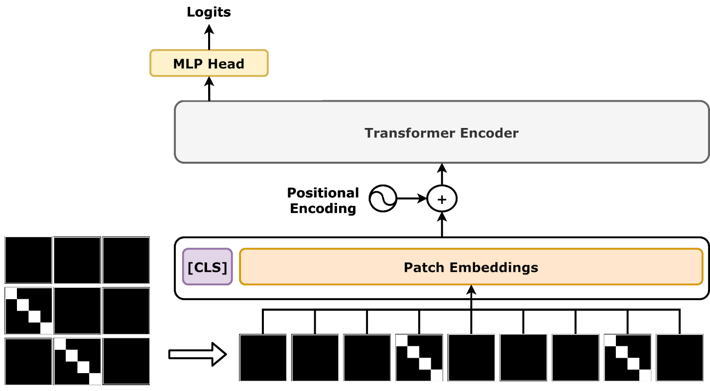
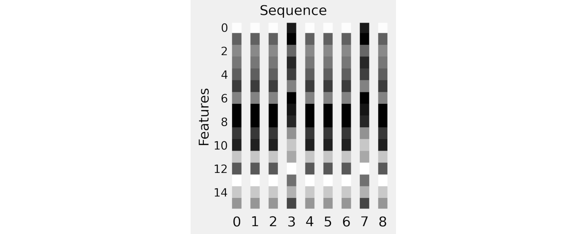
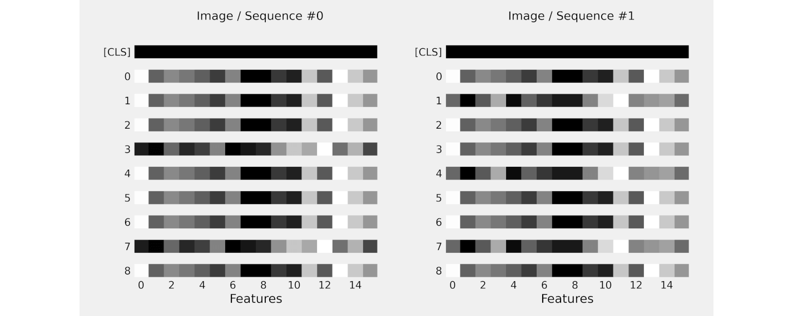
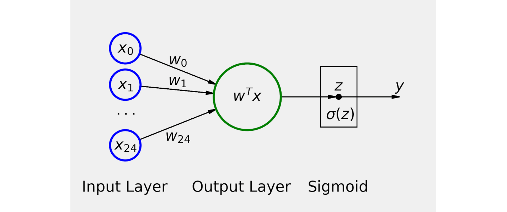
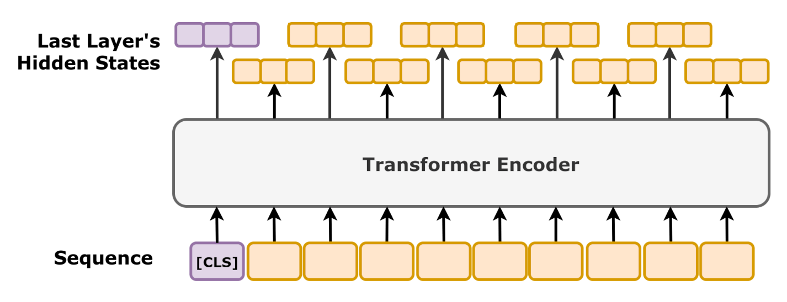

# Vision Transformer (ViT) - Complete Implementation Solutions

**All 10 tasks with implementations based on actual problem descriptions from PaperCode.in**

**Paper**: "An Image is Worth 16x16 Words: Transformers for Image Recognition at Scale"
**Authors**: Dosovitskiy et al. (2020)



*Figure: The Vision Transformer architecture showing the complete pipeline from image patches through transformer encoder layers to classification*

Image credit: ["Vision Transformer"](https://commons.wikimedia.org/wiki/File:Vision_Transformer.png) by Daniel Voigt Godoy, licensed under [CC BY 4.0](https://creativecommons.org/licenses/by/4.0/).

---

## Task 01: Patch Embedding Forward

**Difficulty**: Easy (Micro)
**Time Limit**: 2s



*Figure: The patch embedding process showing how an image is divided into fixed-size patches and flattened into embedding vectors*

Image credit: ["Patch Embeddings - Example embedded patches"](https://github.com/dvgodoy/dl-visuals/tree/main/Patch%20Embeddings) by dvgodoy, licensed under [CC BY 4.0](https://creativecommons.org/licenses/by/4.0/).

### Problem Description

In the Vision Transformer (ViT), an image is split into fixed-size patches, which are then linearly embedded. This is analogous to how words are tokenized in NLP transformers. Each patch is treated as a "token" in the sequence.

The patch embedding layer extracts non-overlapping patches from a 2D image and flattens each patch into a vector. This creates a sequence of patch embeddings that can be processed by the transformer encoder.

### Mathematical Formulation

Given an image **x** ∈ ℝ^(H×W×C) and patch size P:

- Reshape the image into a sequence of flattened patches: **x_p** ∈ ℝ^(N×(P²·C))
- Where N = HW/P² is the number of patches
- The patches are extracted in row-major order (left-to-right, top-to-bottom)

### Function Signature

```python
def patch_embedding_forward(image: torch.Tensor, patch_size: int) -> torch.Tensor:
    """
    Extract and flatten non-overlapping patches from an image.

    Args:
        image: Input image of shape (H, W, C) with dtype float32
        patch_size: Size of each square patch (P)

    Returns:
        Flattened patches of shape (num_patches, patch_dim) with dtype float32
        where num_patches = (H // P) * (W // P) and patch_dim = P * P * C
    """
```

### Constraints

- H and W must be divisible by patch_size
- PyTorch implementation (no NumPy)
- Patches should be extracted in row-major order

### Example

```python
image = torch.randn(4, 4, 3, dtype=torch.float32)
patches = patch_embedding_forward(image, patch_size=2)
# Returns shape (4, 12)
# 4 patches: (4//2) * (4//2) = 4
# Each patch: 2*2*3 = 12 dimensions
```

### Solution

```python
import torch

def patch_embedding_forward(image: torch.Tensor, patch_size: int) -> torch.Tensor:
    """
    Extract and flatten non-overlapping patches from an image.

    Args:
        image: Input image of shape (H, W, C)
        patch_size: Size of each square patch

    Returns:
        Flattened patches of shape (num_patches, patch_dim)
    """
    H, W, C = image.shape
    P = patch_size

    # Calculate number of patches in each dimension
    num_patches_h = H // P
    num_patches_w = W // P

    # Reshape to separate patch dimensions
    image_patches = image.reshape(num_patches_h, P, num_patches_w, P, C)

    # Transpose to get patches in row-major order: (num_patches_h, num_patches_w, P, P, C)
    image_patches = image_patches.permute(0, 2, 1, 3, 4)

    # Reshape to flatten each patch: (num_patches_h * num_patches_w, P * P * C)
    patches = image_patches.reshape(num_patches_h * num_patches_w, P * P * C)

    return patches.to(torch.float32)
```

### Explanation

1. **Reshape for Separation**: Reshape (H, W, C) → (num_h, P, num_w, P, C) to isolate patch boundaries
2. **Transpose for Row-Major Order**: Transpose dimensions to (num_h, num_w, P, P, C) using the (0, 2, 1, 3, 4) permutation
3. **Flatten Patches**: Reshape to (num_patches, P×P×C) where each row is one flattened patch
4. **Extract Dimension Values**: Calculate num_patches_h and num_patches_w from image dimensions divided by patch size

This reshape-transpose-reshape trick efficiently extracts non-overlapping patches without explicit loops. The key insight is using transpose to reorder dimensions so that when reshaped, patch pixels become contiguous, enabling ViT to treat patches as "tokens" analogous to words in NLP.

---

## Task 02: Position Embedding Add

**Difficulty**: Easy (Micro)
**Time Limit**: 2s


*Figure: Sinusoidal positional encodings across dimensions.*

Image credit: ["Absolute positional encoding"](https://commons.wikimedia.org/wiki/File:Absolute_positional_encoding.png) by Nils Blumer, licensed under [CC BY 4.0](https://creativecommons.org/licenses/by/4.0/).


### Problem Description

In the Vision Transformer, after extracting patch embeddings, we need to add positional information to retain spatial relationships between patches. Unlike the sinusoidal positional encodings used in the original Transformer, ViT uses **learned position embeddings**.

These position embeddings are simply added element-wise to the patch embeddings. Each position in the sequence has a corresponding learnable embedding vector.

### Mathematical Formulation

Given:
- Patch embeddings: **E** ∈ ℝ^(N×D)
- Position embeddings: **E_pos** ∈ ℝ^(N×D)

The output is:

**Z_0 = E + E_pos**

Where N is the number of patches and D is the embedding dimension.

### Function Signature

```python
def position_embedding_add(patch_embeddings: torch.Tensor,
                          position_embeddings: torch.Tensor) -> torch.Tensor:
    """
    Add position embeddings to patch embeddings element-wise.

    Args:
        patch_embeddings: Patch embeddings of shape (N, D) with dtype float32
        position_embeddings: Position embeddings of shape (N, D) with dtype float32

    Returns:
        Combined embeddings of shape (N, D) with dtype float32
    """
```

### Constraints

- Both inputs must have the same shape
- PyTorch implementation (no NumPy)

### Example

```python
patch_emb = torch.tensor([[1.0, 2.0], [3.0, 4.0]], dtype=torch.float32)
pos_emb = torch.tensor([[0.1, 0.2], [0.3, 0.4]], dtype=torch.float32)
result = position_embedding_add(patch_emb, pos_emb)
# Returns [[1.1, 2.2], [3.3, 4.4]]
```

### Solution

```python
import torch

def position_embedding_add(patch_embeddings: torch.Tensor,
                          position_embeddings: torch.Tensor) -> torch.Tensor:
    """
    Add position embeddings to patch embeddings element-wise.

    Args:
        patch_embeddings: Patch embeddings of shape (N, D)
        position_embeddings: Position embeddings of shape (N, D)

    Returns:
        Combined embeddings of shape (N, D)
    """
    return (patch_embeddings + position_embeddings).to(torch.float32)
```

### Explanation

1. **Element-wise Addition**: Add position_embeddings directly to patch_embeddings (broadcasting handles (N, D) + (N, D) naturally)
2. **Preserve Shape**: Output maintains (N, D) shape where N is number of patches and D is embedding dimension
3. **Learnable Positions**: Unlike sinusoidal encodings in "Attention Is All You Need", ViT uses learned position embeddings that are optimized during training
4. **Per-Token Information**: Each patch token gets a unique position embedding added, preserving spatial relationships in the 2D image

This simple addition mechanism works because embeddings are dense vectors in continuous space—adding vectors in this space effectively interpolates between patch content and positional context. This design is more parameter-efficient than position-aware projection layers.

---

## Task 03: Class Token Prepend

**Difficulty**: Easy (Micro)
**Time Limit**: 2s



*Figure: Special class tokens prepended to the sequence.*

Image credit: ["two_cls_embeds.png"](https://github.com/dvgodoy/dl-visuals/blob/main/Transformers/two_cls_embeds.png) by dvgodoy, licensed under [CC BY 4.0](https://creativecommons.org/licenses/by/4.0/).


### Problem Description

In the Vision Transformer, a special learnable **class token** is prepended to the sequence of patch embeddings. This class token serves a similar purpose to the [CLS] token in BERT - its final representation after passing through the transformer encoder is used for image classification.

The class token is a learnable embedding that is concatenated to the beginning of the patch embedding sequence before being fed into the transformer encoder.

### Mathematical Formulation

Given:
- Patch embeddings with position: **Z_0** ∈ ℝ^(N×D)
- Class token embedding: **x_class** ∈ ℝ^(1×D)

The output is:

**Z_0' = [x_class; Z_0]** ∈ ℝ^((N+1)×D)

Where [;] denotes concatenation along the sequence dimension.

### Function Signature

```python
def class_token_prepend(patch_embeddings: torch.Tensor,
                       class_token: torch.Tensor) -> torch.Tensor:
    """
    Prepend a class token to the sequence of patch embeddings.

    Args:
        patch_embeddings: Patch embeddings of shape (N, D) with dtype float32
        class_token: Class token of shape (1, D) with dtype float32

    Returns:
        Sequence with class token of shape (N+1, D) with dtype float32
    """
```

### Constraints

- Both inputs must have the same embedding dimension D
- PyTorch implementation (no NumPy)

### Example

```python
patch_emb = torch.tensor([[1.0, 2.0], [3.0, 4.0], [5.0, 6.0]], dtype=torch.float32)
class_token = torch.tensor([[0.5, 0.5]], dtype=torch.float32)
result = class_token_prepend(patch_emb, class_token)
# Returns shape (4, 2):
# [[0.5, 0.5],
#  [1.0, 2.0],
#  [3.0, 4.0],
#  [5.0, 6.0]]
```

### Solution

```python
import torch

def class_token_prepend(patch_embeddings: torch.Tensor,
                       class_token: torch.Tensor) -> torch.Tensor:
    """
    Prepend a class token to the sequence of patch embeddings.

    Args:
        patch_embeddings: Patch embeddings of shape (N, D)
        class_token: Class token of shape (1, D)

    Returns:
        Sequence with class token of shape (N+1, D)
    """
    return torch.cat([class_token, patch_embeddings], dim=0).to(torch.float32)
```

### Explanation

1. **Concatenate at Dim 0**: Prepend class_token to the sequence using torch.cat along the sequence dimension
2. **CLS Token Role**: The class token (analogous to BERT's [CLS]) serves as an aggregator token that attends to all patch tokens
3. **Output Shape**: Result has shape (N+1, D) where the class token is at index 0 and patches follow
4. **Learnable Token**: Like position embeddings, the class token is a learnable parameter initialized randomly and optimized during training
5. **Single Representation**: After encoder processing, only the class token's output representation is used for classification, not the patch representations

This borrowing of BERT's class token design proves effective because it provides a single, trained representation that condenses information from all patches. Conveniently, it works in ViT because transformers naturally aggregate information through attention.

---

## Task 04: ViT MLP Block Forward

**Difficulty**: Medium (Micro)
**Time Limit**: 2s



*Figure: Two-layer feed-forward network applied per token.*

Image credit: ["classification.png"](https://github.com/dvgodoy/dl-visuals/blob/main/Feed-Forward%20Networks/classification.png) by dvgodoy, licensed under [CC BY 4.0](https://creativecommons.org/licenses/by/4.0/).


### Problem Description

The MLP (Multi-Layer Perceptron) block in the Vision Transformer consists of two linear layers with a GELU (Gaussian Error Linear Unit) activation function in between. This feed-forward network processes each token independently and is a crucial component of each encoder layer.

In a typical ViT configuration, the MLP block expands the embedding dimension by a factor (usually 4), applies GELU activation, and then projects back to the original dimension.

### Mathematical Formulation

```
MLP(x) = W_2 · GELU(W_1 · x + b_1) + b_2
```

Where:
- x ∈ ℝ^(N×D): Input embeddings
- W_1 ∈ ℝ^(D×D_ff): First layer weights
- b_1 ∈ ℝ^(D_ff): First layer bias
- W_2 ∈ ℝ^(D_ff×D): Second layer weights
- b_2 ∈ ℝ^(D): Second layer bias
- GELU: Gaussian Error Linear Unit activation

**GELU Activation**:
```
GELU(x) = 0.5 * x * (1 + tanh(√(2/π) * (x + 0.044715 * x³)))
```

### Function Signature

```python
def vit_mlp_block_forward(x: torch.Tensor, W1: torch.Tensor, b1: torch.Tensor,
                         W2: torch.Tensor, b2: torch.Tensor) -> torch.Tensor:
    """
    Forward pass through a ViT MLP block with GELU activation.

    Args:
        x: Input of shape (N, D) with dtype float32
        W1: First layer weights of shape (D, D_ff) with dtype float32
        b1: First layer bias of shape (D_ff,) with dtype float32
        W2: Second layer weights of shape (D_ff, D) with dtype float32
        b2: Second layer bias of shape (D,) with dtype float32

    Returns:
        Output of shape (N, D) with dtype float32
    """
```

### Constraints

- PyTorch implementation (no NumPy)
- Must use GELU activation (not ReLU or other activations)
- Use the tanh-based approximation for GELU

### Solution

```python
import torch
import torch.nn.functional as F

def gelu(x: torch.Tensor) -> torch.Tensor:
    """
    GELU activation function (Gaussian Error Linear Unit).

    Approximation: 0.5 * x * (1 + tanh(√(2/π) * (x + 0.044715 * x³)))
    """
    return F.gelu(x, approximate='tanh')


def vit_mlp_block_forward(x: torch.Tensor, W1: torch.Tensor, b1: torch.Tensor,
                         W2: torch.Tensor, b2: torch.Tensor) -> torch.Tensor:
    """
    Forward pass through a ViT MLP block with GELU activation.

    Args:
        x: Input of shape (N, D)
        W1: First layer weights of shape (D, D_ff)
        b1: First layer bias of shape (D_ff,)
        W2: Second layer weights of shape (D_ff, D)
        b2: Second layer bias of shape (D,)

    Returns:
        Output of shape (N, D)
    """
    # First linear layer
    hidden = torch.matmul(x, W1) + b1  # (N, D_ff)

    # GELU activation
    hidden = gelu(hidden)

    # Second linear layer
    output = torch.matmul(hidden, W2) + b2  # (N, D)

    return output.to(torch.float32)
```

### Explanation

1. **Expansion Layer**: First linear layer projects from D → D_ff (D_ff typically 4×D), expanding the representation
2. **GELU Activation**: GELU smoothly gates activations using a learned function, superior to ReLU for transformer models because it has both multiplicative and additive components
3. **Hidden Representation**: The expanded intermediate hidden state captures non-linear interactions that ReLU would miss through its smooth saturation curve
4. **Projection Back**: Second linear layer projects D_ff → D, reducing dimensionality back to the model dimension
5. **Token-wise Application**: This MLP block applies identically to each token independently (not across tokens), preserving the sequence dimension

The two-layer feed-forward network is crucial because attention alone performs weighted aggregation (linear). MLPs add the non-linearity necessary for transformers to represent complex functions. The expansion-then-projection pattern is more efficient than wide single layers while maintaining expressive power.

---

## Task 05: ViT Encoder Layer Forward

> **Note**: This task depends on `multi_head_attention_forward()` (Task 07) and `vit_mlp_block_forward()` (Task 04). Implement those first, or refer to their solutions below.

**Difficulty**: Hard (Micro)
**Time Limit**: 2s


*Figure: Encoder block with self-attention and feed-forward layers.*

Image credit: ["transf_encself.png"](https://github.com/dvgodoy/dl-visuals/blob/main/Transformers/transf_encself.png) by dvgodoy, licensed under [CC BY 4.0](https://creativecommons.org/licenses/by/4.0/).


### Problem Description

A complete ViT encoder layer implements the Pre-Layer Normalization (Pre-LN) architecture, which has been found to be more stable than the original Post-LN design. Each encoder layer consists of two main sub-blocks:

1. **Multi-head Self-Attention Block**: Layer Normalization → Multi-Head Attention → Residual Connection
2. **MLP Block**: Layer Normalization → MLP → Residual Connection

The Pre-LN architecture applies layer normalization before each sub-block rather than after, which helps with training stability.

### Mathematical Formulation

```
# Multi-head attention block with Pre-LN
x' = x + MultiHeadAttention(LayerNorm(x))

# MLP block with Pre-LN
x'' = x' + MLP(LayerNorm(x'))
```

**Layer Normalization**:
```
LayerNorm(x) = γ * (x - μ) / √(σ² + ε) + β
```

Where:
- μ: Mean computed over the feature dimension
- σ²: Variance computed over the feature dimension
- ε: Small constant for numerical stability (1e-5)
- γ: Learnable scale parameter
- β: Learnable shift parameter

### Function Signature

```python
def vit_encoder_layer_forward(x: torch.Tensor, attn_params: dict,
                              mlp_params: dict, ln1_params: dict,
                              ln2_params: dict) -> torch.Tensor:
    """
    Forward pass through a single ViT encoder layer.

    Args:
        x: Input of shape (N, D) with dtype float32
        attn_params: Dict with 'W_q', 'W_k', 'W_v', 'W_o', 'num_heads'
        mlp_params: Dict with 'W1', 'b1', 'W2', 'b2'
        ln1_params: Dict with 'gamma', 'beta'
        ln2_params: Dict with 'gamma', 'beta'

    Returns:
        Output of shape (N, D) with dtype float32
    """
```

### Constraints

- PyTorch implementation (no NumPy)
- Pre-LN architecture: LayerNorm → Attention → Residual, then LayerNorm → MLP → Residual
- epsilon = 1e-5 for layer normalization

### Solution

```python
import torch

def layer_norm(x: torch.Tensor, gamma: torch.Tensor, beta: torch.Tensor,
               epsilon: float = 1e-5) -> torch.Tensor:
    """
    Layer normalization.

    Args:
        x: Input of shape (N, D)
        gamma: Scale parameter of shape (D,)
        beta: Shift parameter of shape (D,)
        epsilon: Small constant for numerical stability

    Returns:
        Normalized output of shape (N, D)
    """
    mean = torch.mean(x, dim=-1, keepdim=True)
    variance = torch.var(x, dim=-1, keepdim=True, unbiased=False)
    x_norm = (x - mean) / torch.sqrt(variance + epsilon)
    return (gamma * x_norm + beta).to(torch.float32)


def vit_encoder_layer_forward(x: torch.Tensor, attn_params: dict,
                              mlp_params: dict, ln1_params: dict,
                              ln2_params: dict) -> torch.Tensor:
    """
    Forward pass through a single ViT encoder layer.

    Args:
        x: Input of shape (N, D)
        attn_params: Dict with 'W_q', 'W_k', 'W_v', 'W_o', 'num_heads'
        mlp_params: Dict with 'W1', 'b1', 'W2', 'b2'
        ln1_params: Dict with 'gamma', 'beta'
        ln2_params: Dict with 'gamma', 'beta'

    Returns:
        Output of shape (N, D)
    """
    # 1. Pre-LN Multi-head Self-Attention Block
    x_norm1 = layer_norm(x, ln1_params['gamma'], ln1_params['beta'])
    attn_output = multi_head_attention_forward(
        x_norm1,
        attn_params['W_q'],
        attn_params['W_k'],
        attn_params['W_v'],
        attn_params['W_o'],
        attn_params['num_heads']
    )
    x = x + attn_output  # Residual connection

    # 2. Pre-LN MLP Block
    x_norm2 = layer_norm(x, ln2_params['gamma'], ln2_params['beta'])
    mlp_output = vit_mlp_block_forward(
        x_norm2,
        mlp_params['W1'],
        mlp_params['b1'],
        mlp_params['W2'],
        mlp_params['b2']
    )
    x = x + mlp_output  # Residual connection

    return x.to(torch.float32)
```

### Explanation

1. **Pre-Layer Normalization**: Apply LayerNorm before attention (Pre-LN) rather than after (Post-LN) for improved stability
2. **Normalize Features**: Layer norm standardizes features across the embedding dimension D for each token independently, preventing extreme activations
3. **Multi-Head Attention Block**: Apply attention to normalized input and add back via residual connection (x + output preserves original information)
4. **Second Normalization**: Apply LayerNorm again before the MLP block on the updated token representations
5. **MLP Addition**: Apply MLP to normalized representations and again add residually to preserve gradient flow
6. **Residual Connections**: Both x + attn_output and x + mlp_output enable deep networks by ensuring gradients bypass deep layers

The Pre-LN variant with residual connections is the modern architecture choice. It ensures activations remain stable as networks deepen, and residuals guarantee information from early layers reaches deep layers directly. This design is crucial for training the 12-24 layer transformers used in ViT.

---

## Task 06: Scaled Dot-Product Attention

**Difficulty**: Medium (Micro)
**Time Limit**: 2s

Image credit: ["Self-Attention (Scaled dot-product Attention)"](https://commons.wikimedia.org/wiki/File:Self-Attention_(Scaled_dot-product_Attention).png) by Unknown author, licensed under [CC BY 4.0](https://creativecommons.org/licenses/by/4.0/).


### Problem Description

Scaled dot-product attention is the fundamental attention mechanism used in transformers. It computes attention weights between query and key vectors, then uses these weights to aggregate value vectors.

The "scaled" aspect refers to dividing by the square root of the key dimension, which prevents the dot products from becoming too large (which would push the softmax into regions with extremely small gradients).

### Mathematical Formulation

```
Attention(Q, K, V) = softmax(QK^T / √d_k) V
```

Where:
- Q ∈ ℝ^(N×d_k): Query matrix
- K ∈ ℝ^(M×d_k): Key matrix
- V ∈ ℝ^(M×d_v): Value matrix
- d_k: Dimension of queries and keys
- Output ∈ ℝ^(N×d_v)

**Steps**:
1. Compute attention scores: `scores = QK^T / √d_k`
2. Apply optional mask (by adding large negative values to masked positions)
3. Apply softmax: `weights = softmax(scores)`
4. Compute weighted sum: `output = weights V`

### Function Signature

```python
def scaled_dot_product_attention(Q: torch.Tensor, K: torch.Tensor,
                                 V: torch.Tensor, mask: torch.Tensor = None) -> torch.Tensor:
    """
    Compute scaled dot-product attention.

    Args:
        Q: Queries of shape (N, d_k) with dtype float32
        K: Keys of shape (M, d_k) with dtype float32
        V: Values of shape (M, d_v) with dtype float32
        mask: Optional boolean mask of shape (N, M) where True indicates positions to mask

    Returns:
        Attention output of shape (N, d_v) with dtype float32
    """
```

### Constraints

- PyTorch implementation (no NumPy)
- Q and K must have the same last dimension (d_k)
- If mask is provided, masked positions should be set to very negative values before softmax
- Implement numerically stable softmax (subtract max before exp)

### Solution

```python
import torch
import math

def scaled_dot_product_attention(Q: torch.Tensor, K: torch.Tensor,
                                 V: torch.Tensor, mask: torch.Tensor = None) -> torch.Tensor:
    """
    Compute scaled dot-product attention.

    Args:
        Q: Queries of shape (N, d_k)
        K: Keys of shape (M, d_k)
        V: Values of shape (M, d_v)
        mask: Optional boolean mask where True indicates positions to mask

    Returns:
        Attention output of shape (N, d_v)
    """
    d_k = K.shape[-1]

    # Compute attention scores: QK^T / √d_k
    scores = torch.matmul(Q, K.transpose(-2, -1)) / math.sqrt(d_k)  # (N, M)

    # Apply mask if provided (True = mask out)
    if mask is not None:
        scores = scores.masked_fill(mask, -1e9)

    # Apply softmax along last dimension
    attention_weights = torch.softmax(scores, dim=-1)  # (N, M)

    # Apply attention weights to values
    output = torch.matmul(attention_weights, V)  # (N, d_v)

    return output.to(torch.float32)
```

### Explanation

1. **Score Computation**: Compute QK^T to measure query-key similarity, then scale by 1/√d_k to prevent extreme dot products
2. **Scaling Factor**: √d_k scaling keeps gradients well-behaved—without it, large dot products push softmax into saturation regions with vanishing gradients
3. **Optional Masking**: If provided, replace masked positions with -1e9 before softmax (effectively zeros out after softmax)
4. **Numerically Stable Softmax**: PyTorch's torch.softmax handles numerical stability internally (subtracts max before exp)
5. **Weighted Aggregation**: Multiply normalized attention weights by values to get the output—high-weight positions contribute more
6. **Output Shape**: Result has shape (N, d_v), same query count but value dimensions

This core mechanism enables transformers to dynamically attend to relevant positions. In vision, it allows each patch token to gather information from all other patches based on their relevance. The scaling and numerical stability tricks are essential for training deep transformers.

---

## Task 07: Multi-Head Attention Forward

**Difficulty**: Hard (Micro)
**Time Limit**: 2s


*Figure: Multi-head attention splitting the embedding space into multiple representation subspaces.*

Image credit: ["Multiheaded attention, block diagram"](https://commons.wikimedia.org/wiki/File:Multiheaded_attention,_block_diagram.png) by dvgodoy, licensed under [CC BY 4.0](https://creativecommons.org/licenses/by/4.0/).


### Problem Description

Multi-head attention allows the model to jointly attend to information from different representation subspaces at different positions. Instead of performing a single attention function, multi-head attention splits the embedding dimension into multiple "heads" and performs attention in parallel on each head.

The outputs from all heads are then concatenated and linearly transformed to produce the final output. This mechanism enables the model to capture different types of relationships and patterns in the data.

### Mathematical Formulation

```
MultiHead(x) = Concat(head_1, ..., head_h) W^O

where head_i = Attention(xW^Q_i, xW^K_i, xW^V_i)
```

For self-attention in ViT:
```
Q = xW^Q, K = xW^K, V = xW^V
```

Then split into h heads:
- d_k = D / h (head dimension)
- Each head processes a slice of dimension d_k
- Concatenate all heads and apply output projection

### Function Signature

```python
def multi_head_attention_forward(x: torch.Tensor, W_q: torch.Tensor, W_k: torch.Tensor,
                                 W_v: torch.Tensor, W_o: torch.Tensor,
                                 num_heads: int, mask: torch.Tensor = None) -> torch.Tensor:
    """
    Compute multi-head self-attention.

    Args:
        x: Input of shape (N, D) with dtype float32
        W_q: Query projection weights of shape (D, D) with dtype float32
        W_k: Key projection weights of shape (D, D) with dtype float32
        W_v: Value projection weights of shape (D, D) with dtype float32
        W_o: Output projection weights of shape (D, D) with dtype float32
        num_heads: Number of attention heads
        mask: Optional attention mask

    Returns:
        Output of shape (N, D) with dtype float32
    """
```

### Constraints

- PyTorch implementation (no NumPy)
- D must be divisible by num_heads
- d_k = D / num_heads (head dimension)
- Apply scaled dot-product attention to each head independently

### Solution

```python
import torch
import math

def multi_head_attention_forward(x: torch.Tensor, W_q: torch.Tensor, W_k: torch.Tensor,
                                 W_v: torch.Tensor, W_o: torch.Tensor,
                                 num_heads: int, mask: torch.Tensor = None) -> torch.Tensor:
    """
    Compute multi-head self-attention.

    Args:
        x: Input of shape (N, D)
        W_q, W_k, W_v: Weight matrices of shape (D, D)
        W_o: Output weight matrix of shape (D, D)
        num_heads: Number of attention heads
        mask: Optional attention mask

    Returns:
        Output of shape (N, D)
    """
    N, D = x.shape
    d_k = D // num_heads

    # Linear projections
    Q = torch.matmul(x, W_q)  # (N, D)
    K = torch.matmul(x, W_k)  # (N, D)
    V = torch.matmul(x, W_v)  # (N, D)

    # Reshape and transpose for multi-head attention
    # Split D into num_heads and d_k: (N, num_heads, d_k)
    Q = Q.reshape(N, num_heads, d_k).permute(1, 0, 2)  # (num_heads, N, d_k)
    K = K.reshape(N, num_heads, d_k).permute(1, 0, 2)  # (num_heads, N, d_k)
    V = V.reshape(N, num_heads, d_k).permute(1, 0, 2)  # (num_heads, N, d_k)

    # Scaled dot-product attention for each head
    d_k_sqrt = math.sqrt(d_k)
    attn_outputs = []

    for i in range(num_heads):
        # Attention scores
        scores = torch.matmul(Q[i], K[i].transpose(-2, -1)) / d_k_sqrt  # (N, N)

        # Apply mask if provided
        if mask is not None:
            scores = scores.masked_fill(mask, -1e9)

        # Softmax
        attn_weights = torch.softmax(scores, dim=-1)

        # Apply to values
        attn_out = torch.matmul(attn_weights, V[i])  # (N, d_k)
        attn_outputs.append(attn_out)

    # Concatenate all heads: (N, D)
    multi_head_output = torch.cat(attn_outputs, dim=-1)

    # Final linear projection
    output = torch.matmul(multi_head_output, W_o)  # (N, D)

    return output.to(torch.float32)
```

### Explanation

1. **Linear Projections**: Apply learnable weight matrices W_q, W_k, W_v to project input to query, key, value spaces
2. **Head Splitting**: Reshape (N, D) → (N, num_heads, d_k) then transpose to (num_heads, N, d_k) for parallel processing
3. **Per-Head Attention**: Apply scaled dot-product attention independently to each head with its own subspace
4. **Parallel Computation**: All heads compute simultaneously; each head attends with smaller dimensionality (D/num_heads)
5. **Concatenation**: Stack all head outputs along the last axis to get (N, D)
6. **Output Projection**: Apply final weight matrix W_o to mix information across heads

Multi-head attention enables the model to jointly attend to different representation subspaces. Different heads learn complementary attention patterns—some focus on nearby patches, others on distant ones; some aggregate texture while others find object boundaries. This diversity is key to ViT's success.

---

## Task 08: ViT Encoder Forward

**Difficulty**: Medium (Micro)
**Time Limit**: 2s


*Figure: ViT pipeline from image patches through transformer encoder layers to classification.*

Image credit: ["Vision Transformer"](https://commons.wikimedia.org/wiki/File:Vision_Transformer.png) by Daniel Voigt Godoy, licensed under [CC BY 4.0](https://creativecommons.org/licenses/by/4.0/).


### Problem Description

The Vision Transformer encoder consists of a stack of identical encoder layers. Each layer processes the sequence of embeddings, and the output of one layer becomes the input to the next layer. This sequential stacking of layers allows the model to build increasingly complex representations of the input image.

Typical ViT configurations use 12 encoder layers (ViT-Base) or 24 encoder layers (ViT-Large), though smaller models may use fewer layers.

### Mathematical Formulation

Given input embeddings Z_0 ∈ ℝ^(N×D) and L encoder layers:

```
Z_ℓ = EncoderLayer_ℓ(Z_{ℓ-1})  for ℓ = 1, ..., L
```

The final output is Z_L.

### Function Signature

```python
def vit_encoder_forward(x: torch.Tensor, layers_params: list) -> torch.Tensor:
    """
    Apply a stack of encoder layers sequentially.

    Args:
        x: Input embeddings of shape (N, D) with dtype float32
        layers_params: List of dictionaries, each containing parameters for one encoder layer:
            'attn_params': Dict with 'W_q', 'W_k', 'W_v', 'W_o', 'num_heads'
            'mlp_params': Dict with 'W1', 'b1', 'W2', 'b2'
            'ln1_params': Dict with 'gamma', 'beta'
            'ln2_params': Dict with 'gamma', 'beta'

    Returns:
        Output of shape (N, D) with dtype float32
    """
```

### Constraints

- PyTorch implementation (no NumPy)
- Apply each encoder layer sequentially
- Each layer has its own set of parameters
- Output shape remains the same as input shape

### Example

```python
x = torch.randn(10, 64, dtype=torch.float32)
layer1_params = {
    'attn_params': {...},
    'mlp_params': {...},
    'ln1_params': {...},
    'ln2_params': {...}
}
layer2_params = {
    'attn_params': {...},
    'mlp_params': {...},
    'ln1_params': {...},
    'ln2_params': {...}
}
layers_params = [layer1_params, layer2_params]
output = vit_encoder_forward(x, layers_params)
# Returns shape (10, 64)
```

### Solution

```python
import torch

def vit_encoder_forward(x: torch.Tensor, layers_params: list) -> torch.Tensor:
    """
    Apply a stack of encoder layers sequentially.

    Args:
        x: Input embeddings of shape (N, D)
        layers_params: List of parameter dictionaries for each layer

    Returns:
        Output of shape (N, D)
    """
    output = x

    # Apply each encoder layer sequentially
    for layer_params in layers_params:
        output = vit_encoder_layer_forward(
            output,
            layer_params['attn_params'],
            layer_params['mlp_params'],
            layer_params['ln1_params'],
            layer_params['ln2_params']
        )

    return output.to(torch.float32)
```

### Explanation

1. **Sequential Stacking**: Apply encoder layers one after another; output of layer l becomes input to layer l+1
2. **Shared Dimensions**: Each layer maintains input/output shape (N, D), enabling deep architectures
3. **Progressive Refinement**: Early layers learn simple features; middle layers combine them; deeper layers learn high-level semantic information
4. **Full Composition**: The complete encoder represents n function compositions: Encoder = Layer_n ∘ ... ∘ Layer_1
5. **Depth Scaling**: ViT-Base uses 12 layers, ViT-Large uses 24—depth improves representation capacity and receptive field

The sequential stacking of transformer layers with residual connections and layer normalization enables training of very deep networks. Each layer adds another round of attention-based information aggregation and non-linear transformation, progressively building richer representations of the image patches. This is why ViT requires more layers than convolutional networks to achieve similar performance.

---

## Task 09: ViT Classification Head

**Difficulty**: Easy (Micro)
**Time Limit**: 2s



*Figure: Classification head using the CLS hidden state.*

Image credit: ["cls_hidden_state.png"](https://github.com/dvgodoy/dl-visuals/blob/main/Transformers/cls_hidden_state.png) by dvgodoy, licensed under [CC BY 4.0](https://creativecommons.org/licenses/by/4.0/).


### Problem Description

After the encoder processes the sequence of embeddings, the Vision Transformer uses the representation of the class token (at position 0) for image classification. A simple linear layer projects this representation to the number of output classes.

This is analogous to how BERT uses the [CLS] token for sentence classification tasks. Only the class token representation is used for the final classification decision, while the patch token representations are discarded.

### Mathematical Formulation

Given encoder output Z_L ∈ ℝ^((N+1)×D) where the first token is the class token:

```
y = z_class W_cls + b_cls
```

Where:
- z_class = Z_L[0] ∈ ℝ^D is the class token representation
- W_cls ∈ ℝ^(D×K) is the classification weight matrix
- b_cls ∈ ℝ^K is the classification bias
- y ∈ ℝ^K are the logits for K classes

### Function Signature

```python
def vit_classification_head(encoder_output: torch.Tensor, W_cls: torch.Tensor,
                            b_cls: torch.Tensor) -> torch.Tensor:
    """
    Extract class token and apply classification layer.

    Args:
        encoder_output: Encoder output of shape (N+1, D) with dtype float32
        W_cls: Classification weights of shape (D, num_classes) with dtype float32
        b_cls: Classification bias of shape (num_classes,) with dtype float32

    Returns:
        Logits of shape (num_classes,) with dtype float32
    """
```

### Constraints

- PyTorch implementation (no NumPy)
- Extract the class token at index 0
- Apply linear transformation to get logits

### Example

```python
encoder_output = torch.randn(11, 64, dtype=torch.float32)  # 10 patches + 1 class token
W_cls = torch.randn(64, 1000, dtype=torch.float32)  # 1000 classes
b_cls = torch.randn(1000, dtype=torch.float32)
logits = vit_classification_head(encoder_output, W_cls, b_cls)
# Returns shape (1000,)
```

### Notes

- Only the class token (first position) is used for classification
- The patch token representations are discarded for classification
- The output logits can be passed to softmax to get class probabilities

### Solution

```python
import torch

def vit_classification_head(encoder_output: torch.Tensor, W_cls: torch.Tensor,
                            b_cls: torch.Tensor) -> torch.Tensor:
    """
    Extract class token and apply classification layer.

    Args:
        encoder_output: Encoder output of shape (N+1, D)
        W_cls: Classification weights of shape (D, num_classes)
        b_cls: Classification bias of shape (num_classes,)

    Returns:
        Logits of shape (num_classes,)
    """
    # Extract class token (first position)
    class_token = encoder_output[0]  # (D,)

    # Linear classification layer
    logits = torch.matmul(class_token, W_cls) + b_cls  # (num_classes,)

    return logits.to(torch.float32)
```

### Explanation

1. **Class Token Extraction**: Extract the first token (index 0) from encoder output, which is the learned class token representation
2. **Information Aggregation**: After 12-24 transformer layers, this single vector has attended to and aggregated information from all patches
3. **Linear Projection**: Project D-dimensional representation to num_classes dimensions via W_cls to get class logits
4. **Bias Addition**: Add per-class bias terms to shift logits (learned during training)
5. **Logit Output**: Return raw unnormalized scores (logits) to be passed to softmax during training or inference
6. **Discard Patches**: The patch token representations are discarded; only the aggregated class token is used for classification

This design elegantly solves the classification problem: instead of pooling/averaging all patches (which loses information), the class token learns to become a powerful aggregator through self-attention. It's more flexible than global average pooling because it learns what information to aggregate.

---

## Task 10: ViT Forward Pipeline

**Difficulty**: Hard (Micro)
**Time Limit**: 3s


*Figure: ViT pipeline from image patches through transformer encoder layers to classification.*

Image credit: ["Vision Transformer"](https://commons.wikimedia.org/wiki/File:Vision_Transformer.png) by Daniel Voigt Godoy, licensed under [CC BY 4.0](https://creativecommons.org/licenses/by/4.0/).


### Problem Description

This problem brings together all the components of the Vision Transformer into a complete end-to-end inference pipeline. Given an input image and all model parameters, the pipeline performs:

1. Patch embedding extraction
2. Position embedding addition
3. Class token prepending
4. Encoder stack processing
5. Classification head

This represents the complete forward pass of a Vision Transformer for image classification.

### Mathematical Formulation

Given an image **x** ∈ ℝ^(H×W×C):

1. **Patch Embedding**: **E = PatchEmbed(x)** ∈ ℝ^(N×D)
2. **Position Embedding**: **E' = E + E_pos**
3. **Class Token**: **Z_0 = [x_class; E']** ∈ ℝ^((N+1)×D)
4. **Encoder**: **Z_L = Encoder(Z_0)**
5. **Classification**: **y = Z_L[0] · W_cls + b_cls**

### Function Signature

```python
def vit_forward_pipeline(image: torch.Tensor, patch_size: int,
                        position_embeddings: torch.Tensor, class_token: torch.Tensor,
                        encoder_params: list, W_cls: torch.Tensor,
                        b_cls: torch.Tensor) -> torch.Tensor:
    """
    Complete Vision Transformer forward pass.

    Args:
        image: Input image of shape (H, W, C) with dtype float32
        patch_size: Size of each square patch
        position_embeddings: Position embeddings of shape (N, D) with dtype float32
        class_token: Class token of shape (1, D) with dtype float32
        encoder_params: List of encoder layer parameters
        W_cls: Classification weights of shape (D, num_classes) with dtype float32
        b_cls: Classification bias of shape (num_classes,) with dtype float32

    Returns:
        Logits of shape (num_classes,) with dtype float32
    """
```

### Constraints

- PyTorch implementation (no NumPy)
- Use all previously implemented functions
- H and W must be divisible by patch_size

### Example

```python
image = torch.randn(16, 16, 3, dtype=torch.float32)
patch_size = 4  # 16 patches: (16/4) * (16/4) = 16
# Each patch: 4*4*3 = 48 dimensions
position_embeddings = torch.randn(16, 48, dtype=torch.float32)
class_token = torch.randn(1, 48, dtype=torch.float32)
encoder_params = [...]  # List of layer parameters
W_cls = torch.randn(48, 10, dtype=torch.float32)
b_cls = torch.randn(10, dtype=torch.float32)

logits = vit_forward_pipeline(image, patch_size, position_embeddings,
                              class_token, encoder_params, W_cls, b_cls)
# Returns shape (10,)
```

### Solution

```python
import torch

def vit_forward_pipeline(image: torch.Tensor, patch_size: int,
                        position_embeddings: torch.Tensor, class_token: torch.Tensor,
                        encoder_params: list, W_cls: torch.Tensor,
                        b_cls: torch.Tensor) -> torch.Tensor:
    """
    Complete Vision Transformer forward pass.

    Args:
        image: Input image of shape (H, W, C)
        patch_size: Size of each square patch
        position_embeddings: Position embeddings of shape (N, D)
        class_token: Class token of shape (1, D)
        encoder_params: List of encoder layer parameters
        W_cls: Classification weights of shape (D, num_classes)
        b_cls: Classification bias of shape (num_classes,)

    Returns:
        Logits of shape (num_classes,)
    """
    # 1. Patch Embedding
    patches = patch_embedding_forward(image, patch_size)  # (N, patch_dim)

    # NOTE: In a full ViT, a linear projection (x @ W_proj + b_proj) maps
    # patch_dim → d_model here. For simplicity, this implementation assumes
    # patch_dim == d_model (i.e., position_embeddings already match patch_dim).
    # To add the projection, uncomment:
    # patches = torch.matmul(patches, W_proj) + b_proj  # (N, d_model)

    # 2. Add Position Embeddings
    embedded_patches = position_embedding_add(patches, position_embeddings)  # (N, D)

    # 3. Prepend Class Token
    sequence = class_token_prepend(embedded_patches, class_token)  # (N+1, D)

    # 4. Pass Through Encoder
    encoder_output = vit_encoder_forward(sequence, encoder_params)  # (N+1, D)

    # 5. Classification Head
    logits = vit_classification_head(encoder_output, W_cls, b_cls)  # (num_classes,)

    return logits
```

### Explanation

1. **Image → Patches**: Extract and flatten patches from input image, converting spatial 2D structure to sequence of tokens
2. **Add Position Information**: Inject learned position embeddings to preserve spatial relationships that are lost in patch flattening
3. **Prepend Classification Token**: Add the learnable class token at the beginning of the sequence
4. **Transformer Processing**: Stack of 12-24 encoder layers processes (N+1, D) token sequence through repeated attention and MLP
5. **Extract Class Representation**: After deep processing, class token aggregates patch information via self-attention across all layers
6. **Linear Classification**: Project final class token representation to number of output classes to get prediction logits

This end-to-end pipeline demonstrates the insight that justifies ViT: pure transformer attention (plus position/class tokens) can replace hand-crafted convolutional inductive biases for vision. The key advantages are: scalability to larger models, ability to attend globally from the start (no receptive field growth), and transferability across resolutions via interpolated position embeddings.

---

## Complete Usage Example

```python
import torch

# Set random seed for reproducibility
torch.manual_seed(42)

# Configuration
H, W, C = 32, 32, 3
patch_size = 4
num_patches = (H // patch_size) * (W // patch_size)  # 64
d_model = 64
num_heads = 4
d_ff = 256
num_layers = 2
num_classes = 10

# Create sample image
image = torch.randn(H, W, C, dtype=torch.float32)

# Initialize parameters
position_embeddings = torch.randn(num_patches, d_model, dtype=torch.float32) * 0.02
class_token = torch.randn(1, d_model, dtype=torch.float32) * 0.02

# Encoder parameters
encoder_params = []
for _ in range(num_layers):
    layer_params = {
        'attn_params': {
            'W_q': torch.randn(d_model, d_model, dtype=torch.float32) * 0.02,
            'W_k': torch.randn(d_model, d_model, dtype=torch.float32) * 0.02,
            'W_v': torch.randn(d_model, d_model, dtype=torch.float32) * 0.02,
            'W_o': torch.randn(d_model, d_model, dtype=torch.float32) * 0.02,
            'num_heads': num_heads
        },
        'mlp_params': {
            'W1': torch.randn(d_model, d_ff, dtype=torch.float32) * 0.02,
            'b1': torch.zeros(d_ff, dtype=torch.float32),
            'W2': torch.randn(d_ff, d_model, dtype=torch.float32) * 0.02,
            'b2': torch.zeros(d_model, dtype=torch.float32)
        },
        'ln1_params': {
            'gamma': torch.ones(d_model, dtype=torch.float32),
            'beta': torch.zeros(d_model, dtype=torch.float32)
        },
        'ln2_params': {
            'gamma': torch.ones(d_model, dtype=torch.float32),
            'beta': torch.zeros(d_model, dtype=torch.float32)
        }
    }
    encoder_params.append(layer_params)

# Classification head
W_cls = torch.randn(d_model, num_classes, dtype=torch.float32) * 0.02
b_cls = torch.zeros(num_classes, dtype=torch.float32)

# Run complete pipeline
logits = vit_forward_pipeline(
    image, patch_size, position_embeddings,
    class_token, encoder_params, W_cls, b_cls
)

# Get predicted class
predicted_class = torch.argmax(logits).item()

print(f"Input image shape: {image.shape}")
print(f"Number of patches: {num_patches}")
print(f"Logits shape: {logits.shape}")
print(f"Predicted class: {predicted_class}")
```

---

## Summary

This implementation provides a complete, working Vision Transformer from scratch using only PyTorch. All 10 tasks build upon each other to create the full pipeline:

1. **Patch Embedding**: Convert image to sequence of flattened patches
2. **Position Embedding**: Add positional information
3. **Class Token**: Prepend classification token
4. **MLP Block**: Feed-forward network with GELU
5. **Encoder Layer**: Complete transformer encoder layer with Pre-LN
6. **Scaled Attention**: Core attention mechanism
7. **Multi-Head Attention**: Parallel attention heads
8. **Encoder Stack**: Multiple encoder layers
9. **Classification Head**: Extract class token and classify
10. **Complete Pipeline**: End-to-end ViT inference

---

## References

- Dosovitskiy et al., "An Image is Worth 16x16 Words: Transformers for Image Recognition at Scale" (2020)
- [Original Paper](https://arxiv.org/abs/2010.11929)
- [PaperCode.in](https://papercode.in/papers/vision_transformer)
