# ML System Design Interview Prep Guide

> A prep-oriented guide for ML system design interviews: how to structure answers, define labels and metrics, design serving paths, and handle the follow-up questions that separate decent answers from strong ones.

---

## Table of Contents

1. [Interview Playbook](#interview-playbook)
2. [Introduction & Framework](#chapter-1-introduction--ml-system-design-framework)
3. [Visual Search System](#chapter-2-visual-search-system)
4. [Google Street View Blurring System](#chapter-3-google-street-view-blurring-system)
5. [YouTube Video Search](#chapter-4-youtube-video-search)
6. [Harmful Content Detection](#chapter-5-harmful-content-detection)
7. [Video Recommendation System](#chapter-6-video-recommendation-system)
8. [Event Recommendation System](#chapter-7-event-recommendation-system)
9. [Ad Click Prediction on Social Platforms](#chapter-8-ad-click-prediction-on-social-platforms)
10. [Similar Listings on Vacation Rental Platforms](#chapter-9-similar-listings-on-vacation-rental-platforms)
11. [Personalized News Feed](#chapter-10-personalized-news-feed)
12. [Quick Reference: Cross-Chapter Patterns](#quick-reference-cross-chapter-patterns)
13. [Study Plan & Further Reading](#study-plan--further-reading)

---

# Interview Playbook

Most ML system design rounds are 45-60 minutes. Public interview writeups, interviewer-facing prep guides, and production ML blogs all point to the same pattern: strong candidates do not jump straight into "use a Transformer" or "train XGBoost." They first pin down the product objective, define how success will be measured, decide whether ML is even the right tool, and place the ML component inside the full serving system before debating models.

## What Interviewers Actually Score

| Dimension | Strong Signal | Weak Signal |
|---|---|---|
| **Problem framing** | Converts a vague ask into a measurable ML task with clear constraints | Starts with a model architecture before agreeing on the task |
| **Data / labels** | Discusses labels, logging, leakage, delayed feedback, and bias in the observed data | Assumes historical clicks are ground truth |
| **Model / architecture** | Chooses the simplest model that fits the scale and latency budget, then adds complexity intentionally | Picks the fanciest model by default |
| **Production realism** | Covers feature freshness, training-serving skew, fallbacks, rollout, and monitoring | Treats deployment as "put model behind an API" |
| **Communication** | Time-boxed, structured, collaborative, and explicit about tradeoffs | Unstructured brain dump with no prioritization |

## 45-Minute Delivery Template

| Time | What to Cover | What Strong Candidates Usually Do |
|---|---|---|
| **0-5 min** | Clarify the product goal | Ask what action the model influences, who the user is, scale, latency, freshness, and false-positive / false-negative cost |
| **5-10 min** | Frame the system and propose a baseline | State where ML sits in the backend, what a heuristic fallback looks like, and whether this is retrieval, ranking, classification, detection, forecasting, or a hybrid |
| **10-25 min** | Data, labels, features, and model | Define labels carefully, call out bias and leakage, then choose a baseline model before discussing advanced options |
| **25-35 min** | Serving architecture | Separate offline vs online paths, feature stores, caches, ANN indices, policy filters, and degraded modes |
| **35-40 min** | Evaluation and launch | Cover offline metrics, online metrics, guardrails, shadow mode, canary rollout, and A/B testing |
| **40-45 min** | Monitoring and iteration | Explain what breaks, how you detect it, what fallback you use, and how the next version improves |

If the interviewer pushes into one area early, follow the push. The goal is not to force a script; it is to show you can navigate the whole lifecycle and then go deep where asked.

## High-Leverage Clarifying Questions

| Question | Why It Unlocks the Design |
|---|---|
| What exact decision is the model making? | Distinguishes retrieval vs ranking vs classification vs forecasting |
| What user or business metric are we actually trying to move? | Prevents optimizing a bad proxy such as raw CTR |
| What data is logged at decision time? | Determines what labels and features are actually available |
| What freshness is required? | Drives batch vs streaming vs online inference |
| What are the costs of false positives and false negatives? | Determines thresholds, recall vs precision tradeoffs, and human review needs |
| Are there policy, fairness, privacy, or safety constraints? | Often changes the architecture more than the model does |
| What happens on timeout or model failure? | Senior candidates always describe a fallback path |

## Common Failure Modes

- Jumping to model choice before defining labels, metrics, and serving constraints.
- Treating logged clicks / watches / reports as clean ground truth without discussing exposure bias or selection bias.
- Ignoring the difference between offline metrics and the online metric the business actually cares about.
- Designing a ranker with no candidate generation strategy, or a retriever with no downstream ranking stage.
- Forgetting the fallback path when features are stale, a store is down, or p99 latency spikes.
- Monitoring only feature drift instead of predictions, slice metrics, and business outcomes.
- Talking about training but not rollout, experimentation, or iteration.

## Senior-Level Extra Credit

- State a simple baseline first, then explain when a more complex model is justified.
- Name multiple candidate sources: personalized, heuristic/popular, fresh, similar-item, and exploratory.
- Call out selection bias and how exploration, randomized traffic, or counterfactual logging helps.
- Separate ML scoring from policy / eligibility / privacy checks.
- Discuss calibration and thresholding when the output drives binary actions.
- Mention slice-based evaluation for cold start, new geographies, long-tail items, or underrepresented users.

# Chapter 1: Introduction & ML System Design Framework

## The Chip Huyen Framework

Based on Chip Huyen's *Designing Machine Learning Systems* (O'Reilly 2022) and Stanford CS 329S, the standard interview framework follows these stages:

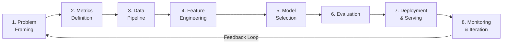

Before Step 1, add a Step 0 in your head: **should this even be ML yet?** Martin Zinkevich's *Rules of ML* makes this explicit: ship heuristics and instrumentation first when possible, keep the first model simple, and make metrics design a priority. In interviews, this is a strong signal because it shows product judgment rather than model obsession.

## Step-by-Step Approach

### Step 1 — Problem Framing & Requirements

| Question to Ask | Why It Matters |
|---|---|
| What is the business objective? | Guides metric selection and tradeoffs |
| What exact action will the model influence? | Tells you whether this is retrieval, ranking, classification, thresholding, or forecasting |
| Who are the end users? | Determines latency, UX constraints |
| What scale are we operating at? | Drives architecture choices |
| Is this real-time or batch? | Impacts serving infrastructure |
| Do we need ML on day 1, or is a heuristic / rule baseline enough? | Good ML systems often start with simple baselines and better logging |
| What are the false-positive vs false-negative costs? | Guides threshold tuning |
| What policy / privacy / fairness constraints exist? | Often adds filters, human review, or restricted features |
| What happens if the model times out? | Forces you to define a degraded serving path |
| What data is available? | Constrains model complexity |

### Step 2 — Metrics Definition

Always define metrics as a stack:

`Business objective -> online proxy metric -> offline training/evaluation metric -> guardrail metrics`

Example:

`Long-term user satisfaction -> valued watch time / satisfaction survey -> NDCG@K or watch probability -> latency, complaint rate, creator fairness`

| Metric Type | Examples | When to Use |
|---|---|---|
| **Business / North-Star** | Revenue, retention, successful bookings, long-term satisfaction | What the product actually cares about |
| **Online Proxy** | CTR, conversion rate, watch time, complaint rate | A/B testing and launch decisions |
| **Offline** | AUC-ROC, PR-AUC, F1, NDCG, Recall@K, calibration error | Model development and candidate comparison |
| **Guardrail** | Diversity, fairness, report rate, duplicate rate | Prevents a local win from hurting the product |
| **Infrastructure** | Latency (p50/p95/p99), throughput, feature freshness | Ensures the model can actually run in production |

Metric anti-patterns to call out in an interview:

- Optimizing raw CTR when you really care about satisfaction, trust, or conversions.
- Using only aggregate metrics and ignoring slices such as new users, long-tail items, or specific geographies.
- Reporting a strong offline metric without explaining how it maps to online impact.

### Step 3 — Data Pipeline

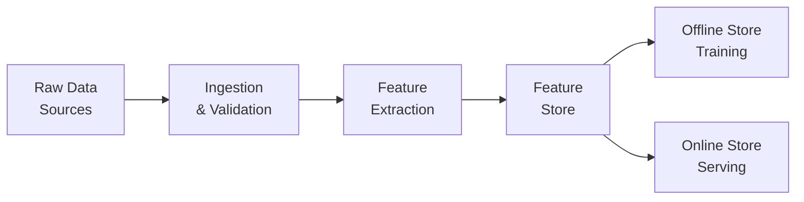

Key considerations:

- **Logging at decision time:** store the features and candidate set as seen at serving time, not just the final clicked item.
- **Label strategy:** decide whether labels come from human annotation, delayed business outcomes, or implicit feedback.
- **Selection bias:** for ranking and recommendation, labels are only observed for exposed items.
- **Negative sampling:** for retrieval and ranking problems, random negatives are often too easy; hard negatives improve training.
- **Leakage detection:** reject any feature that is only known after the decision is made.
- **Class imbalance:** choose PR-AUC / recall-focused metrics when positives are rare.
- **Train-serve consistency:** reuse the same transformations, tokenization, and feature definitions across preprocessing, training, and serving.

If the problem is a recommender or search system, explicitly mention **impression / exposure logs**. Without them, you cannot reason cleanly about what was eligible, shown, ignored, or never surfaced.

### Step 4 — Feature Engineering

Common feature categories across all ML systems:

| Category | Examples |
|---|---|
| **User features** | Demographics, history, preferences, engagement |
| **Item features** | Content type, metadata, embeddings, quality |
| **Context features** | Time of day, device, location, session length |
| **Cross features** | User-item interactions, affinity scores |
| **Aggregated features** | Counts, averages, rates over time windows |

Good interview answers usually separate features by both **entity** and **freshness**:

- Stable features: profile, catalog metadata, learned embeddings.
- Fresh features: recent clicks, session actions, inventory state, current location, time-sensitive aggregates.
- Expensive cross-features: often reserved for later ranking stages because they cannot be precomputed cheaply.

This also gives you a clean way to explain why two-tower retrieval models exclude strong user-item cross-features while heavier rankers include them later.

### Step 5 — Model Selection

| Consideration | Options |
|---|---|
| Baseline | Logistic Regression, heuristic rules |
| Classical ML | XGBoost, LightGBM, Random Forest |
| Deep Learning | MLP, CNN, Transformer, Two-Tower |
| Ensemble | Stacking, blending, model cascading |

Default interview stance:

- Start with the **simplest defensible baseline**.
- Upgrade only when the problem forces it: scale, multimodality, personalization depth, or label complexity.
- Say what the baseline buys you: easier debugging, faster launch, and a clear comparison point.

### Step 6–8 — Evaluation, Deployment, Monitoring

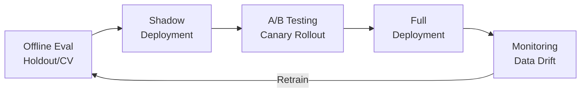

Production-grade evaluation is more than "monitor drift." Separate it into layers:

| Layer | What to Watch |
|---|---|
| **Data / pipeline** | Missing features, schema changes, stale joins, delayed events |
| **Prediction layer** | Score distribution, threshold behavior, calibration, unusual all-zeros / all-ones patterns |
| **Product / business** | CTR, conversion, complaint rate, latency, creator / marketplace health |
| **Slices** | New users, long-tail items, cold-start geos, high-risk content categories |

Chip Huyen explicitly warns that naive feature-drift alerting can create **alert fatigue**. In interviews, this is worth mentioning: monitor what is actionable, not every metric you can compute.

## Common Interview Patterns

Almost every ML system design follows a **multi-stage architecture**:

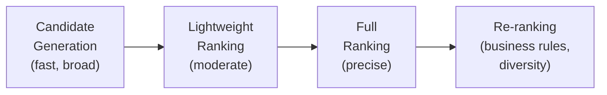

| Stage | Speed | Precision | Candidates |
|---|---|---|---|
| Candidate Generation | ~10ms | Low | Millions → Thousands |
| Lightweight Ranking | ~20ms | Medium | Thousands → Hundreds |
| Full Ranking | ~50ms | High | Hundreds → Tens |
| Re-ranking | ~10ms | Context-aware | Tens → Final list |

In stronger answers, you also name where the non-ML pieces live:

- **Candidate sources:** personalized retrieval, similar-item retrieval, trending / popular, fresh inventory, exploration.
- **Policy / eligibility filters:** blocked content, privacy, marketplace constraints, availability.
- **Fallbacks:** cached recommendations, popular items, rule-based heuristics, previous-session results.

---

# Chapter 2: Visual Search System

**Example systems:** Google Lens, Pinterest Visual Search, Amazon StyleSnap

## Problem Statement

Given an image query, find visually similar items from a catalog of billions of images. Return ranked results within 200ms.

## High-Level Architecture

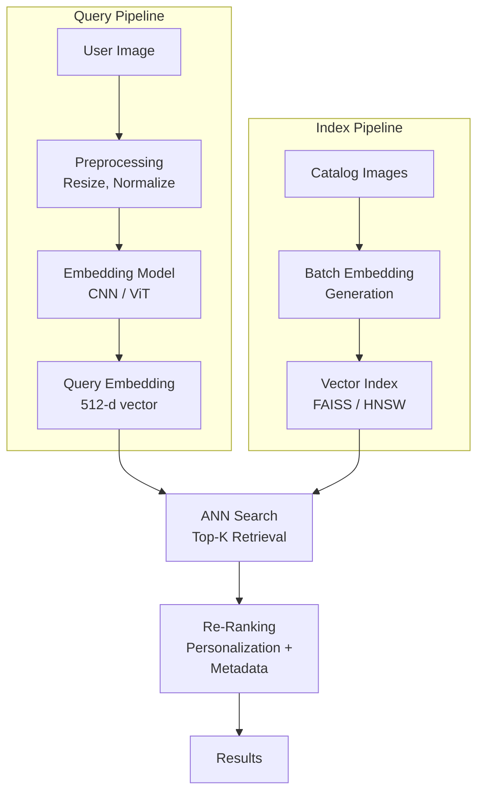

## Embedding Models

| Model | Architecture | Strengths | Typical Dim |
|---|---|---|---|
| ResNet-50/101 | CNN | Fast, well-understood | 2048 → 512 |
| EfficientNet | CNN | Better accuracy/compute tradeoff | 512 |
| ViT (Vision Transformer) | Transformer | Best for long-range dependencies | 768 |
| CLIP | Vision-Language | Cross-modal (image + text) | 512 |

### How ViT Works

```
Image (224×224) → Split into 16×16 patches → Flatten each patch
→ Linear projection → Add positional embeddings
→ Transformer Encoder (self-attention) → [CLS] token = image embedding
```

## Vector Indexing & ANN Search

| Method | How It Works | Recall | Speed | Memory |
|---|---|---|---|---|
| **Flat (Brute Force)** | Compare all vectors | 100% | Slow | High |
| **IVF** | Partition space into cells, search relevant cells | 95%+ | Fast | Medium |
| **HNSW** | Hierarchical graph, greedy traversal | 95%+ | Very fast | High |
| **IVF + PQ** | IVF with Product Quantization compression | 90%+ | Very fast | Low |

### HNSW Deep Dive

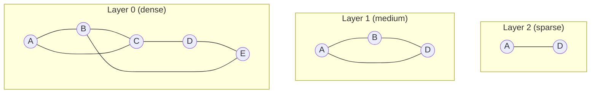

Key tuning parameters:
- `efSearch`: controls query-time recall (higher = more accurate, slower)
- `m`: graph connectivity (higher = better recall, more memory)
- `efConstruction`: build-time quality (higher = better graph, slower build)

## Training: Contrastive & Triplet Loss

### Contrastive Loss

```
L = (1-y) · ½ · D² + y · ½ · max(0, margin - D)²

where y=0 for similar pairs, y=1 for dissimilar pairs, D = embedding distance
```

### Triplet Loss

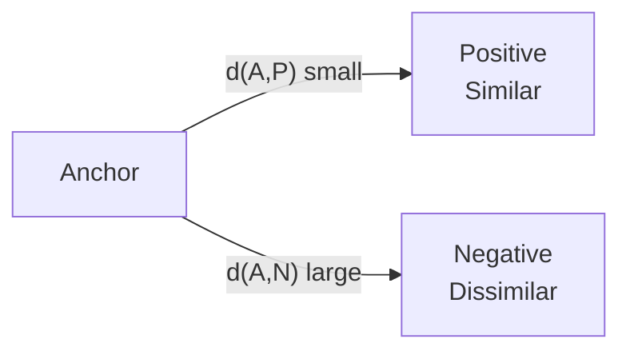

```
L = max(d(anchor, positive) - d(anchor, negative) + margin, 0)
```

| Loss | Pros | Cons |
|---|---|---|
| Contrastive | Simpler, pairs only | Smoother but less discriminative |
| Triplet | More discriminative, preserves fine details | Hard negative mining needed |

## Evaluation Metrics

| Metric | Formula | Interpretation |
|---|---|---|
| **Recall@K** | (relevant in top-K) / total relevant | "Did I find most relevant items?" |
| **Precision@K** | (relevant in top-K) / K | "Are top-K results mostly relevant?" |
| **MRR** | 1 / rank of first relevant item | "How quickly do I find something good?" |
| **Latency** | p50 / p99 query time | "Is it fast enough for real-time?" |

## Interview Talking Points

- Pinterest uses **unified embeddings** serving multiple products (visual search, related pins, shopping)
- Cold-start items use metadata-based embeddings until enough interaction data accumulates
- Production systems add **caching layers** (Redis/Memcached) for popular queries
- **Incremental indexing** avoids full re-index of billions of embeddings

---

# Chapter 3: Google Street View Blurring System

**Goal:** Automatically detect and blur all faces and license plates across billions of Street View images to protect privacy.

## Problem Statement

Process billions of panoramic images to detect and blur all identifiable faces and license plates. The system must prioritize recall (miss no faces) over precision (tolerate some false positives / over-blurring).

## High-Level Architecture

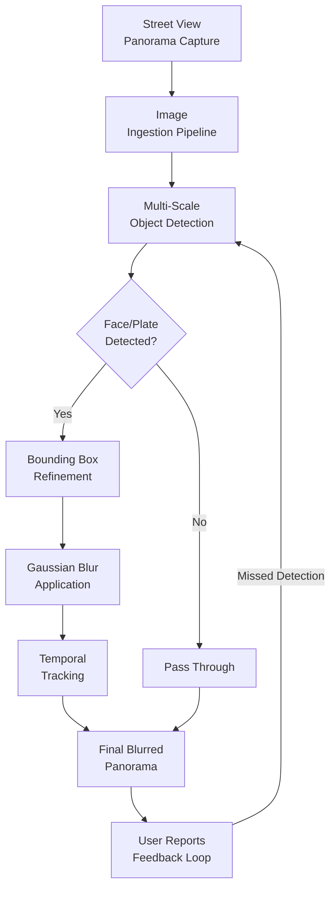

## Detection Pipeline

### Two-Stage Approach

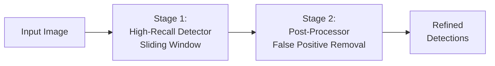

**Stage 1 — High-Recall Detector:** Sliding-window detector tuned to catch nearly every face/plate, accepting many false positives.

**Stage 2 — Post-Processor:** Heuristic-based filter removes obvious false positives (face-like patterns on signs, artwork, etc.).

## Object Detection Model Comparison

| Model | Type | Speed (FPS) | Accuracy | Best For |
|---|---|---|---|---|
| **YOLO** | Single-stage | ~45 | Good | Real-time, speed-critical |
| **SSD** | Single-stage | ~38 | Better | Balance of speed/accuracy |
| **Faster R-CNN** | Two-stage | ~27 | Best | High accuracy requirements |
| **RetinaFace** | Specialized | ~30 | Best (faces) | Face-specific detection |

For Street View, Google likely uses a **Faster R-CNN variant** with a face-specific head, prioritizing recall.

## Challenges at Scale

### Detection Challenges

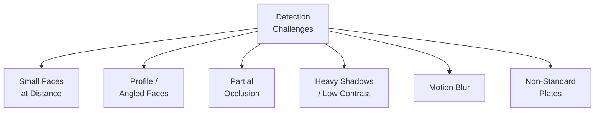

### Multi-Scale Processing

Process each image at multiple resolutions to handle faces at different distances:

| Scale | Target | Detection |
|---|---|---|
| Full resolution | Nearby faces (large) | High confidence |
| 2× downsampled | Medium distance | Moderate confidence |
| 4× downsampled | Far distance (small faces) | Lower confidence, higher recall threshold |

### Temporal Tracking Across Frames

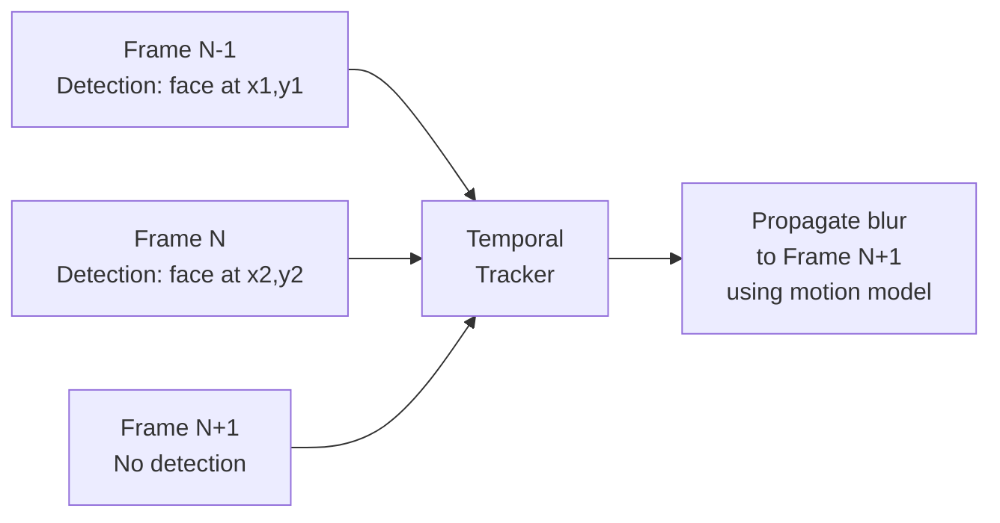

Tracking reduces flickering (inconsistent blur across frames) and catches faces missed in individual frames.

## Precision-Recall Tradeoffs

| Metric | Priority | Rationale |
|---|---|---|
| **Recall** | **Critical (>89%)** | Missing a face = privacy violation |
| **Precision** | Important but secondary | Over-blurring a sign is acceptable |
| **Throughput** | High | Must process billions of images |
| **Latency** | Moderate | Batch processing, not real-time |

### Threshold Tuning Decision

```
High Recall (low threshold) → More faces caught, more false positives (over-blurring)
High Precision (high threshold) → Fewer false alarms, but misses some faces

For privacy: ALWAYS choose high recall.
```

## Reported Performance

- Face detection recall: **89%+**
- License plate detection recall: **94–96%**
- User report system for missed detections enables continuous improvement

## Interview Talking Points

- This is fundamentally a **high-recall binary detection** problem, not a ranking problem
- Key tradeoff: privacy (recall) vs visual quality (precision)
- Scale is the differentiator — billions of images require distributed batch processing
- Temporal consistency across panoramic sequences prevents flickering
- Human feedback loop (user reports) provides ongoing quality improvement

---

# Chapter 4: YouTube Video Search

**Goal:** Match text queries to relevant videos from a corpus of hundreds of millions of videos using multi-modal understanding.

## Problem Statement

Given a text search query, return the most relevant videos ranked by relevance. Must handle: exact matches, semantic matches, and cross-modal understanding (text query → video content).

## High-Level Architecture

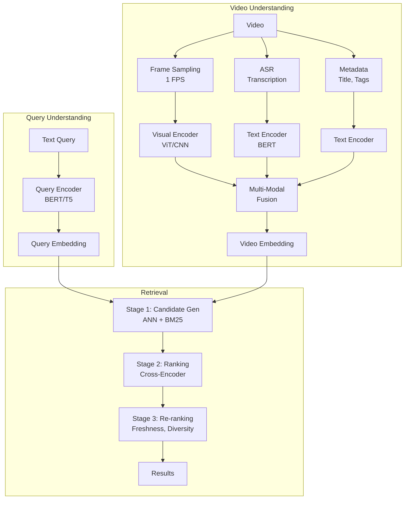

## Video Understanding Pipeline

### Frame Sampling Strategies

| Strategy | Method | Tradeoff |
|---|---|---|
| Uniform | 1 frame/sec | Simple, may miss key moments |
| Shot-boundary | Detect scene changes, sample at boundaries | Better coverage, more compute |
| Keyframe | Cluster frames, select representatives | Efficient, may miss transitions |
| Query-aware | Sample frames relevant to query | Best relevance, requires query at index time |

### Multi-Modal Feature Extraction

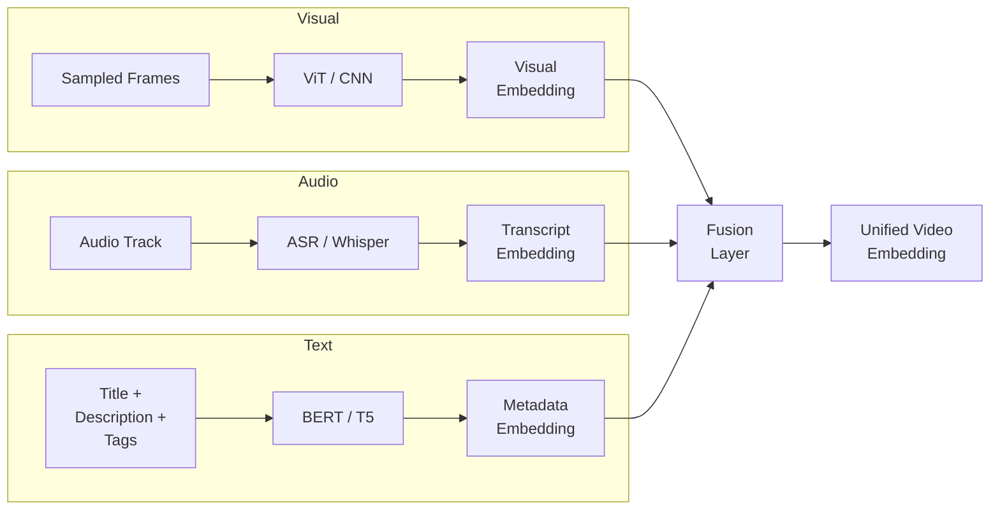

**Fusion approaches:**
- **Early fusion:** Concatenate raw features before encoding
- **Late fusion:** Encode separately, combine embeddings (weighted sum, attention)
- **Cross-modal attention:** Transformer attending across modalities

## Two-Stage Retrieval

### Stage 1 — Candidate Generation

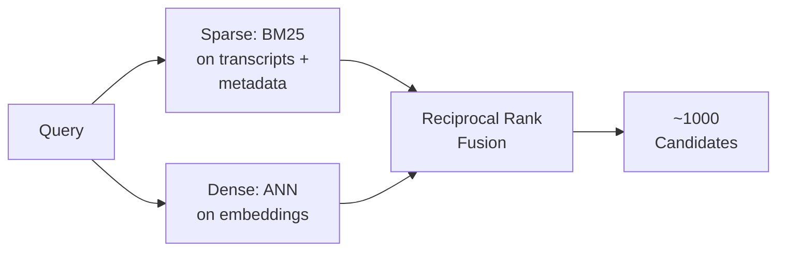

**Hybrid retrieval** combines:
- **BM25 (sparse):** Lexical matching on transcripts, titles, descriptions
- **Dense retrieval:** Semantic matching via embedding similarity
- **RRF:** Merges ranked lists from both methods

### Stage 2 — Ranking

| Feature Type | Examples |
|---|---|
| Query-video relevance | Cosine similarity, cross-encoder score |
| Engagement | Historical CTR, avg watch time, likes/dislikes |
| Freshness | Upload date, trending score |
| Quality | Video resolution, channel authority |
| User context | Watch history, subscriptions, location |

## Evaluation Metrics

| Metric | Formula | Best For |
|---|---|---|
| **NDCG@K** | Discounted cumulative gain / ideal DCG | Graded relevance ranking |
| **MRR** | 1 / rank of first relevant result | "First good result" speed |
| **Precision@K** | Relevant in top-K / K | Result quality |
| **Recall@K** | Relevant in top-K / total relevant | Coverage |

### NDCG Calculation Example

```
Query: "how to make pasta"
Results: [Exact match (3), Substitute (2), Irrelevant (0), Related (1)]

DCG@4 = 3/log2(2) + 2/log2(3) + 0/log2(4) + 1/log2(5)
       = 3 + 1.26 + 0 + 0.43 = 4.69

Ideal order: [3, 2, 1, 0]
IDCG@4 = 3 + 1.26 + 0.5 + 0 = 4.76

NDCG@4 = 4.69 / 4.76 = 0.985
```

## Interview Talking Points

- Modern systems use **multi-modal LLMs** (Gemini-style) for video understanding — +60% improvement from audio descriptions
- **Query understanding** is as important as video understanding (query expansion, spell correction, intent classification)
- Frame sampling strategy significantly impacts both cost and quality
- BM25 + dense hybrid outperforms either alone for search

---

# Chapter 5: Harmful Content Detection

**Example systems:** Facebook/Meta content moderation, YouTube Trust & Safety, TikTok content review

## Problem Statement

Classify user-generated content (text, images, video) as harmful or safe in near-real-time. Must handle multiple harm categories with extremely high precision to avoid censoring legitimate content.

## High-Level Architecture

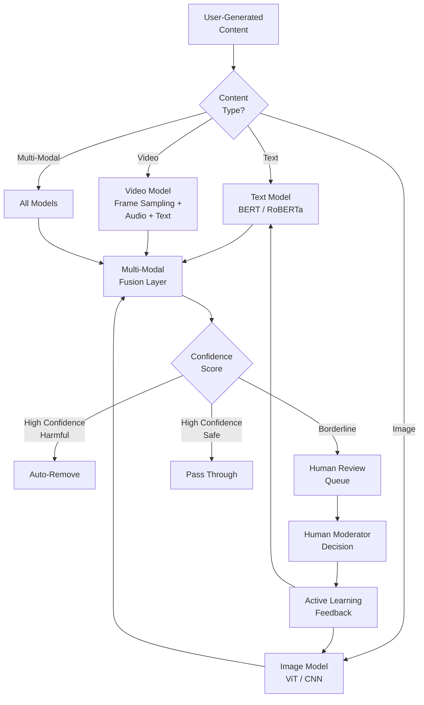

## Classification Taxonomy

| Category | Sub-types | Detection Challenge |
|---|---|---|
| **Hate Speech** | Racial, religious, gender-based | Context-dependent, sarcasm, coded language |
| **Violence** | Graphic, threats, incitement | Distinguishing news reporting vs glorification |
| **Nudity/Sexual** | Explicit content, exploitation | Art vs exploitation, medical context |
| **Spam** | Commercial, engagement bait | Evolving tactics, new accounts |
| **Misinformation** | Health, political, financial | Requires factual verification |
| **Harassment** | Bullying, doxxing, stalking | Relationship context needed |

## Model Architecture by Modality

### Text Classification

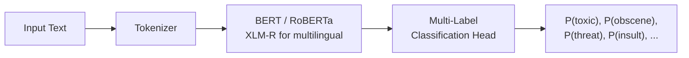

**Key models:** BERT, RoBERTa, XLM-R (multilingual), FastText (lightweight for high-throughput)

### Image Classification

```
Image → CNN/ViT Feature Extractor → Classification Head → [P(nudity), P(violence), P(gore), ...]
```

**Perceptual hashing:** Detect previously flagged images even with modifications (crops, filters, overlays).

### Multi-Modal Fusion

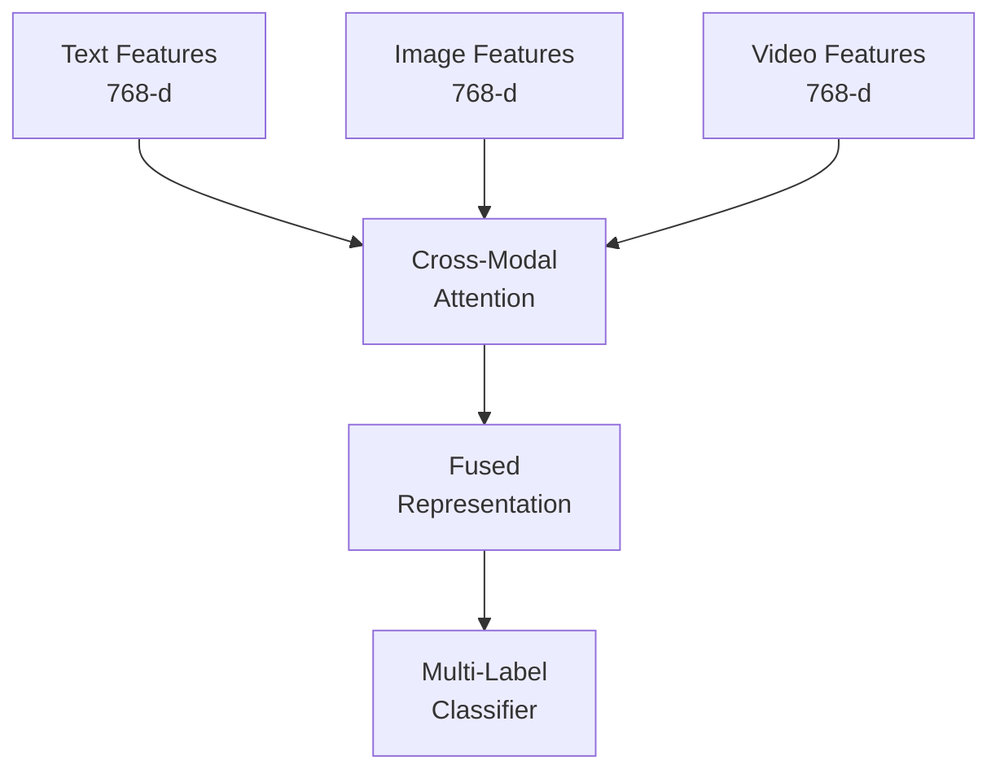

**Approaches:**
- **Max-pooling:** Take max prediction across modalities (simple, robust)
- **Learned fusion:** Attention-weighted combination (more accurate, complex)
- **Late fusion:** Separate predictions combined by rules/ensemble

## Precision vs Recall Tradeoffs

| Scenario | Priority | Rationale |
|---|---|---|
| Child safety content | **Recall** | Must catch all instances |
| General hate speech | **Precision** | Over-censoring damages user trust |
| Spam detection | **Precision** | Users tolerate some spam vs losing real content |
| Terrorist content | **Recall** | Legal obligations, safety critical |

### Threshold Strategy


## Active Learning Pipeline

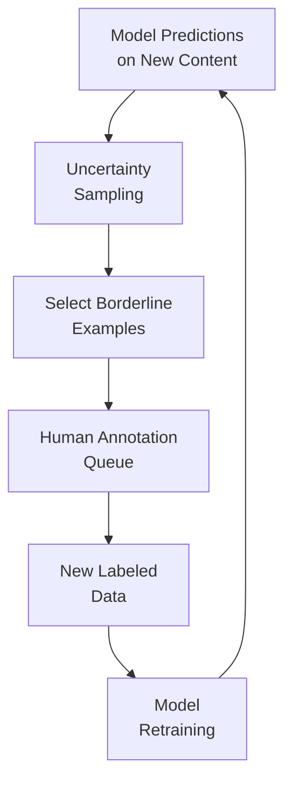

Active learning selects the most informative examples for human labeling, maximizing label efficiency.

## Adversarial Attacks & Defenses

| Attack Type | Example | Defense |
|---|---|---|
| Unicode homoglyphs | "hаte" (Cyrillic 'а') | Unicode normalization |
| Text in images | Hate text as image overlay | OCR + text classification |
| Misspellings | "h8" for "hate" | Character-level models, augmentation |
| Token splitting | "ha" + "te" across tokens | Subword-aware models |
| Image modifications | Mosaics, filters on violent images | Adversarial training, perceptual hashing |

## Evaluation Metrics

| Metric | Target | Notes |
|---|---|---|
| **Precision** | >0.85 | Minimize false positives (wrongful removal) |
| **Recall** | Varies by category | Higher for safety-critical categories |
| **AUC-ROC** | >0.95 | Overall discrimination ability |
| **Latency** | <500ms | Near-real-time classification |
| **Human appeal overturn rate** | <5% | Measures false positive impact |

## Interview Talking Points

- This is a **multi-label, multi-modal classification** problem — not binary
- Precision is often more important than recall (except for child safety / terrorism)
- **Adversarial robustness** is a first-class concern, not an afterthought
- Human-in-the-loop is essential — AI alone cannot capture cultural context
- System must adapt in **weeks, not months** as new harm patterns emerge

---

# Chapter 6: Video Recommendation System

**Example systems:** YouTube, Netflix, TikTok

## Problem Statement

Given a user's history and context, recommend videos that maximize long-term engagement and satisfaction from a corpus of millions of videos.

## High-Level Architecture

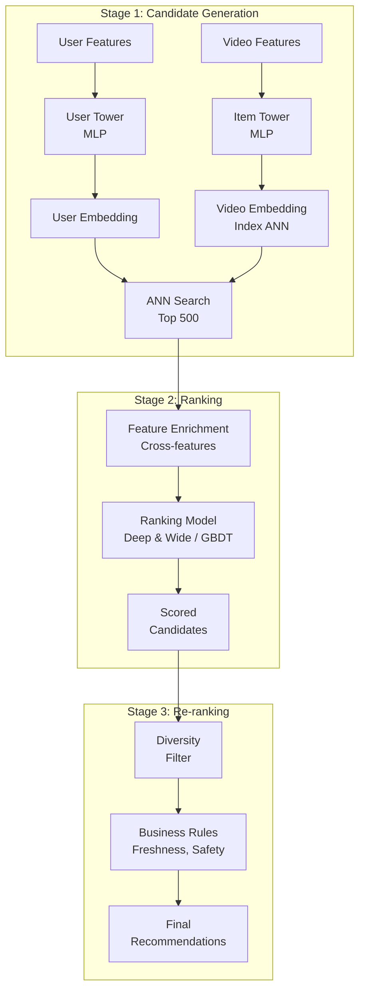

## Two-Tower Model (Candidate Generation)

```mermaid
flowchart TB
    subgraph User Tower
        U1[User ID\nEmbedding] --> U4[Concat]
        U2[Watch History\nAvg Embedding] --> U4
        U3[Demographics\nDevice, Time] --> U4
        U4 --> U5[MLP Layers\n256 → 128 → 64]
        U5 --> U6[User Vector\n64-d]
    end

    subgraph Item Tower
        I1[Video ID\nEmbedding] --> I4[Concat]
        I2[Category\nEmbedding] --> I4
        I3[Description\nEmbedding] --> I4
        I4 --> I5[MLP Layers\n256 → 128 → 64]
        I5 --> I6[Item Vector\n64-d]
    end

    U6 --> S["Similarity = dot(user, item)"]
    I6 --> S
```

**Why Two-Tower?** User and item embeddings are computed independently, enabling:
- Pre-computation and caching of item embeddings
- Real-time ANN lookup at serving time (O(log N) vs O(N))
- Scales to millions of items

## User & Item Feature Tables

### User Features

| Feature | Type | Source |
|---|---|---|
| User ID embedding | Learned | Interaction data |
| Watch history (recent 50) | Avg embedding | Watch logs |
| Search query tokens | Embedding | Search logs |
| Demographics | Categorical | Profile |
| Device, OS | Categorical | Request headers |
| Time of day, day of week | Numerical | Request timestamp |
| Subscription list | Embedding | Account data |
| Geographic region | Categorical | IP / profile |

### Video Features

| Feature | Type | Source |
|---|---|---|
| Video ID embedding | Learned | Interaction data |
| Channel ID embedding | Learned | Channel data |
| Category, tags | Categorical | Metadata |
| Title/description embedding | Text model | NLP pipeline |
| Video age (days since upload) | Numerical | Metadata |
| Historical engagement | Numerical | Aggregated logs |
| Duration | Numerical | Metadata |
| Thumbnail quality score | Numerical | Image model |

## Ranking Model

The ranking model uses **all features including cross-features** that the two-tower model cannot capture:

```mermaid
flowchart LR
    A[User Features] --> C[Feature\nCrossing\nLayer]
    B[Video Features] --> C
    C --> D[Deep Network\nMLP Layers]
    A --> E[Wide Network\nLinear]
    B --> E
    D --> F[Combine]
    E --> F
    F --> G["P(click), P(watch),\nP(like), P(share)"]
```

## Cold Start Solutions

| Scenario | Strategy |
|---|---|
| **New user** | Use demographics + context; explore diverse content; gradually personalize |
| **New video** | Content-based features (title, description, thumbnail); channel reputation |
| **New creator** | Similar channel features; content similarity to popular videos |

## Exploration vs Exploitation

| Strategy | How It Works | Tradeoff |
|---|---|---|
| **Epsilon-greedy** | Random recommendations with probability ε | Simple, but wastes ε fraction |
| **UCB** | Optimistic estimate for uncertain items | Better exploration, more complex |
| **Thompson Sampling** | Bayesian sampling from posterior | Best theoretical guarantees |
| **Diversity constraints** | Force category diversity in results | Explicit diversification |

## Evaluation Metrics

| Metric | What It Measures | Limitation |
|---|---|---|
| **CTR** | Click probability | Clickbait gets high CTR |
| **Watch time** | Total viewing duration | Can create filter bubbles |
| **Valued watch time** | Watch time × satisfaction | Better long-term signal |
| **User satisfaction** | Survey-based quality | Expensive to measure |
| **Session length** | Time spent on platform | Doesn't capture quality |
| **Content diversity** | Variety of recommendations | Tradeoff with relevance |

## Interview Talking Points

- YouTube uses **hundreds of billions** of training examples for its model
- The two-tower architecture is the **industry standard** for candidate generation (YouTube, Pinterest, Airbnb)
- Watch time alone leads to **filter bubbles**; modern systems optimize for "valued watch time"
- **Multi-task learning** predicts multiple objectives (click, watch, like, share) simultaneously
- A/B testing with holdout groups is essential to measure true impact vs feedback loops

---

# Chapter 7: Event Recommendation System

**Example systems:** Eventbrite, Meetup, Facebook Events

## Problem Statement

Recommend relevant events to users considering time sensitivity, geographic constraints, and extremely sparse interaction data. Events are typically one-time (non-repeating), making this fundamentally different from product/video recommendation.

## Key Differences from General Recommendation

| Challenge | Video/Product Rec | Event Rec |
|---|---|---|
| Item lifespan | Permanent | Temporary (hours to weeks) |
| Interaction data | Dense | Very sparse |
| Location constraint | Weak | Critical |
| Time constraint | Weak | Critical (specific date/time) |
| Cold start severity | Moderate | Extreme (every event is new) |
| Repeat consumption | Common | Rare |

## High-Level Architecture

```mermaid
flowchart TB
    subgraph Feature Extraction
        A[User Profile\n& History] --> D[User\nFeatures]
        B[Event\nMetadata] --> E[Event\nFeatures]
        C[Context\nSignals] --> F[Context\nFeatures]
    end

    subgraph Filtering
        D --> G[Location Filter\n< 30km radius]
        E --> G
        F --> G
        G --> H[Time Filter\nNext 30 days]
    end

    subgraph Scoring
        H --> I[Content-Based\nScore]
        H --> J[Collaborative\nFiltering Score]
        I --> K[Hybrid\nCombination]
        J --> K
    end

    K --> L[Ranked Event\nRecommendations]
```

## Feature Engineering

### User Features

| Feature | Type | Notes |
|---|---|---|
| Category preferences | Vector | Inferred from past attendance |
| Location (home, work) | Geo-coords | From profile / history |
| Price tolerance | Numerical | Derived from past bookings |
| Social graph | Graph embedding | Friends, group memberships |
| Temporal preferences | Pattern | Weekday vs weekend, time of day |
| Past attendance | Embedding | Avg of attended event embeddings |

### Event Features

| Feature | Type | Notes |
|---|---|---|
| Category | Categorical | Music, tech, sports, etc. |
| Location | Geo-coords + venue type | Indoor/outdoor, capacity |
| Date/time | Temporal | Start, end, duration |
| Price | Numerical | Free, low, medium, high |
| Description embedding | Dense vector | From NLP encoder |
| Organizer reputation | Numerical | Past event ratings, attendance |
| Social signal | Count | Friends registered |
| Walk/transit/bike score | Numerical | Accessibility |

## Hybrid Model Architecture

```mermaid
flowchart TB
    subgraph Content-Based
        A[User Preference\nVector] --> C[Cosine\nSimilarity]
        B[Event Feature\nVector] --> C
        C --> D[Content\nScore]
    end

    subgraph Collaborative Filtering
        E[Similar Users\nClustering] --> G[CF\nScore]
        F[Co-attendance\nPatterns] --> G
    end

    D --> H[Weighted\nCombination]
    G --> H
    H --> I[Final\nScore]
```

**Adaptive weighting:** When user history is rich, weight collaborative filtering higher. For new users, weight content-based higher. For new events, rely entirely on content features.

## Cold Start Strategies

| Scenario | Strategy |
|---|---|
| **New event** | Content features (category, location, organizer history) → find similar past events → transfer patterns |
| **New user** | Popular events in user's location; onboarding quiz for preferences |
| **New organizer** | Match to similar organizers; use event metadata features only |

## Evaluation Metrics

| Metric | Definition | Target |
|---|---|---|
| **Attendance rate** | Attended / recommended | Primary conversion metric |
| **CTR** | Clicked / shown | Engagement signal |
| **NDCG@K** | Ranking quality | >0.7 |
| **Coverage** | % of events recommended at least once | Avoid popularity bias |
| **Diversity** | Category spread in recommendations | Balanced discovery |

## Interview Talking Points

- Temporal and geographic filtering **before** ML scoring is essential for efficiency
- Class imbalance is severe: "not interested" vastly outnumbers "interested" (3:1+)
- Social signals ("3 friends going") are among the strongest features
- **Graph-based propagation** helps new events inherit signals from similar past events
- Real-time location matters: recommendations should update when user travels

---

# Chapter 8: Ad Click Prediction on Social Platforms

**Example systems:** Facebook/Meta Ads, Google Ads, Twitter/X Ads

## Problem Statement

Predict the probability a user will click on a given ad (pCTR). This prediction is used in the ad auction: **Ad Rank = Bid × pCTR + Quality Score**. Must serve predictions at <100ms latency for billions of daily requests.

## System Architecture

```mermaid
flowchart TB
    subgraph "Ad Auction Pipeline"
        A[Ad Request\nUser + Context] --> B[Candidate\nRetrieval]
        B --> C[Feature\nAssembly]
        C --> D[pCTR Model\nInference]
        D --> E["Score = Bid × pCTR\n+ Quality"]
        E --> F[Auction\nRanking]
        F --> G[Winning Ad\nServed]
    end

    subgraph "Training Pipeline"
        H[Click/Impression\nLogs] --> I[Feature\nExtraction]
        I --> J[Online\nTraining]
        J --> K[Model\nUpdate]
        K --> D
    end
```

## Feature Engineering (The Core of Ad Prediction)

### Feature Categories

| Category | Features | Examples |
|---|---|---|
| **User** | Demographics, interests, engagement history | Age group, "likes sports," avg daily scroll time |
| **Ad** | Creative, format, advertiser, historical CTR | Image ad, Nike, 2.1% historical CTR |
| **Context** | Time, device, placement, page type | 8pm, iPhone, feed placement |
| **Cross** | User × Ad interactions | "User who likes sports" × "Nike ad" |
| **Social** | Friend interactions with ad/advertiser | "3 friends liked this page" |

### Feature Interaction Importance

```mermaid
flowchart LR
    A["User: likes sports"] --> C["Cross Feature:\nSports fan × Nike ad\n→ HIGH relevance"]
    B["Ad: Nike running shoes"] --> C
```

Cross-features capture conditional preferences that individual features cannot.

## Model Architecture Evolution

```mermaid
flowchart TB
    A[Logistic Regression\nBaseline] --> B[LR + GBDT\nFacebook 2014\n+3% improvement]
    B --> C["Wide & Deep\nGoogle 2016\nMemorization +\nGeneralization"]
    C --> D["DeepFM\n2017\nAuto feature\ncrossing"]
    D --> E["DIN\nAlibaba 2018\nAttention on\nuser history"]
    E --> F["Modern: DCN v2,\nGEM Meta 2024\nGenerative models"]
```

### Model Comparison

| Model | Feature Crossing | Strengths | Weaknesses |
|---|---|---|---|
| **Logistic Regression** | Manual | Fast, interpretable | Limited capacity |
| **GBDT + LR** | Tree-based | Good feature interactions | Slow online update |
| **Wide & Deep** | Manual (wide) + learned (deep) | Memorization + generalization | Manual wide features |
| **DeepFM** | FM layer (auto) + deep MLP | No manual feature engineering | Training complexity |
| **DIN** | Attention-weighted history | Adapts to target ad | Serving complexity |

### DeepFM Architecture

```mermaid
flowchart TB
    subgraph Input
        A[Sparse Features\nUser ID, Ad ID, etc.] --> B[Embedding\nLayer]
    end

    subgraph FM Component
        B --> C[Factorization Machine\nOrder-2 interactions]
    end

    subgraph Deep Component
        B --> D[Hidden Layer 1]
        D --> E[Hidden Layer 2]
        E --> F[Hidden Layer 3]
    end

    C --> G[Sigmoid\nOutput]
    F --> G
    G --> H["P(click)"]
```

## Training Pipeline

### Online Learning

```mermaid
flowchart LR
    A[User Clicks\n/ Impressions] --> B[Feature\nExtraction]
    B --> C[Stream\nProcessing]
    C --> D[Incremental\nModel Update]
    D --> E[Updated Model\nServing]
```

**Why online learning?** Ad performance changes rapidly (seasonal trends, campaign launches, user fatigue). Batch-trained models become stale within hours.

### Feature Store Architecture

| Store | Purpose | Latency | Data |
|---|---|---|---|
| **Online Store** (Redis) | Real-time serving | <10ms | Latest feature values |
| **Offline Store** (Hive/S3) | Training data | Minutes | Historical features |
| **Streaming** (Kafka) | Real-time updates | <1s | Fresh engagement signals |

## Calibration

**Why calibration matters:** pCTR is directly multiplied by bid in the auction. If pCTR is systematically biased, the auction produces suboptimal results.

**Normalized Cross-Entropy (NCE):**
```
NCE = Observed LogLoss / Expected LogLoss at baseline CTR

NCE = 1.0 → model no better than predicting average CTR
NCE < 1.0 → model adds predictive value
```

## Evaluation Metrics

| Metric | Formula | What It Measures |
|---|---|---|
| **AUC-ROC** | Area under ROC curve | Ranking quality (discrimination) |
| **LogLoss** | -Σ [y·log(p) + (1-y)·log(1-p)] | Calibration + discrimination |
| **NCE** | LogLoss / baseline LogLoss | Relative improvement |
| **Calibration** | predicted CTR / actual CTR | Should be ≈1.0 |
| **Revenue** | Sum of winning bids × conversions | Business metric |

## Serving Infrastructure

| Component | Requirement | Solution |
|---|---|---|
| Latency | <100ms p99 | Model distillation, quantization |
| Throughput | Millions QPS | Horizontal scaling, batching |
| Feature lookup | <10ms | Redis, in-memory feature stores |
| Model freshness | Hours | Online learning, streaming updates |

## Interview Talking Points

- **Feature engineering is 80% of the work** — model architecture matters less than features
- Calibration is critical because pCTR directly enters the auction formula
- **Online learning** is essential for freshness; batch models become stale quickly
- Meta's Andromeda system achieved **+6% recall** with generative retrieval
- Cross-features (user × ad) are the most predictive features

---

# Chapter 9: Similar Listings on Vacation Rental Platforms

**Example system:** Airbnb "Similar Listings" and search ranking

## Problem Statement

Given a listing a user is viewing, show similar listings they might also like. Must capture both content similarity (amenities, location, style) and behavioral similarity (users who liked this also liked that).

## Airbnb's Embedding Approach

```mermaid
flowchart TB
    subgraph Training
        A[User Search\nSessions] --> B[Click Sequences\nper Session]
        B --> C[Skip-gram\nWord2Vec-style\nTraining]
        C --> D[32-d Listing\nEmbeddings]
    end

    subgraph Serving
        E[Current Listing\nEmbedding] --> F[ANN Search\nNearest Neighbors]
        D --> F
        F --> G[Top-K Similar\nListings]
        G --> H[Re-rank by\nAvailability, Price]
        H --> I[Similar Listings\nCarousel]
    end
```

## Embedding Learning Details

### Training Data: Search Sessions

```
Session 1: [listing_A, listing_B, listing_C, listing_D (BOOKED)]
Session 2: [listing_E, listing_F, listing_G]
```

Each session is treated like a "sentence" in Word2Vec — listings co-clicked in a session are "context words."

### Negative Sampling Strategy

| Type | Method | Purpose |
|---|---|---|
| **Random negatives** | Sample from all listings | General dissimilarity signal |
| **Market-aware negatives** | Sample from same city/region | Prevent geographic shortcut |
| **In-batch negatives** | Other batch examples as negatives | Efficient at scale |

**Problem with random-only negatives:** Positive pairs are from the same market, random negatives are from everywhere. Model learns "same city = similar" rather than actual listing quality similarity.

**Fix:** Add explicit negatives from the same market to force the model to learn finer-grained distinctions.

### Booking-Aware Training

```mermaid
flowchart LR
    A[Click 1] --> B[Click 2]
    B --> C[Click 3]
    C --> D["Booked ★"]

    D -.->|"Global context\n(always in window)"| A
    D -.->|"Global context"| B
    D -.->|"Global context"| C
```

The booked listing acts as a global context that influences all other listing embeddings in the session, ensuring the model learns what leads to bookings.

## Feature Categories

| Feature | Type | Source |
|---|---|---|
| Listing embedding (32-d) | Dense | Learned from sessions |
| Price | Numerical | Listing metadata |
| Location | Geo-coords | Listing metadata |
| Property type | Categorical | House, apt, condo, etc. |
| Amenities | Multi-hot | Pool, WiFi, kitchen, etc. |
| Rating | Numerical | Review aggregation |
| Review sentiment | Dense | NLP on review text |
| Photo quality | Numerical | Image quality model |
| Capacity | Numerical | Guests, beds, bathrooms |
| Availability | Binary/Calendar | Booking system |

## Cold Start for New Listings

```
New listing → Find 3 nearest listings by:
  1. Same property type
  2. Same price range
  3. Geographically closest

New listing embedding = mean(3 neighbor embeddings)
```

## Two-Tower Retrieval Model

```mermaid
flowchart TB
    subgraph Query Tower
        Q1[Search Query\nLocation, Dates,\nGuests] --> Q2[MLP]
        Q2 --> Q3[Query\nEmbedding]
    end

    subgraph Listing Tower
        L1[Listing Features\nEmbedding +\nMetadata] --> L2[MLP]
        L2 --> L3[Listing\nEmbedding]
    end

    Q3 --> S["Score = dot(query, listing)"]
    L3 --> S
```

### ANN Index Choice

| Method | Update Frequency | Recall | Chosen? |
|---|---|---|---|
| HNSW | Slow to update | Slightly better | No |
| IVF | Fast to update | Good | **Yes** |

Airbnb chose **IVF** because listing availability and price change constantly, requiring frequent index updates that HNSW handles poorly.

## Business Impact

- Similar Listings carousel + Search Ranking drive **99% of booking conversions**
- Embedding-based retrieval showed booking lift **on par with largest ML improvements to search ranking in prior two years**

## Evaluation Metrics

| Metric | What It Measures |
|---|---|
| **Booking conversion rate** | Primary: did users book from similar listings? |
| **CTR on carousel** | Are similar listings interesting? |
| **Session engagement** | Dwell time, saves, shares |
| **Price alignment** | Are similar listings in comparable price range? |
| **Geographic relevance** | Are recommendations in the right area? |

## Interview Talking Points

- Airbnb's key insight: **user search sessions = implicit similarity labels** (Word2Vec on listings)
- Market-aware negative sampling prevents the model from learning a geographic shortcut
- **IVF > HNSW** for Airbnb because listings need frequent index updates (availability changes daily)
- Cold-start solved by averaging embeddings of nearest same-type/price/location listings
- Booking signal as global context is a clever architectural choice that improves conversion

---

# Chapter 10: Personalized News Feed

**Example systems:** Facebook News Feed, Twitter/X Timeline, LinkedIn Feed

## Problem Statement

Rank thousands of candidate posts for each user to create a personalized feed that maximizes long-term engagement and satisfaction, balancing multiple objectives (relevance, diversity, quality).

## Multi-Stage Ranking Pipeline

```mermaid
flowchart TB
    A["All Eligible Posts\n(10,000+)"] --> B["Stage 1: Candidate Generation\nFast filter → 1,000"]
    B --> C["Stage 2: Lightweight Ranking\nSimple model → 500"]
    C --> D["Stage 3: Full Ranking\nDeep model with 100K+ features → 50"]
    D --> E["Stage 4: Contextual Re-ranking\nDiversity, business rules → 20"]
    E --> F["Final Feed"]
```

### Stage Details

| Stage | Model | Latency Budget | Input | Output |
|---|---|---|---|---|
| Candidate Gen | Rules + simple models | ~5ms | 10,000+ posts | ~1,000 |
| Lightweight Ranking | Small GBDT/MLP | ~10ms | ~1,000 | ~500 |
| Full Ranking | Deep model (100K+ features) | ~50ms | ~500 | ~50 |
| Re-ranking | Rules + diversity model | ~10ms | ~50 | ~20 |

## Feature Categories

### User Features

| Feature | Type | Update Frequency |
|---|---|---|
| Engagement history (likes, comments, shares) | Aggregated counts | Real-time |
| Topic interests | Embedding | Hourly |
| Social graph strength | Affinity scores | Daily |
| Active hours pattern | Temporal | Weekly |
| Device, location | Contextual | Per-request |

### Post Features

| Feature | Type | Update Frequency |
|---|---|---|
| Content type (text, photo, video, link) | Categorical | Static |
| Engagement velocity | Numerical | Real-time |
| Post age | Numerical | Per-request |
| Author popularity | Numerical | Daily |
| Content quality score | ML-derived | At creation |
| Toxicity score | ML-derived | At creation |

### Author-User Interaction Features

| Feature | Description |
|---|---|
| **Affinity score** | How often user interacts with this author |
| **Message frequency** | Direct message count between user and author |
| **Profile visits** | How often user visits author's profile |
| **Reaction history** | Types of reactions user gives to author's posts |
| **Recency of interaction** | When user last engaged with author |

## Ranking Model Architecture

### Wide & Deep / GBDT Approach

```mermaid
flowchart TB
    subgraph "100,000+ Features"
        A[User Features] --> D[Feature\nProcessing]
        B[Post Features] --> D
        C[Cross Features\nUser × Author] --> D
    end

    D --> E[GBDT\nXGBoost/LightGBM]
    D --> F[Deep Network\nMLP]
    E --> G[Ensemble\nCombination]
    F --> G
    G --> H["Multi-Objective Scores:\nP(click), P(comment),\nP(share), P(hide)"]
```

### Ranking Approaches Comparison

| Approach | How It Ranks | Pros | Cons |
|---|---|---|---|
| **Pointwise** | Score each post independently | Simple, fast | Ignores relative ordering |
| **Pairwise** | Compare pairs of posts | Better ranking quality | O(n²) pairs |
| **Listwise** | Optimize entire list ordering | Best NDCG | Complex training |
| **LambdaMART** | Pairwise with NDCG gradients | Production standard | Requires careful tuning |

## Multi-Objective Optimization

```mermaid
flowchart TB
    A[Full Ranking\nModel] --> B["P(click)"]
    A --> C["P(comment)"]
    A --> D["P(share)"]
    A --> E["P(hide)"]
    A --> F["P(long_dwell)"]

    B --> G["Weighted Score =\nw1·P(click) + w2·P(comment)\n+ w3·P(share) - w4·P(hide)\n+ w5·P(long_dwell)"]

    G --> H[Final\nRanking]
```

### Objective Balancing Strategies

| Strategy | Method | Tradeoff |
|---|---|---|
| **Weighted sum** | Linear combination with learned weights | Simple, may not handle conflicts |
| **Pareto optimization** | Find solutions where no objective can improve without harming another | Theoretical elegance, hard to implement |
| **Constrained** | Optimize engagement subject to diversity/quality constraints | Practical, requires threshold tuning |
| **Multi-tower** | Separate towers for different objectives, combined at output | Flexible, increased model complexity |

## Contextual Re-ranking Rules

| Rule | Purpose |
|---|---|
| **Content diversity** | Avoid showing 5 photo posts in a row |
| **Author diversity** | Don't show too many posts from one person |
| **Type mixing** | Alternate between text, image, video, links |
| **Freshness boost** | Newer posts get ranking uplift |
| **Quality floor** | Filter out below-threshold quality content |
| **Ad insertion** | Insert ads at natural break points |

## Real-Time Feature Computation

```mermaid
flowchart LR
    A[User Action\nLike/Comment] --> B[Stream\nProcessor\nKafka]
    B --> C[Feature\nAggregator]
    C --> D[Online\nFeature Store\nRedis]
    D --> E[Ranking Model\nReal-time Lookup]
```

~100,000 features computed per ranking decision:
- Pre-computed user features (cached, updated hourly)
- Real-time post engagement (streaming updates)
- On-the-fly context features (request time)

## Evaluation Metrics

| Metric | Category | What It Measures |
|---|---|---|
| **CTR** | Engagement | Click probability |
| **Dwell time** | Engagement | Time spent on post |
| **Comment rate** | Engagement | Depth of engagement |
| **Share rate** | Engagement | Content virality |
| **Report/mute rate** | Quality | Negative signals |
| **Content diversity** | Quality | Variety in feed |
| **DAU / Session length** | Business | Platform health |
| **Return rate** | Business | User retention |

## Interview Talking Points

- Facebook's feed uses **100,000+ features** across user, post, author, and context dimensions
- Multi-stage pipeline is essential — can't run the full model on 10,000+ candidates
- **Multi-objective optimization** is the core challenge: engagement vs quality vs diversity
- LambdaMART (GBDT-based) remains the **production workhorse** for ranking
- Real-time feature computation via streaming (Kafka → Redis) enables freshness
- A/B testing must account for **network effects** (one user's feed affects another's engagement)

---

# Quick Reference: Cross-Chapter Patterns

## Universal Architecture Pattern

```mermaid
flowchart LR
    A["Candidate\nGeneration\n(Fast, Broad)"] --> B["Ranking\n(Precise, Rich\nFeatures)"]
    B --> C["Re-Ranking\n(Business Rules,\nDiversity)"]
```

## Model Selection Guide

| Problem Type | Recommended Models |
|---|---|
| **Retrieval/Similarity** | Two-Tower, FAISS/HNSW, Embedding + ANN |
| **Detection** | YOLO/SSD/Faster R-CNN, BERT, ViT |
| **Ranking** | LambdaMART, Wide&Deep, DeepFM, GBDT |
| **Classification** | BERT, XGBoost, Multi-label MLP |
| **CTR Prediction** | DeepFM, DIN, Wide&Deep, DCN v2 |

## Metric Selection Guide

| If You Need To... | Use |
|---|---|
| Measure ranking quality | NDCG@K |
| Measure first relevant result | MRR |
| Measure retrieval completeness | Recall@K |
| Measure result precision | Precision@K |
| Measure click prediction | AUC-ROC, LogLoss |
| Measure calibration | NCE, calibration curves |
| Measure privacy/safety | Recall (must catch all) |

## Common Interview Follow-Up Questions

| Question | What They're Testing |
|---|---|
| "How would you handle cold start?" | Feature engineering, fallback strategies |
| "How would you scale this to 1B users?" | Distributed systems, ANN, caching |
| "What if the model is biased?" | Fairness, evaluation, diverse training data |
| "How would you detect model degradation?" | Monitoring, data drift, alerting |
| "How would you A/B test this?" | Experiment design, statistical rigor |
| "What happens if latency exceeds budget?" | Model distillation, caching, feature selection |

---

## Data & Label Design Cheat Sheet

| Issue | What a Strong Answer Sounds Like |
|---|---|
| **Label leakage** | "I will only use features available at decision time; anything observed after the user action is excluded from training." |
| **Selection / exposure bias** | "Clicks are only observed for shown items, so I need impression logs and possibly exploration or randomized traffic." |
| **Delayed labels** | "Conversion or satisfaction may arrive later, so I may train on both short-term proxies and longer-horizon labels." |
| **Negative sampling** | "For retrieval, I want hard negatives or in-batch negatives, not only random negatives." |
| **Class imbalance** | "I will use PR-AUC / recall-oriented evaluation and threshold tuning instead of relying only on accuracy." |
| **Human labels** | "I need labeling guidelines, inter-rater agreement checks, and a relabeling loop for policy changes." |
| **Training-serving skew** | "Feature logic and tokenization should be shared or versioned so training and serving see the same transformations." |

## Serving & Monitoring Cheat Sheet

| Topic | Interview-Ready Guidance |
|---|---|
| **Offline vs online** | Precompute what is stable; compute only the freshest user/session features online |
| **Latency budget** | Budget time per stage and be explicit about p95 / p99, not just average latency |
| **Fallback mode** | Define what happens when the ranker, feature store, or ANN service is unavailable |
| **Load shedding** | Skip the heaviest stage, reduce candidate count, or serve cached results under pressure |
| **Policy layer** | Keep privacy, eligibility, abuse, and business rules separate from raw model score |
| **Monitoring** | Watch data quality, predictions, business outcomes, and slices; avoid noisy alerts that no one will trust |
| **Rollout** | Shadow -> canary -> A/B -> full launch, with rollback triggers defined in advance |

## Practice Plan

### How to Practice a Case

1. Spend 5 minutes only on framing: objective, user, constraints, and baseline.
2. Spend 10 minutes on labels, data sources, features, and what can go wrong with the data.
3. Spend 10 minutes on model / architecture: retrieval, ranking, thresholding, or forecasting path.
4. Spend 5 minutes on serving, latency, caches, and fallback behavior.
5. Spend 5 minutes on evaluation, experiment design, and monitoring.
6. Spend 5 minutes answering follow-ups: cold start, fairness, privacy, bias, cost, and scale.

### Two-Week Prep Plan

| Days | Focus |
|---|---|
| **1-2** | Master Chapter 1 and the Interview Playbook; rehearse a clean 45-minute structure |
| **3-4** | Retrieval problems: Visual Search, Similar Listings, YouTube Search |
| **5-6** | Ranking / recommendation problems: Video Recommendations, News Feed, Ads CTR |
| **7** | Safety / moderation problems: Harmful Content, Street View Blurring |
| **8-9** | Re-do three earlier prompts from memory with a timer |
| **10-11** | Practice follow-up heavy rounds: monitoring, experimentation, and failure modes |
| **12-13** | Mock interviews with a friend or recorded self-review |
| **14** | Final pass on weak areas and memorize your default answer structure |

## Study Plan & Further Reading

Use these as source material for deeper intuition, not as scripts to memorize:

- [Martin Zinkevich, *Rules of Machine Learning*](https://martin.zinkevich.org/rules_of_ml/rules_of_ml.pdf): still one of the best references for "start simple, instrument metrics, get the pipeline right, and separate policy from ranking."
- [Chip Huyen, *Designing Machine Learning Systems*](https://huyenchip.com/books/): holistic framework for production ML systems.
- [Chip Huyen, *Data Distribution Shifts and Monitoring*](https://huyenchip.com/2022/02/07/data-distribution-shifts-and-monitoring.html): useful for drift, observability, and why feature-only monitoring is often insufficient.
- [Eugene Yan, *System Design for Recommendations and Search*](https://eugeneyan.com/writing/system-design-for-discovery/): strong intuition for offline vs online paths, retrieval vs ranking, and training-serving consistency.
- [Eugene Yan, *Bandits for Recommender Systems*](https://eugeneyan.com/writing/bandits/): good intuition for exploration, uncertainty, and feedback loops.
- [Eugene Yan, *Counterfactual Evaluation for Recommendation Systems*](https://eugeneyan.com/writing/counterfactual-evaluation/): useful when discussing logged policies, exploration, and off-policy evaluation.
- [Google Research, *Deep Neural Networks for YouTube Recommendations*](https://research.google/pubs/pub45530): the classic industrial paper on candidate generation plus ranking at scale.
- [Google Research, *Recommending What Video to Watch Next: A Multitask Ranking System*](https://research.google/pubs/recommending-what-video-to-watch-next-a-multitask-ranking-system/): multi-objective ranking and selection-bias-aware thinking.
- [Meta Engineering, *Scaling the Instagram Explore Recommendations System*](https://engineering.fb.com/2023/08/09/ml-applications/scaling-instagram-explore-recommendations-system/): multiple retrieval sources, caching, precomputation, and stage-wise ranking.
- [Meta Engineering, *Inside Facebook's Video Delivery System*](https://engineering.fb.com/2024/12/10/video-engineering/inside-facebooks-video-delivery-system/): strong reference for business logic outside the model, caching, throttling, elastic ranking, and real-time signals.
- [LeetCode Discuss, *Machine Learning System Design: A Framework for the Interview Day*](https://leetcode.com/discuss/post/566057/machine-learning-system-design-a-framework-for-the-interview-day/): useful as a public anecdotal prep note because it reflects how candidates try to organize a 45-minute round.
- [Hello Interview, *ML System Design in a Hurry*](https://www.hellointerview.com/learn/ml-system-design/in-a-hurry/introduction): useful for thinking about what interviewers assess beyond model choice.

---

*Reworked using ML engineering blogs, public interview prep material, and production system design references from Google Research, Meta Engineering, Chip Huyen, Eugene Yan, and Martin Zinkevich.*
