# Chapter 1: Multi-Armed Bandits

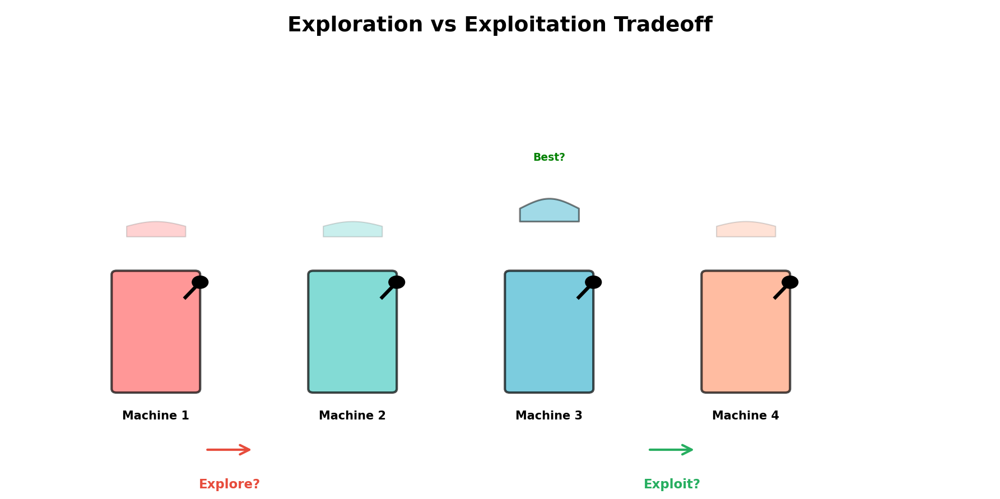


The multi-armed bandit problem is the simplest model of sequential decision-making under uncertainty.
Despite its simplicity, it captures the fundamental tension in learning: **exploration versus exploitation**.
This tension appears throughout reinforcement learning and beyond.

## 1.1 The Exploration-Exploitation Dilemma

### Intuitive Setup: The Casino Analogy
Imagine you walk into a casino and see K identical slot machines. Each machine has an unknown payout distribution.
You have a fixed budget of T coin flips. **How should you allocate your budget to maximize total winnings?**

The dilemma is clear:

- **Exploit:** Keep playing the machine that has paid out the most so far. This maximizes immediate reward.
- **Explore:** Try machines you haven't tried much to learn their true payouts. This might reveal a better machine.

If you exploit only, you might miss a machine that's actually better—you're greedy but inefficient.
If you explore too much, you waste coins on clearly bad machines. The optimal strategy lies somewhere in between.

### Formal Setup
An **n-armed bandit problem** consists of:

- **K arms**: Each arm a ∈ {1, 2, …, K} has an unknown reward distribution ν_a.
- **Sequence of decisions:** At each time step t ∈ {1, 2, …, T}, you select an arm a_t and receive reward R_t.
- **Reward model:** R_t ~ ν_{a_t} (reward is drawn from the distribution of the chosen arm)
- **Stationarity:** The reward distributions don't change over time.
- **No state transitions:** Unlike MDPs, there's no underlying state that evolves. Each pull is independent (given the arm).

For concreteness, consider **Bernoulli bandits**: each arm a has probability p_a of paying out $1 and probability (1 - p_a) of paying out $0.
Our goal is to learn which arm has the highest p_a and exploit it, while spending enough pulls to be confident in our estimates.

### Regret: Formalizing the Cost of Learning
How do we measure the quality of a strategy? If we knew the reward distributions in advance, we would always pull the best arm.
Let \( \mu_a = \mathbb{E}[R_t \mid a_t = a] \) be the expected reward of arm a, and let \( \mu^* = \max_a \mu_a \) be the expected reward of the best arm.

We define the **regret** as:


$$
L_T = T \cdot \mu^* - \sum_{t=1}^{T} \mathbb{E}[R_t] = \sum_{t=1}^{T} (\mu^* - \mathbb{E}[R_t])
$$


This is the total reward we *would have* earned if we always pulled the best arm, minus the reward we actually earned.
It quantifies the cost of not knowing which arm is best.

Equivalently, we can write:


$$
L_T = \sum_{a \neq a^*} \Delta_a \cdot N_a(T)
$$

where \( a^* = \arg\max_a \mu_a \) is the optimal arm, \( \Delta_a = \mu^* - \mu_a > 0 \) is the "gap" for arm a,
and \( N_a(T) \) is the number of times arm a was pulled by time T.

**Regret is the sum of gaps times the number of pulls on suboptimal arms.**

A good algorithm minimizes regret. There's a fundamental tradeoff:

- We must pull each arm enough times to estimate its mean (exploration).
- We must eventually concentrate our pulls on the best arms (exploitation).

**Key Insight:** In bandit problems, we accept some regret as the price of learning.
The question is: *how does regret scale with T?*
We might see linear growth (bad), logarithmic growth (good), or somewhere in between.

## 1.2 Epsilon-Greedy (ε-Greedy)

### The Algorithm
**ε-Greedy** is the simplest bandit algorithm. At each step:

- With probability ε, **explore:** choose a uniformly random arm.
- With probability 1 - ε, **exploit:** choose the arm with the highest sample mean.

Let \( Q_t(a) = \frac{1}{N_a(t)} \sum_{i=1}^{N_a(t)} R_{t,i} \) be the sample mean of arm a's rewards up to time t,
where \( N_a(t) \) is the number of times arm a has been pulled and \( R_{t,i} \) is the i-th reward from arm a.

The greedy action is:


$$
a_t = \begin{cases}
\text{random arm from } \{1, \ldots, K\} & \text{with probability } \varepsilon \\
\arg\max_a Q_t(a) & \text{with probability } 1 - \varepsilon
\end{cases}
$$


### Mathematical Analysis
Let's analyze the regret of ε-greedy. Suppose \( \varepsilon \) is fixed and \( T \) grows large.

**Case 1: With probability ε, we explore.** When exploring, we choose uniformly among K arms.
On average, we pull the best arm a fraction \( 1/K \) of the time during exploration.
Since we explore ε·T times, we waste roughly:


$$
\varepsilon T \cdot (1 - 1/K) \text{ pulls on suboptimal arms}
$$

Each pull on a suboptimal arm a costs us \( \Delta_a \) regret. Summing over all suboptimal arms:


$$
\text{Exploration regret} \approx \varepsilon T \cdot \frac{K-1}{K} \cdot \frac{1}{K-1} \sum_{a \neq a^*} \Delta_a = O(\varepsilon T)
$$


**Case 2: With probability 1 - ε, we exploit.** We pull our best estimate arm.
If we've done enough exploration, our estimate will be close to correct, and we'll mostly pull the true best arm.
But there's some probability we're wrong. The expected regret from exploitation is roughly:


$$
\text{Exploitation regret} = O((1-\varepsilon) T \cdot P(\text{wrong estimate}))
$$


For a fixed ε and large T, this probability can be bounded using concentration inequalities (e.g., Chernoff or Hoeffding),
giving a term that's subexponential in T. However, the exploration term dominates.

**Total regret for ε-greedy:**


$$
L_T = O(\varepsilon T)
$$


The regret is **linear in T**. This is because we keep making suboptimal choices with probability ε,
and this accumulates. For large T, this is actually quite wasteful compared to algorithms we'll see next.

### Intuition and Weaknesses
**Pros:**

- Simple to implement and understand.
- Works reasonably well in practice for problems with many rounds.

**Cons:**

- **Uniform exploration:** When exploring, we treat all arms equally. If arm 1 has mean 0.1 and arm 2 has mean 0.9,
we explore them equally often. This is wasteful.
- **Linear regret:** We continue to explore suboptimal arms forever (with probability ε),
even when we're very confident they're bad.
- **Parameter tuning:** The choice of ε is problem-dependent. Too high and we waste rewards;
too low and we don't explore enough.

### Python Implementation

```python
import numpy as np

class EpsilonGreedyBandit:
    """
    Multi-armed bandit solver using epsilon-greedy exploration.

    Args:
        n_arms: Number of arms (bandit options)
        epsilon: Exploration probability in [0, 1]
    """

    def __init__(self, n_arms, epsilon=0.1):
        self.n_arms = n_arms
        self.epsilon = epsilon
        self.reward_sums = np.zeros(n_arms)
        self.pull_counts = np.zeros(n_arms)
        self.total_reward = 0.0

    def select_arm(self):
        """Select an arm using epsilon-greedy exploration."""
        if np.random.rand() < self.epsilon:
            return np.random.randint(self.n_arms)

        q_values = np.divide(
            self.reward_sums,
            self.pull_counts,
            out=np.full(self.n_arms, 0.0),
            where=self.pull_counts > 0,
        )
        return int(np.argmax(q_values))

    def update(self, arm, reward):
        """Update counts and reward statistics for the selected arm."""
        self.pull_counts[arm] += 1
        self.reward_sums[arm] += reward
        self.total_reward += reward

    def get_q_values(self):
        """Return current estimated Q-values (sample means)."""
        return np.divide(
            self.reward_sums,
            self.pull_counts,
            out=np.full(self.n_arms, np.nan),
            where=self.pull_counts > 0,
        )


if __name__ == "__main__":
    true_means = np.array([0.1, 0.15, 0.9, 0.5])  # Arm 2 is best
    n_rounds = 1000

    bandit = EpsilonGreedyBandit(n_arms=len(true_means), epsilon=0.1)

    for _ in range(n_rounds):
        arm = bandit.select_arm()
        reward = np.random.binomial(1, true_means[arm])
        bandit.update(arm, reward)

    print("Final Q-values (estimated means):", bandit.get_q_values())
    print("True means:", true_means)
    print("Pull counts:", bandit.pull_counts)
    print(f"Total reward: {bandit.total_reward}")
    print(
        f"Regret (vs always pulling best): "
        f"{n_rounds * true_means.max() - bandit.total_reward}"
    )

```

## 1.3 Upper Confidence Bound (UCB1)

### The Key Insight: "Optimism in the Face of Uncertainty"
The ε-greedy algorithm explores uniformly, which is wasteful. A better strategy is: **give each arm the benefit of the doubt**.

Here's the intuition: If an arm hasn't been tried much, we're uncertain about its true mean.
That uncertainty should translate to "optimism"—we should assume it might be good.
As we try an arm more and more, our estimate becomes more confident, and the optimism bonus decreases.

This leads to the Upper Confidence Bound (UCB) algorithm:

$$
a_t = \arg\max_a \left( \hat{Q}_a(t) + c \sqrt{\frac{\ln t}{N_a(t)}} \right)
$$


where:

- \( \hat{Q}_a(t) = \frac{1}{N_a(t)} \sum_{i=1}^{N_a(t)} R_{a,i} \) is the sample mean (exploitation term)
- \( c \sqrt{\frac{\ln t}{N_a(t)}} \) is the "confidence radius" (exploration bonus)
- \( N_a(t) \) is the number of times arm a has been pulled
- \( c \) is a tuning parameter (often set to 1 or \( \sqrt{2} \))

The bonus \( \sqrt{\frac{\ln t}{N_a(t)}} \) has three important properties:

- **Decreases with N_a(t):** As we pull an arm more, the bonus shrinks.
- **Decreases slowly (logarithmically):** The bonus decays as \( \ln t \) rather than linearly, so we keep exploring for a long time.
- **Increases with t:** As time goes on, all bonuses grow (everyone gets a bigger bonus), encouraging exploration when we're less confident.

### Deriving UCB1 from Hoeffding's Inequality
Let's rigorously derive the confidence radius using **Hoeffding's inequality**.

**Hoeffding's Inequality:** Let \( X_1, X_2, \ldots, X_n \) be i.i.d. random variables with \( X_i \in [0, 1] \).
Let \( \bar{X}_n = \frac{1}{n} \sum_{i=1}^n X_i \) be their empirical mean and \( \mu = \mathbb{E}[X_i] \) be the true mean.
Then:

$$
P(|\bar{X}_n - \mu| \geq u) \leq 2 \exp(-2nu^2)
$$

This tells us: the probability that the sample mean is far from the true mean decreases exponentially with n (the number of samples) and u² (how far we are).

**Applying to bandits:** For arm a pulled N_a times with sample mean \( \hat{Q}_a \):

$$
P(|\hat{Q}_a - \mu_a| \geq u) \leq 2 \exp(-2 N_a u^2)
$$

We want \( \mu_a \leq \hat{Q}_a + u \) with high probability. Rearranging:

$$
P(\mu_a \leq \hat{Q}_a + u) \geq 1 - 2 \exp(-2 N_a u^2)
$$

If we want this to hold with probability at least \( 1 - \delta \) for all arms and all time steps, we need:


$$
2 \exp(-2 N_a u^2) \leq \delta
$$


Taking logarithms:


$$
-2 N_a u^2 \leq \ln \delta / 2
$$


$$
u^2 \geq \frac{\ln(2/\delta)}{2 N_a}
$$


$$
u \geq \sqrt{\frac{\ln(2/\delta)}{2 N_a}}
$$


To cover all arms at all times, we use a union bound: there are at most T time steps and K arms, so at most KT events.
Setting \( \delta = 1/(KT) \) makes a union bound loose but manageable:


$$
\frac{\ln(2KT)}{2N_a} = \frac{\ln(KT)}{N_a} + \frac{\ln(2)}{2N_a} \approx \frac{\ln T}{N_a}
$$

Multiplying by a constant c (typically 1 or \( \sqrt{2} \)) gives us:


$$
\text{UCB}_a(t) = \hat{Q}_a(t) + c \sqrt{\frac{\ln t}{N_a(t)}}
$$


The key insight: **The upper confidence bound is a high-probability upper bound on the true mean.**
With high probability over the randomness in rewards, the true mean \( \mu_a \) is below \( \text{UCB}_a(t) \).

### Regret Analysis
Let's sketch the regret bound for UCB. The detailed proof is technical, but the intuition is:

**Step 1: Optimal arm is pulled often.**
The optimal arm a* will have a high sample mean early on, and it will keep being pulled because its UCB is high.
Its UCB decreases slowly (logarithmically), so it gets many pulls. The "wasted" pulls on suboptimal arms are rare.

**Step 2: Suboptimal arms are pulled by mistake.**
A suboptimal arm a gets pulled only if its UCB exceeds the optimal arm's UCB by chance.
Since the optimal arm's sample mean is close to \( \mu^* \) (with high probability), and arm a's sample mean is close to \( \mu_a


$$
L_T = O\left( K \ln T \right)
$$


More precisely, if arms are ordered so \( \mu_1 \geq \mu_2 \geq \cdots \geq \mu_K \):


$$
L_T \leq \sum_{a=2}^K \left( c \frac{\ln T}{\Delta_a} + O(\Delta_a) \right)
$$


The first term comes from the number of suboptimal pulls, and the second term is negligible.
The key result: **Regret grows logarithmically, not linearly!**

**Comparison:**

- **ε-Greedy:** \( L_T = O(\varepsilon T) \) — Linear regret (bad)
- **UCB1:** \( L_T = O(K \ln T) \) — Logarithmic regret (good)

For T = 1,000,000 and K = 10: ε-Greedy wastes O(100,000) rewards; UCB1 wastes O(100) rewards.

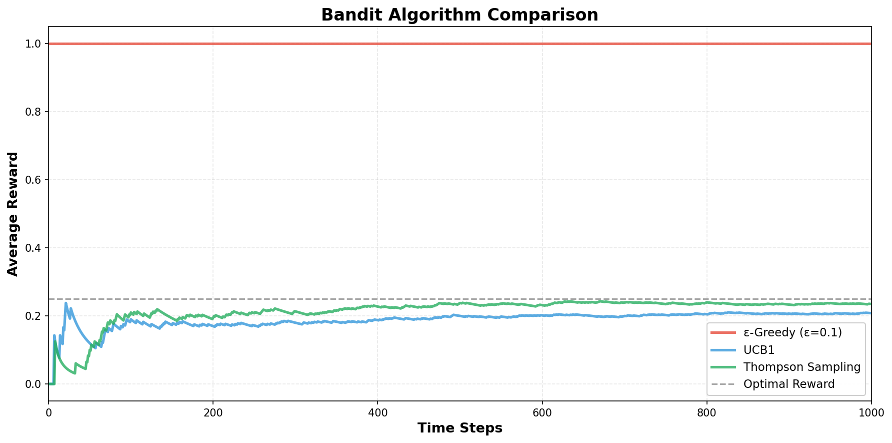

| Algorithm | Exploration rule | Regret scaling | When it is useful |
|-----------|------------------|----------------|-------------------|
| ε-Greedy | Random exploration with probability \( \varepsilon \) | \( O(\varepsilon T) \) | Fast baseline, easy to teach and implement |
| UCB1 | Add an optimism bonus to uncertain arms | \( O(K \ln T) \) | When you want a principled deterministic exploration rule |
| Thompson Sampling | Sample from posterior uncertainty | Often near-logarithmic in practice | When you want strong empirical performance and a Bayesian interpretation |

### Python Implementation

```python
import numpy as np

class UCB1Bandit:
    """
    Multi-armed bandit solver using Upper Confidence Bound (UCB1).

    Args:
        n_arms: Number of arms
        c: Confidence parameter (exploration coefficient)
    """

    def __init__(self, n_arms, c=1.0):
        self.n_arms = n_arms
        self.c = c
        self.reward_sums = np.zeros(n_arms)
        self.pull_counts = np.zeros(n_arms)
        self.total_reward = 0.0
        self.t = 0

    def select_arm(self):
        """Select an arm using the UCB1 rule."""
        self.t += 1
        ucb_values = np.zeros(self.n_arms)

        for arm in range(self.n_arms):
            if self.pull_counts[arm] == 0:
                ucb_values[arm] = float("inf")
            else:
                q_value = self.reward_sums[arm] / self.pull_counts[arm]
                bonus = self.c * np.sqrt(np.log(self.t) / self.pull_counts[arm])
                ucb_values[arm] = q_value + bonus

        return int(np.argmax(ucb_values))

    def update(self, arm, reward):
        """Update estimates after observing a reward."""
        self.pull_counts[arm] += 1
        self.reward_sums[arm] += reward
        self.total_reward += reward

    def get_q_values(self):
        """Return current estimated means."""
        return np.divide(
            self.reward_sums,
            self.pull_counts,
            out=np.full(self.n_arms, np.nan),
            where=self.pull_counts > 0,
        )


if __name__ == "__main__":
    true_means = np.array([0.1, 0.15, 0.9, 0.5])
    n_rounds = 1000
    n_trials = 100

    eg_rewards = np.zeros(n_trials)
    ucb_rewards = np.zeros(n_trials)

    for trial in range(n_trials):
        eg_bandit = EpsilonGreedyBandit(n_arms=len(true_means), epsilon=0.1)
        for _ in range(n_rounds):
            arm = eg_bandit.select_arm()
            reward = np.random.binomial(1, true_means[arm])
            eg_bandit.update(arm, reward)
        eg_rewards[trial] = eg_bandit.total_reward

        ucb_bandit = UCB1Bandit(n_arms=len(true_means), c=1.0)
        for _ in range(n_rounds):
            arm = ucb_bandit.select_arm()
            reward = np.random.binomial(1, true_means[arm])
            ucb_bandit.update(arm, reward)
        ucb_rewards[trial] = ucb_bandit.total_reward

    optimal_total = n_rounds * true_means.max()
    print(
        f"Epsilon-Greedy: avg reward = {eg_rewards.mean():.2f}, "
        f"regret = {optimal_total - eg_rewards.mean():.2f}"
    )
    print(
        f"UCB1: avg reward = {ucb_rewards.mean():.2f}, "
        f"regret = {optimal_total - ucb_rewards.mean():.2f}"
    )

```

## 1.4 Thompson Sampling

### The Key Insight: Uncertainty as Exploration Naturally
Thompson sampling takes a Bayesian approach. The core idea is deceptively simple:

**Thompson Sampling Principle:**
Maintain a probability distribution (posterior) over each arm's true mean.
At each step, sample from each arm's posterior, and choose the arm with the highest sample.
Repeat and update.

Why does this work? Arms with high uncertainty (fat posterior distributions) will have samples scattered across a wide range.
Some of those samples will be high, so these arms get explored. Arms with low uncertainty (tight posterior) will have samples
concentrated around their true mean—if that mean is low, the samples will stay low. This naturally balances exploration and exploitation.

### Bernoulli Bandits with Beta Posteriors
For Bernoulli bandits (rewards in {0, 1}), the Beta distribution is the conjugate prior.
This means: if the prior is Beta and we observe Bernoulli data, the posterior is also Beta.

**The Beta Distribution:**
A Beta distribution with parameters α and β (both positive) has PDF:

$$
\text{Beta}(\alpha, \beta) \propto p^{\alpha-1} (1-p)^{\beta-1}
$$


where \( p \in [0, 1] \) is the parameter of interest (in our case, the probability of reward from an arm).
The mean is:

$$
\mathbb{E}[p] = \frac{\alpha}{\alpha + \beta}
$$


**Thompson Sampling Algorithm for Bernoulli Bandits:**

- **Initialize:** For each arm a, set a prior distribution Beta(1, 1) (uniform on [0, 1]).
- **At each time step t:**

For each arm a, sample \( \theta_a \sim \text{Posterior}_a \) (sample from the current posterior)
- Choose arm \( a_t = \arg\max_a \theta_a \) (arm with highest sample)
- Pull arm a_t and observe reward \( R_t \in \{0, 1\} \)
- Update posterior: If \( R_t = 1 \), increment α_a; if \( R_t = 0 \), increment β_a

**Why conjugacy matters:**
When we observe data, we update by simply incrementing α or β. We don't need to compute integrals or use approximations.
This is computational efficiency for free.

### Step-by-Step Example
Suppose we have 2 arms. Arm 1 has true probability 0.3; Arm 2 has true probability 0.8.

| Step | Posterior Arm 1 | Posterior Arm 2 | Sample 1 | Sample 2 | Chosen | Reward |
|------|----------------|----------------|----------|----------|--------|--------|
| 0 (init) | Beta(1, 1) | Beta(1, 1) | — | — | — | — |
| 1 | Beta(1, 1) | Beta(1, 1) | 0.42 | 0.73 | 2 | 1 |
| 2 | Beta(1, 1) | Beta(2, 1) | 0.19 | 0.81 | 2 | 1 |
| 3 | Beta(1, 1) | Beta(3, 1) | 0.55 | 0.92 | 2 | 0 |
| 4 | Beta(1, 1) | Beta(3, 2) | 0.38 | 0.67 | 2 | 1 |

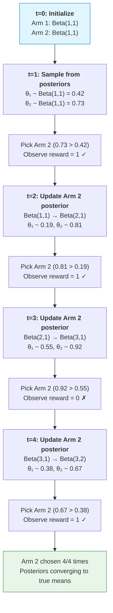

Notice: Even though Arm 2 gets sampled more often (because its posterior mean is higher), Arm 1 still gets tried
occasionally because of exploration via sampling from its uncertainty.

### Why Thompson Sampling Works (Intuition)
**Probability Matching:**
Thompson sampling is optimal in a precise sense—it minimizes Bayesian regret.
The intuition: the probability you choose an arm should equal your posterior probability that it's the best.

More formally, let \( P(a^* = a \mid \text{data}) \) be your posterior probability that arm a is the best.
Thompson sampling (in the limit) chooses each arm with probability equal to this posterior probability.
This is optimal from a Bayesian perspective.

**Practical Advantages:**

- **Natural exploration:** No ε or confidence parameters to tune. Exploration emerges from uncertainty.
- **Bayesian interpretation:** You maintain beliefs and update them. Integrates naturally with prior knowledge.
- **Strong empirical performance:** Often beats UCB in practice on realistic problems.
- **Posterior samples:** Easy to extend to more complex settings (contextual bandits, combinatorial bandits).

### Python Implementation

```python
import numpy as np

class ThompsonSamplingBandit:
    """
    Thompson Sampling for Bernoulli bandits with Beta priors.

    Each arm keeps a Beta(alpha, beta) posterior over its success probability.
    """

    def __init__(self, n_arms):
        self.n_arms = n_arms
        self.alpha = np.ones(n_arms)  # successes
        self.beta = np.ones(n_arms)   # failures
        self.total_reward = 0.0

    def select_arm(self):
        """Sample from each posterior and pick the arm with the largest draw."""
        samples = np.array(
            [np.random.beta(self.alpha[a], self.beta[a]) for a in range(self.n_arms)]
        )
        return int(np.argmax(samples))

    def update(self, arm, reward):
        """Update the Beta posterior after observing reward in {0, 1}."""
        if reward == 1:
            self.alpha[arm] += 1
        else:
            self.beta[arm] += 1
        self.total_reward += reward

    def get_posterior_means(self):
        """Return posterior means for each arm."""
        return self.alpha / (self.alpha + self.beta)

    def get_posterior_stds(self):
        """Return posterior standard deviations for each arm."""
        a = self.alpha
        b = self.beta
        var = (a * b) / ((a + b) ** 2 * (a + b + 1))
        return np.sqrt(var)


if __name__ == "__main__":
    true_probs = np.array([0.1, 0.15, 0.9, 0.5])
    n_rounds = 1000
    n_trials = 100

    ts_rewards = np.zeros(n_trials)

    for trial in range(n_trials):
        bandit = ThompsonSamplingBandit(n_arms=len(true_probs))

        for _ in range(n_rounds):
            arm = bandit.select_arm()
            reward = np.random.binomial(1, true_probs[arm])
            bandit.update(arm, reward)

        ts_rewards[trial] = bandit.total_reward

    optimal_total = n_rounds * true_probs.max()
    print(f"Thompson Sampling: avg reward = {ts_rewards.mean():.2f}")
    print(f"Regret = {optimal_total - ts_rewards.mean():.2f}")
    print(f"(Optimal would be {optimal_total:.0f})")

```

---

# Chapter 2: Markov Decision Processes (MDPs)

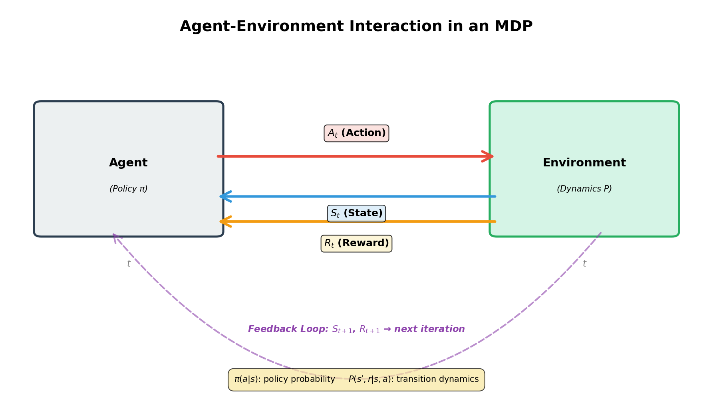


The multi-armed bandit problem is elegant but unrealistic: there's no state, and each decision is independent.
Real sequential decision problems are richer. You might navigate a robot through a maze, trade stocks, or play chess—
in all these cases, your current state matters, and your actions change the state.
This is where **Markov Decision Processes (MDPs)** come in.

## 2.1 Components of an MDP

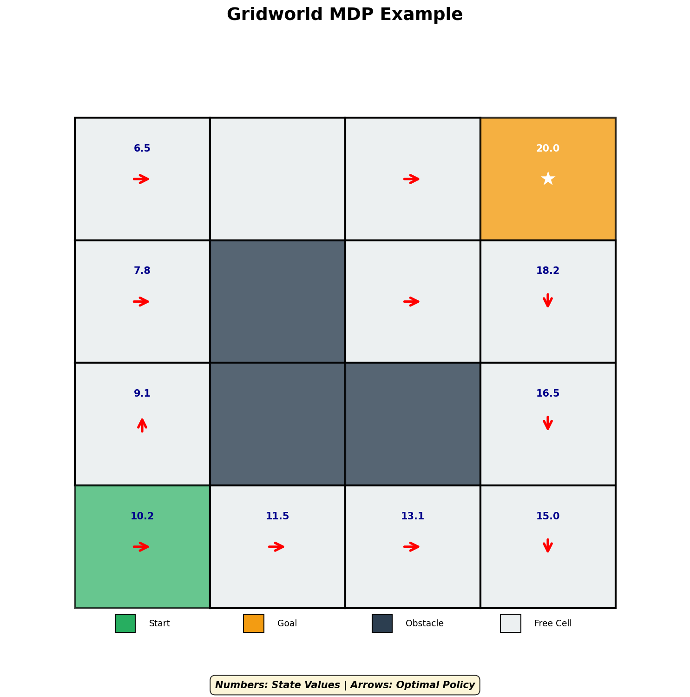


### The Formal Definition
A **Markov Decision Process** is a tuple \( \mathcal{M} = (S, A, P, R, \gamma) \):

- **S:** The state space. A set of all possible states. Can be finite, infinite, or continuous.
- **A:** The action space. A set of all possible actions. Can be discrete or continuous.
- **P:** The transition dynamics. \( P(s' \mid s, a) \) is the probability of moving to state s'
when taking action a in state s. Sometimes written as \( P_{ss'}^a \) or \( T(s, a, s') \).
- **R:** The reward function. \( R(s, a, s') \) is the immediate reward when transitioning
from s to s' via action a. Alternatively, \( R(s, a) \) is the expected reward. Sometimes the reward
depends only on the state or only on the action.
- **γ:** The discount factor. A constant in \( [0, 1) \) that weighs immediate rewards versus future rewards.

| Symbol | Name | What it means in practice |
|--------|------|---------------------------|
| \( S \) | State space | What the agent gets to observe |
| \( A \) | Action space | The choices available to the agent |
| \( P \) | Transition kernel | How the world reacts to actions |
| \( R \) | Reward function | The scalar feedback signal |
| \( \gamma \) | Discount factor | How much future rewards matter relative to immediate ones |

### Intuition: The Robot in the Maze
Consider a robot navigating a maze.
The **state** is the robot's current position (grid coordinates).
The **actions** are movements: up, down, left, right.
The **transitions** are noisy: if the robot says "move right," it might slip and go up instead.
The **rewards** might be negative for each step (encouraging efficiency) and positive when reaching the goal.
The **discount factor** means the robot prefers reaching the goal sooner rather than later.

### Time Horizon and Infinite Episodes
In bandits, we ran for a fixed number of rounds T. In MDPs, we often assume an infinite time horizon.
Does an infinite sum of rewards diverge?

If rewards are bounded (e.g., \( |R_t| \leq R_{\max} \)) and \( \gamma \in [0, 1) \), then the discounted return remains finite:

$$
\sum_{t=0}^{\infty} \gamma^t R_t \leq \sum_{t=0}^{\infty} \gamma^t R_{\max} = \frac{R_{\max}}{1 - \gamma}
$$


The geometric series converges, so even with infinite episodes, the expected total reward is finite.
This is why the discount factor is so important: it ensures that value functions are well-defined and finite.

**Interpretation of γ:**

- **γ = 0:** Myopic agent. Only cares about immediate reward.
- **γ near 1:** Farsighted agent. Cares about long-term consequences.
- **1/(1-γ):** The effective horizon. This is how many steps into the future matter meaningfully.

For example, if \( \gamma = 0.99 \), then \( 1/(1-0.99) = 100 \) steps. Rewards beyond 100 steps are heavily discounted.

## 2.2 The Markov Property

### Definition
A system has the **Markov property** if:

$$
P(S_{t+1} = s' \mid S_t = s, A_t = a, S_{t-1}, A_{t-1}, \ldots, S_0) = P(S_{t+1} = s' \mid S_t = s, A_t = a)
$$


Or more colloquially: **"The future is independent of the past, given the present."**

In other words, the next state depends only on the current state and action, not on how we got to the current state.

### Why It Matters
The Markov property is crucial for several reasons:

- **Sufficient statistics:** The state contains all information we need to make good decisions.
We don't need to remember the entire history.
- **Tractability:** Without the Markov property, we'd need to track the entire history,
making the problem exponentially harder.
- **Dynamic programming:** Bellman equations (which we'll see next) rely on the Markov property.
Without it, we can't decompose the problem recursively.

### Example: Is Chess Markovian?
The board position fully determines the next move's consequences. Whether we got here via
a brilliant sacrifice or a blunder doesn't matter—only the current position matters. So yes, chess is Markovian.

Caveat: If rules depend on move history (like the "threefold repetition" rule), then we need to augment the state
to include repetition counters. Once we do that, it's Markovian again.

### Counterexample: Partially Observable Environments
If you can't fully observe the state (e.g., you see only partial information), then the observation alone doesn't satisfy the Markov property.
You'd need to infer the underlying state, leading to **Partially Observable MDPs (POMDPs)**, which are harder than MDPs.

## 2.3 Policies and Returns

### Policies
A **policy** is a decision rule: a mapping from states to actions. It can be deterministic or stochastic.

- **Deterministic policy:** \( \pi: S \to A \). In state s, always take action \( \pi(s) \).
- **Stochastic policy:** \( \pi: S \times A \to [0, 1] \). In state s, take action a with probability \( \pi(a \mid s) \).
Also written as \( \pi_a(s) \).

The goal of RL is to find the **optimal policy** \( \pi^* \) that maximizes expected cumulative reward.

### Returns and Discounting
Starting from state \( S_t \), the **return** (or cumulative discounted reward) is:

$$
G_t = R_{t+1} + \gamma R_{t+2} + \gamma^2 R_{t+3} + \cdots = \sum_{k=0}^{\infty} \gamma^k R_{t+k+1}
$$


Note the indexing: \( R_{t+1} \) is the reward received after taking an action in state \( S_t \).

**Why discount?**

- **Mathematical convenience:** As we showed, the infinite discounted sum converges when \( \gamma \in [0, 1) \).

$$
V^{\pi}(s) = \mathbb{E}_{\pi}[G_t \mid S_t = s] = \mathbb{E}_{\pi}\left[\sum_{k=0}^{\infty} \gamma^k R_{t+k+1} \mid S_t = s\right]
$$


An **action-value function** (or Q-function) is the expected return starting from a state, taking a specific action, then following π:

$$
Q^{\pi}(s, a) = \mathbb{E}_{\pi}[G_t \mid S_t = s, A_t = a] = \mathbb{E}_{\pi}\left[\sum_{k=0}^{\infty} \gamma^k R_{t+k+1} \mid S_t = s, A_t = a\right]
$$


Clearly, they're related:


$$
V^{\pi}(s) = \sum_a \pi(a \mid s) Q^{\pi}(s, a)
$$


The value of a state is the average of the Q-values of all actions weighted by the policy's action probabilities.

### Example: Simple 2-State MDP
States: {s1, s2}. Actions: {left, right}. \( \gamma = 0.9 \).

Transitions:

- In s1 taking left: stay in s1 with reward 1
- In s1 taking right: go to s2 with reward 0
- In s2 taking left: go to s1 with reward 0
- In s2 taking right: stay in s2 with reward 1

Policy π: in s1 always go left; in s2 always go right.

Under π:

- In s1, we get reward 1 forever: \( V^{\pi}(s1) = 1 + 0.9 \cdot 1 + 0.81 \cdot 1 + \cdots = \frac{1}{1-0.9} = 10 \)
- In s2, we get reward 1 forever: \( V^{\pi}(s2) = 1 + 0.9 \cdot 1 + 0.81 \cdot 1 + \cdots = \frac{1}{1-0.9} = 10 \)

Both states have the same value because we always end up in a rewarding state.

## 2.4 Grid World Example

### Setup
A 4×4 grid. Position (0,0) is the top-left. Position (3,3) is bottom-right.
A robot starts at (0,0). The goal is (3,3).

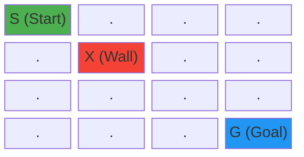

where S = start, G = goal, X = obstacle (impassable), . = empty.

### Actions and Transitions
Actions: {up, down, left, right}. Each action is stochastic (simulating a slippery floor):

- Intended direction: 80% probability
- Left perpendicular direction: 10% probability
- Right perpendicular direction: 10% probability

If the robot hits a boundary or obstacle, it stays in place.

### Rewards

- Each step (not reaching goal): -1
- Reaching goal: +10

This encourages fast paths to the goal.

### Example Path and Trajectory
Suppose the robot follows policy: "Move right if possible, else move down."

```text
Trajectory (assuming lucky rolls):
(0,0) --right--> (0,1) --right--> (0,2) --right--> (0,3)
--down--> (1,3) --down--> (2,3) --down--> (3,3)

Rewards: -1, -1, -1, -1, -1, -1, -1, +10
Return (γ = 0.99): -1(1 + 0.99 + 0.99^2 + ... 0.99^6) + 10·0.99^7
≈ -6.87 + 8.53 ≈ 1.66

```

### Encoding in Python

```python
import numpy as np

class GridWorld:
    """4x4 grid world with a goal, obstacle, and stochastic transitions."""

    def __init__(self, gamma=0.99):
        self.grid_size = 4
        self.start = (0, 0)
        self.goal = (3, 3)
        self.obstacle = (1, 1)
        self.gamma = gamma
        self.actions = ["up", "down", "left", "right"]
        self.n_actions = len(self.actions)
        self.n_states = self.grid_size ** 2

    def state_to_index(self, state):
        """Convert (row, col) to a linear state index."""
        row, col = state
        return row * self.grid_size + col

    def index_to_state(self, idx):
        """Convert a linear state index back to (row, col)."""
        return idx // self.grid_size, idx % self.grid_size

    def is_valid(self, state):
        """Check if a state is inside the grid and not the obstacle."""
        row, col = state
        if row < 0 or row >= self.grid_size or col < 0 or col >= self.grid_size:
            return False
        return state != self.obstacle

    def _clip_or_stay(self, candidate, current):
        """Move to candidate if it is valid; otherwise remain in the current state."""
        return candidate if self.is_valid(candidate) else current

    def get_next_state(self, state, action):
        """
        Sample the next state and reward.

        Transition model:
            80% intended direction
            10% left/perpendicular slip
            10% right/perpendicular slip
        """
        row, col = state
        if action == 0:      # up
            moves = [(-1, 0), (0, -1), (0, 1)]
        elif action == 1:    # down
            moves = [(1, 0), (0, -1), (0, 1)]
        elif action == 2:    # left
            moves = [(0, -1), (-1, 0), (1, 0)]
        else:                # right
            moves = [(0, 1), (-1, 0), (1, 0)]

        move_index = np.random.choice(3, p=[0.8, 0.1, 0.1])
        dr, dc = moves[move_index]
        next_state = self._clip_or_stay((row + dr, col + dc), state)

        reward = 10 if next_state == self.goal else -1
        return next_state, reward

    def simulate_episode(self, policy, max_steps=100):
        """Roll out one episode under a policy(state) -> action_index."""
        state = self.start
        total_reward = 0
        trajectory = [state]

        for _ in range(max_steps):
            action = policy(state)
            next_state, reward = self.get_next_state(state, action)
            total_reward += reward
            trajectory.append(next_state)

            if next_state == self.goal:
                break

            state = next_state

        return total_reward, trajectory


def greedy_policy(state, goal=(3, 3)):
    """Move toward the goal: prioritize right, then down."""
    row, col = state
    goal_row, goal_col = goal

    if col < goal_col:
        return 3  # right
    if row < goal_row:
        return 1  # down
    return 0      # otherwise move up arbitrarily


if __name__ == "__main__":
    env = GridWorld(gamma=0.99)
    total_reward, traj = env.simulate_episode(greedy_policy, max_steps=20)

    print("Sample trajectory:", " -> ".join(map(str, traj[:10])))
    print("Total reward:", total_reward)

```

---

# Chapter 3: Bellman Equations

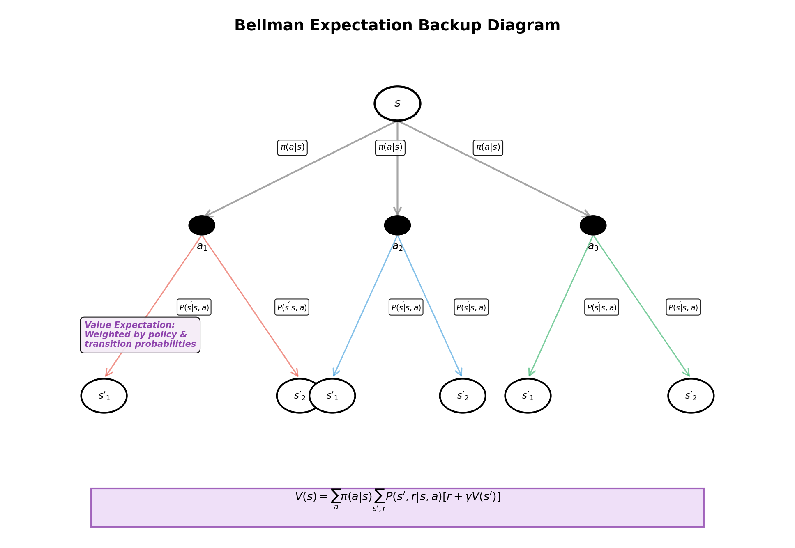


Value functions are at the heart of reinforcement learning. They tell us how good each state (or state-action pair) is.
But how do we compute them? The answer is the **Bellman equation**, one of the most powerful ideas in RL.

## 3.1 Bellman Expectation Equation

### The Key Insight
The core insight of Bellman equations is recursive decomposition:

**Bellman's Principle of Optimality:**
The value of a state = immediate reward + discounted value of next state.

This simple idea turns a complex infinite-horizon problem into a recursive one that we can solve.

### Derivation for V^π (State Value)
Let's derive this carefully. Start with the definition:

$$
V^{\pi}(s) = \mathbb{E}_{\pi}[G_t \mid S_t = s]
$$


Expand the return:

$$
G_t = R_{t+1} + \gamma R_{t+2} + \gamma^2 R_{t+3} + \cdots
$$


Factor out the first term:

$$
G_t = R_{t+1} + \gamma (R_{t+2} + \gamma R_{t+3} + \cdots) = R_{t+1} + \gamma G_{t+1}
$$


Now take expectations:


$$
V^{\pi}(s) = \mathbb{E}_{\pi}[R_{t+1} + \gamma G_{t+1} \mid S_t = s]
$$


By linearity of expectation:


$$
V^{\pi}(s) = \mathbb{E}_{\pi}[R_{t+1} \mid S_t = s] + \gamma \mathbb{E}_{\pi}[G_{t+1} \mid S_t = s]
$$


The first term is the expected immediate reward:

$$
\mathbb{E}_{\pi}[R_{t+1} \mid S_t = s] = \sum_a \pi(a \mid s) \sum_{s'} P(s' \mid s, a) R(s, a, s')
$$


The second term uses the definition of \( V^{\pi} \) again (this is where recursion appears):

$$
\mathbb{E}_{\pi}[G_{t+1} \mid S_t = s] = \mathbb{E}_{\pi}[V^{\pi}(S_{t+1}) \mid S_t = s] = \sum_{s'} P(S_{t+1} = s' \mid S_t = s) V^{\pi}(s')
$$


Combining:


$$
V^{\pi}(s) = \sum_a \pi(a \mid s) \sum_{s'} P(s' \mid s, a) [R(s, a, s') + \gamma V^{\pi}(s')]
$$


This is the **Bellman Expectation Equation** for \( V^{\pi} \). It says: the value of a state is the
policy-weighted average of (immediate reward + discounted next state value).

### Bellman Expectation Equation for Q^π (Action Value)
Similarly, for the Q-function:

$$
Q^{\pi}(s, a) = \sum_{s'} P(s' \mid s, a) [R(s, a, s') + \gamma \mathbb{E}_{\pi}[Q^{\pi}(s', A') \mid S_{t+1} = s']]
$$


The expectation over the next action is taken under the policy:

$$
Q^{\pi}(s, a) = \sum_{s'} P(s' \mid s, a) \left[R(s, a, s') + \gamma \sum_{a'} \pi(a' \mid s') Q^{\pi}(s', a')\right]
$$


### Matrix Form
For a finite MDP with |S| states, we can write these as matrix equations. Let:

- \( \mathbf{v}^{\pi} \in \mathbb{R}^{|S|} \): vector of state values
- \( \mathbf{r}^{\pi} \in \mathbb{R}^{|S|} \): vector of expected immediate rewards under π
- \( P^{\pi} \in \mathbb{R}^{|S| \times |S|} \): transition matrix under π, where \( P_{ij}^{\pi} = \sum_a \pi(a \mid i) P(j \mid i, a) \)

Then the Bellman expectation equation becomes:

$$
\mathbf{v}^{\pi} = \mathbf{r}^{\pi} + \gamma P^{\pi} \mathbf{v}^{\pi}
$$


This is a system of linear equations! Rearranging:

$$
(I - \gamma P^{\pi}) \mathbf{v}^{\pi} = \mathbf{r}^{\pi}
$$


Solving:


$$
\mathbf{v}^{\pi} = (I - \gamma P^{\pi})^{-1} \mathbf{r}^{\pi}
$$


Note: The matrix \( (I - \gamma P^{\pi}) \) is invertible because \( P^{\pi} \) is stochastic and \( \gamma < 1 \), so the spectral radius of \( \gamma P^{\pi} \) is strictly less than 1.

## 3.2 Bellman Optimality Equation

### From Expectation to Optimality
The expectation equation tells us the value of following a given policy. But what if we want the *best* value?

Define the **optimal state value**:


$$
V^*(s) = \max_{\pi} V^{\pi}(s)
$$


and the **optimal action value**:

$$
Q^*(s, a) = \max_{\pi} Q^{\pi}(s, a)
$$


The **optimal policy** is:

$$
\pi^*(a \mid s) = \begin{cases} 1 & \text{if } a = \arg\max_{a'} Q^*(s, a') \\ 0 & \text{otherwise} \end{cases}
$$


The optimal policy is deterministic: in each state, choose the action with the highest Q-value.

### Bellman Optimality for V*
By definition, \( V^*(s) \) is the best possible value starting from s. What's the best action to take in s?
The one that leads to the highest expected value. Then we follow the optimal policy from that next state. This gives:

$$
V^*(s) = \max_a \sum_{s'} P(s' \mid s, a) [R(s, a, s') + \gamma V^*(s')]
$$


This is the **Bellman Optimality Equation for V***. Compare to the expectation version:

- **Expectation:** \( V^{\pi}(s) = \sum_a \pi(a \mid s) \sum_{s'} P(s' \mid s, a) [R(s, a, s') + \gamma V^{\pi}(s')] \)
- **Optimality:** \( V^*(s) = \max_a \sum_{s'} P(s' \mid s, a) [R(s, a, s') + \gamma V^*(s')] \)

The key difference: we replaced the policy's weighted average with a max.

### Bellman Optimality for Q*
Similarly, for Q*:

$$
Q^*(s, a) = \sum_{s'} P(s' \mid s, a) [R(s, a, s') + \gamma \max_{a'} Q^*(s', a')]
$$


### Nonlinearity and Contraction Mappings
A key difference from the expectation equation: the Bellman optimality equation is **nonlinear**
(due to the max operator). We can't solve it with matrix inversion.

But we can use the theory of **contraction mappings**. Define the Bellman optimality operator T:

$$
(TV)(s) = \max_a \sum_{s'} P(s' \mid s, a) [R(s, a, s') + \gamma V(s')]
$$


**Theorem (Banach Fixed-Point Theorem):**
If an operator T is a γ-contraction in a complete metric space (like \( \mathbb{R}^{|S|} \) with \( \ell_{\infty} \) norm),
then T has a unique fixed point \( V^* \) such that \( TV^* = V^* \), and iterating \( V_{n+1} = TV_n \) converges to \( V^* \).

**Proof that T is a γ-contraction:**
For any two value functions V and W:

$$
|(TV)(s) - (TW)(s)| = \left| \max_a \sum_{s'} P(s' \mid s, a) [R(s,a,s') + \gamma V(s')] - \max_a \sum_{s'} P(s' \mid s, a) [R(s,a,s') + \gamma W(s')] \right|
$$

The R terms cancel. Using the triangle inequality and the fact that max is nonexpansive:

$$
\leq \max_a \sum_{s'} P(s' \mid s, a) \gamma |V(s') - W(s')| \leq \gamma \max_{s'} |V(s') - W(s')| = \gamma \|V - W\|_{\infty}
$$


So:


$$
\|TV - TW\|_{\infty} \leq \gamma \|V - W\|_{\infty}
$$


This confirms \( T \) is a \( \gamma \)-contraction with contraction coefficient \( \gamma \).


$$
V_{k+1}(s) = \max_a \sum_{s'} P(s' \mid s, a) [R(s, a, s') + \gamma V_k(s')]
$$


Starting from any \( V_0 \), the sequence \( V_0, V_1, V_2, \ldots \) converges to \( V^* \).
This is called **Value Iteration**, one of the core algorithms in RL.

### Relationship Between V* and Q*
Clearly:


$$
V^*(s) = \max_a Q^*(s, a)
$$


And:


$$
Q^*(s, a) = \sum_{s'} P(s' \mid s, a) [R(s, a, s') + \gamma V^*(s')] = \sum_{s'} P(s' \mid s, a) [R(s, a, s') + \gamma \max_{a'} Q^*(s', a')]
$$


### The Optimality Criterion
An important fact: **There always exists an optimal policy, and it's deterministic.**

Proof sketch: If \( V^* \) satisfies the Bellman optimality equation, we can extract a deterministic optimal policy by:

$$
\pi^*(s) = \arg\max_a \sum_{s'} P(s' \mid s, a) [R(s, a, s') + \gamma V^*(s')]
$$


Following this policy achieves \( V^{\pi^*}(s) = V^*(s) \) for all s.

### Bellman Cheat Sheet

| Quantity | Expectation form | Optimality form | Interpretation |
|----------|------------------|-----------------|----------------|
| State value | \( V^\pi(s) = \sum_a \pi(a \mid s) \sum_{s'} P(s' \mid s,a)[R + \gamma V^\pi(s')] \) | \( V^*(s) = \max_a \sum_{s'} P(s' \mid s,a)[R + \gamma V^*(s')] \) | Average over actions vs. choose the best action |
| Action value | \( Q^\pi(s,a) = \sum_{s'} P(s' \mid s,a)[R + \gamma \sum_{a'} \pi(a' \mid s')Q^\pi(s',a')] \) | \( Q^*(s,a) = \sum_{s'} P(s' \mid s,a)[R + \gamma \max_{a'} Q^*(s',a')] \) | Evaluate a fixed action now, then continue with a policy or greedily |
| Policy extraction | Follows \( \pi \) by definition | \( \pi^*(s) = \arg\max_a Q^*(s,a) \) | Once you know \( Q^* \), acting optimally is immediate |

## 3.3 Backup Diagrams

### Visualizing the Recursive Structure
Backup diagrams illustrate how value functions decompose recursively. Each diagram shows how a value is computed
from "child" values one step into the future.

#### 1. State Value V^π (Expectation)
Shows that the value of a state under a policy is a weighted average over actions (policy weights),
then over next states (transition weights), then next state values.

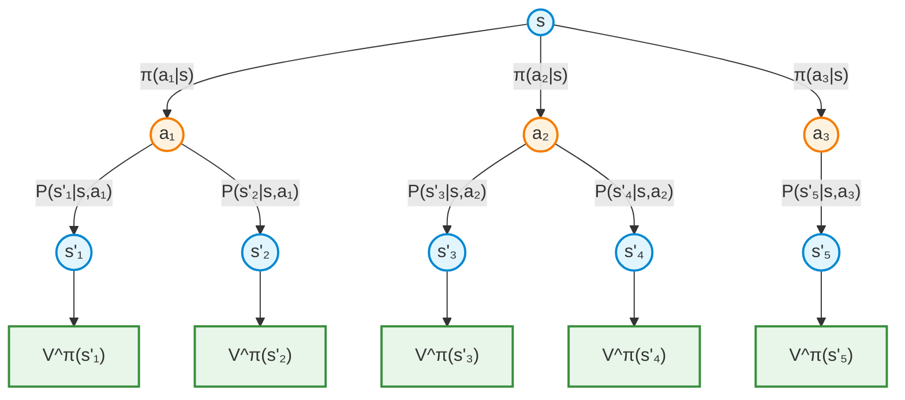

#### 2. Action Value Q^π (Expectation)
Shows that Q-value for (s, a) depends on next state values under the policy.

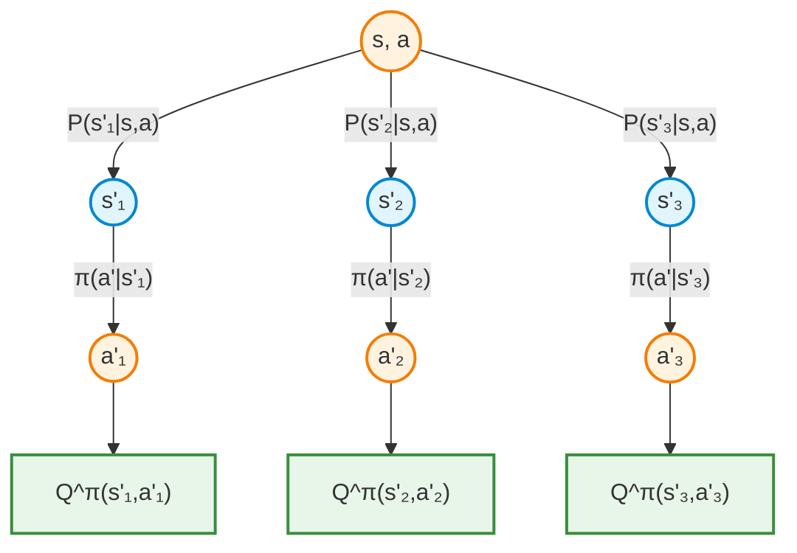

#### 3. State Value V* (Optimality)
Shows that optimal value requires **maximizing** over actions (instead of averaging).

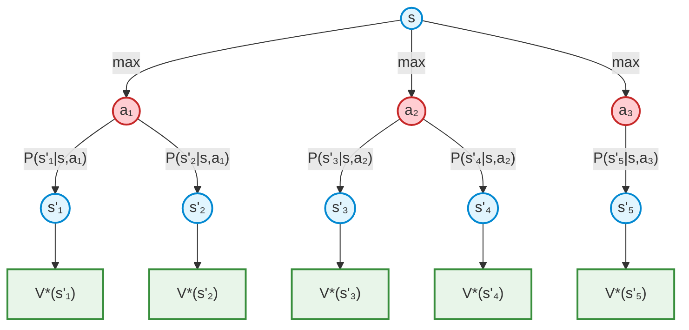

#### 4. Action Value Q* (Optimality)
Shows that optimal Q-value requires maximizing over next actions.

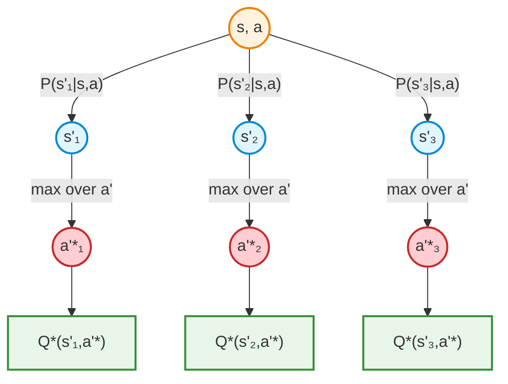

### Intuition
Each diagram shows:

- **Top:** The value we're computing (state value, action value).
- **Middle:** Decomposition into actions and transitions.
- **Bottom:** Next-state values (same type, recursively).

The arrows represent the flow of information: we combine information from all possible next states (weighted by transition probability)
and all possible actions (weighted by policy or maximized).

### Python: Implementing Value Iteration

```python
import numpy as np

def value_iteration(env, gamma=0.99, theta=1e-6, max_iterations=1000):
    """
    Compute an approximately optimal value function using value iteration.

    The GridWorld transitions are stochastic, so we estimate each Bellman
    backup with repeated one-step samples.
    """
    V = np.zeros(env.n_states)

    for iteration in range(max_iterations):
        delta = 0.0

        for state_idx in range(env.n_states):
            state = env.index_to_state(state_idx)

            if not env.is_valid(state) or state == env.goal:
                continue

            q_values = np.zeros(env.n_actions)
            for action in range(env.n_actions):
                q_values[action] = estimate_action_value(
                    env=env,
                    state=state,
                    action=action,
                    V=V,
                    gamma=gamma,
                )

            old_value = V[state_idx]
            V[state_idx] = np.max(q_values)
            delta = max(delta, abs(old_value - V[state_idx]))

        if delta < theta:
            print(f"Converged after {iteration + 1} iterations.")
            break

    policy = np.zeros(env.n_states, dtype=int)
    for state_idx in range(env.n_states):
        state = env.index_to_state(state_idx)

        if not env.is_valid(state) or state == env.goal:
            continue

        q_values = np.array(
            [
                estimate_action_value(env, state, action, V, gamma)
                for action in range(env.n_actions)
            ]
        )
        policy[state_idx] = int(np.argmax(q_values))

    return V, policy


def estimate_action_value(env, state, action, V, gamma, n_samples=200):
    """Approximate Q(s, a) by averaging stochastic one-step outcomes."""
    total = 0.0
    for _ in range(n_samples):
        next_state, reward = env.get_next_state(state, action)
        next_idx = env.state_to_index(next_state)
        total += reward + gamma * V[next_idx]
    return total / n_samples


if __name__ == "__main__":
    env = GridWorld(gamma=0.99)
    V_star, policy_star = value_iteration(env)

    print("Optimal value function:")
    for row in range(env.grid_size):
        row_values = []
        for col in range(env.grid_size):
            state = (row, col)
            if state == env.obstacle:
                row_values.append("  WALL ")
            else:
                idx = env.state_to_index(state)
                row_values.append(f"{V_star[idx]:7.2f}")
        print(" ".join(row_values))

    action_names = np.array(["up", "down", "left", "right"])
    print("\nGreedy policy:")
    for row in range(env.grid_size):
        row_actions = []
        for col in range(env.grid_size):
            state = (row, col)
            if state == env.goal:
                row_actions.append(" GOAL ")
            elif state == env.obstacle:
                row_actions.append(" WALL ")
            else:
                idx = env.state_to_index(state)
                row_actions.append(f"{action_names[policy_star[idx]]:>5}")
        print(" ".join(row_actions))
```

### What to Remember

- Bandits teach exploration under uncertainty without state.
- MDPs add state, transitions, and long-term consequences.
- Bellman equations turn long-horizon reasoning into local recursive updates.
- Value iteration is the bridge from theory to algorithms: repeatedly back up values until they stabilize.
