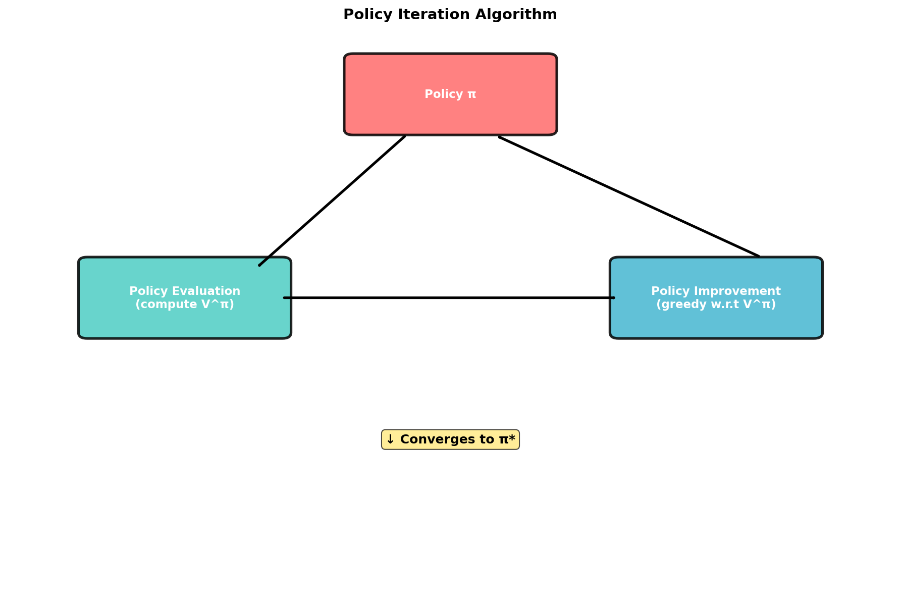
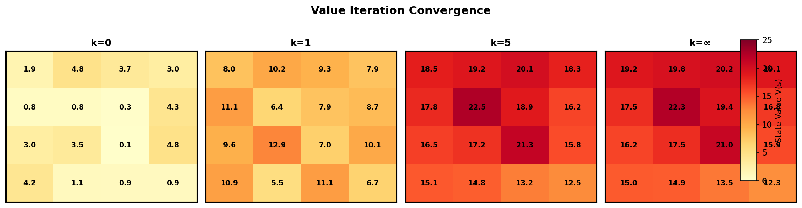
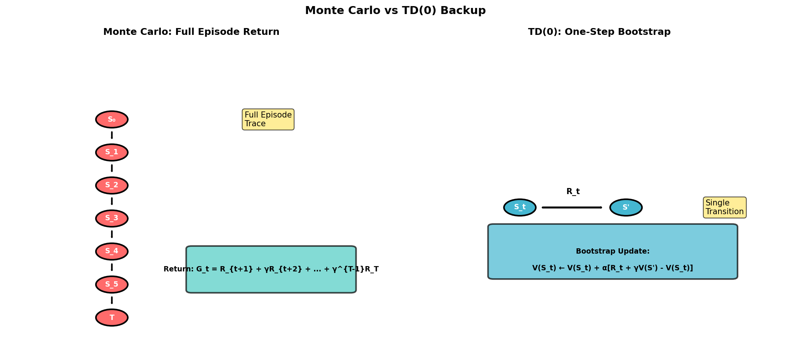
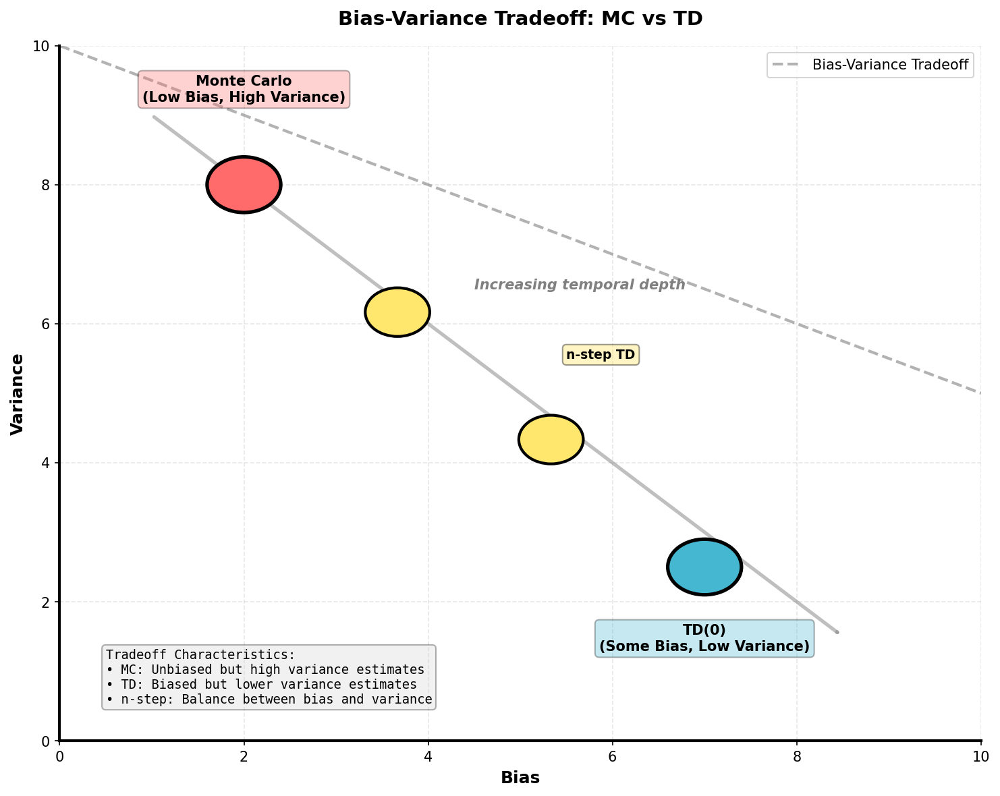
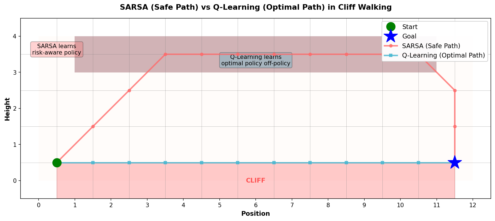

# Chapter 4: Dynamic Programming




**Dynamic Programming (DP)** methods compute optimal value functions using a complete model of the environment's dynamics. They divide the Bellman equations into iterative algorithms that progressively improve estimates of state values or policies.

### At a Glance

| Chapter | Main question | Needs a model? | Learning signal | Best mental model |
|---------|---------------|----------------|-----------------|-------------------|
| 4. Dynamic Programming | "If I know the environment exactly, how do I solve it?" | Yes | Full transition and reward model | Planning by repeated Bellman backups |
| 5. Monte Carlo | "If I can only sample episodes, what can I estimate from complete returns?" | No | Full returns after rollouts | Learn from experience after the episode ends |
| 6. Temporal Difference | "Can I update online before the episode ends?" | No | One-step bootstrap targets | Learn now, bootstrap the rest |

## 4.1 Policy Evaluation (Prediction)

**Problem:** Given a policy \(\pi\), compute the state value function \( V^\pi(s) \) for all states.

In policy evaluation, we want to determine the expected discounted return from each state under a fixed policy \(\pi\). The solution uses the Bellman expectation equation:


$$
V^\pi(s) = \sum_a \pi(a|s) \sum_{s'} P(s'|s,a) \left[ R(s,a,s') + \gamma V^\pi(s') \right]
$$

The recursive structure of the Bellman equation suggests an iterative solution. Starting with arbitrary initial values \(V_0(s)\), we perform successive sweeps through the state space:


$$
V_{k+1}(s) = \sum_a \pi(a|s) \sum_{s'} P(s'|s,a) \left[ R(s,a,s') + \gamma V_k(s') \right]
$$


### Convergence Analysis
The Bellman expectation operator \(\mathcal{T}^\pi\) is defined as:


$$
(\mathcal{T}^\pi V)(s) = \sum_a \pi(a|s) \sum_{s'} P(s'|s,a) \left[ R(s,a,s') + \gamma V(s') \right]
$$

This operator is a \(\gamma\)-contraction in the supremum norm \(\|\cdot\|_\infty\):


$$
\|\mathcal{T}^\pi V - \mathcal{T}^\pi W\|_\infty \leq \gamma \|V - W\|_\infty
$$

By the Banach Fixed-Point Theorem, since \(\gamma \in [0, 1)\), the sequence \(\{V_k\}\) converges to \(V^\pi\) exponentially fast, regardless of the initial value function \(V_0\).


**Intuition:** "Keep averaging your value estimates until they stabilize." Each iteration uses the current value estimates to refine itself. The discount factor \(\gamma\) ensures that the influence of distant future rewards decays, making the problem well-defined and the contraction stronger.

#### Python: Policy Evaluation on 4×4 Gridworld
```python
import numpy as np

# Define 4x4 gridworld: states 0-14 are passable, 15 is goal (absorbing)
# Actions: 0=up, 1=right, 2=down, 3=left
# Reward: -1 per step, 0 at goal

class GridworldEnv:
    def __init__(self, size=4):
        self.size = size
        self.n_states = size * size
        self.n_actions = 4
        self.goal_state = self.n_states - 1

        # Precompute transition probabilities P(s'|s,a)
        # For simplicity: deterministic transitions, out-of-bounds stays in place
        self.P = self._build_transitions()

    def _build_transitions(self):
        """Build P[s][a][s'] = probability of reaching s' from s via action a"""
        P = {}
        for s in range(self.n_states):
            if s == self.goal_state:
                # Goal state is absorbing
                P[s] = {a: {self.goal_state: 1.0} for a in range(4)}
                continue

            P[s] = {}
            row, col = s // self.size, s % self.size

            # Define next positions for each action
            moves = {
                0: (row - 1, col),      # up
                1: (row, col + 1),      # right
                2: (row + 1, col),      # down
                3: (row, col - 1)       # left
            }

            for action, (next_row, next_col) in moves.items():
                # Clip to valid boundaries
                next_row = np.clip(next_row, 0, self.size - 1)
                next_col = np.clip(next_col, 0, self.size - 1)
                next_s = next_row * self.size + next_col

                P[s][action] = {next_s: 1.0}

        return P

    def get_reward(self, s, a, s_next):
        """Reward: -1 for each step, 0 at goal"""
        return 0 if s_next == self.goal_state else -1

def policy_evaluation(env, policy, gamma=0.99, theta=1e-4):
    """
    Evaluate a given policy using iterative application of Bellman equation.

    Args:
        env: Environment with P and reward dynamics
        policy: policy[s][a] = probability of taking action a in state s
        gamma: discount factor
        theta: convergence threshold (max delta between iterations)

    Returns:
        V: Value function V[s] for each state
    """
    V = np.zeros(env.n_states)
    iteration = 0

    while True:
        delta = 0  # Track max change in V

        # Sweep through all states
        for s in range(env.n_states):
            v_old = V[s]

            # Compute new value using Bellman expectation equation:
            # V(s) = Σ_a π(a|s) Σ_s' P(s'|s,a) [R(s,a,s') + γV(s')]
            new_value = 0.0
            for a in range(env.n_actions):
                # Expected value of taking action a
                action_value = 0.0
                for s_next, prob in env.P[s][a].items():
                    reward = env.get_reward(s, a, s_next)
                    action_value += prob * (reward + gamma * V[s_next])

                # Weight by policy
                new_value += policy[s][a] * action_value

            V[s] = new_value
            delta = max(delta, abs(v_old - V[s]))

        iteration += 1
        print(f"Iteration {iteration}: max delta = {delta:.6f}")

        # Stop when values converge (gamma-contraction ensures convergence)
        if delta < theta:
            break

    return V

# Create environment and uniform random policy
env = GridworldEnv(size=4)
policy = np.ones((env.n_states, env.n_actions)) / env.n_actions  # Equal probability for all actions

# Run policy evaluation
V = policy_evaluation(env, policy, gamma=0.99, theta=1e-4)

# Display results
print("\nFinal Value Function (4×4 Gridworld):")
for i in range(4):
    row_vals = V[i*4:(i+1)*4]
    print(" ".join(f"{v:7.2f}" for v in row_vals))
```

## 4.2 Policy Improvement

Once we have the value function \(V^\pi(s)\) for a policy \(\pi\), we can ask: would it be better to take a different action in some state? The policy improvement theorem provides a rigorous answer.

### Policy Improvement Theorem

Suppose we have a policy \(\pi\) with value function \(V^\pi\). Define a new policy \(\pi'\) such that:

$$
\pi'(a|s) = \begin{cases} 1 & \text{if } a = \arg\max_a Q^\pi(s,a) \\ 0 & \text{otherwise} \end{cases}
$$

where the action-value function is \(Q^\pi(s,a) = \sum_{s'} P(s'|s,a)[R(s,a,s') + \gamma V^\pi(s')]\).

**Theorem:** For all states \(s\), \(V^{\pi'}(s) \geq V^\pi(s)\).

**Proof Sketch:** For any state \(s\):

$$
V^\pi(s) = \sum_a \pi(a|s) Q^\pi(s,a) \leq \max_a Q^\pi(s,a) = Q^\pi(s, \pi'(s))
$$

Applying the Bellman expectation equation repeatedly:

$$
Q^\pi(s, \pi'(s)) = \sum_{s'} P(s'|s,\pi'(s))[R + \gamma V^\pi(s')] \leq \sum_{s'} P(s'|s,\pi'(s))[R + \gamma V^{\pi'}(s')] = V^{\pi'}(s)
$$

The key insight: if we choose a greedy action once and then follow \(\pi'\), we eventually end up in states where \(V^{\pi'} \geq V^\pi\).

**Intuition:** "If switching to a different action in one state is better, the whole policy improves." The theorem guarantees monotonic improvement: once you identify a better action from the current state using the current value estimates, committing to that action leads to better overall performance.

### Greedy Improvement

In practice, we use greedy policy improvement:

$$
\pi'(s) = \arg\max_a Q^\pi(s,a)
$$


When there are ties, we can break them arbitrarily. This deterministic policy is evaluated and improved again until no changes occur—at which point we have found a fixed point where greedy action selection agrees with the policy, indicating optimality.

## 4.3 Policy Iteration

Policy iteration alternates between two steps: (1) evaluate the current policy, and (2) improve it. This process is guaranteed to converge to the optimal policy.

$$
\pi_0 \xrightarrow{\text{E}} V^{\pi_0} \xrightarrow{\text{I}} \pi_1 \xrightarrow{\text{E}} V^{\pi_1} \xrightarrow{\text{I}} \pi_2 \xrightarrow{\text{E}} \cdots \xrightarrow{\text{I}} \pi^* \xrightarrow{\text{E}} V^*
$$

### Convergence Guarantees

Since there are only finitely many deterministic policies in a finite MDP (at most \(|A|^{|S|}\) policies), and each iteration either improves the policy or leaves it unchanged, policy iteration must terminate at an optimal policy in a finite number of iterations.

Moreover, each policy is strictly better than the previous one until optimality is reached (since the value of a new policy is strictly greater unless the previous policy was already optimal).

#### Python: Policy Iteration on Gridworld
```python
def policy_iteration(env, gamma=0.99, theta=1e-4):
    """
    Policy iteration: repeatedly evaluate and improve until convergence.

    Returns:
        policy: Final optimal policy
        V: Final value function
        iteration_count: Number of policy improvement iterations
    """
    # Initialize with random policy (equal probability for all actions)
    policy = np.ones((env.n_states, env.n_actions)) / env.n_actions

    iteration = 0
    policy_stable = False

    while not policy_stable:
        # ========== POLICY EVALUATION ==========
        # Compute V^π using the Bellman expectation equation
        V = np.zeros(env.n_states)
        while True:
            delta = 0
            for s in range(env.n_states):
                v_old = V[s]
                new_value = 0.0
                for a in range(env.n_actions):
                    action_value = 0.0
                    for s_next, prob in env.P[s][a].items():
                        reward = env.get_reward(s, a, s_next)
                        action_value += prob * (reward + gamma * V[s_next])
                    new_value += policy[s][a] * action_value
                V[s] = new_value
                delta = max(delta, abs(v_old - V[s]))

            if delta < theta:
                break

        # ========== POLICY IMPROVEMENT ==========
        # Greedily select best action for each state
        policy_stable = True
        new_policy = np.zeros_like(policy)

        for s in range(env.n_states):
            # Compute Q(s,a) for all actions
            action_values = np.zeros(env.n_actions)
            for a in range(env.n_actions):
                for s_next, prob in env.P[s][a].items():
                    reward = env.get_reward(s, a, s_next)
                    action_values[a] += prob * (reward + gamma * V[s_next])

            # Pick greedy action(s)
            best_action = np.argmax(action_values)
            new_policy[s][best_action] = 1.0

            # Check if policy changed
            if not np.allclose(policy[s], new_policy[s]):
                policy_stable = False

        policy = new_policy
        iteration += 1
        print(f"Policy iteration {iteration}: ", end="")
        print("CONVERGED" if policy_stable else "improved")

    return policy, V, iteration

# Run policy iteration
optimal_policy, V_optimal, n_iters = policy_iteration(env, gamma=0.99)

print(f"\nConverged in {n_iters} iterations")
print("\nOptimal Policy (U=↑, R=→, D=↓, L=←):")
action_symbols = ['↑', '→', '↓', '←']
for i in range(4):
    row_policy = []
    for j in range(4):
        s = i * 4 + j
        best_action = np.argmax(optimal_policy[s])
        row_policy.append(action_symbols[best_action])
    print(" ".join(row_policy))
```

## 4.4 Value Iteration




Value iteration combines policy evaluation and improvement into a single step. Instead of fully evaluating a policy before improving it, we apply the Bellman *optimality* operator:

$$
V_{k+1}(s) = \max_a \sum_{s'} P(s'|s,a) \left[ R(s,a,s') + \gamma V_k(s') \right]
$$

### The Bellman Optimality Operator

Define the Bellman optimality operator as:

$$
(\mathcal{T}^* V)(s) = \max_a \sum_{s'} P(s'|s,a) \left[ R(s,a,s') + \gamma V(s') \right]
$$

Like the expectation operator, this is also a \(\gamma\)-contraction:

$$
\|\mathcal{T}^* V - \mathcal{T}^* W\|_\infty \leq \gamma \|V - W\|_\infty
$$

Therefore, iterating \(V_{k+1} = \mathcal{T}^* V_k\) converges to the unique fixed point \(V^*\), the optimal value function.

### Key Insight

Value iteration effectively does one evaluation sweep per improvement. At iteration \(k\), the policy \(\pi_k\) defined by \(\pi_k(s) = \arg\max_a Q_k(s,a)\) is optimal or near-optimal with respect to \(V_k\). Over iterations, \(V_k\) approaches \(V^*\), and \(\pi_k\) approaches \(\pi^*\).

### Value Iteration vs Policy Iteration

| Aspect | Value Iteration | Policy Iteration |
|--------|-----------------|------------------|
| Each iteration cost | One Bellman backup per state | Full policy evaluation (multiple sweeps) plus one improvement sweep |
| Iterations to convergence | More iterations (each does less work) | Fewer iterations (each does more work) |
| Total cost | Often competitive or better in practice | Can be expensive if evaluation is slow |
| Theoretical guarantee | Exponential convergence of \( V \) to \( V^* \) | Finite convergence of \( \pi \) to \( \pi^* \) |

In practice, value iteration is often simpler to implement and can be more efficient, especially with early stopping (extract greedy policy when it stabilizes).

#### Python: Value Iteration on Gridworld
```python
def value_iteration(env, gamma=0.99, theta=1e-4):
    """
    Value iteration: apply Bellman optimality operator until convergence.

    Returns:
        V: Optimal value function
        policy: Greedy policy w.r.t. V*
        iteration_count: Number of iterations
    """
    V = np.zeros(env.n_states)
    iteration = 0

    while True:
        delta = 0

        # Single sweep: for each state, apply Bellman optimality operator
        for s in range(env.n_states):
            v_old = V[s]

            # V(s) = max_a Σ_s' P(s'|s,a) [R(s,a,s') + γV(s')]
            action_values = np.zeros(env.n_actions)
            for a in range(env.n_actions):
                for s_next, prob in env.P[s][a].items():
                    reward = env.get_reward(s, a, s_next)
                    action_values[a] += prob * (reward + gamma * V[s_next])

            # Take max over all actions
            V[s] = np.max(action_values)
            delta = max(delta, abs(v_old - V[s]))

        iteration += 1
        print(f"Value iteration {iteration}: max delta = {delta:.6f}")

        # Converge when value changes are small
        if delta < theta:
            break

    # Extract optimal policy from final value function
    optimal_policy = np.zeros((env.n_states, env.n_actions))
    for s in range(env.n_states):
        action_values = np.zeros(env.n_actions)
        for a in range(env.n_actions):
            for s_next, prob in env.P[s][a].items():
                reward = env.get_reward(s, a, s_next)
                action_values[a] += prob * (reward + gamma * V[s_next])
        best_action = np.argmax(action_values)
        optimal_policy[s][best_action] = 1.0

    return V, optimal_policy, iteration

# Run value iteration

V_star, pi_star, n_iters = value_iteration(env, gamma=0.99)


print(f"\nValue Iteration converged in {n_iters} iterations")
print("\nOptimal Value Function:")
for i in range(4):
    row_vals = V_star[i*4:(i+1)*4]
    print(" ".join(f"{v:7.2f}" for v in row_vals))

print("\nOptimal Policy:")
action_symbols = ['↑', '→', '↓', '←']
for i in range(4):
    row_policy = []
    for j in range(4):
        s = i * 4 + j
        best_action = np.argmax(pi_star[s])
        row_policy.append(action_symbols[best_action])
    print(" ".join(row_policy))
```

# Chapter 5: Monte Carlo Methods




**Monte Carlo methods** learn value functions and policies from complete episodes of experience without requiring a model of the environment. They estimate expected returns by sampling and averaging.

## 5.1 Why Monte Carlo?

Dynamic programming requires complete knowledge of the environment's transition dynamics and reward function. In many real-world scenarios, this is unavailable. Monte Carlo methods learn purely from observed experience.

**Core Idea:** Estimate \(V^\pi(s)\) by averaging the returns observed after visiting state \(s\) in many episodes.

The fundamental insight uses the law of large numbers:

$$
V^\pi(s) = \mathbb{E}[G_t | S_t = s] \approx \frac{1}{N} \sum_{i=1}^{N} G_t^{(i)}
$$

where \(G_t^{(i)}\) is the return (sum of discounted rewards) starting from state \(s\) in episode \(i\).

### Model-Free Learning

Monte Carlo is **model-free**: it does not require knowledge of \(P(s'|s,a)\) or \(R(s,a,s')\). It only needs:
- A way to generate episodes (either by interaction or simulation)
- Access to rewards along trajectories
This makes MC applicable to any problem where you can run simulations or collect experience.

### No Bootstrapping

Unlike dynamic programming, Monte Carlo does *not* bootstrap—it does not use estimates of future values to construct targets. Instead, it uses *actual complete returns*. This has important implications:
- **Unbiased:** The sample mean of observed returns is an unbiased estimator of the true expected return.
- **No model error:** There is no systematic error from approximating future values.
- **Higher variance:** Complete returns depend on many random transitions, leading to higher variance in estimates.

## 5.2 First-Visit vs Every-Visit Monte Carlo Prediction

When predicting state values, we must decide how to aggregate returns from multi-step episodes where a state may be visited multiple times.

### First-Visit MC

**First-Visit MC:** Average the return only from the *first time* state \(s\) is visited in each episode.

Mathematically, let \(t(i)\) be the first time step in episode \(i\) where \(S_{t(i)} = s\). Then:

$$
V(s) \leftarrow \text{average}(G_{t(i)} : i \text{ where } t(i) \text{ is defined})
$$

**Convergence:** By the law of large numbers, \(V(s) \to \mathbb{E}[G_t | S_t = s]\) as the number of episodes \(\to \infty\).

### Every-Visit MC

**Every-Visit MC:** Average the return from *every time* state \(s\) is visited in each episode.

If state \(s\) is visited at times \(t_1, t_2, \ldots, t_k\) in an episode, we collect returns \(G_{t_1}, G_{t_2}, \ldots, G_{t_k}\) and average them.

**Convergence:** Every-visit MC also converges to \(\mathbb{E}[G_t | S_t = s]\), though the proof is slightly more involved.

### Practical Difference

| Aspect | First-Visit MC | Every-Visit MC |
|--------|----------------|----------------|
| Samples per episode | At most one per state | Can be multiple per state |
| Variance (for fixed episodes) | Slightly higher (fewer samples) | Slightly lower (more samples) |
| Bias | Unbiased | Unbiased |
| Preferred in practice | Yes; simpler and less correlated | Less often; samples within an episode are correlated |

In practice, **first-visit MC** is preferred because it uses independent samples (one per episode per state), making variance analysis cleaner.

#### Python: MC Prediction on Blackjack
```python
import numpy as np
from collections import defaultdict

class BlackjackEnv:
    """
    Simplified Blackjack:
    - Player draws cards (face value 1-10) until standing or busting (>21)
    - Dealer stands on 17 or higher
    - Reward: +1 for win, 0 for draw, -1 for loss
    State: (player_sum, dealer_showing, has_ace)
    """

    def __init__(self):
        self.player_sum = 0
        self.dealer_showing = 0
        self.player_has_ace = False
        self.dealer_card = 0

    def reset(self):
        """Start a new episode: both draw one card"""
        self.player_sum = np.random.randint(4, 12)  # 1-10 + 1-10, simplified
        self.player_has_ace = self.player_sum == 11
        self.dealer_showing = np.random.randint(2, 12)
        self.dealer_card = self.dealer_showing
        return (self.player_sum, self.dealer_showing, self.player_has_ace)

    def step(self, action):
        """
        action: 0 = stick (stand), 1 = hit (draw)
        returns: next_state, reward, done
        """
        if action == 0:  # Stick
            return self._resolve_game()
        else:  # Hit
            card = np.random.randint(1, 11)
            self.player_sum += card

            # Ace adjustment: if we bust with ace as 11, count it as 1
            if card == 1:
                self.player_has_ace = True
            if self.player_sum > 21 and self.player_has_ace:
                self.player_sum -= 10
                self.player_has_ace = False

            # Bust?
            if self.player_sum > 21:
                return (self.player_sum, self.dealer_showing, self.player_has_ace), -1, True

            return (self.player_sum, self.dealer_showing, self.player_has_ace), 0, False

    def _resolve_game(self):
        """Dealer plays (hits until ≥17), determine winner"""
        dealer_sum = self.dealer_card

        # Dealer hits until reaching 17 or busting
        while dealer_sum < 17:
            dealer_sum += np.random.randint(1, 11)

        # Compare
        if dealer_sum > 21:
            reward = 1  # Dealer busts, player wins
        elif self.player_sum > dealer_sum:
            reward = 1
        elif self.player_sum == dealer_sum:
            reward = 0
        else:
            reward = -1

        return (self.player_sum, self.dealer_showing, self.player_has_ace), reward, True

def mc_prediction(env, policy, n_episodes=100000, gamma=1.0):
    """
    Monte Carlo prediction: estimate V(s) by averaging returns.

    Args:
        env: Environment
        policy: policy(state) -> action (deterministic or stochastic)
        n_episodes: Number of episodes to sample
        gamma: Discount factor

    Returns:
        V: Value function dict {state -> estimated value}
        returns_list: Dict {state -> list of returns observed from that state}
    """
    V = defaultdict(float)
    returns_list = defaultdict(list)  # Track all returns for each state

    for episode in range(n_episodes):
        # Generate an episode following policy
        state = env.reset()
        episode_states = [state]
        episode_rewards = []

        done = False
        while not done:
            action = policy(state)
            state, reward, done = env.step(action)
            episode_states.append(state)
            episode_rewards.append(reward)

        # Compute returns (backwards from terminal state)
        G = 0
        for t in range(len(episode_rewards) - 1, -1, -1):
            G = episode_rewards[t] + gamma * G
            s = episode_states[t]

            # FIRST-VISIT: Only process first occurrence of s in episode
            if t == 0 or s not in episode_states[:t]:
                returns_list[s].append(G)
                V[s] = np.mean(returns_list[s])

        if (episode + 1) % 10000 == 0:
            print(f"Episode {episode + 1}: Sample size = {sum(len(returns_list[s]) for s in returns_list)}")

    return V, returns_list

# Simple policy: stick on 20-21, else hit
def simple_policy(state):
    player_sum, dealer_showing, has_ace = state
    return 0 if player_sum >= 20 else 1

env = BlackjackEnv()

V_mc, returns = mc_prediction(env, simple_policy, n_episodes=100000)


# Display sample values
print("\nMonte Carlo Estimates (sample of states):")
test_states = [
    (10, 5, False),
    (15, 7, False),
    (20, 3, False),
    (21, 6, False),
]
for state in test_states:
    if state in V_mc:
        print(f"V({state}) = {V_mc[state]:6.3f} (n={len(returns[state])} samples)")
```

## 5.3 MC Control: On-Policy Learning

MC prediction estimates the value of a given policy. For control, we want to improve the policy. On-policy methods learn the policy while following it (using the same policy for both exploration and exploitation).

### \(\varepsilon\)-Greedy Policy

To ensure exploration, we use \(\varepsilon\)-soft policies:

$$
\pi(a|s) = \begin{cases} 1 - \varepsilon + \frac{\varepsilon}{|A|} & \text{if } a = \arg\max_a Q(s,a) \\ \frac{\varepsilon}{|A|} & \text{otherwise} \end{cases}
$$

The policy always takes the greedy action with probability \(1 - \varepsilon + \varepsilon/|A|\) and explores uniformly with probability \(\varepsilon\). This ensures every action gets tried infinitely often with positive probability.

### GLIE (Greedy in the Limit with Infinite Exploration)

For on-policy MC to converge to optimal policies, we need:
- All state-action pairs are visited infinitely often
- Policy converges to greedy (no exploration in the limit)
**GLIE schedule:** Use \(\varepsilon_k = 1/k\) (or any schedule where \(\sum_k \varepsilon_k = \infty\) and \(\lim_k \varepsilon_k = 0\)).

**Theorem (Convergence):** MC with GLIE converges to optimal policy and value function.

#### Python: MC Control with GLIE
```python
def mc_control_on_policy(env, n_episodes=100000, gamma=1.0):
    """
    On-policy MC control with ε-greedy exploration (GLIE).

    Returns:
        Q: Action-value function {state -> {action -> value}}
        policy: Final policy {state -> action}
    """
    Q = defaultdict(lambda: defaultdict(float))
    N = defaultdict(lambda: defaultdict(float))  # Visit counts for averaging

    for episode in range(n_episodes):
        # Decay epsilon to ensure GLIE
        epsilon = 1.0 / (episode + 1)

        # Generate episode using current ε-greedy policy
        state = env.reset()
        episode_history = []

        done = False
        while not done:
            # ε-greedy action selection
            if np.random.random() < epsilon:
                action = np.random.randint(0, 2)  # Blackjack: 0=stick, 1=hit
            else:
                # Greedy: pick best action, break ties randomly
                best_actions = [a for a in [0, 1]
                               if Q[state][a] == max(Q[state][0], Q[state][1])]
                action = np.random.choice(best_actions)

            next_state, reward, done = env.step(action)
            episode_history.append((state, action, reward))
            state = next_state

        # MC evaluation: compute returns and update Q
        G = 0
        for t in range(len(episode_history) - 1, -1, -1):
            s, a, r = episode_history[t]
            G = r + gamma * G

            # First-visit only
            if t == 0 or (s, a) not in [(s_, a_) for s_, a_, _ in episode_history[:t]]:
                N[s][a] += 1
                Q[s][a] += (G - Q[s][a]) / N[s][a]  # Incremental mean

        if (episode + 1) % 20000 == 0:
            print(f"Episode {episode + 1}: ε = {epsilon:.4f}")

    # Extract final policy (greedy w.r.t. Q)
    policy = {}
    for state in Q:
        best_action = max([0, 1], key=lambda a: Q[state][a])
        policy[state] = best_action

    return Q, policy

Q, policy = mc_control_on_policy(env, n_episodes=100000)

print("\nFinal Policy (player_sum, dealer_card, has_ace) -> action:")
print("(0=stick, 1=hit)")
for state in sorted(Q.keys()):
    best_a = max([0, 1], key=lambda a: Q[state][a])
    val = max(Q[state][0], Q[state][1])
    action_str = "STICK" if best_a == 0 else "HIT "
    print(f"{state}: {action_str} (value={val:6.3f})")
```

## 5.4 Importance Sampling for Off-Policy MC

On-policy methods are inefficient: data is discarded once the policy improves. Off-policy methods learn about optimal behavior while following a different (often exploratory) behavior policy.

### The Off-Policy Problem

We have data from a behavior policy \(b\) but want to evaluate a target policy \(\pi\). The issue: states and actions under \(\pi\) may have different probabilities than under \(b\).

Example: \(b\) explores uniformly while \(\pi\) is greedy. The probability of a trajectory under \(\pi\) differs from that under \(b\).

### Importance Sampling Ratio

The **importance sampling ratio** corrects for the difference in probabilities:

$$
\rho_t^{T-1} = \prod_{k=t}^{T-1} \frac{\pi(A_k|S_k)}{b(A_k|S_k)}
$$


This ratio represents how much more (or less) likely the trajectory is under \(\pi\) compared to \(b\).

An episode's return under \(\pi\) can be estimated by:


$$
G_t^{\pi} = \rho_t^{T-1} G_t
$$


That is, we reweight the observed return by how much the trajectory's probability changes.

### Ordinary Importance Sampling

**Ordinary IS:** Average the weighted returns:


$$
V(s) = \frac{\sum_{i=1}^{n} \rho_i G_i}{n}
$$


**Properties:**
- **Unbiased:** \(\mathbb{E}[V(s)] = \mathbb{E}[G | S_t = s]\) = \(V^\pi(s)\)
- **High variance:** The ratio \(\rho\) can be very large if actions are unlikely under \(b\), causing high variance and slow convergence
### Weighted Importance Sampling

**Weighted IS:** Normalize by the sum of weights:

$$
V(s) = \frac{\sum_{i=1}^{n} \rho_i G_i}{\sum_{i=1}^{n} \rho_i}
$$

**Properties:**
- **Biased:** Not unbiased in finite samples, but bias → 0 as \(n \to \infty\)
- **Lower variance:** Weights normalize outliers, reducing variance significantly
In practice, **weighted IS is preferred** because lower variance often outweighs the small bias.

**Intuition:** "Re-weight experiences to account for the different behavior." If under the behavior policy we took a surprising (unlikely) action that happens to be good under the target policy, we upweight that return. Conversely, if we took a likely action under behavior but it's unlikely under target, we downweight it.

#### Python: Off-Policy MC with Importance Sampling
```python
def off_policy_mc_evaluation(env, target_policy, behavior_policy,
                             n_episodes=100000, gamma=1.0, use_weighted_is=True):
    """
    Evaluate target_policy using data from behavior_policy via importance sampling.

    Args:
        target_policy: function that returns action given state
        behavior_policy: function that returns action and its probability
        use_weighted_is: True for weighted IS, False for ordinary IS

    Returns:
        V: Value function estimate
        N_samples: Number of samples for each state
    """
    V = defaultdict(float)
    N_samples = defaultdict(float)

    for episode in range(n_episodes):
        # Generate episode under behavior policy
        state = env.reset()
        episode_history = []

        done = False
        while not done:
            # Take action under BEHAVIOR policy
            action = behavior_policy(state)
            next_state, reward, done = env.step(action)
            episode_history.append((state, action, reward))
            state = next_state

        # Compute importance-weighted returns
        # For weighted IS, we maintain cumulative weight
        weight = 1.0
        G = 0

        # Work backwards through episode
        for t in range(len(episode_history) - 1, -1, -1):
            s, a, r = episode_history[t]
            G = r + gamma * G

            # Compute importance ratio at time t
            target_prob = 1.0 if a == target_policy(s) else 0.0  # Deterministic target
            behavior_prob = 0.5  # Uniform behavior (Blackjack: 2 actions)

            weight *= target_prob / behavior_prob

            # Skip if ratio becomes zero (trajectory impossible under target)
            if weight == 0:
                break

            # First-visit only
            if t == 0 or s not in [s_ for s_, _, _ in episode_history[:t]]:
                if use_weighted_is:
                    # Weighted: accumulate weighted return

                    N_samples[s] += weight

                    V[s] += (weight * G - V[s]) / N_samples[s] if N_samples[s] > 0 else 0
                else:
                    # Ordinary: maintain list of weighted returns
                    if s not in V:
                        V[s] = []
                    V[s].append(weight * G)

        if (episode + 1) % 20000 == 0:
            n_states_visited = len(V)
            print(f"Episode {episode + 1}: {n_states_visited} states visited")

    # For ordinary IS, convert lists to averages
    if not use_weighted_is:

        V_avg = {}

        for s in V:

            V_avg[s] = np.mean(V[s]) if V[s] else 0.0

        V = V_avg

    return V, N_samples

# Behavior policy: uniform (explore both stick and hit)
def uniform_behavior_policy(state):
    return np.random.randint(0, 2)

# Target policy: greedy based on a pre-learned Q-function
learned_Q = defaultdict(lambda: {0: 10, 1: -5})  # Simplified: prefer stick
def greedy_target_policy(state):
    return max([0, 1], key=lambda a: learned_Q[state][a])

# Evaluate target using behavior data

V_target_weighted, n_weighted = off_policy_mc_evaluation(

    env, greedy_target_policy, uniform_behavior_policy,
    n_episodes=50000, use_weighted_is=True
)

print("\nOff-Policy MC (Weighted IS) Value Estimates:")
for state in sorted(V_target_weighted.keys())[:10]:
    print(f"V({state}) = {V_target_weighted[state]:6.3f} (n={n_weighted[state]:.0f})")
```

# Chapter 6: Temporal Difference Learning




**Temporal Difference (TD) learning** combines the best of two worlds: it learns from raw experience like Monte Carlo, but uses bootstrapping (value estimates for future states) like Dynamic Programming. This makes TD more efficient and practical than either approach alone.

## 6.1 The TD Idea: Unifying MC and DP

Monte Carlo methods wait until the episode ends to update values. Dynamic Programming updates immediately using estimates. TD does both: it updates immediately (before the episode ends) using an estimate of the future.

### TD(0) Update Rule

The simplest TD algorithm is **TD(0)**:

$$
V(S_t) \leftarrow V(S_t) + \alpha \left[ R_{t+1} + \gamma V(S_{t+1}) - V(S_t) \right]
$$

This update happens at each time step \(t\), not at the end of the episode. The quantity in brackets is the **TD error**:

$$
\delta_t = R_{t+1} + \gamma V(S_{t+1}) - V(S_t)
$$

The TD error measures the difference between:
- **TD target:** \(R_{t+1} + \gamma V(S_{t+1})\)—the observed reward plus the current estimate of future value
- **Current estimate:** \(V(S_t)\)
We move \(V(S_t)\) toward the TD target by a fraction \(\alpha\) (the learning rate).

### Why TD Works: Bootstrapping

TD uses a bootstrap: the TD target \(R_{t+1} + \gamma V(S_{t+1})\) relies on the current estimate \(V(S_{t+1})\). This introduces some bias (the estimate may be wrong), but it drastically reduces variance compared to waiting for complete returns.

The key advantage: TD can update after a single step, without waiting for the episode to finish. This enables learning in continuing tasks (where episodes don't naturally end) and faster learning in episodic tasks.

**Intuition:** "Don't wait until the end of the episode — update after each step using your current estimate of the next state's value." If you're in state \(S_t\) and take an action leading to state \(S_{t+1}\), you can immediately make a small adjustment to \(V(S_t)\) based on the reward received and your current belief about \(S_{t+1}\)'s value. As you learn and \(V(S_{t+1})\) becomes more accurate, past updates were justified.

## 6.2 Comparison: TD vs Monte Carlo vs Dynamic Programming

Each approach has different properties. Understanding the tradeoffs is crucial for choosing the right method.

### Comparison Table

| Property | Dynamic Programming | Monte Carlo | Temporal Difference |
|----------|----------------------|-------------|---------------------|
| Requires model? | Yes; needs \( P(s' \mid s,a) \) and rewards | No | No |
| Bootstraps? | Yes | No | Yes |
| Requires complete episodes? | No | Yes | No |
| Bias | Depends on initialization | Unbiased (uses actual returns) | Biased (uses estimates) |
| Variance | Low | High | Low |
| Convergence rate | Fast when the model is accurate | Slow because of high variance | Medium; good balance in practice |
| Efficiency | Expensive full sweeps | Incremental, but waits for episode end | Incremental and online |

### The Bias-Variance Tradeoff

**Monte Carlo:** The target is the actual return \(G_t = R_{t+1} + \gamma R_{t+2} + \gamma^2 R_{t+3} + \cdots\). This depends on many random transitions ahead, so it has high variance but zero bias.

**TD(0):** The target is \(R_{t+1} + \gamma V(S_{t+1})\). This depends on only one random transition (to \(S_{t+1}\)), so it has lower variance. However, if \(V(S_{t+1})\) is inaccurate, the target is biased.

Formally, the variance of the MC target grows with the episode length, while the TD target's variance is dominated by a single step's randomness—a massive reduction.


$$
\text{Var}(G_t) \propto T \quad \text{vs} \quad \text{Var}(R_{t+1} + \gamma V(S_{t+1})) \propto 1
$$


In practice, this bias-variance tradeoff often favors TD, especially in problems with long episodes or continuing tasks.



## 6.3 SARSA: On-Policy TD Control

**SARSA** (State-Action-Reward-State-Action) extends TD to control by learning action values \(Q(s,a)\) instead of state values. It is an on-policy algorithm: it evaluates and improves the policy being followed.

### The SARSA Update

The SARSA update rule is:


$$
Q(S_t, A_t) \leftarrow Q(S_t, A_t) + \alpha \left[ R_{t+1} + \gamma Q(S_{t+1}, A_{t+1}) - Q(S_t, A_t) \right]
$$

where \(A_{t+1}\) is the action *actually taken* in state \(S_{t+1}\) (not the greedy action). This is why the algorithm needs all five elements: (S_t, A_t, R_{t+1}, S_{t+1}, A_{t+1}).


The TD target is \(R_{t+1} + \gamma Q(S_{t+1}, A_{t+1})\)—the immediate reward plus the estimate of the next state-action pair that will actually be visited.

### On-Policy Property

SARSA is **on-policy**: it updates toward the value of the policy currently being followed, including its exploratory actions. If the policy uses \(\varepsilon\)-greedy exploration, the TD target accounts for the possibility of exploratory actions in the next step.

This makes SARSA conservative: it learns the value of exploration, so it learns safer, more realistic value estimates. However, it cannot learn the optimal policy faster than the behavior policy allows.

#### Python: SARSA on CliffWalking
```python
import numpy as np
import matplotlib.pyplot as plt

class CliffWalkingEnv:
    """
    4×12 gridworld. Cliff in bottom row (except start and goal).
    Start: (3, 0), Goal: (3, 11)
    Falling off cliff: -100 reward, immediate reset to start
    Normal step: -1 reward
    """

    def __init__(self):
        self.grid_height = 4
        self.grid_width = 12
        self.start_pos = (3, 0)
        self.goal_pos = (3, 11)
        self.cliff_row = 3
        self.cliff_cols = set(range(1, 11))  # Columns 1-10 are cliff
        self.current_pos = self.start_pos

    def reset(self):
        self.current_pos = self.start_pos
        return self._pos_to_state()

    def _pos_to_state(self):
        r, c = self.current_pos
        return r * self.grid_width + c

    def _state_to_pos(self, state):
        return (state // self.grid_width, state % self.grid_width)

    def step(self, action):
        """Actions: 0=up, 1=right, 2=down, 3=left"""
        r, c = self.current_pos
        moves = {0: (-1, 0), 1: (0, 1), 2: (1, 0), 3: (0, -1)}
        dr, dc = moves[action]

        new_r, new_c = np.clip(r + dr, 0, 3), np.clip(c + dc, 0, 11)
        self.current_pos = (new_r, new_c)

        # Check if fell off cliff
        if new_r == self.cliff_row and new_c in self.cliff_cols:
            reward = -100
            self.current_pos = self.start_pos  # Reset to start
            done = False  # Episode doesn't end
        elif self.current_pos == self.goal_pos:
            reward = 0
            done = True
        else:
            reward = -1
            done = False

        return self._pos_to_state(), reward, done

    def render_policy(self, policy):
        """Display policy as arrow grid"""
        symbols = ['↑', '→', '↓', '←']
        grid = []
        for r in range(self.grid_height):
            row = []
            for c in range(self.grid_width):
                state = r * self.grid_width + c
                if (r, c) == self.goal_pos:
                    row.append('G')
                elif r == self.cliff_row and c in self.cliff_cols:
                    row.append('C')
                else:
                    best_action = np.argmax(policy[state])
                    row.append(symbols[best_action])
            grid.append(' '.join(row))
        return '\n'.join(grid)

def sarsa(env, n_episodes=500, alpha=0.1, gamma=1.0, epsilon=0.1):
    """
    SARSA: On-policy TD control

    Returns:
        Q: Action-value function
        episode_rewards: Reward per episode (for plotting)
    """
    n_states = env.grid_height * env.grid_width
    n_actions = 4
    Q = np.zeros((n_states, n_actions))

    episode_rewards = []

    for episode in range(n_episodes):
        state = env.reset()

        # ε-greedy action selection
        if np.random.random() < epsilon:
            action = np.random.randint(n_actions)
        else:
            action = np.argmax(Q[state])

        episode_reward = 0
        done = False

        while not done:
            # Take action, observe (s', r, done)
            next_state, reward, done = env.step(action)
            episode_reward += reward

            # Select next action using ε-greedy w.r.t. CURRENT policy
            if np.random.random() < epsilon:
                next_action = np.random.randint(n_actions)
            else:
                next_action = np.argmax(Q[next_state])

            # SARSA update: use actual next action
            td_target = reward + gamma * Q[next_state, next_action]
            td_error = td_target - Q[state, action]
            Q[state, action] += alpha * td_error

            state, action = next_state, next_action

        episode_rewards.append(episode_reward)

        if (episode + 1) % 100 == 0:
            avg_reward = np.mean(episode_rewards[-100:])
            print(f"SARSA Episode {episode + 1}: avg reward (last 100) = {avg_reward:.1f}")

    # Extract final policy
    policy = np.argmax(Q, axis=1)

    return Q, policy, episode_rewards

# Run SARSA
env = CliffWalkingEnv()

Q_sarsa, pi_sarsa, rewards_sarsa = sarsa(env, n_episodes=500, alpha=0.1, epsilon=0.1)


print("\nSARSA Learned Policy:")
print(env.render_policy(Q_sarsa))
```

## 6.4 Q-Learning: Off-Policy TD Control

**Q-Learning** is an off-policy TD control algorithm: it learns the optimal policy while following a different (exploratory) policy. This makes it significantly more efficient than SARSA in many problems.

### The Q-Learning Update

The Q-learning update rule is:

$$
Q(S_t, A_t) \leftarrow Q(S_t, A_t) + \alpha \left[ R_{t+1} + \gamma \max_{a'} Q(S_{t+1}, a') - Q(S_t, A_t) \right]
$$

The key difference from SARSA: instead of using the action \(A_{t+1}\) that will actually be taken, Q-learning uses the *greedy* action \(\max_{a'} Q(S_{t+1}, a')\). This is what makes it off-policy.

The TD target is now \(R_{t+1} + \gamma \max_{a'} Q(S_{t+1}, a')\)—the immediate reward plus the estimated value of the *best* action available in the next state.

### Off-Policy Property

Q-learning evaluates and improves the **greedy policy** while following an \(\varepsilon\)-greedy behavior policy. Even though the agent explores (takes random actions sometimes), the TD target always optimistically assumes it will take the best action next.

This separates the behavior and target policies:
- **Behavior policy:** \(\varepsilon\)-greedy w.r.t. current Q—ensures exploration
- **Target policy:** Greedy w.r.t. Q—the policy being optimized
Since exploration is "built into" the behavior policy, Q-learning can be more aggressive (larger \(\varepsilon\)) and still converge to the optimal policy faster than SARSA.

### Convergence Guarantees

**Theorem (Watkins & Dayan):** Under the Robbins-Monro conditions on the learning rate \(\alpha_t\) (i.e., \(\sum_t \alpha_t(s,a) = \infty\) and \(\sum_t \alpha_t^2(s,a)
S . . . . . . . . . . .
. . . . . . . . . . . .
. . . . . . . . . . . .
. C C C C C C C C C . G

Legend:
S = Start (3,0)
. = Safe cell (reward -1)
C = Cliff (reward -100, reset to start)
G = Goal (3,11)

The optimal path runs along the cliff edge (row 3, columns 0→11) for a total reward of approximately -12 (11 steps × -1).

An alternative safe path runs above the cliff for a total reward of approximately -25 (25 steps × -1 to go around).

### SARSA Behavior

SARSA accounts for exploration risk. When following an \(\varepsilon\)-greedy policy near the cliff:

- With probability \(\varepsilon\), the agent might take a random action and fall off the cliff (reward -100)
- SARSA's update uses the actual next action, which includes this exploration risk
- The value of the cliff-edge path is reduced to account for exploration
**Result:** SARSA learns the **safe path** away from the cliff. This is conservative but realistic given the exploration strategy.

### Q-Learning Behavior

Q-learning is optimistic about the target policy. When learning near the cliff:

- Q-learning's update uses \(\max Q(S_{t+1}, a')\), assuming the best action will be taken next
- It does not account for the risk that ε-greedy exploration might fall off the cliff
- The value of the cliff-edge path is not reduced
**Result:** Q-learning learns the **optimal path** near the cliff edge. This is aggressive and assumes perfect future execution.

**Key Insight:** SARSA is pessimistic (conservative) about exploration, while Q-learning is optimistic about future behavior. Neither is wrong—they learn different things. SARSA learns "the best I can reliably do while exploring," while Q-learning learns "the best I could do with a perfect greedy policy."

### Visualization and Comparison

SARSA Learned Path (Conservative):
S → → → → → → → → → ↓
↑                   ↓
↑ . . . . . . . . . ↓
↑ C C C C C C C C C G

Takes a detour above the cliff to avoid risk from exploration.

Q-Learning Learned Path (Optimal):
S ↓ ← ← ← ← ← ← ← ← ↓
↑                   ↓
↑                   ↓
↑ C C C C C C C C C G

Follows the cliff edge, assuming optimal greedy behavior in the future.

#### Python: Comparison and Visualization
```python
# Compare SARSA and Q-Learning on the same problem
env_cw = CliffWalkingEnv()

print("=" * 60)
print("CLIFF WALKING: SARSA vs Q-LEARNING")
print("=" * 60)

# Run both algorithms
Q_sarsa, pi_sarsa, rewards_sarsa = sarsa(env_cw, n_episodes=500, alpha=0.1, epsilon=0.1)
Q_ql, pi_ql, rewards_ql = q_learning(env_cw, n_episodes=500, alpha=0.1, epsilon=0.1)

print("\n" + "=" * 60)
print("SARSA POLICY (On-Policy, Conservative)")
print("=" * 60)
print(env_cw.render_policy(Q_sarsa))

print("\n" + "=" * 60)
print("Q-LEARNING POLICY (Off-Policy, Optimistic)")
print("=" * 60)
print(env_cw.render_policy(Q_ql))

# Analyze policies
sarsa_cliff_steps = sum(1 for i in range(1, 11)
                        if np.argmax(Q_sarsa[3 * 12 + i]) == 1)  # Right moves on cliff row
ql_cliff_steps = sum(1 for i in range(1, 11)
                      if np.argmax(Q_ql[3 * 12 + i]) == 1)

print("\n" + "=" * 60)
print("POLICY ANALYSIS")
print("=" * 60)
print(f"SARSA 'Right' moves on cliff row (cols 1-10): {sarsa_cliff_steps}")
print(f"Q-Learning 'Right' moves on cliff row (cols 1-10): {ql_cliff_steps}")
print(f"\nSARSA takes safer path (fewer cliff-edge steps).")
print(f"Q-Learning takes optimal path (more cliff-edge steps).")

# Compare learning curves
import matplotlib.pyplot as plt

# Smooth rewards for visualization
def smooth(x, window=10):
    return np.convolve(x, np.ones(window)/window, mode='valid')

plt.figure(figsize=(10, 6))
episodes_smooth = np.arange(len(smooth(rewards_sarsa)))
plt.plot(episodes_smooth, smooth(rewards_sarsa), label='SARSA', linewidth=2)
plt.plot(episodes_smooth, smooth(rewards_ql), label='Q-Learning', linewidth=2)
plt.xlabel('Episode')
plt.ylabel('Reward per Episode (smoothed)')
plt.title('Cliff Walking: SARSA vs Q-Learning Learning Curves')
plt.legend(fontsize=12)
plt.grid(True, alpha=0.3)
plt.tight_layout()
plt.savefig('/tmp/sarsa_vs_qlearning.png', dpi=150)
print("\nLearning curve saved to /tmp/sarsa_vs_qlearning.png")

print("\n" + "=" * 60)
print("SUMMARY")
print("=" * 60)
print("SARSA: Learns the value of exploration, takes safe path.")
print("Q-Learning: Assumes optimal greedy behavior, takes optimal path.")
print("\nBoth converge to different policies because they optimize")
print("different target policies under different assumptions.")
```
