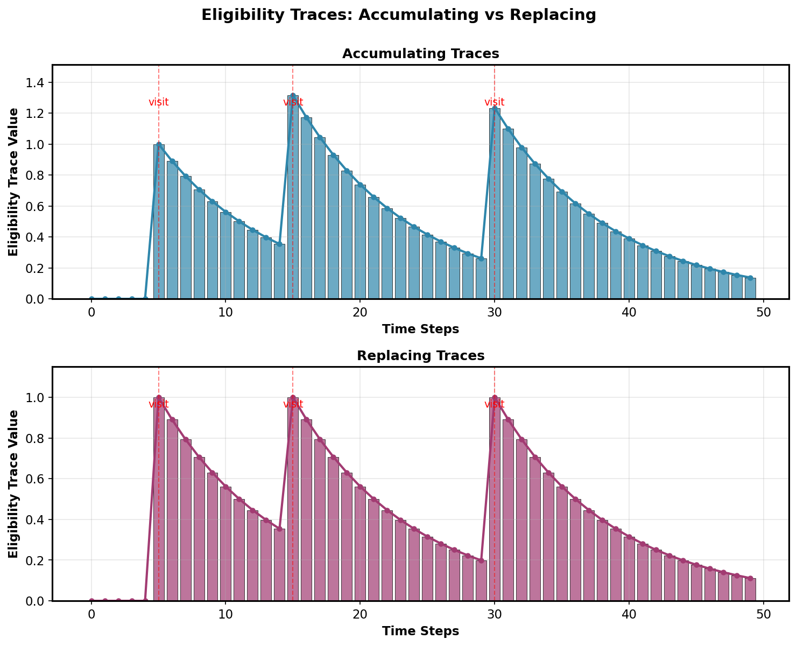
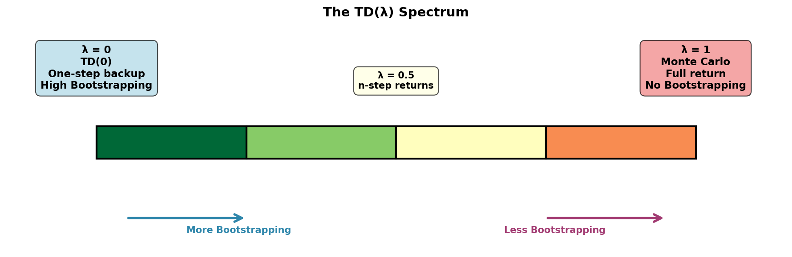
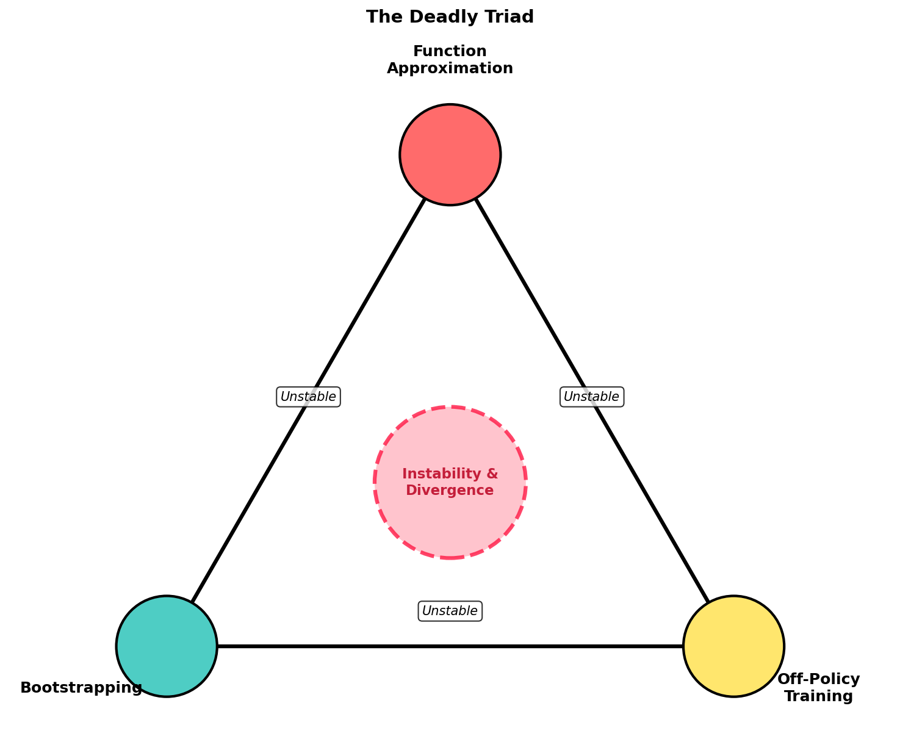
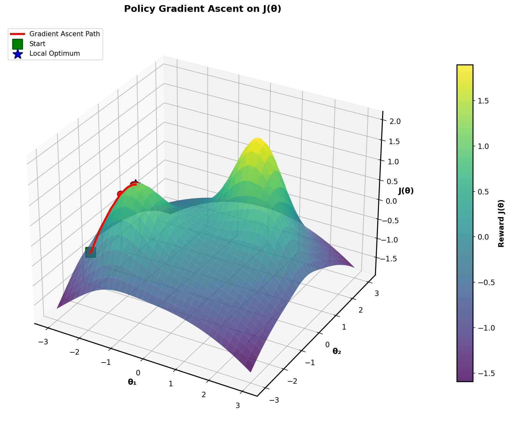
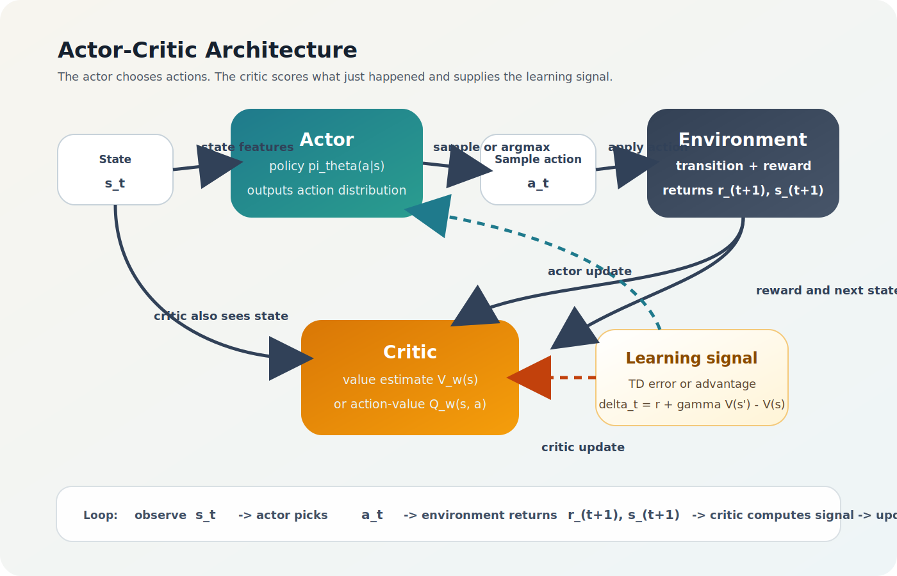
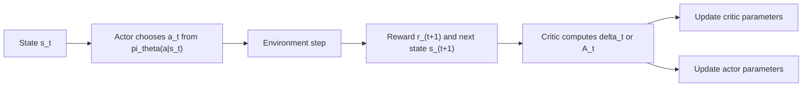

# Chapter 7: n-Step Methods and TD(λ)



### Learning Map

| Chapter | Core question | Main object to track | Common failure mode |
|---------|---------------|----------------------|---------------------|
| 7. n-Step Methods and TD(λ) | How far should I bootstrap? | n-step returns and eligibility traces | Picking updates that are too noisy or too biased |
| 8. Value Function Approximation | How do I generalize beyond tables? | Features and parameter vector \( \mathbf{w} \) | Divergence from the deadly triad |
| 9. Policy Gradients | What if I optimize the policy directly? | \( \pi_\theta(a \mid s) \) and \( \nabla_\theta J(\theta) \) | High-variance gradient estimates |
| 10. Actor-Critic | How do I combine policy learning with value estimation? | Actor, critic, and advantage estimates | Unstable critic or overly aggressive policy updates |


### 7.1 n-Step Returns

In previous chapters, we encountered two extremes: **TD(0)** uses only one step of experience before bootstrapping, while **Monte Carlo** uses the full return until episode termination. The n-step framework unifies these approaches by generalizing the backup depth.

#### The Spectrum from TD(0) to MC

Define the n-step return as:


$$
G_t^{(n)} = \sum_{k=0}^{n-1} \gamma^k R_{t+k+1} + \gamma^n V(S_{t+n})
$$


We can trace through the spectrum:

- **1-step (TD(0)):** \( G_t^{(1)} = R_{t+1} + \gamma V(S_{t+1}) \) Uses only the immediate reward and bootstraps from the next state value.
- **2-step:** \( G_t^{(2)} = R_{t+1} + \gamma R_{t+2} + \gamma^2 V(S_{t+2}) \) Incorporates two steps of actual returns, then bootstraps.
- **∞-step (Monte Carlo):** \( G_t^{(\infty)} = \sum_{k=0}^{\infty} \gamma^k R_{t+k+1} \) No bootstrapping—uses all accumulated rewards until episode end.

#### The Bias-Variance Tradeoff as a Function of n

- **Key Insight:** As \( n \) increases: **Bias decreases:** Relying more on actual experience, less on the (potentially inaccurate) bootstrap estimate.
- **Variance increases:** More terms in the sum \( G_t^{(n)} \) means higher variance in the return estimate.

> Small \( n \) = high bias, low variance. Large \( n \) = low bias, high variance.

Mathematically, the bias stems from the approximation error in \( V(S_{t+n}) \), which dominates when \( n \) is small. The variance comes from the stochasticity of rewards \( R_{t+1}, \ldots, R_{t+n} \), which accumulates as \( n \) grows.

#### Intuition

Think of it this way: *"How many steps of actual experience do you use before you stop trusting experience and start trusting your current value estimate?"* With \( n=1 \), you trust the value function quickly (biased but stable). With large \( n \), you collect more real data before trusting your estimate (less biased but noisier).

### 7.2 TD(λ) — Forward View




Rather than picking a single value of \( n \), why not take a **weighted average of all possible n-step returns**? This is the elegant insight behind TD(λ).

#### The λ-Return


$$
G_t^{\lambda} = (1-\lambda) \sum_{n=1}^{\infty} \lambda^{n-1} G_t^{(n)}
$$

The weights \( (1-\lambda) \lambda^{n-1} \) form a geometric distribution that sums to 1, ensuring the λ-return is a proper weighted average. The normalization factor \( (1-\lambda) \) ensures probabilities sum to unity.


#### Boundary Cases

- **λ = 0:** \( G_t^{0} = (1-0) \cdot 1 \cdot G_t^{(1)} = G_t^{(1)} \) → pure TD(0)
- **λ = 1:** \( G_t^{1} = (1-1) \sum_{n=1}^{\infty} G_t^{(n)} \) formally undefined, but the limit gives MC return
- **λ = 0.9:** Gives more weight to short returns, some weight to long returns

#### Intuition

*"Instead of betting all your chips on a single value of n, place bets across the entire spectrum. Recent steps get higher weight (recency bias), but even distant steps contribute."* This provides a smooth middle ground between the stability of TD and the low-bias property of MC.

### 7.3 TD(λ) — Backward View with Eligibility Traces

Computing the forward-view λ-return requires looking into the future (not practical for online learning). The backward view provides an **online, incremental** algorithm using eligibility traces.

#### Eligibility Traces

The eligibility trace for state \( s \) evolves as:


$$
e_t(s) = \gamma \lambda e_{t-1}(s) + \mathbb{1}(S_t = s)
$$

with \( e_0(s) = 0 \) for all \( s \).


**Interpretation:** The eligibility trace measures *how eligible* a state is for receiving credit updates. It embodies two heuristics:

- **Frequency heuristic:** States visited more often (during an episode) accumulate higher traces.
- **Recency heuristic:** States visited recently have higher traces; traces decay exponentially with \( \gamma\lambda \).

#### The TD(λ) Update Rule

At each timestep \( t \), compute the TD error:


$$
\delta_t = R_{t+1} + \gamma V(S_{t+1}) - V(S_t)
$$


Then update **all states simultaneously**:


$$
V(s) \leftarrow V(s) + \alpha \delta_t e_t(s) \quad \text{for all } s
$$

States with high eligibility traces receive large updates; states with low traces are barely affected. After each step, decay the traces: \( e_{t+1}(s) = \gamma \lambda e_t(s) + \mathbb{1}(S_{t+1}=s) \).


#### Forward = Backward Equivalence

> **Key Theorem:** In the offline setting (entire episode collected, then updates applied), the backward view with eligibility traces produces identical value updates to the forward view with λ-returns. However, the backward view is **online and incremental**, making it practical.

#### Intuition

*"When you observe a TD error (good or bad surprise), immediately propagate this information backward to all recently visited states. States you visited earlier today matter more than states from long ago."*

#### Python Implementation: TD(λ) with Eligibility Traces

```python

import numpy as np

class TDLambda:
    """TD(λ) value function learner with eligibility traces."""

    def __init__(self, n_states, alpha=0.1, gamma=0.99, lambda_=0.9):
        """
        Args:
            n_states: Number of discrete states
            alpha: Learning rate
            gamma: Discount factor
            lambda_: TD(λ) parameter, controls decay of eligibility traces
        """
        self.V = np.zeros(n_states)  # Value function table
        self.e = np.zeros(n_states)  # Eligibility traces for each state
        self.alpha = alpha
        self.gamma = gamma
        self.lambda_ = lambda_

    def step(self, s_t, r_next, s_next, done=False):
        """
        Single TD(λ) update step.

        Args:
            s_t: Current state index
            r_next: Reward received
            s_next: Next state index
            done: Whether episode terminated
        """
        # Compute TD error: δ = R + γV(s') - V(s)
        target = r_next + (0.0 if done else self.gamma * self.V[s_next])
        delta = target - self.V[s_t]

        # Update eligibility trace for current state: e(s) ← γλe(s) + 1(S_t = s)
        # Decay all traces, increment current state's trace
        self.e = self.gamma * self.lambda_ * self.e
        self.e[s_t] += 1.0

        # Update all states proportional to their eligibility: V(s) ← V(s) + αδe(s)
        self.V += self.alpha * delta * self.e

        # If episode ends, reset traces
        if done:
            self.e.fill(0.0)

    def reset_traces(self):
        """Reset eligibility traces (for new episode)."""
        self.e.fill(0.0)

# Example usage: Simple grid world
if __name__ == "__main__":
    agent = TDLambda(n_states=10, alpha=0.1, gamma=0.99, lambda_=0.9)

    # Simulate a trajectory: 0 → 1 → 2 → ... → 9 (terminal)
    # Rewards: 0 at each step except +1 at terminal state
    trajectory = [(0, 0), (1, 0), (2, 0), (3, 1)]  # (state, reward)

    for i in range(len(trajectory) - 1):
        s_t, r_t = trajectory[i]
        s_next, r_next = trajectory[i+1]
        agent.step(s_t, r_next, s_next, done=(i == len(trajectory) - 2))

    print("Learned values:", agent.V)
    # States visited more recently and more frequently will have higher values
    
```

**Key points in the code:**

- Eligibility traces decay by \( \gamma \lambda \) each step.
- Current state's trace is incremented by 1 (recency heuristic).
- All states are updated simultaneously based on their trace values.
- Traces reset at episode boundaries.

# Chapter 8: Value Function Approximation




### 8.1 The Need for Approximation

Tabular methods (maintaining a lookup table \( V(s) \) for every state) work well when the state space is small. But real problems have challenges:

- **Continuous state spaces:** Robot joint angles, prices, positions—infinitely many states.
- **High-dimensional observations:** Images (1M+ pixels), sensor data—intractable to tabulate.
- **Combinatorial explosion:** Even discrete spaces can be astronomically large (e.g., chess: ~10^47 positions).

#### Function Approximation to the Rescue

Instead of storing \( V(s) \) for each \( s \), learn a **parameterized function** that generalizes:


$$
V(s) \approx \hat{V}(s; \mathbf{w})
$$


where \( \mathbf{w} \) is a parameter vector of much smaller dimension than the state space.

#### Function Approximation Families

- **Linear:** \( \hat{V}(s;\mathbf{w}) = \mathbf{w}^T \mathbf{x}(s) \) where \( \mathbf{x}(s) \) is a hand-crafted feature vector. Simple, interpretable, convergent.
- **Neural networks:** \( \hat{V}(s;\mathbf{w}) = \text{NN}(s; \mathbf{w}) \) Non-linear, powerful, but no convergence guarantees and requires careful tuning.
- **Kernels & RBFs:** Implicit feature spaces, smooth interpolation.

### 8.2 Stochastic Gradient Descent for Value Function Approximation

#### The Objective Function

We want to minimize the mean squared error between the true value and our approximation:

$$
J(\mathbf{w}) = \mathbb{E}_\pi \left[ \left( V^\pi(s) - \hat{V}(s;\mathbf{w}) \right)^2 \right]
$$

#### Gradient of the Objective

Taking the gradient with respect to \( \mathbf{w} \):


$$
\nabla_\mathbf{w} J(\mathbf{w}) = -2 \mathbb{E}_\pi \left[ \left( V^\pi(s) - \hat{V}(s;\mathbf{w}) \right) \nabla_\mathbf{w} \hat{V}(s;\mathbf{w}) \right]
$$


Standard gradient descent would be:


$$
\mathbf{w} \leftarrow \mathbf{w} - \alpha \nabla_\mathbf{w} J(\mathbf{w})
$$


Rearranging (moving the negative sign and the 2):


$$
\mathbf{w} \leftarrow \mathbf{w} + \alpha \left[ V^\pi(s) - \hat{V}(s;\mathbf{w}) \right] \nabla_\mathbf{w} \hat{V}(s;\mathbf{w})
$$


#### The Core Problem: We Don't Know \( V^\pi(s) \)!

The true value \( V^\pi(s) \) is unknown. We have two options:

| Approach | Target | Update | Properties |
|----------|--------|--------|------------|
| MC target | \( G_t \) (episode return) | \( \mathbf{w} \leftarrow \mathbf{w} + \alpha [G_t - \hat{V}(S_t;\mathbf{w})] \nabla_\mathbf{w} \hat{V}(S_t;\mathbf{w}) \) | Unbiased, converges, high variance |
| TD target | \( R + \gamma \hat{V}(S';\mathbf{w}) \) | \( \mathbf{w} \leftarrow \mathbf{w} + \alpha [R + \gamma \hat{V}(S';\mathbf{w}) - \hat{V}(S_t;\mathbf{w})] \nabla_\mathbf{w} \hat{V}(S_t;\mathbf{w}) \) | Biased (semi-gradient), practical, lower variance |

> **Semi-gradient note:** The TD target itself depends on \( \mathbf{w} \), so we're not taking the full gradient of the true MSE objective. We treat \( \hat{V}(S';\mathbf{w}) \) as a constant when differentiating. This is why it's called "semi-gradient." Despite this bias, TD with approximation is practical and widely used.

### 8.3 Linear Function Approximation

When the approximator is linear in the parameters, we get strong convergence guarantees.

#### Linear Approximator

$$
\hat{V}(s;\mathbf{w}) = \mathbf{w}^T \mathbf{x}(s)
$$


where \( \mathbf{x}(s) \in \mathbb{R}^d \) is a feature vector. The gradient is simply:

$$
\nabla_\mathbf{w} \hat{V}(s;\mathbf{w}) = \mathbf{x}(s)
$$


#### TD Update with Linear Approximation


$$
\mathbf{w} \leftarrow \mathbf{w} + \alpha \delta_t \mathbf{x}(S_t)
$$

where \( \delta_t = R_{t+1} + \gamma \hat{V}(S_{t+1};\mathbf{w}) - \hat{V}(S_t;\mathbf{w}) \).


#### Convergence Property

**Convergence Guarantee:** With linear approximation and TD updates, the algorithm converges to a fixed point
(not necessarily the optimal value function). The limiting value function satisfies:

$$
\hat{V}^*(s) = \hat{V}^\pi(s) - \text{bounded error}
$$


> The error depends on how well the feature space can represent the true value function.

#### Feature Engineering

The quality of the feature vector \( \mathbf{x}(s) \) is critical. Common approaches:

- **Tile coding:** Partition the state space into overlapping tiles; \( x_i(s) = 1 \) if \( s \) falls in tile \( i \), else 0. Provides local generalization; number of active features is constant.
- **Radial Basis Functions (RBF):** \( x_i(s) = \exp\left( -\frac{\|s - \mu_i\|^2}{2\sigma^2} \right) \) Smooth interpolation around learned centers.
- **Polynomial features:** Include \( s, s^2, s_1 s_2, \ldots \) Expressive but can suffer from scaling issues.

### 8.4 The Deadly Triad

When combining three ingredients, convergence is **not guaranteed** and divergence can occur:

- **The Deadly Triad:** **Function approximation** (instead of tabular)
- **Bootstrapping** (using \( \hat{V}(S';\mathbf{w}) \) in the target)
- **Off-policy learning** (following one policy while evaluating another)

> Any two are safe. All three together can cause divergence.

#### Why the Combination is Dangerous

**Intuition:**

- **Approximation error:** The function approximator cannot represent all values perfectly. There's always some residual error.
- **Bootstrapping amplifies error:** When you use \( \hat{V}(S_{t+1};\mathbf{w}) \) in the TD target, you're feeding your own approximation error back into the learning process. The error compounds.
- **Off-policy amplifies further:** Off-policy learning (e.g., importance sampling or Q-learning) can amplify variance and errors, especially when the behavior policy differs significantly from the target policy.

#### Baird's Counterexample

A canonical counterexample demonstrating divergence under the deadly triad:

- **Setup:** 7-state MDP with a specific reward structure and transition probabilities.
- Linear approximator with 8 features (including bias).
- TD learning under a fixed off-policy distribution.

> **Result:** The weights oscillate wildly and diverge to infinity, even though the true value function is bounded. The divergence arises because the feature space and the off-policy distribution interact poorly with bootstrapping.

#### Solutions and Mitigation Strategies

- **How to safely use all three:** **Experience replay:** Store transitions in a buffer and sample uniformly for updates. This breaks temporal correlations and approximates on-policy learning.
- **Target networks:** Use a separate, frozen copy of the network to compute targets. Update it infrequently. This stabilizes bootstrapping.
- **Importance sampling weights:** Correct for off-policy distribution shift. (Requires care and can increase variance.)
- **Gradient TD methods:** Use a different learning objective that avoids the deadly triad (more advanced).

### 8.5 Neural Network Function Approximation

Neural networks are the default choice in modern deep RL, replacing hand-crafted features.

#### Why Neural Networks?

- **Universal approximation:** Can represent any continuous function (with enough neurons).
- **Automatic feature learning:** Hidden layers learn useful representations end-to-end.
- **Scalability:** GPUs enable training on large, high-dimensional problems (vision, large action spaces).

#### Challenges

- **No convergence guarantees:** Non-linearity breaks the convergence proofs. In practice, we rely on empirical success and careful engineering.
- **Instability:** Bootstrapping + function approximation + off-policy can diverge even faster with neural nets. Mitigation strategies (replay buffers, target networks, clipping) are essential.
- **Hyperparameter sensitivity:** Learning rates, network architecture, and regularization matter greatly.

#### Python Implementation: Simple Deep Q-Function

```python

import torch
import torch.nn as nn
import torch.optim as optim
import numpy as np

class DeepQNetwork(nn.Module):
    """
    A simple neural network for approximating Q-values.

    Architecture: state input → hidden layer(s) → Q-values for each action
    """

    def __init__(self, state_dim, action_dim, hidden_dim=128):
        """
        Args:
            state_dim: Dimension of state space (e.g., 4 for CartPole)
            action_dim: Number of discrete actions (e.g., 2 for CartPole)
            hidden_dim: Size of hidden layers
        """
        super(DeepQNetwork, self).__init__()

        # Define network architecture: state → hidden → hidden → Q-values
        self.fc1 = nn.Linear(state_dim, hidden_dim)
        self.fc2 = nn.Linear(hidden_dim, hidden_dim)
        self.fc3 = nn.Linear(hidden_dim, action_dim)  # Output: Q(s, a) for each action

    def forward(self, state):
        """
        Forward pass: compute Q-values for a given state.

        Args:
            state: Tensor of shape (batch_size, state_dim)

        Returns:
            Q-values tensor of shape (batch_size, action_dim)
        """
        # ReLU activation for hidden layers (introduces non-linearity)
        x = torch.relu(self.fc1(state))
        x = torch.relu(self.fc2(x))
        # Linear output for Q-values (no activation; Q can be any real number)
        q_values = self.fc3(x)
        return q_values

class DQNAgent:
    """
    Deep Q-Learning agent with experience replay and target network.
    Mitigates the deadly triad via:
      1. Experience replay: breaks temporal correlations
      2. Target network: stabilizes bootstrapping
    """

    def __init__(self, state_dim, action_dim, learning_rate=1e-3, gamma=0.99):
        """
        Args:
            state_dim: State space dimension
            action_dim: Action space dimension
            learning_rate: Optimizer learning rate
            gamma: Discount factor
        """
        self.state_dim = state_dim
        self.action_dim = action_dim
        self.gamma = gamma

        # Main Q-network (trained)
        self.q_network = DeepQNetwork(state_dim, action_dim)

        # Target Q-network (frozen, updated periodically)
        self.target_network = DeepQNetwork(state_dim, action_dim)
        self.target_network.load_state_dict(self.q_network.state_dict())

        # Optimizer for main network
        self.optimizer = optim.Adam(self.q_network.parameters(), lr=learning_rate)

        # Loss function: Mean Squared Error
        self.loss_fn = nn.MSELoss()

    def compute_td_target(self, reward, next_state, done, batch_size):
        """
        Compute TD target using target network.

        TD target = r + γ * max_a Q_target(s', a) if not done, else r

        Args:
            reward: Batch of rewards, shape (batch_size,)
            next_state: Batch of next states, shape (batch_size, state_dim)
            done: Batch of done flags, shape (batch_size,)
            batch_size: Batch size

        Returns:
            TD targets, shape (batch_size,)
        """
        with torch.no_grad():
            # Compute max Q-value for next state using target network
            max_next_q = self.target_network(next_state).max(dim=1)[0]  # Shape: (batch_size,)

            # Apply discount: γ * max Q if not done, else 0
            discounted_next_q = self.gamma * max_next_q * (1.0 - done)

            # TD target: R + γ * V(S')
            targets = reward + discounted_next_q

        return targets

    def update(self, state, action, reward, next_state, done):
        """
        Perform one gradient step of Q-learning.

        Args:
            state: Batch of states, shape (batch_size, state_dim)
            action: Batch of actions, shape (batch_size,)
            reward: Batch of rewards, shape (batch_size,)
            next_state: Batch of next states, shape (batch_size, state_dim)
            done: Batch of done flags, shape (batch_size,)
        """
        batch_size = state.shape[0]

        # Compute Q-values for current state
        q_values = self.q_network(state)  # Shape: (batch_size, action_dim)

        # Select Q-values for taken actions
        q_selected = q_values.gather(1, action.unsqueeze(1)).squeeze(1)  # Shape: (batch_size,)

        # Compute TD targets using target network
        targets = self.compute_td_target(reward, next_state, done, batch_size)

        # Compute MSE loss: E[(r + γV(s') - Q(s,a))²]
        # This is the semi-gradient TD update in neural network form
        loss = self.loss_fn(q_selected, targets)

        # Gradient step
        self.optimizer.zero_grad()  # Clear old gradients
        loss.backward()  # Backpropagation
        self.optimizer.step()  # Update weights

        return loss.item()

    def update_target_network(self):
        """
        Periodically copy weights from main network to target network.
        Called every N steps to stabilize learning.
        """
        self.target_network.load_state_dict(self.q_network.state_dict())

# Example usage
if __name__ == "__main__":
    agent = DQNAgent(state_dim=4, action_dim=2, learning_rate=1e-3, gamma=0.99)

    # Simulate a batch of transitions
    batch_size = 32
    state = torch.randn(batch_size, 4)
    action = torch.randint(0, 2, (batch_size,))
    reward = torch.randn(batch_size)
    next_state = torch.randn(batch_size, 4)
    done = torch.randint(0, 2, (batch_size,)).float()

    # Single training step
    loss = agent.update(state, action, reward, next_state, done)
    print(f"TD Loss: {loss:.4f}")

    # Periodically update target network
    agent.update_target_network()
    
```

**Key design patterns:**

- **Target network:** Separate frozen copy of the network used for computing TD targets. Updated periodically.
- **Gradient descent:** Use backpropagation to minimize the TD error (difference between predicted and target Q-values).
- **No gradient through target:** The target is computed with \( \text{torch.no_grad}() \), treating it as a constant.

# Chapter 9: Policy Gradient Methods




### 9.1 Why Policy Gradient?

In value-based methods, we learn a value function and derive the policy greedily (or ε-greedily). Policy gradient methods invert this: **learn the policy directly**.

#### Value-Based vs. Policy-Based

| Aspect | Value-Based (Q-learning, TD) | Policy-Based (Policy Gradient) |
|--------|-------------------------------|--------------------------------|
| Learns | \( Q(s,a) \) or \( V(s) \) | \( \pi_\theta(a \mid s) \) directly |
| Policy | Derived: \( \pi(a \mid s) = \arg\max_a Q(s,a) \) | Parameterized directly, e.g. softmax or Gaussian |
| Stochastic policies | Usually indirect via exploration tricks like \( \varepsilon \)-greedy | Natural; sampling is built into the policy |
| Continuous actions | Awkward without discretization or specialized critics | Natural; directly parameterize a continuous action distribution |

- **Convergence guarantees:** Policy gradient methods have theoretical convergence proofs to local optima under standard assumptions.
- **Handle continuous actions:** No discretization needed. Parameterize policy as continuous distribution.
- **Learn stochastic policies:** Can maintain exploration via a stochastic policy, useful for games with mixed-strategy equilibria.
- **Better for off-policy:** Some variants handle off-policy learning better than Q-learning.

#### Disadvantages

- **High variance:** The returns \( G_t \) are noisy; policy gradients inherit this variance.
- **Local optima:** Convergence to global optimum is not guaranteed, only to local optima.
- **Sample inefficiency:** May require more samples than value-based methods to converge.

### 9.2 The Policy Gradient Theorem

This is the mathematical foundation of all policy gradient algorithms. It provides a tractable way to compute the gradient of the policy's performance objective.

#### Objective Function

Define the expected return under policy \( \pi_\theta \) as:

$$
J(\theta) = \mathbb{E}_{s_0} \left[ V^{\pi_\theta}(s_0) \right] = \sum_s d^{\pi_\theta}(s) \sum_a \pi_\theta(a|s) \sum_{s',r} p(s',r|s,a) r
$$

where \( d^{\pi_\theta}(s) \) is the stationary state distribution under policy \( \pi_\theta \). Equivalently:


$$
J(\theta) = \sum_s d^{\pi_\theta}(s) V^{\pi_\theta}(s)
$$


#### The Policy Gradient Theorem (Sutton et al.)

**Theorem:**


$$
\nabla_\theta J(\theta) = \mathbb{E}_{s \sim d^{\pi_\theta}} \left[ \sum_a \nabla_\theta \pi_\theta(a|s) Q^{\pi_\theta}(s,a) \right] \\
= \mathbb{E}_{s \sim d^{\pi_\theta}, a \sim \pi_\theta} \left[ \nabla_\theta \log \pi_\theta(a|s) \, Q^{\pi_\theta}(s,a) \right]
$$


> The gradient of the policy's objective is the expected product of the log-gradient of the policy and the Q-value.

#### Derivation Sketch

Start with the objective:


$$
J(\theta) = \sum_s d^{\pi_\theta}(s) V^{\pi_\theta}(s) = \sum_s d^{\pi_\theta}(s) \sum_a \pi_\theta(a|s) Q^{\pi_\theta}(s,a)
$$


Take the gradient (using the chain rule and product rule):


$$
\nabla_\theta J(\theta) = \sum_s \nabla_\theta d^{\pi_\theta}(s) \sum_a \pi_\theta(a|s) Q^{\pi_\theta}(s,a) + \sum_s d^{\pi_\theta}(s) \sum_a \nabla_\theta \pi_\theta(a|s) Q^{\pi_\theta}(s,a) + \ldots
$$

The key insight: under certain ergodicity assumptions, the gradient of the stationary distribution term telescopes and simplifies. The main contribution comes from \( \nabla_\theta \pi_\theta(a|s) \).


Rewrite using the log-derivative trick:

$$
\nabla_\theta \pi_\theta(a|s) = \pi_\theta(a|s) \nabla_\theta \log \pi_\theta(a|s)
$$


So:

$$
\nabla_\theta J(\theta) = \sum_s d^{\pi_\theta}(s) \sum_a \pi_\theta(a|s) \nabla_\theta \log \pi_\theta(a|s) Q^{\pi_\theta}(s,a) \\
$$


$$
= \mathbb{E}_{s \sim d^{\pi_\theta}, a \sim \pi_\theta} \left[ \nabla_\theta \log \pi_\theta(a|s) Q^{\pi_\theta}(s,a) \right]
$$


#### The Log-Derivative Trick

> **Key identity:** \( \nabla_\theta \log \pi_\theta(a|s) = \frac{\nabla_\theta \pi_\theta(a|s)}{\pi_\theta(a|s)} \)
> **Why useful:** It lets us estimate policy gradients from samples without differentiating through action selection directly. This is what makes REINFORCE-style algorithms practical.

#### Intuition

*"Increase the probability of actions that led to high returns (high Q-value), decrease the probability of actions that led to low returns."* The gradient is proportional to the Q-value, so good actions get boosted more than bad actions.

### 9.3 REINFORCE Algorithm

REINFORCE is the simplest policy gradient algorithm. It directly applies the policy gradient theorem using the sampled return \( G_t \) in place of \( Q^{\pi_\theta}(s,a) \).

#### Update Rule

From the policy gradient theorem, we have:


$$
\nabla_\theta J(\theta) = \mathbb{E} \left[ \nabla_\theta \log \pi_\theta(A_t|S_t) Q^{\pi_\theta}(S_t, A_t) \right]
$$

In REINFORCE, we replace the unknown \( Q^{\pi_\theta}(S_t, A_t) \) with the unbiased sample return \( G_t \):


$$
\theta \leftarrow \theta + \alpha G_t \nabla_\theta \log \pi_\theta(A_t|S_t)
$$


This is performed on each sampled transition (at the end of an episode or step-by-step during the episode).

#### Properties

- **Unbiased:** \( \mathbb{E}[G_t | S_t, A_t] = Q^{\pi_\theta}(S_t, A_t) \), so the update is an unbiased estimate of the true policy gradient.
- **Convergent:** With decreasing learning rates, REINFORCE converges to a local optimum.
- **High variance:** The return \( G_t \) is noisy—accumulates many stochastic rewards and transitions. This causes slow convergence.

#### Python Implementation: REINFORCE

```python

import torch
import torch.nn as nn
import torch.optim as optim
import numpy as np

class PolicyNetwork(nn.Module):
    """
    A neural network that outputs a probability distribution over actions.

    For discrete action spaces, uses softmax output.
    For continuous action spaces, outputs mean and log-std of a Gaussian.
    """

    def __init__(self, state_dim, action_dim, hidden_dim=128):
        """
        Args:
            state_dim: Dimension of state space
            action_dim: Number of discrete actions
            hidden_dim: Size of hidden layers
        """
        super(PolicyNetwork, self).__init__()

        # Shared hidden layers
        self.fc1 = nn.Linear(state_dim, hidden_dim)
        self.fc2 = nn.Linear(hidden_dim, hidden_dim)

        # Output: logits for each action (softmax applied during forward pass)
        self.fc_logits = nn.Linear(hidden_dim, action_dim)

    def forward(self, state):
        """
        Args:
            state: Tensor of shape (batch_size, state_dim) or (state_dim,)

        Returns:
            action_logits: Tensor of shape (..., action_dim)
        """
        x = torch.relu(self.fc1(state))
        x = torch.relu(self.fc2(x))
        logits = self.fc_logits(x)
        return logits

    def get_action_probs(self, state):
        """
        Get action probability distribution.

        Args:
            state: State tensor

        Returns:
            probs: Probability distribution over actions
        """
        logits = self.forward(state)
        probs = torch.softmax(logits, dim=-1)
        return probs

class REINFORCEAgent:
    """REINFORCE policy gradient agent."""

    def __init__(self, state_dim, action_dim, learning_rate=1e-2, gamma=0.99):
        """
        Args:
            state_dim: Dimension of state space
            action_dim: Number of discrete actions
            learning_rate: Optimizer learning rate
            gamma: Discount factor
        """
        self.state_dim = state_dim
        self.action_dim = action_dim
        self.gamma = gamma

        # Policy network
        self.policy_net = PolicyNetwork(state_dim, action_dim)

        # Optimizer
        self.optimizer = optim.Adam(self.policy_net.parameters(), lr=learning_rate)

        # Storage for trajectory during episode
        self.log_probs = []
        self.rewards = []

    def select_action(self, state):
        """
        Select an action by sampling from the policy.

        Args:
            state: Current state (numpy array or tensor)

        Returns:
            action: Selected action (integer)
            log_prob: Log probability of selected action
        """
        # Convert state to tensor if needed
        if isinstance(state, np.ndarray):
            state = torch.FloatTensor(state).unsqueeze(0)  # Add batch dimension

        # Get action probabilities from policy network
        probs = self.policy_net.get_action_probs(state)

        # Create categorical distribution and sample action
        dist = torch.distributions.Categorical(probs)
        action = dist.sample()

        # Get log probability of sampled action (needed for policy gradient)
        log_prob = dist.log_prob(action)

        return action.item(), log_prob

    def store_transition(self, reward, log_prob):
        """
        Store reward and log probability during episode rollout.

        Args:
            reward: Reward received
            log_prob: Log probability of taken action
        """
        self.rewards.append(reward)
        self.log_probs.append(log_prob)

    def compute_returns(self):
        """
        Compute discounted returns (cumulative future rewards).

        Returns list of returns G_t = sum_{k=0}^{T-t} gamma^k R_{t+k}

        Returns:
            returns: List of returns for each timestep
        """
        returns = []
        g = 0.0  # Cumulative return (initialize at 0)

        # Iterate backward through episode
        for reward in reversed(self.rewards):
            # G_t = R_{t+1} + gamma * G_{t+1}
            g = reward + self.gamma * g
            returns.insert(0, g)  # Prepend to maintain chronological order

        # Normalize returns for stability (helps reduce variance)
        returns = torch.tensor(returns)
        returns = (returns - returns.mean()) / (returns.std() + 1e-8)

        return returns

    def update(self):
        """
        Perform REINFORCE update at end of episode.

        Policy gradient: θ ← θ + α * G_t * ∇_θ log π_θ(a|s)
        """
        # Compute returns for all timesteps
        returns = self.compute_returns()

        # Accumulate gradients for all transitions in episode
        loss = 0.0
        for log_prob, g_t in zip(self.log_probs, returns):
            # REINFORCE objective: maximize E[G_t * log π(a|s)]
            # Equivalently, minimize negative of this (for optimizer step)
            loss += -log_prob * g_t  # Negative because we use gradient descent

        # Gradient step
        self.optimizer.zero_grad()
        loss.backward()  # Backpropagation through entire episode
        self.optimizer.step()

        # Clear trajectory buffer for next episode
        self.log_probs.clear()
        self.rewards.clear()

        return loss.item()

# Example usage in an episodic task
if __name__ == "__main__":
    agent = REINFORCEAgent(state_dim=4, action_dim=2, learning_rate=1e-2, gamma=0.99)

    # Simulate one episode of rollout
    num_steps = 50
    states = torch.randn(num_steps, 4)

    for t in range(num_steps):
        state = states[t]
        action, log_prob = agent.select_action(state)
        reward = np.random.randn()  # Dummy reward

        agent.store_transition(reward, log_prob)

    # Update policy at end of episode
    loss = agent.update()
    print(f"Episode loss: {loss:.4f}")
    
```

**Key implementation points:**

- **Episodic update:** Collect entire trajectory, then update. This is the most straightforward way.
- **Return computation:** Go backward through rewards, accumulating the discounted return.
- **Normalization:** Standardize returns to reduce variance (critical for stable learning).
- **Loss aggregation:** Sum \( -\log \pi_\theta(a|s) \cdot G_t \) over all transitions, then backprop.

### 9.4 Baseline Subtraction

REINFORCE is unbiased but suffers from high variance. A simple technique to reduce variance without introducing bias is **baseline subtraction**.

#### The Idea

Instead of:

$$
\theta \leftarrow \theta + \alpha G_t \nabla_\theta \log \pi_\theta(A_t|S_t)
$$


Use:

$$
\theta \leftarrow \theta + \alpha [G_t - b(S_t)] \nabla_\theta \log \pi_\theta(A_t|S_t)
$$

where \( b(S_t) \) is a **baseline** that depends only on the state, not the action.

#### Why Does This Work?

**Claim:** The baseline doesn't introduce bias. That is:

$$
\mathbb{E}\left[ \nabla_\theta \log \pi_\theta(A_t|S_t) \cdot b(S_t) \right] = 0
$$

**Proof:**

$$
\begin{align}
\mathbb{E}\left[ \nabla_\theta \log \pi_\theta(a|s) \cdot b(s) \right] &= b(s) \mathbb{E}_a \left[ \nabla_\theta \log \pi_\theta(a|s) \right] \\
&= b(s) \mathbb{E}_a \left[ \frac{\nabla_\theta \pi_\theta(a|s)}{\pi_\theta(a|s)} \right] \\
&= b(s) \sum_a \nabla_\theta \pi_\theta(a|s) \\
&= b(s) \nabla_\theta \sum_a \pi_\theta(a|s) \\
&= b(s) \nabla_\theta 1 = 0
\end{align}
$$

The key step: \( \sum_a \pi_\theta(a|s) = 1 \) for all \( \theta \), so its gradient is zero. Thus, the baseline subtracts off without changing the expected gradient.

#### Variance Reduction

Even though baseline doesn't change the expected gradient (unbiased), it reduces the variance:

$$
\text{Var}(G_t - b(S_t)) < \text{Var}(G_t)
$$


because the baseline "centers" the return, removing a component that adds noise without changing the direction.

#### Optimal Baseline

The optimal baseline (minimizing variance) is:


$$
b^*(s) = \frac{\mathbb{E}[G_t^2 | S_t = s]}{\mathbb{E}[G_t | S_t = s]} = \frac{\mathbb{E}[(Q(s,a))^2]}{\mathbb{E}[Q(s,a)]}
$$

In practice, we approximate this with a learned value function: \( b(s) \approx V̂(s) \). Since \( V(s) = \mathbb{E}_a[Q(s,a)] \), using the value function as a baseline is a good heuristic.


#### Intuition

*"Compare each action's return to the average value of the state. Only reinforce actions that do better than the state's average. This way, good actions in bad states still get reinforced, and bad actions in good states get punished."*

- **Example:** In CartPole, state = "pole about to fall over". Average Q-value for this state: -5 (bad situation).
- Action A gives G_t = -3 (less bad than average).
- Action B gives G_t = -8 (worse than average).
- Without baseline: Both get reinforced (both have negative return, but one cancels the other's negative).
- With baseline \( V̂(s) = -5 \): Action A gets \( -3 - (-5) = +2 \) reinforcement; Action B gets \( -8 - (-5) = -3 \) punishment.

# Chapter 10: Actor-Critic Methods






### 10.1 The Actor-Critic Idea

Actor-Critic methods combine ideas from policy gradient and value function learning:

- **Actor:** The policy \( \pi_\theta(a|s) \) that selects actions.
- **Critic:** A value function \( \hat{V}_w(s) \) or \( \hat{Q}_w(s,a) \) that evaluates the quality of actions.

The **actor** is trained using policy gradient, but instead of using the high-variance return \( G_t \), the **critic** provides a low-variance estimate.

#### Actor Update

Use the policy gradient theorem with the critic's estimate (Q or advantage):


$$
\theta \leftarrow \theta + \alpha_\theta \delta_t \nabla_\theta \log \pi_\theta(A_t|S_t)
$$

where \( \delta_t = R_{t+1} + \gamma \hat{V}_w(S_{t+1}) - \hat{V}_w(S_t) \) is the TD error.


#### Critic Update

Update the value function with the same TD error:


$$
w \leftarrow w + \alpha_w \delta_t \nabla_w \hat{V}_w(S_t)
$$

or with linear approximation: \( w \leftarrow w + \alpha_w \delta_t \mathbf{x}(S_t) \).


#### Benefits of Actor-Critic

- **Lower variance:** TD error is a one-step estimate, much lower variance than full return.
- **Online learning:** Can update both actor and critic at each step; no need to wait until episode end.
- **Bootstrapping:** The critic bootstraps, providing faster credit assignment than MC.
- **Convergence:** Policy gradient with function approximation has convergence guarantees under certain conditions.

### 10.2 Advantage Function

A key quantity in actor-critic algorithms is the **advantage function**.

#### Definition


$$
A^\pi(s, a) = Q^\pi(s, a) - V^\pi(s)
$$

The advantage of taking action \( a \) in state \( s \) is how much better it is compared to the average action.


#### Interpretation

- \( A^\pi(s, a) > 0 \): Action \( a \) is better than average in state \( s \).
- \( A^\pi(s, a) = 0 \): Action \( a \) is exactly average.
- \( A^\pi(s, a) < 0 \): Action \( a \) is worse than average.

#### Relationship to TD Error

The TD error is an unbiased one-step estimate of the advantage:


$$
\mathbb{E}[\delta_t | S_t = s, A_t = a] = \mathbb{E}[R_{t+1} + \gamma \hat{V}(S_{t+1}) - \hat{V}(S_t) | S_t = s, A_t = a] \\
= \mathbb{E}[R_{t+1} | s, a] + \gamma \mathbb{E}[V^\pi(S_{t+1}) | s, a] - V^\pi(s) \\
= Q^\pi(s, a) - V^\pi(s) = A^\pi(s, a)
$$


(assuming the critic has learned the true value function perfectly). So the TD error, despite being a one-step estimate, provides an unbiased estimate of the advantage.

#### Why Advantages Matter

Using advantages as the gradient weight (instead of raw Q-values or returns) has several benefits:

- **Better baseline:** The value function acts as a strong baseline, reducing variance.
- **Interpretability:** An advantage directly tells you which actions are worth reinforcing in a given state.
- **Stability:** Advantages are typically more stable than raw returns (bounded by range of rewards and discount).

### 10.3 Generalized Advantage Estimation (GAE)

The advantage function can be estimated at different bootstrap depths, trading off bias and variance. **Generalized Advantage Estimation (GAE)** (Peters & Bhatnagar, 2010) provides a principled way to interpolate between these estimates.

#### Definition


$$
A_t^{\text{GAE}(\gamma, \lambda)} = \sum_{l=0}^{\infty} (\gamma \lambda)^l \delta_{t+l}^V
$$

where \( \delta_t^V = R_{t+1} + \gamma V(S_{t+1}) - V(S_t) \) is the TD residual.


#### Boundary Cases

| \( \lambda \) | Value | Advantage estimate | Properties |
|---------------|-------|--------------------|------------|
| \( \lambda = 0 \) | Pure TD | \( A_t^{(0)} = \delta_t \) | Lowest variance, highest bootstrap bias |
| \( 0 < \lambda < 1 \) | Mixed estimate | \( A_t^{(\lambda)} = \delta_t + (\gamma \lambda)\delta_{t+1} + (\gamma \lambda)^2\delta_{t+2} + \ldots \) | Balanced trade-off between stability and accuracy |
| \( \lambda = 1 \) | Monte Carlo-style | \( A_t^{(1)} = \sum_{l=0}^{\infty} \gamma^l \delta_{t+l} = G_t - V(S_t) \) | Lowest bias from the critic, highest variance |

- **λ = 0:** Only use immediate TD error. If the critic is perfect, this is unbiased. But if the critic is wrong, one-step bootstrap bias is high.
- **λ = 1:** Use all accumulated TD errors (equivalent to full return minus baseline). Unbiased in the long run, but noisy due to reward stochasticity.
- **0 < λ < 1:** Smooth interpolation. Common choice: λ = 0.95.

#### Intuition

*"Much like TD(λ) for value functions, GAE uses a weighted average of n-step advantages. If your critic is good, lean toward λ = 0 (trust the critic). If unsure, use λ ∈ (0,1) as a hedge."*

#### Python Implementation: GAE

```python

import torch
import numpy as np

def compute_gae(rewards, values, gamma=0.99, lambda_=0.95):
    """
    Compute Generalized Advantage Estimation (GAE).

    Args:
        rewards: List/array of rewards [R_0, R_1, ..., R_{T-1}]
        values: List/array of state values [V(S_0), V(S_1), ..., V(S_T)]
                Note: values has T+1 elements (includes final state value)
        gamma: Discount factor
        lambda_: GAE parameter (0 to 1)

    Returns:
        advantages: Numpy array of advantage estimates for each timestep
        returns: Numpy array of return estimates (advantages + values)
    """
    T = len(rewards)  # Length of trajectory
    advantages = np.zeros(T)
    gae = 0.0  # Generalized advantage accumulator

    # Iterate backward through trajectory
    for t in reversed(range(T)):
        # One-step TD residual: δ_t = R_{t+1} + γV(S_{t+1}) - V(S_t)
        delta = rewards[t] + gamma * values[t + 1] - values[t]

        # Update GAE accumulator: GAE_t = δ_t + (γλ) * GAE_{t+1}
        # This implements: A_t = Σ_l (γλ)^l δ_{t+l}
        gae = delta + gamma * lambda_ * gae

        # Store advantage for timestep t
        advantages[t] = gae

    # Compute returns: G_t = A_t + V(S_t)
    returns = advantages + values[:-1]  # values[:-1] removes final state value

    return advantages, returns

class ActorCriticAgent:
    """Actor-Critic agent with GAE."""

    def __init__(self, state_dim, action_dim, actor_lr=1e-3, critic_lr=1e-3, gamma=0.99, lambda_=0.95):
        """
        Args:
            state_dim: Dimension of state space
            action_dim: Number of actions
            actor_lr: Learning rate for actor (policy)
            critic_lr: Learning rate for critic (value function)
            gamma: Discount factor
            lambda_: GAE parameter
        """
        self.gamma = gamma
        self.lambda_ = lambda_

        # Actor: policy network
        self.actor = PolicyNetworkSimple(state_dim, action_dim)
        self.actor_optimizer = torch.optim.Adam(self.actor.parameters(), lr=actor_lr)

        # Critic: value function network
        self.critic = ValueNetworkSimple(state_dim)
        self.critic_optimizer = torch.optim.Adam(self.critic.parameters(), lr=critic_lr)

    def compute_advantages(self, trajectory):
        """
        Compute GAE advantages and returns for a trajectory.

        Args:
            trajectory: List of (state, action, reward) tuples

        Returns:
            advantages: Tensor of advantage estimates
            returns: Tensor of return estimates
            states: Tensor of states in trajectory
        """
        states, actions, rewards = zip(*trajectory)
        states = torch.FloatTensor(states)

        # Compute state values: V(S_0), V(S_1), ..., V(S_T), V(terminal)
        with torch.no_grad():
            values = self.critic(states)  # Shape: (T,)
            # Append value of final state (or 0 if terminal)
            final_value = torch.tensor(0.0)  # Assuming terminal
            values_with_final = torch.cat([values, final_value.unsqueeze(0)])  # Shape: (T+1,)

        # Compute GAE advantages
        advantages, returns = compute_gae(
            np.array(rewards),
            values_with_final.detach().numpy(),
            gamma=self.gamma,
            lambda_=self.lambda_
        )

        advantages = torch.FloatTensor(advantages)
        returns = torch.FloatTensor(returns)

        return advantages, returns, states, actions

    def update(self, trajectory):
        """
        Perform one policy update on a trajectory.

        Args:
            trajectory: List of (state, action, reward) tuples
        """
        advantages, returns, states, actions = self.compute_advantages(trajectory)
        actions = torch.LongTensor(actions)

        # ========== Update Critic (Value Function) ==========
        # Minimize MSE: (V(s) - G_t)²
        critic_loss = torch.mean((self.critic(states).squeeze() - returns) ** 2)

        self.critic_optimizer.zero_grad()
        critic_loss.backward()
        self.critic_optimizer.step()

        # ========== Update Actor (Policy) ==========
        # Policy gradient with advantage: θ ← θ + α A_t ∇_θ log π(a|s)
        # Equivalently, maximize: E[log π(a|s) * A_t]
        # Or minimize: E[-log π(a|s) * A_t]

        logits = self.actor(states)  # Shape: (T, action_dim)
        log_probs = torch.log_softmax(logits, dim=-1)  # Log probabilities
        action_log_probs = log_probs.gather(1, actions.unsqueeze(1)).squeeze(1)  # Log prob of taken action

        actor_loss = -torch.mean(action_log_probs * advantages.detach())

        self.actor_optimizer.zero_grad()
        actor_loss.backward()
        self.actor_optimizer.step()

        return {
            'actor_loss': actor_loss.item(),
            'critic_loss': critic_loss.item(),
            'mean_advantage': advantages.mean().item(),
        }

class PolicyNetworkSimple(torch.nn.Module):
    """Simple policy network."""
    def __init__(self, state_dim, action_dim):
        super().__init__()
        self.fc = torch.nn.Sequential(
            torch.nn.Linear(state_dim, 64),
            torch.nn.ReLU(),
            torch.nn.Linear(64, action_dim)
        )

    def forward(self, state):
        return self.fc(state)

class ValueNetworkSimple(torch.nn.Module):
    """Simple value function network."""
    def __init__(self, state_dim):
        super().__init__()
        self.fc = torch.nn.Sequential(
            torch.nn.Linear(state_dim, 64),
            torch.nn.ReLU(),
            torch.nn.Linear(64, 1)
        )

    def forward(self, state):
        return self.fc(state)

# Example usage
if __name__ == "__main__":
    agent = ActorCriticAgent(state_dim=4, action_dim=2, gamma=0.99, lambda_=0.95)

    # Simulate a trajectory
    trajectory = []
    state = np.random.randn(4)
    for _ in range(20):
        action = np.random.randint(0, 2)
        reward = np.random.randn()
        trajectory.append((state, action, reward))
        state = np.random.randn(4)  # Next state

    # Update agent
    losses = agent.update(trajectory)
    print(f"Actor loss: {losses['actor_loss']:.4f}, Critic loss: {losses['critic_loss']:.4f}")
    
```

**Key points:**

- **Backward accumulation:** Compute GAE by iterating backward through the trajectory, accumulating TD residuals.
- **Values array:** Include both state values in the trajectory AND the value of the final/next state.
- **Normalization:** In practice, normalize advantages before computing actor loss (not shown but important).

### 10.4 A2C (Advantage Actor-Critic)

**A3C (Asynchronous Advantage Actor-Critic)** (Mnih et al., 2016) is a landmark algorithm that trains multiple agents in parallel with shared parameters, stabilizing learning. **A2C (Advantage Actor-Critic)** is the synchronous variant, collecting experience from multiple parallel environments and updating once before rollout continues.

| Variant | Rollout style | Update style | Why it matters |
|---------|---------------|--------------|----------------|
| A3C | Multiple workers act independently | Asynchronous parameter updates | Reduced correlation and no replay buffer required |
| A2C | Multiple environments step in lockstep | Synchronous batch updates | Easier to implement on modern hardware and easier to debug |

#### Algorithm Overview

- **Rollout:** Run \( N \) parallel environments for \( T \) steps each, collecting state-action-reward trajectories.
- **Compute advantages:** Use GAE to compute advantage estimates for all transitions.
- **Batch update:** Perform gradient steps on the actor and critic using the collected batch of transitions.
- **Repeat:** Reset and gather new trajectories.

#### Why Parallel Environments?

- **Decorrelation:** Multiple environments explore different parts of the state space, reducing correlation between samples.
- **Stability:** Averaging updates across environments reduces variance and smooths learning.
- **Computational efficiency:** Environments can be parallelized on CPU/GPU for faster wall-clock time.

#### Python Implementation: A2C

```python

import torch
import torch.nn as nn
import torch.optim as optim
import numpy as np
from collections import namedtuple

# Named tuple for storing transitions
Transition = namedtuple('Transition', ['state', 'action', 'reward', 'next_state', 'done', 'log_prob', 'value'])

class A2CNetwork(nn.Module):
    """
    Shared architecture for A2C: actor and critic heads on shared backbone.

    Architecture:
        Input (state) → Shared hidden layers → Actor output (action logits)
                                            → Critic output (value)
    """

    def __init__(self, state_dim, action_dim, hidden_dim=128):
        super(A2CNetwork, self).__init__()

        # Shared feature extraction
        self.shared = nn.Sequential(
            nn.Linear(state_dim, hidden_dim),
            nn.ReLU(),
            nn.Linear(hidden_dim, hidden_dim),
            nn.ReLU()
        )

        # Actor head: outputs action logits
        self.actor_head = nn.Linear(hidden_dim, action_dim)

        # Critic head: outputs state value
        self.critic_head = nn.Linear(hidden_dim, 1)

    def forward(self, state):
        """
        Args:
            state: Tensor of shape (batch_size, state_dim)

        Returns:
            action_logits: Tensor of shape (batch_size, action_dim)
            value: Tensor of shape (batch_size, 1)
        """
        x = self.shared(state)
        action_logits = self.actor_head(x)
        value = self.critic_head(x)
        return action_logits, value.squeeze(-1)

class A2CAgent:
    """Advantage Actor-Critic (A2C) agent with parallel environment support."""

    def __init__(self, state_dim, action_dim, num_envs=4, lr=1e-3, gamma=0.99,
                 lambda_=0.95, entropy_coeff=0.01):
        """
        Args:
            state_dim: Dimension of state
            action_dim: Number of actions
            num_envs: Number of parallel environments
            lr: Learning rate
            gamma: Discount factor
            lambda_: GAE parameter
            entropy_coeff: Weight for entropy regularization (exploration)
        """
        self.state_dim = state_dim
        self.action_dim = action_dim
        self.num_envs = num_envs
        self.gamma = gamma
        self.lambda_ = lambda_
        self.entropy_coeff = entropy_coeff

        # Shared actor-critic network
        self.net = A2CNetwork(state_dim, action_dim)
        self.optimizer = optim.Adam(self.net.parameters(), lr=lr)

        # Buffers for collecting trajectory
        self.states = []
        self.actions = []
        self.rewards = []
        self.values = []
        self.log_probs = []
        self.dones = []

    def select_action(self, state):
        """
        Select action from policy and compute log probability.

        Args:
            state: Tensor of shape (num_envs, state_dim)

        Returns:
            actions: Numpy array of sampled actions, shape (num_envs,)
            log_probs: Tensor of log probabilities, shape (num_envs,)
            values: Tensor of state values, shape (num_envs,)
        """
        # Compute policy and value from network
        action_logits, values = self.net(state)

        # Create categorical distribution and sample actions
        dist = torch.distributions.Categorical(logits=action_logits)
        actions = dist.sample()
        log_probs = dist.log_prob(actions)

        return actions.numpy(), log_probs, values

    def store_transition(self, state, action, reward, log_prob, value, done):
        """Store transition in replay buffer."""
        self.states.append(state)
        self.actions.append(action)
        self.rewards.append(reward)
        self.log_probs.append(log_prob)
        self.values.append(value)
        self.dones.append(done)

    def compute_gae_batch(self, next_state):
        """
        Compute GAE advantages for entire batch of trajectories.

        Args:
            next_state: Tensor of next states (for bootstrapping), shape (num_envs, state_dim)

        Returns:
            advantages: Tensor of shape (T, num_envs) where T is trajectory length
            returns: Tensor of shape (T, num_envs)
        """
        T = len(self.rewards)

        # Compute value of next state (for bootstrapping)
        with torch.no_grad():
            _, next_values = self.net(next_state)  # Shape: (num_envs,)

        # Initialize buffers
        advantages = torch.zeros((T, self.num_envs))
        gae = torch.zeros(self.num_envs)

        # Iterate backward through trajectory
        values = self.values + [next_values]
        for t in reversed(range(T)):
            # TD residual: δ_t = R_t + γV(S_{t+1}) - V(S_t)
            delta = (self.rewards[t] + self.gamma * values[t + 1] * (1 - self.dones[t])
                     - values[t])

            # GAE: A_t = δ_t + (γλ)A_{t+1}
            gae = delta + self.gamma * self.lambda_ * (1 - self.dones[t]) * gae
            advantages[t] = gae

        returns = advantages + torch.stack(self.values)

        return advantages, returns

    def update(self, next_state):
        """
        Perform one policy update on collected trajectory.

        Args:
            next_state: Next state for bootstrapping (after trajectory ends)
        """
        # Compute advantages
        advantages, returns = self.compute_gae_batch(next_state)

        # Flatten for batch processing
        states = torch.stack(self.states)  # Shape: (T, num_envs, state_dim)
        actions = torch.stack(self.actions)  # Shape: (T, num_envs)
        log_probs_old = torch.stack(self.log_probs)  # Shape: (T, num_envs)

        # Reshape to (T * num_envs,)
        states_flat = states.view(-1, self.state_dim)
        actions_flat = actions.view(-1)
        advantages_flat = advantages.view(-1)
        returns_flat = returns.view(-1)

        # Forward pass on entire batch
        action_logits, values_pred = self.net(states_flat)

        # ========== Actor loss: Policy gradient with advantage ==========
        # New log probabilities under current policy
        dist = torch.distributions.Categorical(logits=action_logits)
        new_log_probs = dist.log_prob(actions_flat)

        # Policy gradient loss: -E[log π(a|s) * A_t]
        actor_loss = -(new_log_probs * advantages_flat).mean()

        # ========== Critic loss: Value function loss ==========
        # Minimize (V(s) - G_t)²
        critic_loss = (values_pred - returns_flat).pow(2).mean()

        # ========== Entropy regularization: encourage exploration ==========
        # Entropy bonus: E[-log π(a|s)] (higher entropy = more randomness)
        entropy = dist.entropy().mean()

        # Total loss: actor + critic - entropy bonus
        # We subtract entropy to maximize it (gradient ascent on entropy)
        total_loss = actor_loss + 0.5 * critic_loss - self.entropy_coeff * entropy

        # Gradient step
        self.optimizer.zero_grad()
        total_loss.backward()
        torch.nn.utils.clip_grad_norm_(self.net.parameters(), max_norm=0.5)  # Gradient clipping for stability
        self.optimizer.step()

        # Clear buffers
        self.states.clear()
        self.actions.clear()
        self.rewards.clear()
        self.values.clear()
        self.log_probs.clear()
        self.dones.clear()

        return {
            'actor_loss': actor_loss.item(),
            'critic_loss': critic_loss.item(),
            'entropy': entropy.item(),
            'mean_advantage': advantages_flat.mean().item(),
            'mean_return': returns_flat.mean().item(),
        }

# Example usage (pseudo-code for training loop)
if __name__ == "__main__":
    # Hyperparameters
    state_dim, action_dim = 4, 2
    num_envs = 4
    num_steps = 128  # Steps per rollout
    num_updates = 1000

    # Agent
    agent = A2CAgent(state_dim, action_dim, num_envs=num_envs, lr=1e-3,
                     gamma=0.99, lambda_=0.95, entropy_coeff=0.01)

    # Dummy environments
    states = torch.randn(num_envs, state_dim)

    for update in range(num_updates):
        # Collect trajectory from parallel environments
        for step in range(num_steps):
            # Select actions and get values
            actions, log_probs, values = agent.select_action(states)

            # Simulate environment (dummy)
            rewards = torch.randn(num_envs)
            next_states = torch.randn(num_envs, state_dim)
            dones = torch.zeros(num_envs)

            # Store transitions
            agent.store_transition(states, torch.tensor(actions), rewards, log_probs, values, dones)

            states = next_states

        # Update actor and critic
        metrics = agent.update(states)

        if update % 100 == 0:
            print(f"Update {update}: Actor loss {metrics['actor_loss']:.4f}, "
                  f"Critic loss {metrics['critic_loss']:.4f}, "
                  f"Entropy {metrics['entropy']:.4f}")
    
```

**Key components of A2C:**

- **Shared network:** Single network with separate actor and critic heads for parameter efficiency.
- **Parallel rollout:** Collect experiences from \( N \) environments simultaneously.
- **Batch update:** Perform single gradient step on entire batch of transitions, unlike async A3C.
- **Entropy regularization:** Add entropy bonus to encourage exploration and prevent premature convergence to deterministic policies.
- **Gradient clipping:** Stabilize learning by clipping gradient norms.
- **GAE:** Use generalized advantage estimation for lower-variance advantage estimates.

#### Why A2C Works Well

- **Stability:** By collecting from multiple environments and averaging, we reduce variance.
- **Efficiency:** Actor and critic share features, reducing parameter count.
- **Scalability:** Works in both discrete and continuous action spaces.
- **Practical success:** A2C and its variants (PPO, TRPO) achieve strong empirical results across many domains.

## Connecting the Pieces

These four chapters form the intellectual foundation of modern reinforcement learning:

- **Chapter 7** extends the TD/MC spectrum to a continuum via n-step methods and elegantly unifies them through TD(λ) and eligibility traces.
- **Chapter 8** scales these methods to large, high-dimensional problems via function approximation, exposing the subtle but critical "deadly triad" pathology.
- **Chapter 9** shifts perspective from value-based to policy-based learning, introducing the policy gradient theorem and REINFORCE as the foundational policy gradient algorithm.
- **Chapter 10** synthesizes value and policy methods into actor-critic algorithms, which combine the theoretical convergence properties of policy gradients with the low variance of value estimation.

Understanding these chapters equips you to:

- Analyze the bias-variance trade-off in any RL algorithm.
- Design algorithms that balance stability, convergence, and sample efficiency.
- Recognize when modern algorithms (PPO, TRPO, A3C, DQN) are appropriate and why.
- Debug and improve deep RL systems by understanding their mathematical foundations.

> **Final Thought:** Reinforcement learning is about credit assignment—figuring out which actions led to good or bad outcomes. TD(λ), value function approximation, policy gradients, and actor-critic methods are all different angles on this same fundamental challenge. Master the principles, and the algorithms follow naturally.
