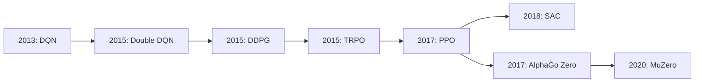
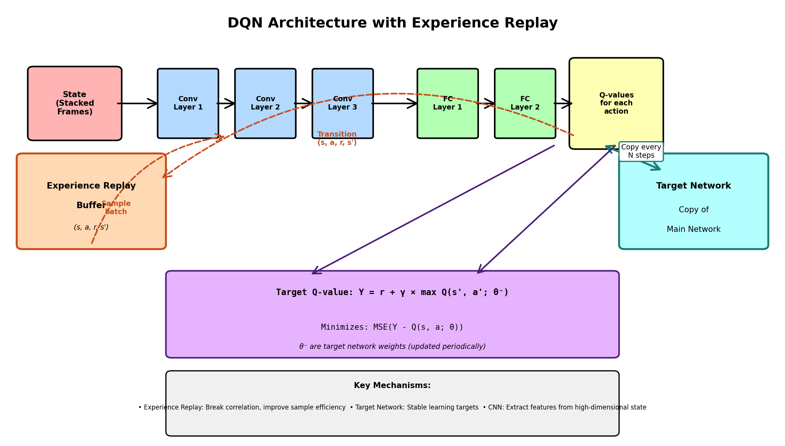
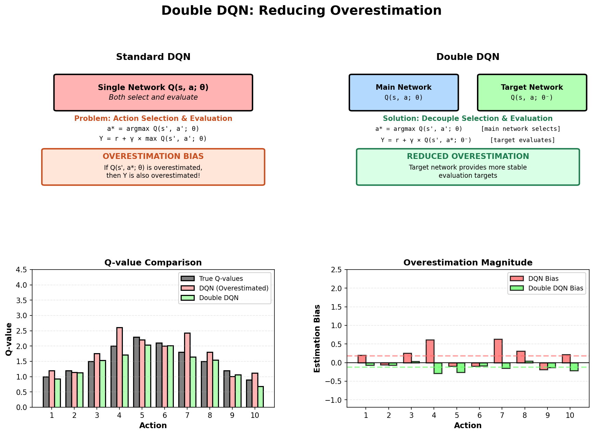
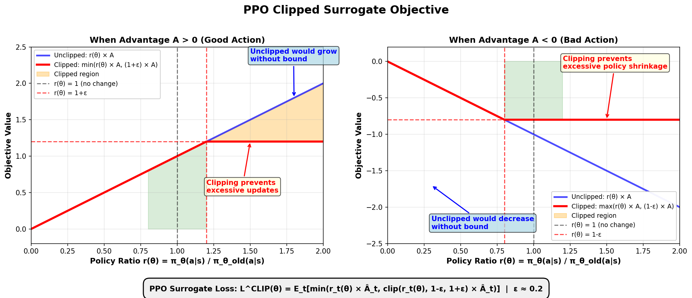
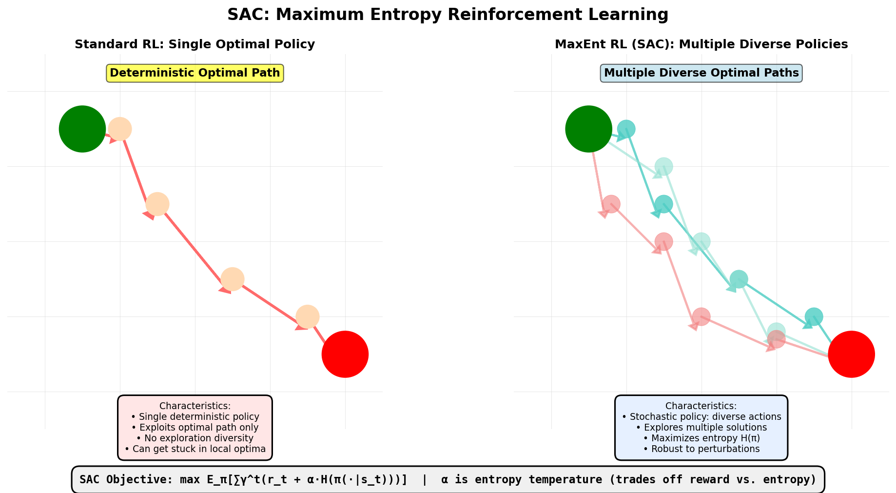
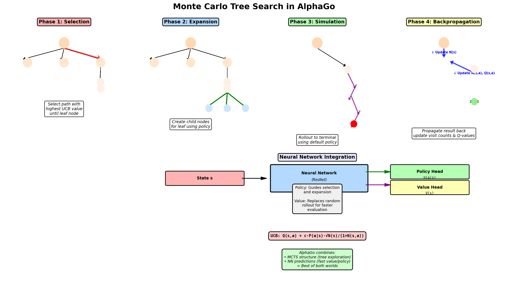

# Part II: Seminal Papers in Deep Reinforcement Learning

## Reading Map

| Paper | Core idea | What problem it fixes | Best read after |
|-------|-----------|-----------------------|-----------------|
| DQN | Neural Q-learning with replay and target networks | Instability in deep value learning | Bellman equations, TD learning |
| Double DQN | Decouple action selection and evaluation | Overestimation bias in DQN | DQN |
| DDPG | Deterministic actor-critic for continuous control | Discrete-action limitation of DQN | Policy gradients, actor-critic |
| TRPO | Trust-region constrained updates | Policy collapse from overly large gradient steps | Policy gradients |
| PPO | Clipped surrogate objective | TRPO complexity in practice | TRPO or policy gradients |
| SAC | Maximum-entropy actor-critic | Poor exploration and brittle deterministic control | Actor-critic, entropy regularization |
| AlphaGo / MuZero | Planning plus learned value/policy models | Long-horizon search in complex games | Value functions, policy gradients, MCTS basics |



## Paper 1: DQN — Playing Atari with Deep Reinforcement Learning



Mnih et al., 2013/2015 | [arxiv.org/abs/1312.5602](https://arxiv.org/abs/1312.5602)

### Problem Addressed
Q-learning is classically limited to small, discrete state spaces. Scaling it to high-dimensional problems like Atari games requires function approximation, but directly applying Q-learning with neural networks is unstable due to:

- Correlation between consecutive samples from the environment
- Non-stationary targets (moving target problem)
- Bootstrapping instability with neural network function approximators

### Key Innovation
Combined deep neural networks with Q-learning using two critical stabilization tricks: **Experience Replay** and **Target Networks**.

### Mathematical Formulation

#### Core Q-Learning Update
Standard Q-learning iteratively updates:


$$
Q(s,a) \leftarrow Q(s,a) + \alpha \left[r + \gamma \max_{a'} Q(s',a') - Q(s,a)\right]
$$


#### DQN Loss Function (with Target Network)
Let \(\theta\) be the online network parameters and \(\theta^-\) be the target network parameters (updated every \(C\) steps):


$$
L(\theta) = \mathbb{E}_{(s,a,r,s') \sim D} \left[\left(r + \gamma \max_{a'} Q(s',a';\theta^-) - Q(s,a;\theta)\right)^2\right]
$$


#### Trick 1: Experience Replay
**Why:** Breaks temporal correlation between samples, improves sample efficiency, allows mini-batch learning.
Sample uniformly from replay buffer \(D\): \((s_i, a_i, r_i, s'_i) \sim \text{Uniform}(D)\)
Compute gradient on batch of size \(N\):


$$
\nabla_\theta L(\theta) = \frac{1}{N} \sum_{i=1}^{N} \nabla_\theta \left[\delta_i^2\right]
$$

where \(\delta_i = r_i + \gamma \max_{a'} Q(s'_i,a';\theta^-) - Q(s_i,a_i;\theta)\)


#### Trick 2: Target Network
**Why:** Prevents the *moving target* problem. Both prediction and target shouldn't change with each update—this causes instability and divergence.
Update target network parameters: \(\theta^- \leftarrow \theta\) every \(C\) iterations (typically \(C = 10,000\))

### Intuitive Explanation
**Analogy:** Imagine training a student to predict exam scores:

- **Experience Replay:** Don't study practice problems in order (that creates weird patterns). Instead, shuffle them and study random batches. This forces genuine understanding rather than memorization of sequences.
- **Target Network:** Don't ask the student to both predict the score AND simultaneously change their own grading rubric. Use an old, frozen rubric to evaluate answers, update it slowly. This prevents chasing moving targets.

Together, these techniques transform unstable neural network Q-learning into a practical algorithm that achieves superhuman performance on Atari games.

### PyTorch DQN Implementation

```python
import torch
import torch.nn as nn
import torch.optim as optim
from collections import deque
import random
import numpy as np

class DQN(nn.Module):
    """Neural network for Q-function approximation"""
    def __init__(self, state_dim, action_dim, hidden_size=128):
        super(DQN, self).__init__()
        self.net = nn.Sequential(
            nn.Linear(state_dim, hidden_size),
            nn.ReLU(),
            nn.Linear(hidden_size, hidden_size),
            nn.ReLU(),
            nn.Linear(hidden_size, action_dim)
        )

    def forward(self, state):
        """Output Q-values for all actions"""
        return self.net(state)

class ReplayBuffer:
    """Experience replay buffer for storing transitions"""
    def __init__(self, capacity=10000):
        self.buffer = deque(maxlen=capacity)

    def push(self, state, action, reward, next_state, done):
        """Store transition"""
        self.buffer.append((state, action, reward, next_state, done))

    def sample(self, batch_size):
        """Sample random mini-batch"""
        transitions = random.sample(self.buffer, batch_size)
        states, actions, rewards, next_states, dones = zip(*transitions)
        return (torch.tensor(states, dtype=torch.float32),
                torch.tensor(actions, dtype=torch.long),
                torch.tensor(rewards, dtype=torch.float32),
                torch.tensor(next_states, dtype=torch.float32),
                torch.tensor(dones, dtype=torch.float32))

    def __len__(self):
        return len(self.buffer)

class DQNAgent:
    """DQN learning agent"""
    def __init__(self, state_dim, action_dim, lr=1e-4, gamma=0.99,
                 epsilon=1.0, epsilon_decay=0.995, buffer_capacity=10000):
        self.action_dim = action_dim
        self.gamma = gamma
        self.epsilon = epsilon
        self.epsilon_decay = epsilon_decay
        self.update_counter = 0
        self.target_update_freq = 1000

        # Initialize online and target networks
        self.online_net = DQN(state_dim, action_dim)
        self.target_net = DQN(state_dim, action_dim)
        self.target_net.load_state_dict(self.online_net.state_dict())
        self.target_net.eval()  # Target network is frozen during learning

        # Optimizer and loss
        self.optimizer = optim.Adam(self.online_net.parameters(), lr=lr)
        self.loss_fn = nn.MSELoss()

        # Experience replay buffer
        self.replay_buffer = ReplayBuffer(capacity=buffer_capacity)

    def select_action(self, state, training=True):
        """Epsilon-greedy action selection"""
        if training and random.random() < self.epsilon:
            return random.randint(0, self.action_dim - 1)  # Exploration

        with torch.no_grad():
            state_tensor = torch.tensor(state, dtype=torch.float32).unsqueeze(0)
            q_values = self.online_net(state_tensor)
            return q_values.argmax(dim=1).item()  # Exploitation

    def train_step(self, batch_size=32):
        """Single training step with mini-batch from replay buffer"""
        if len(self.replay_buffer) < batch_size:
            return None

        # Sample mini-batch from replay buffer (TRICK 1: Experience Replay)
        states, actions, rewards, next_states, dones = self.replay_buffer.sample(batch_size)

        # Compute Q-values for current states
        q_values = self.online_net(states)  # Shape: (batch_size, action_dim)
        q_values = q_values.gather(1, actions.unsqueeze(1)).squeeze(1)  # Select action Q-values

        # Compute target Q-values using TARGET NETWORK (TRICK 2: Frozen target)
        with torch.no_grad():
            next_q_values = self.target_net(next_states)  # Use frozen target network
            max_next_q = next_q_values.max(dim=1)[0]
            targets = rewards + self.gamma * max_next_q * (1 - dones)

        # Compute loss and optimize
        loss = self.loss_fn(q_values, targets)
        self.optimizer.zero_grad()
        loss.backward()
        torch.nn.utils.clip_grad_norm_(self.online_net.parameters(), max_norm=1.0)
        self.optimizer.step()

        # Periodically update target network
        self.update_counter += 1
        if self.update_counter % self.target_update_freq == 0:
            self.target_net.load_state_dict(self.online_net.state_dict())

        # Decay exploration
        self.epsilon *= self.epsilon_decay

        return loss.item()

```
### Paper & Resources

- **Paper:** [Playing Atari with Deep Reinforcement Learning (Mnih et al., 2013)](https://arxiv.org/abs/1312.5602)
- **Best explanation:** [FreeCodeCamp DQN Tutorial](https://www.freecodecamp.org/news/an-introduction-to-deep-q-learning-lets-play-doom-54d02d8017d8/)

## Paper 2: Double DQN

*— Addressing Overestimation in DQN, van Hasselt et al., 2015*



### Problem Addressed
DQN systematically **overestimates** Q-values. The culprit: using the same network to both select and evaluate actions in the Bellman target.
In standard DQN, we compute:

$$
Y_t^{DQN} = r_t + \gamma \max_{a'} Q(s_{t+1}, a'; \theta^-)
$$

The problem: \(\mathbb{E}[\max_i X_i] \geq \max_i \mathbb{E}[X_i]\) (Jensen's inequality for max operator). Since Q-values are noisy estimates, taking the max amplifies positive errors.

### Key Innovation
**Decouple action selection from action evaluation.** Use the online network to SELECT which action looks best, but use the target network to EVALUATE its value.

### Mathematical Formulation

#### The Bias Problem (Jensen's Inequality)
For random variables \(X_1, ..., X_n\), the max is a convex function:

$$
\mathbb{E}\left[\max_{i} X_i\right] \geq \max_{i} \mathbb{E}[X_i]
$$


In DQN, Q-estimates are noisy. Taking \(\max_a Q(s',a')\) tends to select overestimated values, perpetuating bias.

#### Double DQN Target
Separate selection and evaluation:

$$
Y_t^{\text{DoubleDQN}} = r_t + \gamma Q(s_{t+1}, \underbrace{\arg\max_{a'} Q(s_{t+1}, a'; \theta)}_{\text{select with online net}}, \theta^-)
$$

The online network \(\theta\) selects the action, but the target network \(\theta^-\) evaluates it.

#### Why This Reduces Bias
The online network's errors in overestimation are often different from the target network's errors (since they diverge after each update). By using them for different purposes, we decorrelate biases.

### Intuitive Explanation
**Analogy:** In a real estate market, asking the same optimistic person both "Which house do you think is best?" AND "How much is that house worth?" leads to overpriced estimates. Instead:

- **One person (online network):** "Which house looks like the best investment?"
- **Another person (target network):** "What is that house actually worth?" (asked later, with fresher data)

This prevents the same biases from cascading through both decisions.

### Double DQN Update (Code Snippet)

```python
def train_step_double_dqn(self, batch_size=32):
    """Single training step using Double DQN"""
    if len(self.replay_buffer) < batch_size:
        return None

    states, actions, rewards, next_states, dones = self.replay_buffer.sample(batch_size)

    # Current Q-values from online network
    q_values = self.online_net(states).gather(1, actions.unsqueeze(1)).squeeze(1)

    # DOUBLE DQN: Decouple selection and evaluation
    with torch.no_grad():
        # Step 1: Use ONLINE network to SELECT the best action
        next_actions = self.online_net(next_states).argmax(dim=1)

        # Step 2: Use TARGET network to EVALUATE that action
        next_q_values = self.target_net(next_states).gather(1, next_actions.unsqueeze(1)).squeeze(1)

        # Compute targets
        targets = rewards + self.gamma * next_q_values * (1 - dones)

    # Compute loss and update
    loss = self.loss_fn(q_values, targets)
    self.optimizer.zero_grad()
    loss.backward()
    self.optimizer.step()

    self.update_counter += 1
    if self.update_counter % self.target_update_freq == 0:
        self.target_net.load_state_dict(self.online_net.state_dict())

    return loss.item()

```
### Key Insight
Double DQN is a simple but powerful fix that requires almost no additional computation. It empirically reduces overestimation and leads to more stable, better-performing agents. This became the de facto standard, incorporated into virtually all modern DQN variants.

## Paper 3: DDPG — Continuous Control with Deep Reinforcement Learning
Lillicrap et al., 2015

### Problem Addressed
DQN and Double DQN are fundamentally limited to discrete action spaces. The \(\max_{a'} Q(s',a')\) requires iterating over all actions—impossible in continuous spaces where actions are real-valued vectors.
Examples: robotic control, autonomous driving, physics simulations all require continuous action outputs.

### Key Innovation
**Learn a deterministic policy function** that directly outputs the continuous action, rather than a Q-function over all possible actions. Use an actor-critic architecture with experience replay and target networks for stability.

### Mathematical Formulation

#### Architecture: Actor-Critic
**Actor (Policy Network):** Deterministic policy \(\mu_\theta(s)\) that outputs a continuous action directly


$$
a_t = \mu_\theta(s_t)
$$


**Critic (Q-Network):** Evaluates state-action pairs


$$
Q_w(s,a)
$$


#### Critic (Q-Network) Update
Standard TD learning with target network:

$$
L_{\text{critic}} = \mathbb{E}_{(s,a,r,s') \sim D} \left[\left(Q_w(s,a) - (r + \gamma Q_{w'}(s', \mu_{\theta'}(s')))\right)^2\right]
$$

#### Actor (Policy) Update
Use the chain rule to compute the gradient of Q with respect to \(\theta\):

$$
\nabla_\theta J(\theta) \approx \mathbb{E}_{s \sim D} \left[\nabla_a Q_w(s,a) \big|_{a=\mu_\theta(s)} \cdot \nabla_\theta \mu_\theta(s)\right]
$$

This is the **policy gradient theorem** applied to Q-functions. The actor moves in the direction that increases Q-values.

#### Exploration: Ornstein-Uhlenbeck Noise
Since the policy is deterministic, exploration requires explicit noise:


$$
a_t = \mu_\theta(s_t) + \mathcal{N}_t
$$


where \(\mathcal{N}_t\) is drawn from an Ornstein-Uhlenbeck process (temporally correlated Gaussian noise, more realistic for physical systems).

### Intuitive Explanation
**Analogy:** Instead of evaluating every possible move in chess (discrete), learn a neural network that directly suggests the next move (continuous thinking). Then use another network to evaluate "how good is this move?" to improve the move suggester.
**Why chain rule matters:** The actor network asks "which direction should I push this action?" by asking the critic "how much does increasing this dimension help?" The gradient of Q with respect to action tells the policy where to go.

### PyTorch DDPG Implementation

```python
import torch
import torch.nn as nn
import torch.optim as optim
from collections import deque
import random
import numpy as np

class Actor(nn.Module):
    """Deterministic policy network"""
    def __init__(self, state_dim, action_dim, hidden_size=256):
        super(Actor, self).__init__()
        self.net = nn.Sequential(
            nn.Linear(state_dim, hidden_size),
            nn.ReLU(),
            nn.Linear(hidden_size, hidden_size),
            nn.ReLU(),
            nn.Linear(hidden_size, action_dim),
            nn.Tanh()  # Action bounds to [-1, 1]
        )

    def forward(self, state):
        """Output deterministic action"""
        return self.net(state)

class Critic(nn.Module):
    """Q-function network"""
    def __init__(self, state_dim, action_dim, hidden_size=256):
        super(Critic, self).__init__()
        self.net = nn.Sequential(
            nn.Linear(state_dim + action_dim, hidden_size),
            nn.ReLU(),
            nn.Linear(hidden_size, hidden_size),
            nn.ReLU(),
            nn.Linear(hidden_size, 1)  # Output scalar Q-value
        )

    def forward(self, state, action):
        """Output Q-value for state-action pair"""
        x = torch.cat([state, action], dim=1)
        return self.net(x)

class DDPGAgent:
    """DDPG learning agent for continuous control"""
    def __init__(self, state_dim, action_dim, action_scale=1.0,
                 lr_actor=1e-4, lr_critic=1e-3, gamma=0.99, tau=0.001):
        self.action_dim = action_dim
        self.action_scale = action_scale
        self.gamma = gamma
        self.tau = tau  # Soft update rate
        self.update_counter = 0

        # Actor networks
        self.actor = Actor(state_dim, action_dim)
        self.actor_target = Actor(state_dim, action_dim)
        self.actor_target.load_state_dict(self.actor.state_dict())
        self.actor_optimizer = optim.Adam(self.actor.parameters(), lr=lr_actor)

        # Critic networks
        self.critic = Critic(state_dim, action_dim)
        self.critic_target = Critic(state_dim, action_dim)
        self.critic_target.load_state_dict(self.critic.state_dict())
        self.critic_optimizer = optim.Adam(self.critic.parameters(), lr=lr_critic)

        # Replay buffer
        self.replay_buffer = deque(maxlen=100000)

        # Noise for exploration (Ornstein-Uhlenbeck)
        self.noise_mean = 0.0
        self.noise_std = 0.2

    def select_action(self, state, training=True):
        """Select action with optional noise for exploration"""
        with torch.no_grad():
            state_tensor = torch.tensor(state, dtype=torch.float32).unsqueeze(0)
            action = self.actor(state_tensor).squeeze(0).numpy()

        if training:
            # Add Ornstein-Uhlenbeck noise for exploration
            noise = np.random.normal(self.noise_mean, self.noise_std, size=action.shape)
            action = action + noise

        # Clip to action bounds
        action = np.clip(action * self.action_scale, -self.action_scale, self.action_scale)
        return action

    def train_step(self, batch_size=64):
        """Single training step for actor and critic"""
        if len(self.replay_buffer) < batch_size:
            return None

        # Sample mini-batch
        batch = random.sample(self.replay_buffer, batch_size)
        states, actions, rewards, next_states, dones = zip(*batch)

        states = torch.tensor(states, dtype=torch.float32)
        actions = torch.tensor(actions, dtype=torch.float32)
        rewards = torch.tensor(rewards, dtype=torch.float32).unsqueeze(1)
        next_states = torch.tensor(next_states, dtype=torch.float32)
        dones = torch.tensor(dones, dtype=torch.float32).unsqueeze(1)

        # ===== CRITIC UPDATE =====
        with torch.no_grad():
            # Target policy: deterministic action from target actor
            next_actions = self.actor_target(next_states)
            # Target Q-value from target critic
            target_q = self.critic_target(next_states, next_actions)
            # TD target
            target = rewards + self.gamma * target_q * (1 - dones)

        # Critic loss: MSE between predicted and target Q
        current_q = self.critic(states, actions)
        critic_loss = nn.MSELoss()(current_q, target)

        self.critic_optimizer.zero_grad()
        critic_loss.backward()
        self.critic_optimizer.step()

        # ===== ACTOR UPDATE =====
        # Policy gradient: maximize Q-values of selected actions
        # ∇_θ J = E[∇_a Q(s,a)|_{a=μ(s)} · ∇_θ μ(s)]
        actor_loss = -self.critic(states, self.actor(states)).mean()

        self.actor_optimizer.zero_grad()
        actor_loss.backward()
        self.actor_optimizer.step()

        # ===== SOFT TARGET UPDATES =====
        # Update target networks using soft updates (polyak averaging)
        with torch.no_grad():
            for param, target_param in zip(self.critic.parameters(), self.critic_target.parameters()):
                target_param.data.copy_(self.tau * param.data + (1 - self.tau) * target_param.data)

            for param, target_param in zip(self.actor.parameters(), self.actor_target.parameters()):
                target_param.data.copy_(self.tau * param.data + (1 - self.tau) * target_param.data)

        return {"critic_loss": critic_loss.item(), "actor_loss": actor_loss.item()}

    def remember(self, state, action, reward, next_state, done):
        """Store transition in replay buffer"""
        self.replay_buffer.append((state, action, reward, next_state, done))

```
### Key Insights

- **Policy Gradient Theorem:** The gradient points directly toward higher Q-values—no need to sample all possible actions.
- **Soft Updates (Polyak Averaging):** Instead of hard target network updates every N steps, continuously blend: \(\theta_{target} \leftarrow \tau \theta + (1-\tau) \theta_{target}\) with small \(\tau\). This is more stable than DQN's hard updates.
- **Exploration:** Deterministic policies need explicit noise. Ornstein-Uhlenbeck noise is temporally correlated (realistic for physical systems) versus Gaussian noise (independent).

### Paper & Resources

- **Paper:** [Continuous Control with Deep Reinforcement Learning (Lillicrap et al., 2015)](https://arxiv.org/abs/1509.02971)

## Paper 4: TRPO — Trust Region Policy Optimization
Schulman et al., 2015

### Problem Addressed
Naive policy gradient can take steps that are too large, drastically degrading performance. Small errors in policy gradients can destroy a well-learned policy. Need a principled way to constrain updates: take the biggest improvement step possible, but only within a region where our gradient estimates are trustworthy.

### Key Innovation
**Add a constraint to policy gradient optimization:** maximize improvement to the policy, but stay within a trust region where our estimates are reliable. Guarantees monotonic improvement.

### Mathematical Formulation

#### Surrogate Objective (Importance-Weighted)
Instead of taking the full step with new policy \(\pi_\theta\), we use importance sampling to estimate improvement from old policy \(\pi_{\theta_{\text{old}}}\):

$$
L(\theta) = \mathbb{E}_{s,a \sim \pi_{\theta_{\text{old}}}} \left[\frac{\pi_\theta(a|s)}{\pi_{\theta_{\text{old}}}(a|s)} \hat{A}^{\pi_{\theta_{\text{old}}}}(s,a)\right]
$$

where \(\hat{A}\) is the advantage function estimate and the ratio \(\frac{\pi_\theta(a|s)}{\pi_{\theta_{\text{old}}}(a|s)}\) corrects for the policy change.

#### Trust Region Constraint
Constrain the KL divergence between old and new policy:

$$
\max_\theta L(\theta) \quad \text{subject to} \quad \text{KL}(\pi_{\theta_{\text{old}}} \| \pi_\theta) \leq \delta
$$

The constraint ensures policies don't diverge too much—if they diverge, our advantage estimates become invalid.

#### Monotonic Improvement Guarantee
Theory proves that if we solve this constrained optimization exactly, the new policy's performance is guaranteed to be at least as good as the old policy:

$$
\eta(\theta) \geq L(\theta) - \frac{2\epsilon\gamma}{(1-\gamma)^2} \text{KL}(\pi_{\theta_{\text{old}}} \| \pi_\theta)
$$

where \(\eta(\theta)\) is the actual return and \(\epsilon\) is the error in advantage estimation.

### Intuitive Explanation
**Analogy:** Imagine hiking uphill in fog (gradient estimates are noisy). You want to take the biggest step uphill possible, BUT: if you wander too far from where you took measurements, your map becomes unreliable. TRPO says: "Take the longest step in the uphill direction, but keep the KL-distance from your starting point small so the terrain estimates are still valid."
The KL constraint prevents sudden, large policy shifts that could invalidate our value function estimates.

### TRPO Update (Conceptual Pseudocode)

```python
def trpo_step(states, actions, advantages, policy, value_net,
              delta=0.01, cg_iters=10, backtrack_iters=10):
    """
    TRPO update: constrained optimization with conjugate gradient

    The actual implementation is complex, so this shows the structure:
    1. Compute natural gradient using conjugate gradient method
    2. Line search: shrink step size until KL constraint satisfied
    """

    # Compute policy gradients (vanilla policy gradient)
    pg_loss = -(advantages * torch.log(policy_dist.probs)).sum()
    policy_grad = torch.autograd.grad(pg_loss, policy.parameters())

    # Compute natural gradient direction using conjugate gradient
    # This solves: H^{-1} * g where H is Fisher info matrix (approx Hessian)
    # Conjugate gradient is efficient for computing this without explicitly
    # forming the large Hessian matrix

    natural_grad = conjugate_gradient(
        policy, states, actions,
        policy_grad, cg_iters=cg_iters
    )

    # Line search: find largest step size respecting KL constraint
    old_policy_params = [p.data.clone() for p in policy.parameters()]

    step_fraction = 1.0
    for i in range(backtrack_iters):
        # Propose new parameters
        alpha = step_fraction * STEP_SIZE
        new_params = [
            p - alpha * ng
            for p, ng in zip(old_policy_params, natural_grad)
        ]

        # Load new parameters and check KL constraint
        assign_parameters(policy, new_params)
        new_policy_dist = policy(states)
        old_policy_dist = policy(states)  # Would use saved distribution in practice

        kl_div = torch.distributions.kl_divergence(
            old_policy_dist, new_policy_dist
        ).mean()

        if kl_div <= delta:
            # Constraint satisfied, use this update
            break
        else:
            # Shrink step size and retry
            step_fraction *= 0.5

    return new_policy_dist

def conjugate_gradient(policy, states, actions, gradient, cg_iters=10):
    """
    Solves: H^{-1} * g where H is Fisher information matrix
    Uses Hessian-vector products (efficient, doesn't form H explicitly)
    """
    # Detailed implementation omitted for brevity
    # Key idea: iteratively refine estimate of H^{-1} * g
    pass

```
### Key Insights

- **Natural Gradient:** Uses Fisher information matrix to account for the policy's geometry. Conjugate gradient efficiently computes this without forming the matrix.
- **Line Search:** After computing the natural gradient direction, TRPO performs backtracking line search to find the largest step that satisfies the KL constraint.
- **Theoretical Guarantee:** TRPO is one of the few RL algorithms with a monotonic improvement guarantee—each update strictly improves or maintains performance.
- **Computational Cost:** Computing conjugate gradient + line search is expensive, which motivated the simpler PPO.

### Paper & Resources

- **Paper:** [Trust Region Policy Optimization (Schulman et al., 2015)](https://arxiv.org/abs/1502.05477)

## Paper 5: PPO — Proximal Policy Optimization



Schulman et al., 2017 | [arxiv.org/abs/1707.06347](https://arxiv.org/abs/1707.06347)

### Problem Addressed
TRPO is theoretically sound and guarantees monotonic improvement, but the conjugate gradient + line search is computationally expensive and complex to implement. Need a simpler algorithm that:

- Has similar performance to TRPO
- Is easier to implement and tune
- Is more sample-efficient
- Doesn't require computing natural gradients or line search

### Key Innovation
**Replace TRPO's explicit constraint with a clipped surrogate objective.** Instead of constrained optimization, use a simple clipped loss that prevents the policy ratio from deviating too far from 1, naturally limiting updates without conjugate gradient or line search.

### Mathematical Formulation

#### Probability Ratio
Measure how much the new policy differs from the old:


$$
r_t(\theta) = \frac{\pi_\theta(a_t|s_t)}{\pi_{\theta_{\text{old}}}(a_t|s_t)}
$$


#### Clipped Surrogate Objective (Core Innovation)

$$
L^{\text{CLIP}}(\theta) = \mathbb{E}_t \left[\min\left(r_t(\theta) \hat{A}_t, \text{clip}(r_t(\theta), 1-\epsilon, 1+\epsilon) \hat{A}_t\right)\right]
$$

#### How Clipping Works
**When advantage \(\hat{A}_t > 0\) (good action):**

$$
\min(r_t \hat{A}_t, (1+\epsilon) \hat{A}_t)
$$


Clipping prevents the ratio from exceeding \(1+\epsilon\), stopping the update from getting too greedy.

$$
**When advantage \(\hat{A}_t 
$$


$$
\min(r_t \hat{A}_t, (1-\epsilon) \hat{A}_t)
$$


Clipping prevents the ratio from going below \(1-\epsilon\), stopping over-penalization.

#### Full PPO Loss Function

$$
L^{\text{total}}(\theta) = \mathbb{E}_t \left[L^{\text{CLIP}}(\theta) - c_1 L^{VF}(\theta) + c_2 H(s_t, \theta)\right]
$$


where:

- \(L^{\text{VF}} = (V_\theta(s_t) - V_t^{\text{target}})^2\) — value function loss (critic)
- \(H(s_t, \theta) = -\pi_\theta(a|s) \log \pi_\theta(a|s)\) — entropy bonus (exploration)
- \(c_1, c_2\) — hyperparameters (typically 0.5, 0.01)

### Intuitive Explanation
**Analogy — Clipping as "Governor":** In old cars, governors mechanically limited top speed. PPO's clipping is like a software governor: once the policy ratio reaches certain bounds, further pushes are ignored. This prevents reckless policy updates without needing complex constrained optimization.
**Two-part min:** The unclipped part \(r_t \hat{A}_t\) provides the direction of improvement, but is capped by the clipped version. The min ensures we never go too far.

### Complete PPO Implementation in PyTorch

```python
import torch
import torch.nn as nn
import torch.optim as optim
import numpy as np
from collections import deque

class PPONetwork(nn.Module):
    """Actor-Critic network with shared backbone"""
    def __init__(self, state_dim, action_dim, hidden_size=64):
        super(PPONetwork, self).__init__()

        # Shared feature network
        self.feature = nn.Sequential(
            nn.Linear(state_dim, hidden_size),
            nn.ReLU(),
            nn.Linear(hidden_size, hidden_size),
            nn.ReLU(),
        )

        # Policy head
        self.policy_head = nn.Sequential(
            nn.Linear(hidden_size, hidden_size),
            nn.ReLU(),
            nn.Linear(hidden_size, action_dim),
            nn.Softmax(dim=-1)
        )

        # Value head
        self.value_head = nn.Sequential(
            nn.Linear(hidden_size, hidden_size),
            nn.ReLU(),
            nn.Linear(hidden_size, 1)
        )

    def forward(self, state):
        """Return policy logits and value estimate"""
        features = self.feature(state)
        policy_probs = self.policy_head(features)
        value = self.value_head(features)
        return policy_probs, value

class PPOAgent:
    """PPO learning agent"""
    def __init__(self, state_dim, action_dim, lr=3e-4, gamma=0.99,
                 gae_lambda=0.95, clip_ratio=0.2, value_coef=0.5,
                 entropy_coef=0.01, epochs=3, batch_size=64):
        self.action_dim = action_dim
        self.gamma = gamma
        self.gae_lambda = gae_lambda
        self.clip_ratio = clip_ratio
        self.value_coef = value_coef
        self.entropy_coef = entropy_coef
        self.epochs = epochs
        self.batch_size = batch_size

        # Network and optimizer
        self.network = PPONetwork(state_dim, action_dim)
        self.optimizer = optim.Adam(self.network.parameters(), lr=lr)

        # Storage for trajectories
        self.states = []
        self.actions = []
        self.rewards = []
        self.values = []
        self.log_probs = []
        self.dones = []

    def select_action(self, state):
        """Select action according to policy"""
        state_tensor = torch.tensor(state, dtype=torch.float32).unsqueeze(0)

        with torch.no_grad():
            policy_probs, value = self.network(state_tensor)

        # Sample action from policy
        dist = torch.distributions.Categorical(policy_probs)
        action = dist.sample()
        log_prob = dist.log_prob(action)

        return action.item(), log_prob.item(), value.item()

    def store_transition(self, state, action, reward, value, log_prob, done):
        """Store transition for trajectory"""
        self.states.append(state)
        self.actions.append(action)
        self.rewards.append(reward)
        self.values.append(value)
        self.log_probs.append(log_prob)
        self.dones.append(done)

    def compute_advantages(self, next_value=0.0):
        """
        Compute advantages using Generalized Advantage Estimation (GAE)

        GAE: Ã_t = δ_t + (γλ)δ_{t+1} + (γλ)²δ_{t+2} + ...
        where δ_t = r_t + γV(s_{t+1}) - V(s_t) is the TD residual

        This is a running estimate of the advantage that trades off
        bias and variance through the λ parameter
        """
        advantages = []
        returns = []
        gae = 0.0

        # Compute from end to beginning
        for t in reversed(range(len(self.rewards))):
            # Next value: either stored V(s_{t+1}) or bootstrap value
            if t == len(self.rewards) - 1:
                next_value_t = next_value
            else:
                next_value_t = self.values[t + 1]

            # TD residual: δ_t = r_t + γV(s_{t+1}) - V(s_t)
            delta = self.rewards[t] + self.gamma * next_value_t * (1 - self.dones[t]) - self.values[t]

            # Update GAE
            gae = delta + self.gamma * self.gae_lambda * (1 - self.dones[t]) * gae

            advantages.insert(0, gae)
            returns.insert(0, gae + self.values[t])

        # Normalize advantages (improves stability)
        advantages = torch.tensor(advantages, dtype=torch.float32)
        advantages = (advantages - advantages.mean()) / (advantages.std() + 1e-8)

        returns = torch.tensor(returns, dtype=torch.float32)

        return advantages, returns

    def train_step(self, next_value=0.0):
        """Single training update on collected trajectory"""
        if len(self.states) == 0:
            return None

        # Convert to tensors
        states = torch.tensor(np.array(self.states), dtype=torch.float32)
        actions = torch.tensor(self.actions, dtype=torch.long)
        old_log_probs = torch.tensor(self.log_probs, dtype=torch.float32)

        # Compute advantages and returns
        advantages, returns = self.compute_advantages(next_value)

        # Shuffle trajectories
        indices = torch.randperm(len(states))

        total_loss = 0.0

        # Multiple epochs of updates
        for epoch in range(self.epochs):
            for i in range(0, len(states), self.batch_size):
                batch_indices = indices[i:i+self.batch_size]

                batch_states = states[batch_indices]
                batch_actions = actions[batch_indices]
                batch_old_log_probs = old_log_probs[batch_indices]
                batch_advantages = advantages[batch_indices]
                batch_returns = returns[batch_indices]

                # Forward pass
                policy_probs, values = self.network(batch_states)

                # Policy loss with clipping (KEY INNOVATION)
                dist = torch.distributions.Categorical(policy_probs)
                new_log_probs = dist.log_prob(batch_actions)

                # Probability ratio: r_t(θ)
                ratio = torch.exp(new_log_probs - batch_old_log_probs)

                # Unclipped objective
                surr1 = ratio * batch_advantages

                # Clipped objective: clip(r_t, 1-ε, 1+ε)
                surr2 = torch.clamp(ratio, 1 - self.clip_ratio, 1 + self.clip_ratio) * batch_advantages

                # PPO loss: take minimum (this is the clipping mechanism!)
                policy_loss = -torch.min(surr1, surr2).mean()

                # Value function loss
                value_loss = nn.MSELoss()(values.squeeze(1), batch_returns)

                # Entropy bonus (encourages exploration)
                entropy = dist.entropy().mean()

                # Total loss
                loss = policy_loss + self.value_coef * value_loss - self.entropy_coef * entropy

                # Optimization step
                self.optimizer.zero_grad()
                loss.backward()
                torch.nn.utils.clip_grad_norm_(self.network.parameters(), max_norm=0.5)
                self.optimizer.step()

                total_loss += loss.item()

        # Clear trajectory buffer
        self.states.clear()
        self.actions.clear()
        self.rewards.clear()
        self.values.clear()
        self.log_probs.clear()
        self.dones.clear()

        return total_loss / (self.epochs * (len(states) // self.batch_size))

# ===== 37 IMPLEMENTATION DETAILS THAT MATTER (Costa Huang's insights) =====
"""
From https://iclr-blog-track.github.io/2022/03/25/ppo-implementation-details/

Key details for stable PPO:
1. Advantage normalization: (A - mean(A)) / (std(A) + ε)
2. Orthogonal initialization of network weights
3. Symlog observation normalization
4. Value function loss scaling
5. Entropy coefficient schedule (anneal over time)
6. Learning rate schedule (linear decay)
7. Gradient clipping (max_norm)
8. GAE-λ advantage estimation (not just returns)
9. Multiple epochs per rollout
10. Mini-batch shuffling
... (27 more implementation tricks documented in the blog)

The implementation above includes most critical ones:
- GAE-λ advantage computation
- Gradient clipping
- Multi-epoch training with mini-batches
- Entropy bonus
- Advantage normalization
"""

```
### Key Insights

- **Clipping Mechanism:** The min between unclipped and clipped objectives is simple but brilliant. It creates a "no-encouragement zone" beyond the clip bounds, naturally limiting updates.
- **GAE (Generalized Advantage Estimation):** Instead of raw returns or TD(0), PPO uses GAE with parameter λ to balance bias-variance tradeoff. This significantly reduces variance without adding bias.
- **37 Implementation Details Matter:** Costa Huang's blog post documents tricks that dramatically impact PPO performance: learning rate schedules, weight initialization, normalization, entropy scheduling, etc. These details are as important as the algorithm itself.
- **Simplicity + Robustness:** PPO is not just simpler than TRPO—it's often more robust. The clipped objective is less sensitive to hyperparameters and scales better.

### Paper & Resources

- **Paper:** [Proximal Policy Optimization Algorithms (Schulman et al., 2017)](https://arxiv.org/abs/1707.06347)
- **Implementation guide:** [Costa Huang's 37 Implementation Details](https://iclr-blog-track.github.io/2022/03/25/ppo-implementation-details/)

## Paper 6: SAC — Soft Actor-Critic



Haarnoja et al., 2018 | [arxiv.org/abs/1801.01290](https://arxiv.org/abs/1801.01290)

### Problem Addressed
DDPG and policy gradient methods optimize purely for cumulative reward, which can lead to:

- Premature convergence to suboptimal deterministic policies
- Poor exploration and sample efficiency
- Brittleness to small environment changes
- Sensitivity to hyperparameter choices

Need an algorithm that balances reward maximization with exploration naturally.

### Key Innovation
**Maximize reward AND entropy simultaneously.** Add an entropy term to the objective to encourage exploration and policy diversity. The temperature parameter α automatically balances the two objectives.

### Mathematical Formulation

#### Core Objective: Entropy-Augmented Reward
Instead of just maximizing return, maximize return + entropy:

$$
J(\pi) = \sum_{t=0}^{\infty} \gamma^t \mathbb{E}_{(s_t,a_t) \sim \pi} \left[r(s_t, a_t) + \alpha H(\pi(\cdot|s_t))\right]
$$


where:

- \(H(\pi(\cdot|s)) = -\mathbb{E}_a[\log \pi(a|s)]\) is the entropy of the policy
- \(\alpha\) is the temperature parameter (balances reward vs. entropy)

#### Soft Q-Function (Bellman Equation)
The soft Q-function includes the entropy term in the bootstrapping:

$$
Q(s,a) = r(s,a) + \gamma \mathbb{E}_{s' \sim p} \left[V(s')\right]
$$

where the value function is:


$$
V(s) = \mathbb{E}_{a \sim \pi} \left[Q(s,a) - \alpha \log \pi(a|s)\right]
$$


Substituting V back into Q:


$$
Q(s,a) = r(s,a) + \gamma \mathbb{E}_{s'} \left[\mathbb{E}_{a' \sim \pi} [Q(s',a') - \alpha \log \pi(a'|s')]\right]
$$


#### Soft Policy (Maximum Entropy Policy)
The optimal policy is a softmax over Q-values:

$$
\pi(a|s) \propto \exp\left(\frac{1}{\alpha} Q(s,a)\right)
$$


High \(\alpha\) → more uniform (high entropy). Low \(\alpha\) → more peaked (low entropy).

#### Automatic Temperature Adjustment
Instead of manually tuning \(\alpha\), learn it to maintain a target entropy:


$$
\mathcal{L}(\alpha) = -\alpha \mathbb{E}_{a \sim \pi} [\log \pi(a|s) + \mathcal{H}_{\text{target}}]
$$

where \(\mathcal{H}_{\text{target}} = -\dim(a)\) (target entropy is typically negative log of action space dimension).


### Intuitive Explanation
**Analogy — Exploration as "Information Gain":** Imagine you're playing poker. Pure reward maximization says "always play the optimal hand." But entropy maximization adds: "sometimes play surprising hands to keep opponents guessing." This builds a more robust, harder-to-exploit strategy.
**Why entropy helps:**

- Prevents premature convergence to local optima
- Naturally encourages exploration
- Makes the policy robust to environment perturbations
- Acts as implicit regularization

**Temperature parameter:** High \(\alpha\) means "I'm uncertain, explore broadly." Low \(\alpha\) means "I'm confident, exploit what I've learned."

### PyTorch SAC Implementation

```python
import torch
import torch.nn as nn
import torch.optim as optim
import torch.nn.functional as F
from torch.distributions import Normal
import numpy as np
from collections import deque
import random

class SACActor(nn.Module):
    """Stochastic policy network (Gaussian)"""
    def __init__(self, state_dim, action_dim, hidden_size=256,
                 min_log_std=-20, max_log_std=2):
        super(SACActor, self).__init__()
        self.min_log_std = min_log_std
        self.max_log_std = max_log_std

        self.net = nn.Sequential(
            nn.Linear(state_dim, hidden_size),
            nn.ReLU(),
            nn.Linear(hidden_size, hidden_size),
            nn.ReLU(),
        )

        # Mean and log-std outputs
        self.mu_head = nn.Linear(hidden_size, action_dim)
        self.log_std_head = nn.Linear(hidden_size, action_dim)

    def forward(self, state):
        """Return policy distribution (mean, std)"""
        x = self.net(state)
        mu = self.mu_head(x)
        log_std = self.log_std_head(x)

        # Clamp log_std to avoid instability
        log_std = torch.clamp(log_std, self.min_log_std, self.max_log_std)
        std = torch.exp(log_std)

        return mu, std

    def sample_action(self, state):
        """Sample action and compute log probability"""
        mu, std = self.forward(state)

        # Gaussian sampling with reparameterization trick
        dist = Normal(mu, std)
        action = dist.rsample()

        # Squash to [-1, 1] using tanh
        action_tanh = torch.tanh(action)

        # Compute log probability (account for tanh squashing)
        log_prob = dist.log_prob(action)
        log_prob = log_prob - torch.log(1 - action_tanh.pow(2) + 1e-6)
        log_prob = log_prob.sum(dim=1, keepdim=True)

        return action_tanh, log_prob

class SACCritic(nn.Module):
    """Soft Q-function network"""
    def __init__(self, state_dim, action_dim, hidden_size=256):
        super(SACCritic, self).__init__()

        self.net = nn.Sequential(
            nn.Linear(state_dim + action_dim, hidden_size),
            nn.ReLU(),
            nn.Linear(hidden_size, hidden_size),
            nn.ReLU(),
            nn.Linear(hidden_size, 1)
        )

    def forward(self, state, action):
        """Output soft Q-value"""
        x = torch.cat([state, action], dim=1)
        return self.net(x)

class SACAgent:
    """Soft Actor-Critic agent"""
    def __init__(self, state_dim, action_dim, lr_actor=3e-4, lr_critic=3e-4,
                 lr_alpha=3e-4, gamma=0.99, tau=5e-3, target_entropy=None,
                 buffer_capacity=100000):
        self.gamma = gamma
        self.tau = tau

        # Actor
        self.actor = SACActor(state_dim, action_dim)
        self.actor_optimizer = optim.Adam(self.actor.parameters(), lr=lr_actor)

        # Two Q-networks (for stability)
        self.critic1 = SACCritic(state_dim, action_dim)
        self.critic2 = SACCritic(state_dim, action_dim)
        self.critic1_target = SACCritic(state_dim, action_dim)
        self.critic2_target = SACCritic(state_dim, action_dim)

        self.critic1_target.load_state_dict(self.critic1.state_dict())
        self.critic2_target.load_state_dict(self.critic2.state_dict())

        self.critic1_optimizer = optim.Adam(self.critic1.parameters(), lr=lr_critic)
        self.critic2_optimizer = optim.Adam(self.critic2.parameters(), lr=lr_critic)

        # Automatic entropy adjustment
        self.log_alpha = torch.tensor(0.0, requires_grad=True)
        self.alpha_optimizer = optim.Adam([self.log_alpha], lr=lr_alpha)
        self.target_entropy = target_entropy or -action_dim

        # Replay buffer
        self.replay_buffer = deque(maxlen=buffer_capacity)

    def select_action(self, state, deterministic=False):
        """Select action from policy"""
        state_tensor = torch.tensor(state, dtype=torch.float32).unsqueeze(0)

        with torch.no_grad():
            if deterministic:
                mu, _ = self.actor(state_tensor)
                return mu.squeeze(0).numpy()
            else:
                action, _ = self.actor.sample_action(state_tensor)
                return action.squeeze(0).numpy()

    def remember(self, state, action, reward, next_state, done):
        """Store transition in replay buffer"""
        self.replay_buffer.append((state, action, reward, next_state, done))

    def train_step(self, batch_size=256):
        """Single training step"""
        if len(self.replay_buffer) < batch_size:
            return None

        # Sample mini-batch
        batch = random.sample(self.replay_buffer, batch_size)
        states, actions, rewards, next_states, dones = zip(*batch)

        states = torch.tensor(np.array(states), dtype=torch.float32)
        actions = torch.tensor(np.array(actions), dtype=torch.float32)
        rewards = torch.tensor(np.array(rewards), dtype=torch.float32).unsqueeze(1)
        next_states = torch.tensor(np.array(next_states), dtype=torch.float32)
        dones = torch.tensor(np.array(dones), dtype=torch.float32).unsqueeze(1)

        alpha = torch.exp(self.log_alpha)

        # ===== CRITIC UPDATE =====
        with torch.no_grad():
            # Sample next actions from current policy
            next_actions, next_log_probs = self.actor.sample_action(next_states)

            # Compute soft Q-targets using BOTH critics (double Q-learning)
            target_q1 = self.critic1_target(next_states, next_actions)
            target_q2 = self.critic2_target(next_states, next_actions)

            # Take minimum to reduce overestimation
            target_q = torch.min(target_q1, target_q2)

            # Soft Bellman target: includes entropy bonus
            # V(s) = E[Q(s,a) - α log π(a|s)]
            target = rewards + self.gamma * (1 - dones) * (target_q - alpha * next_log_probs)

        # Critic 1 loss
        q1 = self.critic1(states, actions)
        loss_q1 = F.mse_loss(q1, target)

        # Critic 2 loss
        q2 = self.critic2(states, actions)
        loss_q2 = F.mse_loss(q2, target)

        # Update both critics
        self.critic1_optimizer.zero_grad()
        loss_q1.backward()
        self.critic1_optimizer.step()

        self.critic2_optimizer.zero_grad()
        loss_q2.backward()
        self.critic2_optimizer.step()

        # ===== ACTOR UPDATE =====
        # Policy gradient: maximize Q - α log π (entropy term)
        actions_new, log_probs_new = self.actor.sample_action(states)

        q1_new = self.critic1(states, actions_new)
        q2_new = self.critic2(states, actions_new)
        q_new = torch.min(q1_new, q2_new)

        # Actor loss: minimize (α log π - Q)
        loss_actor = (alpha * log_probs_new - q_new).mean()

        self.actor_optimizer.zero_grad()
        loss_actor.backward()
        self.actor_optimizer.step()

        # ===== AUTOMATIC TEMPERATURE ADJUSTMENT =====
        # Adjust α to maintain target entropy
        loss_alpha = -(self.log_alpha * (log_probs_new + self.target_entropy).detach()).mean()

        self.alpha_optimizer.zero_grad()
        loss_alpha.backward()
        self.alpha_optimizer.step()

        # ===== SOFT TARGET UPDATES =====
        with torch.no_grad():
            for param, target_param in zip(self.critic1.parameters(), self.critic1_target.parameters()):
                target_param.data.copy_(self.tau * param.data + (1 - self.tau) * target_param.data)

            for param, target_param in zip(self.critic2.parameters(), self.critic2_target.parameters()):
                target_param.data.copy_(self.tau * param.data + (1 - self.tau) * target_param.data)

        return {
            "critic1_loss": loss_q1.item(),
            "critic2_loss": loss_q2.item(),
            "actor_loss": loss_actor.item(),
            "alpha": alpha.item()
        }

```
### Key Insights

- **Entropy as Implicit Regularization:** The entropy term prevents the policy from becoming too deterministic, naturally encouraging exploration without explicit exploration noise.
- **Automatic Temperature:** Instead of manually tuning \(\alpha\), SAC learns it via gradient descent. The temperature adjusts automatically: if entropy is too low, increase \(\alpha\); if too high, decrease it.
- **Double Critic Networks:** SAC uses TWO Q-networks and takes the minimum to reduce overestimation bias (similar to Double DQN philosophy).
- **Off-policy, Sample Efficient:** SAC is off-policy (uses replay buffer), making it sample-efficient. Can reuse old data effectively.
- **Continuous Actions:** Like DDPG, SAC directly learns a policy for continuous action spaces, but with the added entropy regularization.

### Paper & Resources

- **Paper:** [Soft Actor-Critic: Off-Policy Deep Reinforcement Learning with a Stochastic Actor (Haarnoja et al., 2018)](https://arxiv.org/abs/1801.01290)

## Paper 7: AlphaGo, AlphaGo Zero, and MuZero



Competitive game-playing through neural networks + tree search

### Problem Addressed
Go is a game with \(19^2 = 361\) positions and average branching factor ~250, making tree search infeasible with classical methods. Need to combine:

- Neural networks for pattern recognition (evaluating positions)
- Monte Carlo tree search for lookahead
- Self-play for training without human data

### Key Innovations (Evolution)
**AlphaGo (2016):** Policy + Value networks + MCTS. Trained on human games.
**AlphaGo Zero (2017):** Single network outputs both policy and value. Pure self-play, no human data.
**MuZero (2020):** Learns a latent dynamics model. Doesn't need to know the rules—plans in learned latent space.

### Mathematical Formulation

#### AlphaGo Architecture
**Policy Network:** \(p_\sigma(a|s)\) predicts best moves (supervised on human games)
**Value Network:** \(v_\theta(s)\) estimates win probability from position \(s\)
**MCTS:** Expand tree using network predictions, but also sample playouts

#### AlphaGo Zero: Single Network
One network outputs both policy and value:


$$
f_\theta(s) = (p, v)
$$


where:

- \(p \in \mathbb{R}^{|\mathcal{A}|}\) — policy logits (softmax to get action probabilities)
- \(v \in \mathbb{R}\) — scalar value estimate (win/loss probability)

#### Self-Play Training Loop
Iterate:

1. Play game: Use MCTS with current network \(f_\theta\) to select moves
2. Collect data: Record states \(s_t\), MCTS visit counts \(\pi_t\), final outcome \(z_t\)

$$
3. Train network: Minimize
$$


$$
L = (v - z)^2 - \pi^T \log p + c \|\theta\|^2
$$


where:

- \(v = f_\theta(s)[1]\) is network's value prediction
- \(z\) is the actual game outcome (±1 for loss/win)
- \(\pi\) is MCTS visit counts (normalized to probabilities)
- \(p = \text{softmax}(f_\theta(s)[0])\) is network's policy

#### MCTS with Neural Network
Use network for fast evaluation instead of full rollouts:


$$
Q(s,a) = \frac{1}{N(s,a)} \sum_{i=1}^{N(s,a)} (r_i + \gamma v_\theta(s'_i))
$$

where \(N(s,a)\) is the visit count and \(v_\theta(s')\) is the network's value estimate (replaces slow playouts).


#### MuZero: Learned Latent Dynamics
Learn a latent model that can predict:

$$
h_0 = e(o) \quad \text{(encode observation)}
$$


$$
h_{t+1}, r_t = g(h_t, a_t) \quad \text{(latent dynamics)}
$$


$$
p_t, v_t = f(h_t) \quad \text{(policy and value from latent)}
$$

Plan in latent space using MCTS, then decode actions back to the real world.
Loss: Predict actual rewards, policy, and value in the latent trajectory


$$
L = \sum_{k=0}^{K} \left[(z_{t+k} - v_k)^2 - \pi_{t+k}^T \log p_k + (r_k - r'_k)^2\right]
$$

where \(r'_k\) is the predicted reward in latent space.


### Intuitive Explanations
**AlphaGo:** Combine intuition (neural networks recognize patterns) with calculation (MCTS explores promising lines). The policy net guides which moves look promising, the value net evaluates positions.
**AlphaGo Zero:** Remove human bias—let self-play discover the best strategy. One network learns to both suggest good moves AND evaluate positions.
**MuZero:** Don't even assume you know what winning means. Learn a hidden representation where you can plan effectively. This works for any game or task with a reward signal.

### Comparison Table

| Aspect | AlphaGo (2016) | AlphaGo Zero (2017) | MuZero (2020) |
|--------|----------------|---------------------|---------------|
| Training data | Human games plus self-play | Self-play only | Self-play only |
| Network architecture | Separate policy and value networks | Single network producing \( p \) and \( v \) | Encoder plus dynamics and prediction heads |
| Game rules | Required for rollouts | Required for tree search | Not required; latent dynamics are learned |
| Planning space | Real game tree | Real game tree | Learned latent space |
| Generalization | Go only | Go only (with retraining) | Atari, Chess, Shogi, Go, and more |
| Sample efficiency | Moderate | Good | Excellent |
| Interpretability | Moderate; MCTS is interpretable | Moderate; MCTS is interpretable | Lower; latent dynamics are opaque |

### Simplified AlphaGo Zero / MuZero Structure (Pseudocode)

```python
class MuZeroNetwork(nn.Module):
    """Simplified MuZero: Learn latent dynamics without game rules"""

    def __init__(self, state_dim, action_dim, latent_dim=64):
        super().__init__()

        # Encoder: observation → latent state
        self.encoder = nn.Sequential(
            nn.Linear(state_dim, 128),
            nn.ReLU(),
            nn.Linear(128, latent_dim)
        )

        # Dynamics model: h_t, a → h_{t+1}, r
        self.dynamics = nn.Sequential(
            nn.Linear(latent_dim + action_dim, 128),
            nn.ReLU(),
            nn.Linear(128, latent_dim + 1)  # hidden state + reward
        )

        # Policy head: h → action logits
        self.policy_head = nn.Linear(latent_dim, action_dim)

        # Value head: h → scalar value estimate
        self.value_head = nn.Linear(latent_dim, 1)

    def initial_inference(self, observation):
        """Encode observation and return initial policy/value"""
        h = self.encoder(observation)
        p = self.policy_head(h)
        v = self.value_head(h)
        return h, p, v

    def recurrent_inference(self, h, action):
        """
        Predict next hidden state and reward.
        This is the 'learned dynamics model'—it doesn't know the real game rules,
        just learned to predict what happens next.
        """
        action_one_hot = torch.eye(self.action_dim)[action]
        x = torch.cat([h, action_one_hot], dim=1)

        output = self.dynamics(x)
        h_next = output[:, :-1]  # Next hidden state
        r = output[:, -1:]  # Predicted reward

        p = self.policy_head(h_next)
        v = self.value_head(h_next)

        return h_next, r, p, v

class AlphaZeroMCTS:
    """Monte Carlo Tree Search with neural network evaluation"""

    def __init__(self, network, num_simulations=100):
        self.network = network
        self.num_simulations = num_simulations
        self.Q_values = {}  # Q(s,a)
        self.visit_counts = {}  # N(s,a)
        self.children = {}  # Children of each state

    def run(self, root_observation):
        """Run MCTS from root, return visit counts (policy)"""

        # Initial inference: encode observation
        root_h, root_p, root_v = self.network.initial_inference(root_observation)

        for _ in range(self.num_simulations):
            # Selection: traverse tree using UCB
            h = root_h
            actions_taken = []

            while True:
                legal_actions = list(range(self.action_dim))

                # UCB formula: Q + c*P*sqrt(N_parent) / (1+N)
                # Balance exploitation (high Q) and exploration (high P, low N)

                best_action = max(
                    legal_actions,
                    key=lambda a: (
                        self.Q_values.get((id(h), a), 0) +
                        1.25 * root_p[a] * np.sqrt(sum(
                            self.visit_counts.get((id(h), a2), 0)
                            for a2 in legal_actions
                        )) / (1 + self.visit_counts.get((id(h), a), 0))
                    )
                )

                actions_taken.append(best_action)

                # Recurrent inference: predict next state
                h_next, r, p, v = self.network.recurrent_inference(h, best_action)

                # Check if this state is in the tree
                if id(h_next) not in self.children:
                    # Leaf node: evaluate with network value
                    value = r + self.gamma * v
                    self.children[id(h_next)] = {}
                    self.root_p = p  # Store policy for backup
                    break

                h = h_next

        # Return normalized visit counts as policy
        policy = [
            self.visit_counts.get((id(root_h), a), 0) / self.num_simulations
            for a in range(self.action_dim)
        ]

        return policy

# Training loop pseudocode
def train_muzero():
    """Self-play training loop"""

    network = MuZeroNetwork(state_dim=84*84*4, action_dim=18)  # Atari
    optimizer = optim.Adam(network.parameters())

    for episode in range(num_episodes):
        # Self-play: generate trajectory with MCTS
        mcts = AlphaZeroMCTS(network, num_simulations=50)

        trajectory = []
        obs = env.reset()
        total_reward = 0

        for step in range(max_steps):
            # MCTS planning
            policy = mcts.run(obs)
            action = sample(policy)

            obs_next, reward, done = env.step(action)
            total_reward += reward
            trajectory.append((obs, action, reward, policy))

            obs = obs_next
            if done:
                break

        # Training: optimize network on trajectory
        for t in range(len(trajectory)):
            obs_t, action_t, reward_t, policy_t = trajectory[t]

            # Forward pass: predict value, reward, policy in latent space
            h_0, p_0, v_0 = network.initial_inference(obs_t)

            loss = 0
            h = h_0
            for k in range(K):  # Lookahead depth
                h, r_pred, p, v = network.recurrent_inference(h, action_t[k])

                # Loss: match actual returns, MCTS policy, and rewards
                z = discounted_return(trajectory[t+k:])
                loss += (v - z)**2  # Value loss
                loss -= policy_t[k] @ torch.log(p)  # Policy loss
                loss += (reward_t[k] - r_pred)**2  # Reward loss

            optimizer.zero_grad()
            loss.backward()
            optimizer.step()

```
### Key Insights

- **Neural Network + MCTS Synergy:** Networks excel at pattern recognition but struggle with long-horizon planning. MCTS excels at lookahead but requires game knowledge. Combined, they achieve superhuman performance.
- **Self-Play as Curriculum:** The agent learns to play against itself, naturally creating harder opponents as the agent improves. This curriculum learning drives progress.
- **MuZero's Generality:** By learning latent dynamics, MuZero works for ANY domain with a scalar reward. It plays Atari, Chess, Go, etc.—without hardcoding game rules. This is the most general approach.
- **Planning in Latent Space:** Planning is expensive in high-dimensional real space but cheap in low-dimensional latent space. MuZero learns a compressed representation optimized for planning.

### Papers & Resources

- **AlphaGo:** [Mastering the game of Go with Deep Neural Networks and Tree Search (Silver et al., 2016)](https://www.nature.com/articles/nature16961)
- **AlphaGo Zero:** [Mastering the Game of Go without Human Knowledge (Silver et al., 2017)](https://www.nature.com/articles/nature24270)
- **MuZero:** [Mastering Atari, Go, Chess and Shogi by Planning with a Learned Model (Schaal et al., 2020)](https://arxiv.org/abs/1911.08265)

## Summary: Evolution of Deep RL Algorithms

**2013/2015:** DQN proves deep RL works with experience replay + target networks
**2015:** Double DQN addresses overestimation; DDPG handles continuous actions; TRPO introduces principled policy optimization
**2017:** PPO simplifies TRPO with clipping; AlphaGo Zero shows power of self-play + MCTS
**2018:** SAC brings entropy regularization and automatic temperature adjustment
**2020:** MuZero achieves greatest generality by learning latent dynamics

### Key Takeaways

- **Stability:** Deep RL requires careful stabilization (replay buffers, target networks, gradient clipping, advantage normalization).
- **Policy Parameterization:** Discrete actions → Q-learning; continuous actions → actor-critic (DDPG, SAC); games → policy + value networks (AlphaGo).
- **Exploration:** Can come from randomness (ε-greedy), noise (DDPG), entropy regularization (SAC), or MCTS (AlphaGo).
- **Planning vs. Learning:** Pure learning (Q-learning, Policy gradient) vs. model-based planning (MCTS) vs. hybrid (AlphaGo).
- **Off-policy vs. On-policy:** Off-policy (DQN, DDPG, SAC) reuses old data but has stability challenges. On-policy (TRPO, PPO) is more stable but requires more data.
